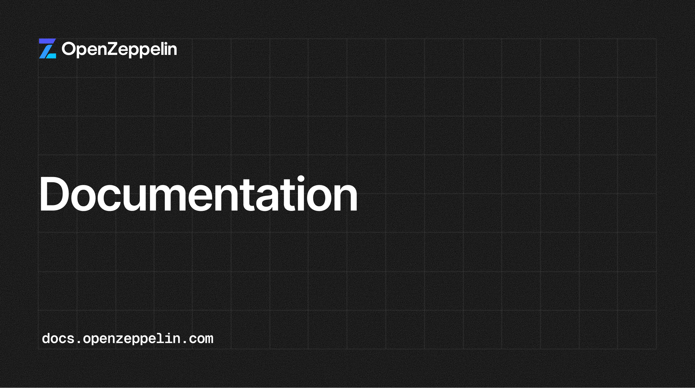

# OpenZeppelin Docs



Welcome to the OpenZeppelin Docs repo! Before opening an issue or creating a PR please consult our [contribution guide](CONTRIBUTING.md) as well as the [OpenZeppelin Documentation Standards](STANDARDS.md)

## Development

This is a Next.js application generated with [Fumadocs](https://github.com/fuma-nama/fumadocs).

To start local development follow the steps below

**1. Make sure [pnpm](https://pnpm.io) is installed**

```bash
pnpm --version
```

**2. Clone the repo and install dependencies**

```bash
git clone https://github.com/OpenZeppelin/docs
cd docs
pnpm install
```

**3. Run the `dev` server to see a live preview and have your changes reflected at `http://localhost:3000`**

```bash
pnpm dev
```

**4. Run `build` and `lint`**

```bash
pnpm run build
pnpm run check
```

## Project Overview

This documentation site is built with:

- **Next.js** - React framework for the application
- **Fumadocs** - Documentation framework with MDX support
- **TypeScript** - Type-safe development

### Directory Structure

```
docs/
├── content/           # MDX documentation files organized by product
├── src/
│   ├── app/          # Next.js app directory (routes and layouts)
│   ├── components/   # React components
│   ├── navigation/   # Navigation configuration files
│   └── lib/          # Utility libraries
├── public/           # Static assets
└── scripts/          # Build and utility scripts
```

For detailed information about the codebase structure, navigation system, and component architecture, see [CONTRIBUTING.md](CONTRIBUTING.md)

## API Reference Generation

API reference pages are auto-generated from source contract repositories and placed in the `content/` directory. The generation is handled by `scripts/generate-api-docs.js`, which supports two modes depending on the source repo's language.

### Solidity Repos

For Solidity repos using [solidity-docgen](https://github.com/OpenZeppelin/solidity-docgen), the script **injects canonical MDX templates** from this repo's [`docgen/templates-md/`](https://github.com/OpenZeppelin/docs/tree/main/docgen/templates-md) into the cloned source repo before running docgen. Source repos do not need MDX templates committed.

The script automatically:
- Copies `docgen/templates-md/` and `docgen/config-md.js` into the source repo
- Sets `API_DOCS_PATH` based on the output directory
- Updates the GitHub source link and import path for the source repo
- Patches `hardhat.config.js` to use the MDX config
- Runs `npm run prepare-docs` to generate MDX files
- Copies the output to the specified `content/` directory

**Run locally:**

```bash
# openzeppelin-contracts
node scripts/generate-api-docs.js \
  --repo https://github.com/OpenZeppelin/openzeppelin-contracts.git \
  --branch v5.6.1 \
  --api-output content/contracts/5.x/api

# community-contracts
node scripts/generate-api-docs.js \
  --repo https://github.com/OpenZeppelin/openzeppelin-community-contracts.git \
  --branch master \
  --api-output content/community-contracts/api

# confidential-contracts
node scripts/generate-api-docs.js \
  --repo https://github.com/OpenZeppelin/openzeppelin-confidential-contracts.git \
  --branch v0.4.0 \
  --api-output content/confidential-contracts/api
```

### Non-Solidity Repos

For repos using other languages (Cairo, Move, Rust, etc.) that generate MDX through their own tooling, use the `--pre-generated` flag to skip docgen and copy pre-built MDX files directly:

```bash
node scripts/generate-api-docs.js \
  --repo https://github.com/OpenZeppelin/cairo-contracts.git \
  --branch v3.0.0 \
  --api-output content/contracts-cairo/3.x/api \
  --pre-generated docs/api
```

### Canonical Templates

The MDX templates that control API reference output live in [`docgen/templates-md/`](https://github.com/OpenZeppelin/docs/tree/main/docgen/templates-md):

- `helpers.js` - Reference resolution, link generation, callout processing, natspec handling
- `contract.hbs` - Contract page layout (heading, GitHub link, import, function/event/error cards)
- `page.hbs` - Page wrapper with frontmatter
- `properties.js` - Solidity AST property helpers (anchors, inheritance, function lists)
- `config-md.js` - Solidity docgen configuration

Changes to these templates affect all source repos on the next generation run.

### Automated Workflow

The generation runs automatically via GitHub Actions:

1. **Source repo** pushes a release tag (e.g., `v5.6.1`) or commits to a tracked branch
2. **Source trigger workflow** (`.github/workflows/docs.yml` in the source repo) calls this repo's receiver workflow via `gh workflow run`
3. **Receiver workflow** (`.github/workflows/generate-api-docs-{name}.yml`) runs `generate-api-docs.js`, validates links, and creates a PR

Receiver workflows in this repo:
- `generate-api-docs-contracts.yml` - versioned paths (`content/contracts/{major}.x/api`)
- `generate-api-docs-community-contracts.yml` - non-versioned (`content/community-contracts/api`)
- `generate-api-docs-confidential-contracts.yml` - non-versioned (`content/confidential-contracts/api`)

Source repos need a `DOCS_REPO_TOKEN` secret (GitHub PAT with `repo` + `workflow` scopes) for the trigger workflow to call this repo.

### Versioning

- Major version changes (e.g., 4.x to 5.x) create a new versioned directory
- Minor and patch releases within a major version regenerate the same directory
- Non-versioned repos (community-contracts, confidential-contracts) use a flat `api/` path

## Content Management

### Adding New Content

1. Create `.mdx` files in appropriate `content/` subdirectories
2. Use frontmatter for metadata (title, description, etc.)
3. Follow existing directory structure for consistency
4. Update navigation if adding new product categories

### Versioning

- Version-specific content in numbered subdirectories (e.g., `contracts/4.x/`)
- Latest content at root level of each product directory
- Automatic version detection and routing

## Learn More

To learn more about the technologies used:

- [Next.js Documentation](https://nextjs.org/docs) - React framework features and API
- [Fumadocs](https://fumadocs.vercel.app) - Documentation framework
- [MDX](https://mdxjs.com/) - Markdown with JSX components
