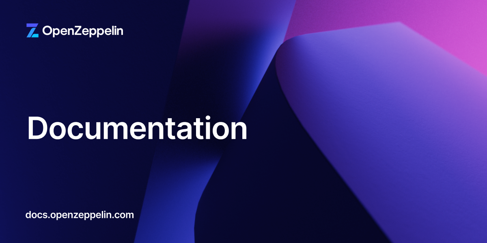

# OpenZeppelin Docs



Welcome to the OpenZeppelin Docs repo! Before opening an issue or creating a PR please consult our [contribution guide](CONTRIBUTING.md) as well as the [OpenZeppelin Documentation Standards](STANDARDS.md)

## Development

This is a Next.js application generated with [Fumadocs](https://github.com/fuma-nama/fumadocs).

To start local development follow the steps below

**1. Make sure [pnpm](https://pnpm.io) is installed**

```bash
pnpm --version
```

**2. Clone the repo and install dependencies**

```bash
git clone https://github.com/OpenZeppelin/docs
cd docs
pnpm install
```

**3. Run the `dev` server to see a live preview and have your changes reflected at `http://localhost:3000`**

```bash
pnpm dev
```

**4. Run `build` and `lint`**

```bash
pnpm run build
pnpm run check
```

## Project Overview

This documentation site is built with:

- **Next.js** - React framework for the application
- **Fumadocs** - Documentation framework with MDX support
- **TypeScript** - Type-safe development

### Directory Structure

```
docs/
├── content/           # MDX documentation files organized by product
├── src/
│   ├── app/          # Next.js app directory (routes and layouts)
│   ├── components/   # React components
│   ├── navigation/   # Navigation configuration files
│   └── lib/          # Utility libraries
├── public/           # Static assets
└── scripts/          # Build and utility scripts
```

For detailed information about the codebase structure, navigation system, and component architecture, see [CONTRIBUTING.md](CONTRIBUTING.md)

## Solidity Docgen

Any library using Solidity Docgen can utilize the `docgen` templates and config file in their repo to generate markdown API references for the docs. To get started follow the instructions below:

### 1. Add the templates to your repo

Inside this docs repo is the [`docgen`](https://github.com/OpenZeppelin/docs/tree/main/docgen) folder which contains [`templates-md`](https://github.com/OpenZeppelin/docs/tree/main/docgen/templates-md) and [`config-md.js`](https://github.com/OpenZeppelin/docs/blob/main/docgen/config-md.js). Copy both of these items into your `docs` folder in your repo. Once there open the [`templates-md/helpers.js`](https://github.com/OpenZeppelin/docs/blob/main/docgen/templates-md/helpers.js) file and update the `API_DOCS_PATH` constant to match your export path. Also open [`templates-md/contract.hbs`](https://github.com/OpenZeppelin/docs/blob/main/docgen/templates-md/contract.hbs) to modify the solidity import path and the github link. 

```js
const API_DOCS_PATH = 'contracts/5.x/api';
// const API_DOCS_PATH = 'community-contracts/api';
// const API_DOCS_PATH = 'confidential-contracts/api';
// const API_DOCS_PATH = 'uniswap-hooks/api';
```

### 2. Update the `hardhat.config.js` file

With the `config-md.js` file now in the `docs` folder, update your `hardhat.config.js` to use the new config file.

```js
{
  // other config options
  docgen: require('./docs/config-md'),
}
```

Once added make sure these are accessible in your branches going forward. If you are generating an API reference for previous branches you will need to repeat steps 1 and 2 for those branches.

### 3. Run the `generate-api-docs.js` script

With your remote repo setup with the new template files you can run the `scripts/generate-api-docs.js` script. Be sure to pass in the correct arguements for your docs

```bash
node scripts/generate-api-docs.js \
  --repo https://github.com/OpenZeppelin/openzeppelin-community-contracts.git \
  --branch release-v5.5 \
  --api-output content/contracts/5.x/api \
  --examples-output examples
```

### Automated Setup

In the case you want to setup an automated GitHub workflow to create these API docs visit the [docs-api-generation-workflows](https://github.com/OpenZeppelin/docs-api-generation-workflows) for more info. This repo (`OpenZeppelin/docs`) is the `Docs Receiver` side of the equation.

## Content Management

### Adding New Content

1. Create `.mdx` files in appropriate `content/` subdirectories
2. Use frontmatter for metadata (title, description, etc.)
3. Follow existing directory structure for consistency
4. Update navigation if adding new product categories

### Versioning

- Version-specific content in numbered subdirectories (e.g., `contracts/4.x/`)
- Latest content at root level of each product directory
- Automatic version detection and routing

## Learn More

To learn more about the technologies used:

- [Next.js Documentation](https://nextjs.org/docs) - React framework features and API
- [Fumadocs](https://fumadocs.vercel.app) - Documentation framework
- [MDX](https://mdxjs.com/) - Markdown with JSX components
