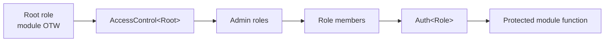
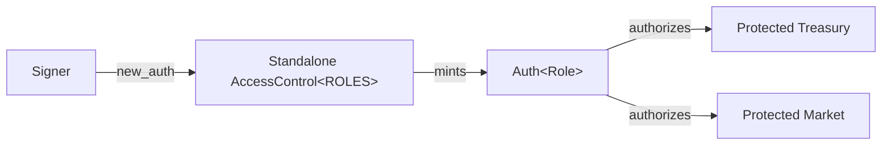
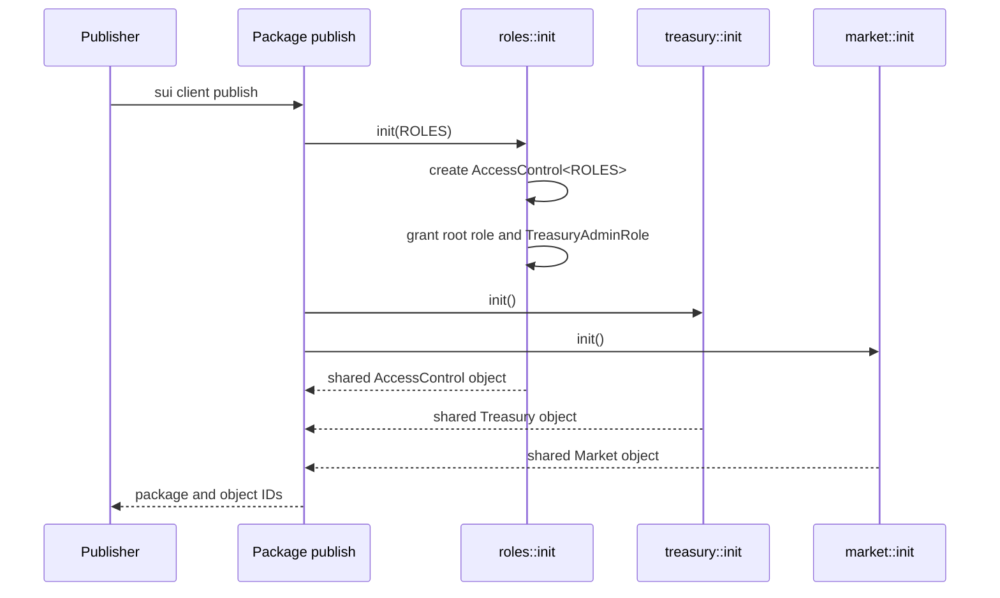
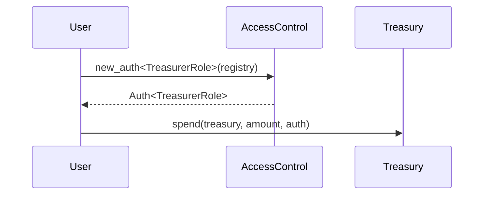
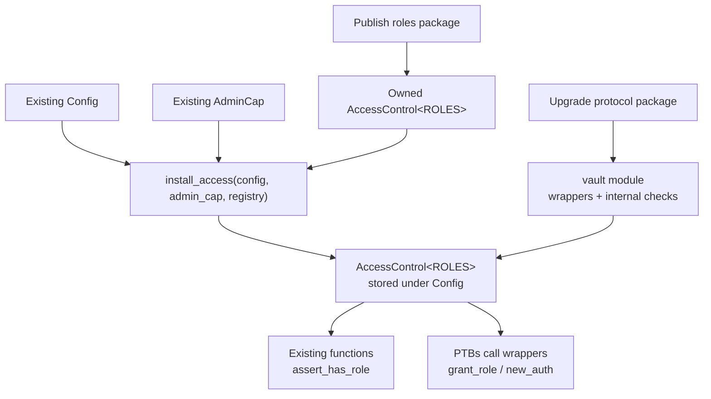
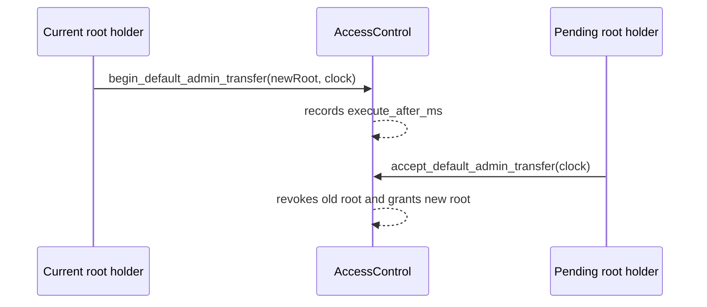
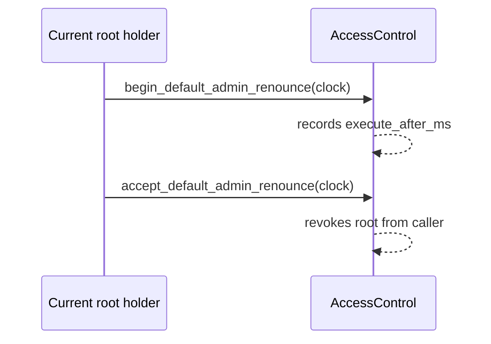
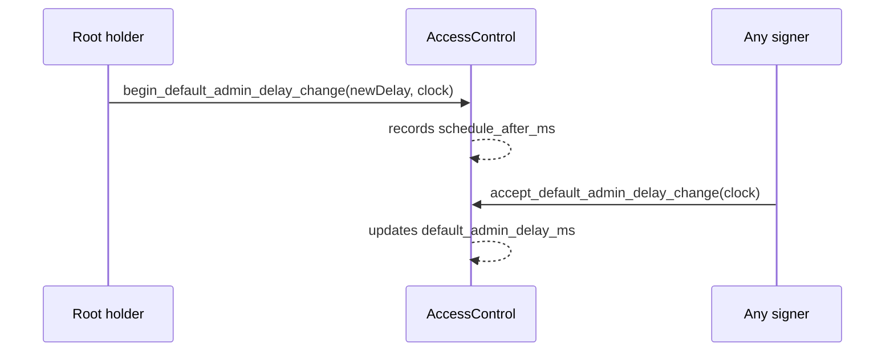

<Callout type="warn">
The example code snippets used in this guide are experimental and have not been audited. They simply help exemplify usage of the OpenZeppelin Sui Package.
</Callout>

The `access_control` module provides role-based authorization for Sui Move packages. It is designed for protocols that need more than one privileged actor: admins, operators, guardians, treasurers, keepers, or governance executors.

At a high level, your package defines role marker types, publishes an `AccessControl` registry for those roles, and uses `Auth<Role>` values minted by that registry to authorize privileged actions.



The module has two important constraints:

- The root role must be the module's One-Time Witness (OTW). This pins the registry to the package publish flow.
- Managed roles must be defined in the same module as the root role. Roles added to that same module in later package upgrades still work because the check uses the package's original ID.

These constraints make `Auth<Role>` useful as a typed proof. If a function receives `&Auth<TreasurerRole>`, it can trust that the transaction sender held `TreasurerRole` when the auth value was minted in that PTB.

## Prerequisites

Before following this guide, it helps to be familiar with Sui Move One-Time Witnesses (OTWs), shared objects, and programmable transaction blocks (PTBs). The examples reference those concepts throughout.

## Add the dependency

Add the access package to `Move.toml`:

```toml
[dependencies]
openzeppelin_access = { r.mvr = "@openzeppelin-move/access" }
```

Then import the module from your Move code:

```move
use openzeppelin_access::access_control::{Self, AccessControl, Auth};
```

## Default Pattern: Standalone Access Registry

For new packages, publish `AccessControl` as its own shared object and pass it directly in PTBs. This keeps role management in the OpenZeppelin module, while protected functions only need an `&Auth<Role>` parameter.

The protected object does not store the registry. PTBs mint an auth value from the registry, then pass that auth value to the protected function.



### Define roles

Put the root role and all managed role marker types in one module. Here, `ROLES` is the OTW and root role type. It is not a collection object; it anchors the singleton `AccessControl<ROLES>` registry.

```move
module my_protocol::roles;

use openzeppelin_access::access_control;

public struct ROLES has drop {}

public struct TreasuryAdminRole {}
public struct TreasurerRole {}
public struct PauserRole {}
public struct OperatorRole {}

const DEFAULT_ADMIN_DELAY_MS: u64 = 24 * 60 * 60 * 1_000;

fun init(otw: ROLES, ctx: &mut TxContext) {
    let mut access = access_control::new(otw, DEFAULT_ADMIN_DELAY_MS, ctx);

    access.grant_role<_, TreasuryAdminRole>(ctx.sender(), ctx);
    access.set_role_admin<_, TreasurerRole, TreasuryAdminRole>(ctx);
    access.set_role_admin<_, PauserRole, TreasuryAdminRole>(ctx);
    access.set_role_admin<_, OperatorRole, TreasuryAdminRole>(ctx);

    transfer::public_share_object(access);
}
```

### Protect protocol objects

Protected modules import role types and accept `&Auth<Role>` in privileged functions. They do not store the registry, expose role-management wrappers, or check registry object IDs. `AccessControl<ROLES>` is unique for the `ROLES` OTW, and `Auth<TreasurerRole>` can only be minted by that registry.

```move
module my_protocol::treasury;

use my_protocol::roles::{PauserRole, TreasurerRole, TreasuryAdminRole};
use openzeppelin_access::access_control::Auth;

#[error(code = 0)]
const EPaused: vector<u8> = "Treasury operations are paused";

#[error(code = 1)]
const EInsufficientBalance: vector<u8> = "Treasury balance is too low";

public struct Treasury has key, store {
    id: UID,
    balance: u64,
    fee_bps: u64,
    paused: bool,
}

fun init(ctx: &mut TxContext) {
    transfer::share_object(Treasury {
        id: object::new(ctx),
        balance: 0,
        fee_bps: 0,
        paused: false,
    });
}

public fun deposit(treasury: &mut Treasury, amount: u64) {
    treasury.balance = treasury.balance + amount;
}

public fun spend(treasury: &mut Treasury, amount: u64, _: &Auth<TreasurerRole>) {
    assert!(!treasury.paused, EPaused);
    assert!(treasury.balance >= amount, EInsufficientBalance);
    treasury.balance = treasury.balance - amount;
}

public fun pause(treasury: &mut Treasury, _: &Auth<PauserRole>) {
    treasury.paused = true;
}

public fun unpause(treasury: &mut Treasury, _: &Auth<PauserRole>) {
    treasury.paused = false;
}

public fun set_fee_bps(treasury: &mut Treasury, fee_bps: u64, _: &Auth<TreasuryAdminRole>) {
    treasury.fee_bps = fee_bps;
}

public fun balance(treasury: &Treasury): u64 { treasury.balance }

public fun is_paused(treasury: &Treasury): bool { treasury.paused }
```

The same registry can protect other modules too:

```move
module my_protocol::market;

use my_protocol::roles::OperatorRole;
use openzeppelin_access::access_control::Auth;

public struct Market has key, store {
    id: UID,
    settled_rounds: u64,
}

fun init(ctx: &mut TxContext) {
    transfer::share_object(Market {
        id: object::new(ctx),
        settled_rounds: 0,
    });
}

public fun settle(market: &mut Market, _: &Auth<OperatorRole>) {
    market.settled_rounds = market.settled_rounds + 1;
}
```

Define a separate root role type and registry only when a group of objects needs independent administration.

## Publish and Bootstrap

Publishing the package runs each module initializer. In this walkthrough, that creates the shared `AccessControl<ROLES>`, the shared `Treasury`, and the shared `Market`. The publisher receives the root role and `TreasuryAdminRole`.



Publish the package:

```bash
sui client publish
```

Record the package and object IDs from the publish output. Set `$ACCESS` to the published OpenZeppelin access package address on your target network:

```bash
export PACKAGE=0x...
export ACCESS=0x...
export ACCESS_REGISTRY=0x...
export TREASURY=0x...
export MARKET=0x...
export PUBLISHER=0x...
export OPS_ADMIN=0x...
export TREASURER=0x...
export GUARDIAN=0x...
export OPERATOR=0x...
```

After publishing, grant an operational admin and optionally renounce the publisher's day-to-day admin role. The publisher keeps the root role until a delayed root transfer is completed.

Run this PTB from the publisher account, because `renounce_role` can only renounce the sender's own role.

```bash
sui client ptb \
  --move-call $ACCESS::access_control::grant_role \
    "<$PACKAGE::roles::ROLES,$PACKAGE::roles::TreasuryAdminRole>" \
    @$ACCESS_REGISTRY \
    @$OPS_ADMIN \
  --move-call $ACCESS::access_control::renounce_role \
    "<$PACKAGE::roles::ROLES,$PACKAGE::roles::TreasuryAdminRole>" \
    @$ACCESS_REGISTRY \
    @$PUBLISHER
```

Run the next PTB from `$OPS_ADMIN` to grant the roles used by the protected functions:

```bash
sui client ptb \
  --move-call $ACCESS::access_control::grant_role \
    "<$PACKAGE::roles::ROLES,$PACKAGE::roles::TreasurerRole>" \
    @$ACCESS_REGISTRY \
    @$TREASURER \
  --move-call $ACCESS::access_control::grant_role \
    "<$PACKAGE::roles::ROLES,$PACKAGE::roles::PauserRole>" \
    @$ACCESS_REGISTRY \
    @$GUARDIAN \
  --move-call $ACCESS::access_control::grant_role \
    "<$PACKAGE::roles::ROLES,$PACKAGE::roles::OperatorRole>" \
    @$ACCESS_REGISTRY \
    @$OPERATOR
```

## Interact with Protected Functions

For functions that take `&Auth<Role>`, mint the auth value and use it in the same PTB. The auth value has `drop` only, so it is a temporary proof for the current transaction, not an object that can be stored or transferred.



Treasurer spending from `$TREASURER`:

```bash
sui client ptb \
  --move-call $ACCESS::access_control::new_auth \
    "<$PACKAGE::roles::ROLES,$PACKAGE::roles::TreasurerRole>" \
    @$ACCESS_REGISTRY \
  --assign treasurer_auth \
  --move-call $PACKAGE::treasury::spend \
    @$TREASURY \
    4000000000 \
    treasurer_auth
```

Guardian pausing from `$GUARDIAN`:

```bash
sui client ptb \
  --move-call $ACCESS::access_control::new_auth \
    "<$PACKAGE::roles::ROLES,$PACKAGE::roles::PauserRole>" \
    @$ACCESS_REGISTRY \
  --assign pauser_auth \
  --move-call $PACKAGE::treasury::pause @$TREASURY pauser_auth
```

Operator settling a market from `$OPERATOR`:

```bash
sui client ptb \
  --move-call $ACCESS::access_control::new_auth \
    "<$PACKAGE::roles::ROLES,$PACKAGE::roles::OperatorRole>" \
    @$ACCESS_REGISTRY \
  --assign operator_auth \
  --move-call $PACKAGE::market::settle @$MARKET operator_auth
```

One auth value can be reused across multiple calls in the same PTB when those calls require the same role:

```bash
sui client ptb \
  --move-call $ACCESS::access_control::new_auth \
    "<$PACKAGE::roles::ROLES,$PACKAGE::roles::PauserRole>" \
    @$ACCESS_REGISTRY \
  --assign pauser_auth \
  --move-call $PACKAGE::treasury::pause @$TREASURY pauser_auth \
  --move-call $PACKAGE::treasury::unpause @$TREASURY pauser_auth
```

For new functions, prefer `Auth<Role>`. It makes authorization explicit in the function type and lets one proof authorize multiple calls in the same PTB.

Use `assert_has_role` when authorization must stay inside the function body. This is useful for signature-preserving upgrades, or when a function accepts either of two roles, requires two roles, or chooses the required role from function state before it checks `ctx.sender()`.

## When Wrappers Are Needed

The standalone registry pattern assumes the registry is passed directly to PTBs. Wrappers are needed when the registry is stored inside another object and cannot be passed as its own PTB input.

The main case is an upgrade to an already-published package. Public function signatures cannot be changed, but existing functions may already receive a `Config`, `State`, or similar object. In that layout, store `AccessControl` under that object, borrow it internally, and use `assert_has_role` without changing the public API.

Only add wrappers in new packages when you intentionally want a domain-specific access API. Otherwise, keep PTBs calling OpenZeppelin directly.

When the registry is embedded, PTBs cannot access it directly:

- PTBs cannot project a private field such as `treasury.access`.
- A Move call that returns `&AccessControl<...>` cannot be assigned as a PTB command result and reused by the next command.

Expose wrapper functions from the module that owns the field. The upgrade section below uses a dynamic object field under an existing `Config`.

## Upgrading an Existing Package

Access control can be integrated with an already-published package, but the role root must come from a newly published package. Do not add a new roles module to the existing package and expect its `init` to create the registry during an upgrade. Sui does not run `init` for modules added by package upgrades, so that module will not receive its OTW and cannot initialize `AccessControl`.

For existing packages, the usual path uses two packages:

- A new roles package that defines `ROLES` and role marker types, runs `init` on first publish, and creates `AccessControl<ROLES>`.
- An upgrade to the existing protocol package that imports the roles package, stores the registry as a dynamic object field under an existing protocol object, and exposes wrappers where PTBs need a public boundary.

This works when the function already receives a protocol object that can act as the access anchor, usually an existing `Config` or `State` object. Existing public functions keep their signatures and borrow the registry internally.

If an existing public function does not receive a suitable object parameter, upgraded code has no place to discover the registry from. In that case, keep the old function behavior, add a new role-gated function with a new signature, and migrate callers to the new entrypoint.

First publish a new package that owns the root role and role marker types. Its initializer receives the OTW on first publish, creates the registry, and transfers that registry to the publisher for installation. In this example, publish from the address that owns the existing `AdminCap`, or transfer the registry to the `AdminCap` holder before installation.

```move
module my_protocol_roles::roles;

use openzeppelin_access::access_control;

public struct ROLES has drop {}

public struct ProtocolAdminRole {}
public struct OperatorRole {}
public struct GuardianRole {}

const DEFAULT_ADMIN_DELAY_MS: u64 = 24 * 60 * 60 * 1_000;

fun init(otw: ROLES, ctx: &mut TxContext) {
    let mut access = access_control::new(otw, DEFAULT_ADMIN_DELAY_MS, ctx);

    access.grant_role<_, ProtocolAdminRole>(ctx.sender(), ctx);
    access.set_role_admin<_, OperatorRole, ProtocolAdminRole>(ctx);
    access.set_role_admin<_, GuardianRole, ProtocolAdminRole>(ctx);

    transfer::public_transfer(access, ctx.sender());
}
```

Then upgrade the existing protocol package that already owns the `Config` type. Add a dependency on the new roles package, store the registry under `Config`, and expose wrappers for PTBs. The example assumes `Config` and `AdminCap` already existed before the upgrade, with `AdminCap` used for privileged operations.

```move
module my_protocol::vault;

use my_protocol_roles::roles::{ROLES, GuardianRole, ProtocolAdminRole};
use openzeppelin_access::access_control::{Self, AccessControl, Auth};
use sui::dynamic_object_field as dof;

public struct Config has key, store {
    id: UID,
    fee_bps: u64,
}

public struct AdminCap has key, store {
    id: UID,
}

public struct Vault has key, store {
    id: UID,
    paused: bool,
}

public struct AccessKey has copy, drop, store {}

/// One-time migration function. It preserves the `Config` layout by storing
/// the registry as a dynamic object field instead of adding a struct field.
public fun install_access(
    config: &mut Config,
    _: &AdminCap,
    access: AccessControl<ROLES>,
) {
    dof::add(&mut config.id, AccessKey {}, access);
}

fun access(config: &Config): &AccessControl<ROLES> {
    dof::borrow<AccessKey, AccessControl<ROLES>>(&config.id, AccessKey {})
}

fun access_mut(config: &mut Config): &mut AccessControl<ROLES> {
    dof::borrow_mut<AccessKey, AccessControl<ROLES>>(&mut config.id, AccessKey {})
}

public fun new_auth<Role>(config: &Config, ctx: &mut TxContext): Auth<Role> {
    access_control::new_auth<ROLES, Role>(access(config), ctx)
}

public fun grant_role<Role>(config: &mut Config, account: address, ctx: &mut TxContext) {
    access_control::grant_role<ROLES, Role>(access_mut(config), account, ctx);
}

public fun has_role<Role>(config: &Config, account: address): bool {
    access_control::has_role<ROLES, Role>(access(config), account)
}

// Existing public function: same signature as v1.
public fun set_fee_bps(config: &mut Config, fee_bps: u64, ctx: &mut TxContext) {
    access_control::assert_has_role<ROLES, ProtocolAdminRole>(access(config), ctx.sender());
    config.fee_bps = fee_bps;
}

// New public function: new signatures can make authorization explicit.
public fun emergency_pause(vault: &mut Vault, _: &Auth<GuardianRole>) {
    vault.paused = true;
}
```

The upgrade flow looks like this:



Publish the roles package first:

```bash
sui client publish
```

Record the roles package ID and the owned `AccessControl` object ID transferred to the publisher. Then upgrade the existing protocol package:

```bash
sui client upgrade \
  --upgrade-capability $UPGRADE_CAP
```

Record the upgraded protocol package ID, the existing config object ID, and the existing admin-cap object ID. `$ACCESS` is the published OpenZeppelin access package address on your target network:

```bash
export PROTOCOL=0x...
export ROLES_PACKAGE=0x...
export ACCESS=0x...
export CONFIG=0x...
export ADMIN_CAP=0x...
export ACCESS_REGISTRY=0x...
export VAULT=0x...
export OPERATOR=0x...
export GUARDIAN=0x...
```

Install the registry under the existing config object. This PTB must be signed by the address that owns both `ACCESS_REGISTRY` and `ADMIN_CAP`.

```bash
sui client ptb \
  --move-call $PROTOCOL::vault::install_access @$CONFIG @$ADMIN_CAP @$ACCESS_REGISTRY
```

Bootstrap roles through the upgraded protocol wrapper. Run this from an address that holds `ProtocolAdminRole`, which is the roles-package publisher in this example.

```bash
sui client ptb \
  --move-call $PROTOCOL::vault::grant_role \
    "<$ROLES_PACKAGE::roles::OperatorRole>" \
    @$CONFIG \
    @$OPERATOR \
  --move-call $PROTOCOL::vault::grant_role \
    "<$ROLES_PACKAGE::roles::GuardianRole>" \
    @$CONFIG \
    @$GUARDIAN
```

Call a retrofitted function that kept its original signature and now uses `assert_has_role` internally. Run this from a `ProtocolAdminRole` holder:

```bash
sui client ptb \
  --move-call $PROTOCOL::vault::set_fee_bps @$CONFIG 30
```

Call a new function that uses `Auth<Role>`. Run this from `$GUARDIAN`, because `new_auth` checks that the transaction sender holds `GuardianRole`:

```bash
sui client ptb \
  --move-call $PROTOCOL::vault::new_auth \
    "<$ROLES_PACKAGE::roles::GuardianRole>" \
    @$CONFIG \
  --assign guardian_auth \
  --move-call $PROTOCOL::vault::emergency_pause @$VAULT guardian_auth
```

## Root Role Operations

The root role is intentionally harder to change than ordinary roles. It cannot be granted, revoked, or renounced with `grant_role`, `revoke_role`, or `renounce_role`. Use the delayed root-role flows (`begin_default_admin_*`, `accept_default_admin_*`, and `cancel_default_admin_*`) for root transfer, root renounce, and changes to the root-operation delay.

Scheduling a root transfer or a root renounce uses the same pending slot. Starting one overwrites the other, and `cancel_default_admin_transfer` cancels either pending action.

Root transfers cannot target `@0x0`, and ordinary role grants also reject `@0x0`. If the goal is to intentionally lock the registry, use the delayed root-renounce flow instead of transferring the root role to the zero address.

The PTBs below use the standalone `AccessControl` object from the default pattern. For an upgraded roles package, replace `$PACKAGE::roles::ROLES` with `$ROLES_PACKAGE::roles::ROLES`. If your registry is embedded in another object or stored as a dynamic object field, expose wrappers that call the same `access_control` functions internally.



### Transfer the root role

Schedule the transfer from the current root holder:

```bash
export CLOCK=0x6
export NEW_ROOT=0x...

sui client ptb \
  --move-call $ACCESS::access_control::begin_default_admin_transfer \
    "<$PACKAGE::roles::ROLES>" \
    @$ACCESS_REGISTRY \
    @$NEW_ROOT \
    @$CLOCK
```

After the configured delay elapses, the pending root holder accepts:

```bash
sui client ptb \
  --move-call $ACCESS::access_control::accept_default_admin_transfer \
    "<$PACKAGE::roles::ROLES>" \
    @$ACCESS_REGISTRY \
    @$CLOCK
```

The current root holder can cancel before acceptance:

```bash
sui client ptb \
  --move-call $ACCESS::access_control::cancel_default_admin_transfer \
    "<$PACKAGE::roles::ROLES>" \
    @$ACCESS_REGISTRY
```

### Renounce the root role

Root renounce is a delayed two-step flow. Use it only when the protocol is intentionally being locked, because after acceptance no account holds the root role and the registry can no longer recover role administration through root actions.



Schedule the renounce:

```bash
sui client ptb \
  --move-call $ACCESS::access_control::begin_default_admin_renounce \
    "<$PACKAGE::roles::ROLES>" \
    @$ACCESS_REGISTRY \
    @$CLOCK
```

After the configured delay elapses, the current root holder finalizes it:

```bash
sui client ptb \
  --move-call $ACCESS::access_control::accept_default_admin_renounce \
    "<$PACKAGE::roles::ROLES>" \
    @$ACCESS_REGISTRY \
    @$CLOCK
```

The current root holder can cancel a pending transfer or renounce with the same cancellation call:

```bash
sui client ptb \
  --move-call $ACCESS::access_control::cancel_default_admin_transfer \
    "<$PACKAGE::roles::ROLES>" \
    @$ACCESS_REGISTRY
```

### Change the root-operation delay

`default_admin_delay_ms` controls how long root transfers and root renounces must wait before acceptance. It can also be changed through a delayed flow. The maximum value is `max_default_admin_delay_ms()`, currently 60 days.

Delay increases take effect after `min(new_delay_ms, max_delay_increase_wait_ms())`; `max_delay_increase_wait_ms()` is 48 hours. Delay decreases take effect after `current_delay_ms - new_delay_ms`, so the root holder cannot immediately shorten the protection window and schedule a faster root change.



Schedule a delay change:

```bash
export NEW_DEFAULT_ADMIN_DELAY_MS=172800000

sui client ptb \
  --move-call $ACCESS::access_control::begin_default_admin_delay_change \
    "<$PACKAGE::roles::ROLES>" \
    @$ACCESS_REGISTRY \
    $NEW_DEFAULT_ADMIN_DELAY_MS \
    @$CLOCK
```

After `schedule_after_ms`, any signer can apply the scheduled delay change:

```bash
sui client ptb \
  --move-call $ACCESS::access_control::accept_default_admin_delay_change \
    "<$PACKAGE::roles::ROLES>" \
    @$ACCESS_REGISTRY \
    @$CLOCK
```

The root holder can cancel a pending delay change before it is applied:

```bash
sui client ptb \
  --move-call $ACCESS::access_control::cancel_default_admin_delay_change \
    "<$PACKAGE::roles::ROLES>" \
    @$ACCESS_REGISTRY
```

## Operational Checklist

- Define role marker types in the same module as the OTW that roots the registry.
- Use a standalone `AccessControl` object by default.
- Use `Auth<Role>` in new protected functions so access checks stay out of the function body.
- Use embedded or dynamic-field registries mainly for upgrades where existing public function signatures must stay stable.
- Grant an operational admin role during `init`; avoid using the root role for daily operations.
- Use `set_role_admin` to make day-to-day roles administered by an operational admin role.
- Use `assert_has_role` when upgrading existing functions or when authorization must be computed inside the function body.
- Transfer the root role to governance or a multisig through the delayed transfer flow.
- Renounce the root role only through the delayed renounce flow and only when the protocol is intentionally being locked.
- Treat delay changes as governance-sensitive operations; existing pending root transfers or renounces keep the delay they were scheduled under.
