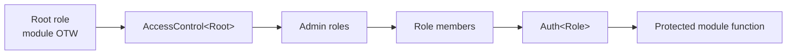
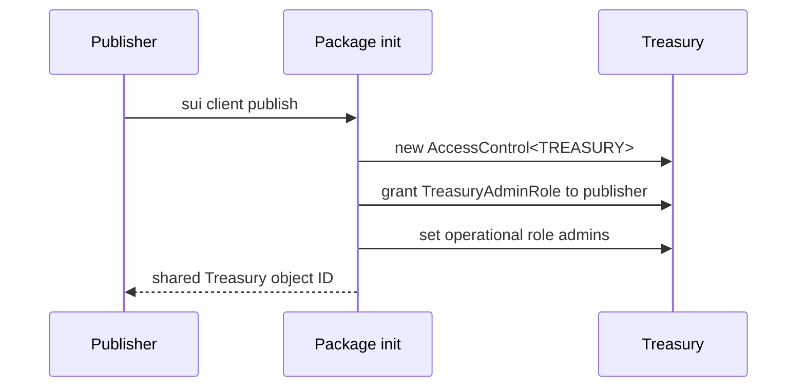
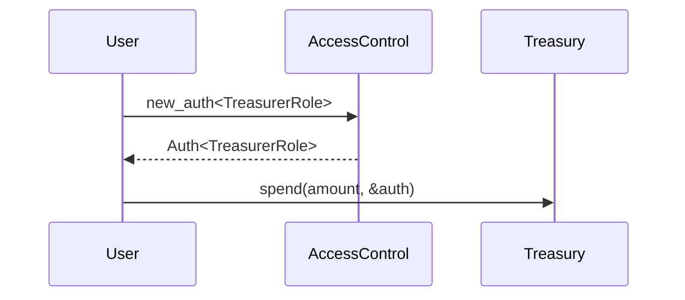
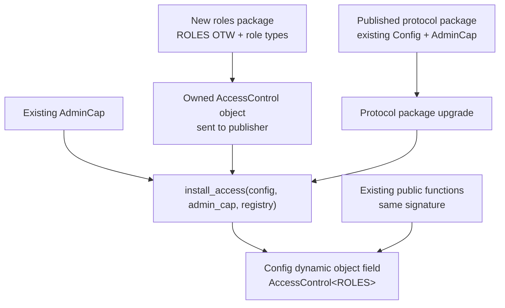
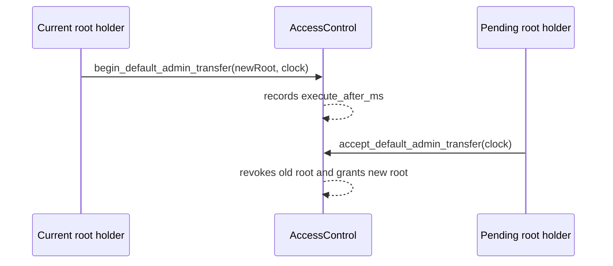
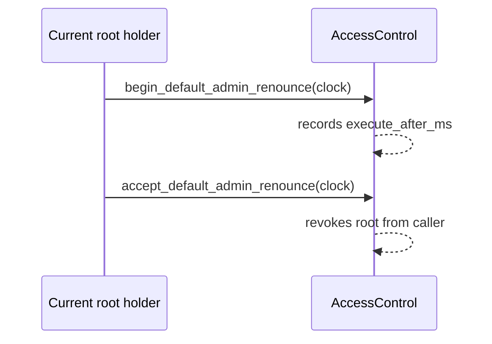
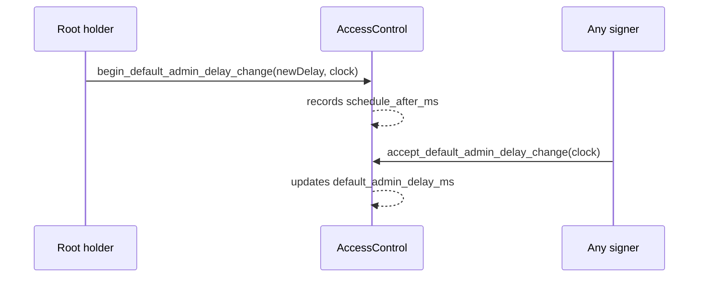

<Callout type="warn">
The example code snippets used in this guide are experimental and have not been audited. They simply help exemplify usage of the OpenZeppelin Sui Package.
</Callout>

The `access_control` module provides role-based authorization for Sui Move packages. It is designed for protocols that need more than one privileged actor: admins, operators, guardians, treasurers, keepers, or governance executors.

At a high level, your package defines the roles, publishes one access-control registry for those roles, and uses that registry to check who can perform privileged actions.



The module has two important constraints:

- The root role must be the module's One-Time Witness (OTW). This pins the registry to the package publish flow.
- Managed roles must be defined in the same module as the root role. Roles added to that same module in later package upgrades still work because the check uses the package's original ID.

These constraints make `Auth<Role>` useful as a typed proof. If a function receives `&Auth<TreasurerRole>`, it can trust that the transaction sender held `TreasurerRole` when the auth value was minted in that PTB.

## Add the dependency

Add the access package to `Move.toml`:

```toml
[dependencies]
openzeppelin_access = { r.mvr = "@openzeppelin-move/access" }
```

Then import the module from your Move code:

```move
use openzeppelin_access::access_control::{Self, AccessControl, Auth};
```

## Implementing a new module

This example builds a shared treasury controlled by roles:

- `TREASURY` is the module OTW and the root role.
- `TreasuryAdminRole` can grant and revoke operational roles.
- `TreasurerRole` can spend funds.
- `PauserRole` can pause or unpause operations.

```move
module my_protocol::treasury;

use openzeppelin_access::access_control::{Self, AccessControl, Auth};

// === Errors ===

#[error(code = 0)]
const EPaused: vector<u8> = "Treasury operations are paused";

#[error(code = 1)]
const EInsufficientBalance: vector<u8> = "Treasury balance is too low";

// === One-Time Witness ===

public struct TREASURY has drop {}

// === Role Types ===

public struct TreasuryAdminRole {}
public struct TreasurerRole {}
public struct PauserRole {}

// === Constants ===

const DEFAULT_ADMIN_DELAY_MS: u64 = 24 * 60 * 60 * 1_000;

// === Protocol Object ===

public struct Treasury has key, store {
    id: UID,
    access: AccessControl<TREASURY>,
    balance: u64,
    fee_bps: u64,
    paused: bool,
}

// === Init ===

fun init(otw: TREASURY, ctx: &mut TxContext) {
    let access = access_control::new(otw, DEFAULT_ADMIN_DELAY_MS, ctx);
    let mut treasury = Treasury {
        id: object::new(ctx),
        access,
        balance: 0,
        fee_bps: 0,
        paused: false,
    };

    treasury.access.grant_role<_, TreasuryAdminRole>(ctx.sender(), ctx);
    treasury.access.set_role_admin<_, TreasurerRole, TreasuryAdminRole>(ctx);
    treasury.access.set_role_admin<_, PauserRole, TreasuryAdminRole>(ctx);

    transfer::share_object(treasury);
}

// === Access Getters ===

public fun borrow_access(treasury: &Treasury): &AccessControl<TREASURY> {
    &treasury.access
}

public fun borrow_access_mut(treasury: &mut Treasury): &mut AccessControl<TREASURY> {
    &mut treasury.access
}

// === Business Actions ===

public fun deposit(treasury: &mut Treasury, amount: u64) {
    treasury.balance = treasury.balance + amount;
}

public fun spend(treasury: &mut Treasury, amount: u64, _: &Auth<TreasurerRole>) {
    assert!(!treasury.paused, EPaused);
    assert!(treasury.balance >= amount, EInsufficientBalance);
    treasury.balance = treasury.balance - amount;
}

public fun pause(treasury: &mut Treasury, _: &Auth<PauserRole>) {
    treasury.paused = true;
}

public fun unpause(treasury: &mut Treasury, _: &Auth<PauserRole>) {
    treasury.paused = false;
}

// === Getters ===

public fun balance(treasury: &Treasury): u64 { treasury.balance }

public fun is_paused(treasury: &Treasury): bool { treasury.paused }
```

This embeds `AccessControl<TREASURY>` inside the shared treasury object. That is a good default when the registry only protects that one protocol object.

The public access getters let PTBs compose your protocol module with `access_control` calls from the OpenZeppelin package. The module does not need thin forwarding functions for role management unless your protocol wants to add domain-specific checks or events around those operations.

### Using one registry for several objects

If the same roles protect several shared objects, keep the registry as its own shared object instead of embedding it in one protected object. The protected objects can be defined in the same module or in different modules that import the role types.

Assume a separate `my_protocol::roles` module defines `ROLES` and `OperatorRole`, creates `AccessControl<ROLES>` during `init`, and shares that registry. When more than one protected object can exist, store the trusted registry ID in each protected object and check it in protected functions:

```move
module my_protocol::market;

use my_protocol::roles::{ROLES, OperatorRole};
use openzeppelin_access::access_control::{AccessControl, Auth};
use sui::object::{Self, ID};

#[error(code = 0)]
const EWrongRegistry: vector<u8> = "Market is bound to a different access registry";

public struct Market has key, store {
    id: UID,
    access_id: ID,
    settled_rounds: u64,
}

public fun new_market(access: &AccessControl<ROLES>, ctx: &mut TxContext) {
    transfer::share_object(Market {
        id: object::new(ctx),
        access_id: object::id(access),
        settled_rounds: 0,
    });
}

public fun settle(
    market: &mut Market,
    access: &AccessControl<ROLES>,
    _: &Auth<OperatorRole>,
) {
    assert!(market.access_id == object::id(access), EWrongRegistry);
    market.settled_rounds = market.settled_rounds + 1;
}
```

The PTB passes both the shared registry and the protected object. Here, `$ACCESS_REGISTRY` is the shared `AccessControl<ROLES>` object and `$MARKET` is a market created with that registry:

```bash
sui client ptb \
  --move-call $ACCESS::access_control::new_auth \
    "<$PACKAGE::roles::ROLES,$PACKAGE::roles::OperatorRole>" \
    @$ACCESS_REGISTRY \
  --assign operator_auth \
  --move-call $PACKAGE::market::settle @$MARKET @$ACCESS_REGISTRY operator_auth \
  --gas-budget 10000000
```

## Publish and bootstrap

Publishing runs `init`, creates the treasury, and makes the publisher the root role holder. The same transaction also grants `TreasuryAdminRole` to the publisher and configures the role hierarchy.



Publish the package:

```bash
sui client publish --gas-budget 100000000
```

Record the package and treasury object IDs from the publish output, and set `$ACCESS` to the published OpenZeppelin access package address on your target network:

```bash
export PACKAGE=0x...
export ACCESS=0x...
export TREASURY=0x...
export PUBLISHER=0x...
export OPS_ADMIN=0x...
export TREASURER=0x...
export GUARDIAN=0x...
```

Grant an operational admin, then optionally renounce the deployer's day-to-day admin role. The deployer keeps the root role until a delayed root transfer is completed.

Run this PTB from the publisher account, because `renounce_role` can only renounce the sender's own role.

```bash
sui client ptb \
  --move-call $PACKAGE::treasury::borrow_access_mut @$TREASURY \
  --assign access \
  --move-call $ACCESS::access_control::grant_role \
    "<$PACKAGE::treasury::TREASURY,$PACKAGE::treasury::TreasuryAdminRole>" \
    access \
    @$OPS_ADMIN \
  --move-call $ACCESS::access_control::renounce_role \
    "<$PACKAGE::treasury::TREASURY,$PACKAGE::treasury::TreasuryAdminRole>" \
    access \
    @$PUBLISHER \
  --gas-budget 10000000
```

Run the next PTB from `$OPS_ADMIN` to grant operational roles:

```bash
sui client ptb \
  --move-call $PACKAGE::treasury::borrow_access_mut @$TREASURY \
  --assign access \
  --move-call $ACCESS::access_control::grant_role \
    "<$PACKAGE::treasury::TREASURY,$PACKAGE::treasury::TreasurerRole>" \
    access \
    @$TREASURER \
  --move-call $ACCESS::access_control::grant_role \
    "<$PACKAGE::treasury::TREASURY,$PACKAGE::treasury::PauserRole>" \
    access \
    @$GUARDIAN \
  --gas-budget 10000000
```

## Interacting with protected functions

For functions that take `&Auth<Role>`, create the auth value and use it in the same PTB. The auth value has `drop` only, so it is a temporary proof for the current transaction, not an object that can be stored or transferred.



Treasurer spending from `$TREASURER`:

```bash
sui client ptb \
  --move-call $PACKAGE::treasury::borrow_access @$TREASURY \
  --assign access \
  --move-call $ACCESS::access_control::new_auth \
    "<$PACKAGE::treasury::TREASURY,$PACKAGE::treasury::TreasurerRole>" \
    access \
  --assign treasurer_auth \
  --move-call $PACKAGE::treasury::spend \
    @$TREASURY \
    4000000000 \
    treasurer_auth \
  --gas-budget 10000000
```

Guardian pausing from `$GUARDIAN`:

```bash
sui client ptb \
  --move-call $PACKAGE::treasury::borrow_access @$TREASURY \
  --assign access \
  --move-call $ACCESS::access_control::new_auth \
    "<$PACKAGE::treasury::TREASURY,$PACKAGE::treasury::PauserRole>" \
    access \
  --assign pauser_auth \
  --move-call $PACKAGE::treasury::pause @$TREASURY pauser_auth \
  --gas-budget 10000000
```

The `borrow_access` getter returns a reference to the embedded registry, so PTBs can compose your protocol module with `access_control::new_auth` from the OpenZeppelin package directly.

For existing functions, `assert_has_role` can be simpler than introducing new `Auth<Role>` parameters because it does not change the function signature:

```move
public fun set_fee_bps(treasury: &mut Treasury, fee_bps: u64, ctx: &mut TxContext) {
    treasury.access.assert_has_role<_, TreasuryAdminRole>(ctx.sender());
    treasury.fee_bps = fee_bps;
}
```

Use `Auth<Role>` for new functions when you want authorization to be explicit in the function type and reusable across multiple calls in the same PTB. Use `assert_has_role` when you are retrofitting an existing entrypoint and want the smallest API change.

`assert_has_role` is also useful when authorization is more complex than a single proof parameter. For example, a function can accept either of two roles, require two roles, or choose the required role from function state before it checks `ctx.sender()`.

## Upgrading an existing package

Access control can be integrated with an already-published package, but the role root must come from a newly published package. Do not add a new roles module to the existing package and expect its `init` to create the registry during an upgrade. Sui does not run `init` for modules added by package upgrades, so that module will not receive its OTW and cannot initialize `AccessControl`.

The upgrade-friendly pattern uses two packages:

- A new roles package that defines `ROLES` and role marker types, runs `init` on first publish, and creates `AccessControl<ROLES>`.
- An upgrade to the existing protocol package that imports the roles package, stores the registry as a dynamic object field under an existing protocol object, and calls `assert_has_role` internally.

This works when the function already receives a protocol object that can act as the access anchor, usually an existing `Config` or `State` object. Existing public functions keep their signatures and borrow the registry internally.

This pattern is not possible for an existing public function that has no suitable object parameter from which the upgraded code can discover the registry. In that case, keep the old function behavior, add a new role-gated function with a new signature, and migrate callers to the new entrypoint.

First publish a new package that owns the root role and role marker types. Its initializer receives the OTW on first publish, creates the registry, and transfers that registry to the publisher for installation. In this example, publish from the address that owns the existing `AdminCap`, or transfer the registry to the `AdminCap` holder before installation.

```move
module my_protocol_roles::roles;

use openzeppelin_access::access_control;

public struct ROLES has drop {}

public struct ProtocolAdminRole {}
public struct OperatorRole {}
public struct GuardianRole {}

const DEFAULT_ADMIN_DELAY_MS: u64 = 24 * 60 * 60 * 1_000;

fun init(otw: ROLES, ctx: &mut TxContext) {
    let mut access = access_control::new(otw, DEFAULT_ADMIN_DELAY_MS, ctx);

    access.grant_role<_, ProtocolAdminRole>(ctx.sender(), ctx);
    access.set_role_admin<_, OperatorRole, ProtocolAdminRole>(ctx);
    access.set_role_admin<_, GuardianRole, ProtocolAdminRole>(ctx);

    transfer::public_transfer(access, ctx.sender());
}
```

Then upgrade the existing protocol package that already owns the `Config` type. Add a dependency on the new roles package, store the registry under `Config`, and use `assert_has_role` inside existing functions. The example assumes `Config` and `AdminCap` already existed before the upgrade, with `AdminCap` used for privileged operations.

```move
module my_protocol::vault;

use my_protocol_roles::roles::{ROLES, GuardianRole, ProtocolAdminRole};
use openzeppelin_access::access_control::{AccessControl, Auth};
use sui::dynamic_object_field as dof;

public struct Config has key, store {
    id: UID,
    fee_bps: u64,
}

public struct AdminCap has key, store {
    id: UID,
}

public struct Vault has key, store {
    id: UID,
    paused: bool,
}

public struct AccessKey has copy, drop, store {}

/// One-time migration function. It preserves the `Config` layout by storing
/// the registry as a dynamic object field instead of adding a struct field.
public fun install_access(
    config: &mut Config,
    _: &AdminCap,
    access: AccessControl<ROLES>,
) {
    dof::add(&mut config.id, AccessKey {}, access);
}

public fun borrow_access(config: &Config): &AccessControl<ROLES> {
    dof::borrow<AccessKey, AccessControl<ROLES>>(&config.id, AccessKey {})
}

public fun borrow_access_mut(config: &mut Config): &mut AccessControl<ROLES> {
    dof::borrow_mut<AccessKey, AccessControl<ROLES>>(&mut config.id, AccessKey {})
}

// Existing public function: same signature as v1.
public fun set_fee_bps(config: &mut Config, fee_bps: u64, ctx: &mut TxContext) {
    config.borrow_access().assert_has_role<_, ProtocolAdminRole>(ctx.sender());
    config.fee_bps = fee_bps;
}

// New public function: new signatures can make authorization explicit.
public fun emergency_pause(vault: &mut Vault, _: &Auth<GuardianRole>) {
    vault.paused = true;
}
```

The example has this flow:



Publish the roles package first:

```bash
sui client publish --gas-budget 100000000
```

Record the roles package ID and the owned access registry object ID transferred to the publisher. Then upgrade the existing protocol package:

```bash
sui client upgrade \
  --upgrade-capability $UPGRADE_CAP \
  --gas-budget 100000000
```

Record the upgraded protocol package ID, the existing config object ID, and the existing admin-cap object ID. `$ACCESS` is the published OpenZeppelin access package address on your target network:

```bash
export PROTOCOL=0x...
export ROLES_PACKAGE=0x...
export ACCESS=0x...
export CONFIG=0x...
export ADMIN_CAP=0x...
export ACCESS_REGISTRY=0x...
export VAULT=0x...
export OPERATOR=0x...
export GUARDIAN=0x...
```

Install the registry under the existing config object. This PTB must be signed by the address that owns both `ACCESS_REGISTRY` and `ADMIN_CAP`.

```bash
sui client ptb \
  --move-call $PROTOCOL::vault::install_access @$CONFIG @$ADMIN_CAP @$ACCESS_REGISTRY \
  --gas-budget 10000000
```

Bootstrap roles by borrowing the config-anchored registry and calling OpenZeppelin role-management functions directly. Run this from an address that holds `ProtocolAdminRole`, which is the roles-package publisher in this example.

```bash
sui client ptb \
  --move-call $PROTOCOL::vault::borrow_access_mut @$CONFIG \
  --assign access \
  --move-call $ACCESS::access_control::grant_role \
    "<$ROLES_PACKAGE::roles::ROLES,$ROLES_PACKAGE::roles::OperatorRole>" \
    access \
    @$OPERATOR \
  --move-call $ACCESS::access_control::grant_role \
    "<$ROLES_PACKAGE::roles::ROLES,$ROLES_PACKAGE::roles::GuardianRole>" \
    access \
    @$GUARDIAN \
  --gas-budget 10000000
```

Call a retrofitted function that kept its original signature and now uses `assert_has_role` internally. Run this from a `ProtocolAdminRole` holder:

```bash
sui client ptb \
  --move-call $PROTOCOL::vault::set_fee_bps @$CONFIG 30 \
  --gas-budget 10000000
```

Call a new function that uses `Auth<Role>`. Run this from `$GUARDIAN`, because `new_auth` checks that the transaction sender holds `GuardianRole`:

```bash
sui client ptb \
  --move-call $PROTOCOL::vault::borrow_access @$CONFIG \
  --assign access \
  --move-call $ACCESS::access_control::new_auth \
    "<$ROLES_PACKAGE::roles::ROLES,$ROLES_PACKAGE::roles::GuardianRole>" \
    access \
  --assign guardian_auth \
  --move-call $PROTOCOL::vault::emergency_pause @$VAULT guardian_auth \
  --gas-budget 10000000
```

The `borrow_access` call returns `&AccessControl<ROLES>` from the dynamic object field. PTBs can pass that returned reference into a later Move call, so `new_auth` can come directly from the OpenZeppelin package.

## Root role operations

The root role is intentionally harder to change than ordinary roles. It cannot be granted, revoked, or renounced with `grant_role`, `revoke_role`, or `renounce_role`. Use the delayed root-role flows (`begin_default_admin_*`, `accept_default_admin_*`, and `cancel_default_admin_*`) for root transfer, root renounce, and changes to the root-operation delay.

Scheduling a root transfer or a root renounce uses the same pending slot. Starting one overwrites the other, and `cancel_default_admin_transfer` cancels either pending action.

Root transfers cannot target `@0x0`, and ordinary role grants also reject `@0x0`. If the goal is to intentionally lock the registry, use the delayed root-renounce flow instead of transferring the root role to the zero address.

The PTBs below use the upgrade example's config-anchored registry:

- Registry getter: `$PROTOCOL::vault::borrow_access_mut @$CONFIG`
- Root role type: `$ROLES_PACKAGE::roles::ROLES`

If your module embeds `AccessControl` in a different object, expose equivalent access getters over that object and pass the returned reference instead. For the treasury example above, use `$PACKAGE::treasury::borrow_access_mut @$TREASURY` and `<$PACKAGE::treasury::TREASURY>`.



### Transfer the root role

Schedule the transfer from the current root holder:

```bash
export CLOCK=0x6
export NEW_ROOT=0x...

sui client ptb \
  --move-call $PROTOCOL::vault::borrow_access_mut @$CONFIG \
  --assign access \
  --move-call $ACCESS::access_control::begin_default_admin_transfer \
    "<$ROLES_PACKAGE::roles::ROLES>" \
    access \
    @$NEW_ROOT \
    @$CLOCK \
  --gas-budget 10000000
```

After the configured delay elapses, the pending root holder accepts:

```bash
sui client ptb \
  --move-call $PROTOCOL::vault::borrow_access_mut @$CONFIG \
  --assign access \
  --move-call $ACCESS::access_control::accept_default_admin_transfer \
    "<$ROLES_PACKAGE::roles::ROLES>" \
    access \
    @$CLOCK \
  --gas-budget 10000000
```

The current root holder can cancel before acceptance:

```bash
sui client ptb \
  --move-call $PROTOCOL::vault::borrow_access_mut @$CONFIG \
  --assign access \
  --move-call $ACCESS::access_control::cancel_default_admin_transfer \
    "<$ROLES_PACKAGE::roles::ROLES>" \
    access \
  --gas-budget 10000000
```

### Renounce the root role

Root renounce is a delayed two-step flow. Use it only when the protocol is intentionally being locked, because after acceptance no account holds the root role and the registry can no longer recover role administration through root actions.



Schedule the renounce:

```bash
sui client ptb \
  --move-call $PROTOCOL::vault::borrow_access_mut @$CONFIG \
  --assign access \
  --move-call $ACCESS::access_control::begin_default_admin_renounce \
    "<$ROLES_PACKAGE::roles::ROLES>" \
    access \
    @$CLOCK \
  --gas-budget 10000000
```

After the configured delay elapses, the current root holder finalizes it:

```bash
sui client ptb \
  --move-call $PROTOCOL::vault::borrow_access_mut @$CONFIG \
  --assign access \
  --move-call $ACCESS::access_control::accept_default_admin_renounce \
    "<$ROLES_PACKAGE::roles::ROLES>" \
    access \
    @$CLOCK \
  --gas-budget 10000000
```

The current root holder can cancel a pending transfer or renounce with the same cancellation call:

```bash
sui client ptb \
  --move-call $PROTOCOL::vault::borrow_access_mut @$CONFIG \
  --assign access \
  --move-call $ACCESS::access_control::cancel_default_admin_transfer \
    "<$ROLES_PACKAGE::roles::ROLES>" \
    access \
  --gas-budget 10000000
```

### Change the root-operation delay

`default_admin_delay_ms` controls how long root transfers and root renounces must wait before acceptance. It can also be changed through a delayed flow. The maximum value is `max_default_admin_delay_ms()`, currently 60 days.

Delay increases take effect after `min(new_delay_ms, max_delay_increase_wait_ms())`; `max_delay_increase_wait_ms()` is 48 hours. Delay decreases take effect after `current_delay_ms - new_delay_ms`, so the root holder cannot immediately shorten the protection window and schedule a faster root change.



Schedule a delay change:

```bash
export NEW_DEFAULT_ADMIN_DELAY_MS=172800000

sui client ptb \
  --move-call $PROTOCOL::vault::borrow_access_mut @$CONFIG \
  --assign access \
  --move-call $ACCESS::access_control::begin_default_admin_delay_change \
    "<$ROLES_PACKAGE::roles::ROLES>" \
    access \
    $NEW_DEFAULT_ADMIN_DELAY_MS \
    @$CLOCK \
  --gas-budget 10000000
```

After `schedule_after_ms`, any signer can apply the scheduled delay change:

```bash
sui client ptb \
  --move-call $PROTOCOL::vault::borrow_access_mut @$CONFIG \
  --assign access \
  --move-call $ACCESS::access_control::accept_default_admin_delay_change \
    "<$ROLES_PACKAGE::roles::ROLES>" \
    access \
    @$CLOCK \
  --gas-budget 10000000
```

The root holder can cancel a pending delay change before it is applied:

```bash
sui client ptb \
  --move-call $PROTOCOL::vault::borrow_access_mut @$CONFIG \
  --assign access \
  --move-call $ACCESS::access_control::cancel_default_admin_delay_change \
    "<$ROLES_PACKAGE::roles::ROLES>" \
    access \
  --gas-budget 10000000
```

## Operational checklist

- Define role marker types in the same module as the OTW that roots the registry.
- Grant an operational admin role during `init`; avoid using the root role for daily operations.
- Use `set_role_admin` to make day-to-day roles administered by an operational admin role.
- Use `Auth<Role>` for new role-gated functions, especially when multiple protected calls should share one authorization proof in a PTB.
- Use `assert_has_role` when upgrading existing functions and changing the signature would be disruptive.
- Transfer the root role to governance or a multisig through the delayed transfer flow.
- Renounce the root role only through the delayed renounce flow and only when the protocol is intentionally being locked.
- Treat delay changes as governance-sensitive operations; existing pending root transfers or renounces keep the delay they were scheduled under.
