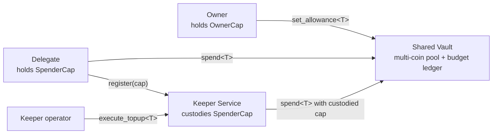
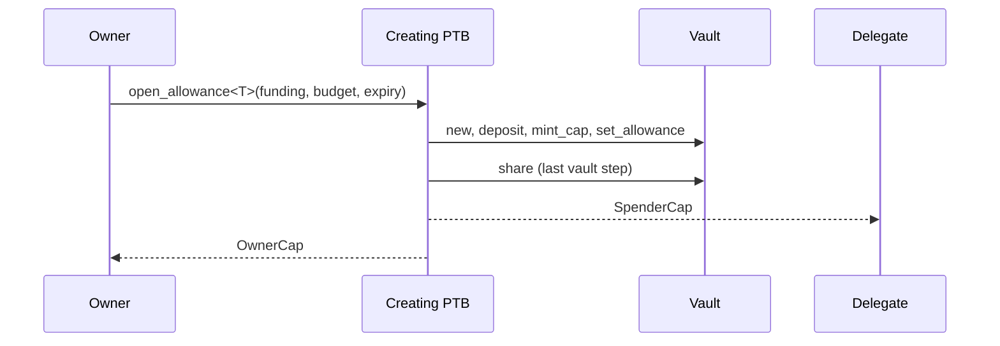
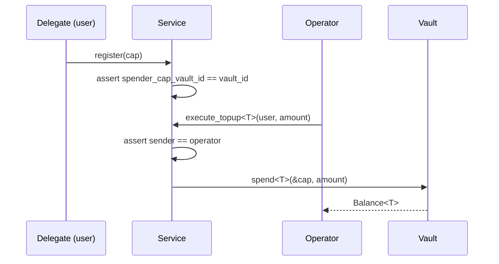

<Callout type="warn">
The example code snippets used in this guide are experimental and have not been audited. They simply help exemplify usage of the OpenZeppelin Sui Package.
</Callout>

This tutorial builds a delegated-spending system on the `spend_vault` module: a shared `Vault` whose owner grants expiring per-coin budgets to a `SpenderCap`, spent first directly by a delegate, then through a sender-gated keeper service that custodies the cap and spends on the user's behalf.

Three parties participate. The owner funds the vault, mints the cap, and sets budgets with the `OwnerCap`. The delegate holds the `SpenderCap` and draws against its budget. The keeper operator later drives spends through a custodied cap without the delegate signing each transaction.



Four ground rules shape everything below:

- A `SpenderCap` is a bearer instrument. The library never checks who calls [`spend`](/contracts-sui/1.x/api/allowance#spend_vault-spend); whoever presents the cap spends with its full authority, across every coin it is budgeted for.
- A `Vault` has `key` only, so it must be shared or destroyed in the transaction that creates it, and sharing must come last.
- Budgets are ceilings, not reservations. Grants may sum over the pool; a pool-short spend fails with the `InsufficientFundsForWithdraw` execution status, not a Move abort code.
- `destroy` deletes the budget ledger but never drains the pool. Undrained funds strand permanently.

The tutorial is linear: one happy path, with a named failure checkpoint at each step. Run every command in order.

## Prerequisites

This tutorial requires:

- The [Sui CLI](https://docs.sui.io/guides/developer/getting-started/sui-install), version 1.75.2 or newer (the modules rely on `sui::accumulator` and address balances, which older toolchains do not ship)
- `jq`, used at checkpoints to extract values from JSON output (optional; each checkpoint names the raw path as a fallback)

The tutorial runs on testnet, so register the environment and switch to it. If the first command reports the environment already exists, that is fine; the switch is what matters:

```bash
sui client new-env --alias testnet --rpc https://fullnode.testnet.sui.io:443
sui client switch --env testnet
```

Familiarity with shared objects and programmable transaction blocks (PTBs) helps but is not required; every command is given in full. Which account signs matters at every step, so each transaction block below begins with a `sui client switch` to its signer.

You need three funded accounts on your target network: an owner, a delegate, and a keeper operator. Create them with aliases so switching signers stays readable:

```bash
sui client new-address ed25519 owner
sui client new-address ed25519 delegate
sui client new-address ed25519 operator
```

On testnet, request tokens for the **owner** from the [web faucet](https://faucet.sui.io) (the CLI faucet, `sui client faucet`, redirects there). At the time of writing each request grants 1 SUI and the faucet rate-limits after a few requests, so request three times for the owner. 3 SUI covers the whole tutorial: the owner pays for the publish, deposits 1 SUI into the vault, and signs several more transactions, while the delegate and operator each only sign a few cheap ones.

Each faucet request delivers a separate 1 SUI coin object, and the split below draws from a single gas coin, so first merge the three into one. `sui client gas owner` lists the coin IDs; paying all coins to yourself consolidates them:

```bash
sui client switch --address owner
sui client pay-all-sui \
  --input-coins <COIN_ID_1> <COIN_ID_2> <COIN_ID_3> \
  --recipient <OWNER_ADDRESS> \
  --gas-budget 10000000
```

Then split gas out to the delegate and operator (`sui client addresses` lists the three addresses):

```bash
sui client ptb \
  --split-coins gas "[500000000, 500000000]" \
  --assign c \
  --transfer-objects "[c.0]" @<DELEGATE_ADDRESS> \
  --transfer-objects "[c.1]" @<OPERATOR_ADDRESS>
```

This leaves the owner just under 2 SUI and the delegate and operator 0.5 SUI each, which is enough for everything that follows.

## Set up the package

Create the package first. The modules in this tutorial declare `module my_defi::delegation` and `module my_defi::keeper`, so the package must be named `my_defi`: the scaffold defines the `my_defi` named address the modules resolve against. A different name fails the build unless you rename the module declarations to match.

```bash
sui move new my_defi
cd my_defi
```

Add the allowance package to `Move.toml` under the generated `[dependencies]` section, pinned to a git revision (it is not yet on the Move Registry):

```toml
[dependencies]
openzeppelin_allowance = { git = "https://github.com/OpenZeppelin/contracts-sui.git", subdir = "contracts/allowance", rev = "v1.5.1" }
```

Then import the module from your Move code:

```move
use openzeppelin_allowance::spend_vault::{Self, Vault, OwnerCap, SpenderCap};
```

## Create, Fund, and Share a Vault

The setup module composes the whole vault lifecycle in one function and returns the three objects by value, so the enclosing PTB decides every destination:

```move
module my_defi::delegation;

use openzeppelin_allowance::spend_vault::{Self, Vault, OwnerCap, SpenderCap};
use sui::clock::Clock;
use sui::coin::Coin;

/// Build a funded, budgeted allowance and return its three objects unattached, for
/// the caller to wire into the surrounding PTB. Creates the vault, deposits the
/// funding, mints a fresh cap, and grants it `budget` of `T`.
public fun open_allowance<T>(
    funding: Coin<T>,
    budget: u64,
    expires_at_ms: u64, // pass std::u64::max_value!() for "no expiry"
    clock: &Clock,
    ctx: &mut TxContext,
): (Vault, SpenderCap, OwnerCap) {
    let (mut vault, owner_cap) = spend_vault::new(ctx);

    // Permissionless top-up. Confers no rights; the funds become the owner's pool.
    vault.deposit(funding, ctx);

    // Bare cap, no budget yet. Returned by value, so the caller chooses its destination.
    let cap = vault.mint_cap(&owner_cap, ctx);
    let cap_id = object::id(&cap);

    // Create the (cap, T) budget. `option::none()` = no CAS guard on a fresh create.
    vault.set_allowance<T>(&owner_cap, cap_id, budget, expires_at_ms, option::none(), clock, ctx);

    // Hand the objects back; the caller shares the vault and routes the caps.
    (vault, cap, owner_cap)
}
```

This teaches the compose-then-share rule. `Vault` has `key` only and no `drop`: the transaction that calls `new` must either `share` or `destroy` the vault, or execution aborts. Sharing must also come last, because a shared vault is only addressable as a shared input in later transactions: every fund, mint, and grant step in the creating transaction has to precede `share`.



Publishing is a one-time step: a republish creates a fresh package whose `Vault` type no longer matches any vault you already created. The sections below introduce the functions one at a time, but paste **both complete modules** now and publish once.

<details>
<summary>Complete `sources/delegation.move` and `sources/keeper.move`</summary>

Each function is explained in its own section below; paste both files now so the single publish covers them.

```move
module my_defi::delegation;

use openzeppelin_allowance::spend_vault::{Self, Vault, OwnerCap, SpenderCap};
use sui::accumulator::AccumulatorRoot;
use sui::clock::Clock;
use sui::coin::Coin;

public fun open_allowance<T>(
    funding: Coin<T>,
    budget: u64,
    expires_at_ms: u64,
    clock: &Clock,
    ctx: &mut TxContext,
): (Vault, SpenderCap, OwnerCap) {
    let (mut vault, owner_cap) = spend_vault::new(ctx);
    vault.deposit(funding, ctx);
    let cap = vault.mint_cap(&owner_cap, ctx);
    let cap_id = object::id(&cap);
    vault.set_allowance<T>(&owner_cap, cap_id, budget, expires_at_ms, option::none(), clock, ctx);
    (vault, cap, owner_cap)
}

public fun spend_to_address<T>(
    vault: &mut Vault,
    cap: &SpenderCap,
    recipient: address,
    amount: u64,
    clock: &Clock,
    ctx: &mut TxContext,
) {
    vault.spend<T>(cap, amount, clock, ctx).send_funds(recipient);
}

public fun change_budget<T>(
    vault: &mut Vault,
    owner_cap: &OwnerCap,
    cap_id: ID,
    expected: u64,
    new_budget: u64,
    new_expires_at_ms: u64,
    clock: &Clock,
    ctx: &mut TxContext,
) {
    vault.set_allowance<T>(
        owner_cap,
        cap_id,
        new_budget,
        new_expires_at_ms,
        option::some(expected),
        clock,
        ctx,
    );
}

public fun kill_authority(
    vault: &mut Vault,
    owner_cap: &OwnerCap,
    cap_id: ID,
    ctx: &mut TxContext,
) {
    vault.revoke_all(owner_cap, cap_id, ctx);
}

public fun drain_coin<T>(
    vault: &mut Vault,
    owner_cap: &OwnerCap,
    root: &AccumulatorRoot,
    ctx: &mut TxContext,
): Coin<T> {
    vault.withdraw_all<T>(owner_cap, root, ctx).into_coin(ctx)
}
```

```move
module my_defi::keeper;

use openzeppelin_allowance::spend_vault::{Vault, SpenderCap};
use sui::balance::Balance;
use sui::clock::Clock;
use sui::table::{Self, Table};

#[error(code = 0)]
const ENotOperator: vector<u8> = "Caller is not the service operator";
#[error(code = 1)]
const EWrongVaultForService: vector<u8> =
    "Cap is bound to a different vault than this service serves";
#[error(code = 2)]
const ENotRegistered: vector<u8> = "No cap registered under this user address";

public struct Service has key {
    id: UID,
    operator: address,
    vault_id: ID,
    caps: Table<address, SpenderCap>,
}

public fun create(vault_id: ID, ctx: &mut TxContext): Service {
    Service {
        id: object::new(ctx),
        operator: ctx.sender(),
        vault_id,
        caps: table::new(ctx),
    }
}

public fun share(service: Service) {
    transfer::share_object(service);
}

public fun register(service: &mut Service, cap: SpenderCap, ctx: &mut TxContext) {
    assert!(cap.spender_cap_vault_id() == service.vault_id, EWrongVaultForService);
    service.caps.add(ctx.sender(), cap);
}

public fun execute_topup<T>(
    service: &mut Service,
    vault: &mut Vault,
    user: address,
    amount: u64,
    clock: &Clock,
    ctx: &mut TxContext,
): Balance<T> {
    assert!(ctx.sender() == service.operator, ENotOperator);
    assert!(service.caps.contains(user), ENotRegistered);
    let cap = service.caps.borrow(user);
    vault.spend<T>(cap, amount, clock, ctx)
}

public fun unregister(service: &mut Service, ctx: &mut TxContext): SpenderCap {
    assert!(service.caps.contains(ctx.sender()), ENotRegistered);
    service.caps.remove(ctx.sender())
}
```

</details>

`openzeppelin_allowance` is a source dependency with no on-chain address (OpenZeppelin does not publish it on-chain), so pass `--with-unpublished-dependencies` to bundle its modules into yours. The publish emits a single package object holding all three modules, `delegation`, `keeper`, and `spend_vault` together. Run it from the owner account (`sui client switch --address owner`); the publisher pays the gas and receives the package's `UpgradeCap`:

```bash
sui client publish --with-unpublished-dependencies
```

Record the package ID and account addresses from the output. There is only one: `$PACKAGE` contains `spend_vault` alongside your own modules, so every library call below is addressed as `$PACKAGE::spend_vault`. Bundling gives you your own copy of the library at your own package id rather than an OpenZeppelin-hosted address, which also means your `Vault` type is distinct from any other integrator's:

```bash
export PACKAGE=0x...
export OWNER=0x...
export DELEGATE=0x...
export OPERATOR=0x...
export GRAPHQL_URL=https://graphql.testnet.sui.io/graphql
export EXPIRES_AT_MS=$((($(date +%s) + 30 * 24 * 60 * 60) * 1000))
```

Run the creating PTB from the owner account. It funds the vault with 1 SUI, grants the cap a 0.4 SUI budget expiring in 30 days, shares the vault last, and routes the caps:

```bash
sui client switch --address owner
sui client ptb \
  --split-coins gas "[1000000000]" \
  --assign funding \
  --move-call $PACKAGE::delegation::open_allowance \
    "<0x2::sui::SUI>" \
    funding \
    400000000 \
    $EXPIRES_AT_MS \
    @0x6 \
  --assign r \
  --move-call $PACKAGE::spend_vault::share r.0 \
  --transfer-objects "[r.1]" @$DELEGATE \
  --transfer-objects "[r.2]" @$OWNER
```

Record the created object IDs from the output:

```bash
export VAULT=0x...
export OWNER_CAP=0x...
export SPENDER_CAP=0x...
```

**Checkpoint.** The transaction emits `VaultCreated`, `Deposited`, `SpenderCapMinted`, and `AllowanceSet { was_created: true }`. If you see anything else, stop and re-check the PTB before continuing.

## Grant a Budget

`open_allowance` already performed the first grant, so this step unpacks what [`set_allowance`](/contracts-sui/1.x/api/allowance#spend_vault-set_allowance) actually did and establishes the habit you need for every later grant.

A budget is an entry keyed by `(cap_id, coin type)`. Two sentinel values use `u64::MAX`: a `new_amount` of `u64::MAX` means unlimited (never decremented by spends), and a `new_expires_at_ms` of `u64::MAX` means no expiry. Any finite expiry must be strictly in the future or the call aborts [`EExpiryInPast`](/contracts-sui/1.x/api/allowance#spend_vault-EExpiryInPast). Setting `new_amount` to `0` is legal and means suspension, not deletion.

`set_allowance` takes the spender cap's id as a bare, unvalidated `ID` and upserts. A mistyped `cap_id` does not abort; it silently provisions a fresh phantom budget. The defense is the `was_created` flag on the emitted `AllowanceSet` event: on a grant you intended as an update, confirm `was_created == false`. If it is `true`, you just created a budget under the wrong id.

The owner grants or updates later budgets by calling the library directly. Run this from the owner account to raise the budget to 0.6 SUI (unconditionally; the race-free variant comes later):

```bash
sui client switch --address owner
sui client ptb \
  --move-call $PACKAGE::spend_vault::set_allowance \
    "<0x2::sui::SUI>" \
    @$VAULT \
    @$OWNER_CAP \
    @$SPENDER_CAP \
    600000000 \
    $EXPIRES_AT_MS \
    none \
    @0x6
```

**Checkpoint.** Read the entry back with a dev-inspect call to each view function. Use `sui client call --dev-inspect --json`, which reports return values under `command_outputs` (`sui client ptb --dev-inspect` executes the same reads but prints no return values); piping through `jq` extracts the value from the otherwise lengthy output:

```bash
sui client call --dev-inspect --json \
  --package $PACKAGE --module spend_vault --function allowance \
  --type-args 0x2::sui::SUI --args $VAULT $SPENDER_CAP \
  | jq '.command_outputs[0].returnValues[0].json'

sui client call --dev-inspect --json \
  --package $PACKAGE --module spend_vault --function expiry \
  --type-args 0x2::sui::SUI --args $VAULT $SPENDER_CAP \
  | jq '.command_outputs[0].returnValues[0].json'
```

`allowance` must print `"600000000"` and `expiry` your `$EXPIRES_AT_MS` (without `jq`, find the same path by eye in the raw JSON). The transaction's `AllowanceSet` event must show `was_created: false`.

## Spend as the Delegate

`spend` returns a `Balance<T>` with no `drop`: the caller must consume it in the same PTB. Because the library's pool already lives as [address balances](https://docs.sui.io/onchain-finance/asset-custody/address-balances), the delegate-facing wrapper hands the drawn balance straight to a recipient's address balance with `send_funds`, creating no new object. That wrapper is already in your module:

```move
/// `spend` returns Balance<T>, which has no `drop`: it must be consumed in the
/// same PTB. Here we hand it straight to `recipient`'s address balance with
/// `send_funds`, so the funds land natively with no `Coin` object created.
public fun spend_to_address<T>(
    vault: &mut Vault,
    cap: &SpenderCap,
    recipient: address,
    amount: u64,
    clock: &Clock,
    ctx: &mut TxContext,
) {
    vault.spend<T>(cap, amount, clock, ctx).send_funds(recipient);
}
```

Reach for a `Coin<T>` only when a downstream call needs a coin object to compose with: return `vault.spend<T>(...).into_coin(ctx)` instead and let the PTB route the object. The [Spend Vault guide](/contracts-sui/1.x/spend-vault#spending) shows both forms.

Run the spend from the delegate account, drawing 0.15 SUI straight into the delegate's address balance:

```bash
sui client switch --address delegate
sui client ptb \
  --move-call $PACKAGE::delegation::spend_to_address \
    "<0x2::sui::SUI>" \
    @$VAULT \
    @$SPENDER_CAP \
    @$DELEGATE \
    150000000 \
    @0x6
```

**Checkpoint.** The transaction emits one `Spent` event: `amount: 150000000`, `remaining: 450000000` (the raw post-call budget), `caller` equal to `$DELEGATE`, and the `coin_type` and `cap_id` you expect. No new coin object is created: the 0.15 SUI merges into `$DELEGATE`'s SUI address balance. Re-running the dev-inspect from the previous step shows `allowance` decremented to `450000000`.

## Build the Keeper Service

Direct spending proves the primitive. The library's primary use case wraps it: a protocol custodies users' caps and spends on their behalf within the owner-set budgets, without the owner or delegate signing each spend.

<Callout type="warn">
A `SpenderCap` is a bearer instrument and the library never checks who calls `spend`; any code that gets the library to see `&cap` exercises its full authority. A public function that borrows a custodied cap without a sender gate is world-drainable. The operator assert below is the integration's security boundary, not optional hygiene.
</Callout>

The service is pinned to exactly one vault id at creation; pinning up front is what makes the register-time binding check meaningful. It is the second module you already published:

```move
module my_defi::keeper;

use openzeppelin_allowance::spend_vault::{Vault, SpenderCap};
use sui::balance::Balance;
use sui::clock::Clock;
use sui::table::{Self, Table};

#[error(code = 0)]
const ENotOperator: vector<u8> = "Caller is not the service operator";
#[error(code = 1)]
const EWrongVaultForService: vector<u8> =
    "Cap is bound to a different vault than this service serves";
#[error(code = 2)]
const ENotRegistered: vector<u8> = "No cap registered under this user address";

/// Shared keeper service. Serves exactly one `Vault` and custodies at most one cap
/// per user. Untyped, so one service drives every coin a cap is budgeted for.
public struct Service has key {
    id: UID,
    operator: address,
    vault_id: ID,
    caps: Table<address, SpenderCap>,
}

/// Create a service pinned to `vault_id`. The creator becomes the operator, the
/// only address the cap-borrowing entrypoint accepts. Returned by value for the
/// caller to `share` (two-step create-then-share, mirroring `spend_vault::share`).
public fun create(vault_id: ID, ctx: &mut TxContext): Service {
    Service {
        id: object::new(ctx),
        operator: ctx.sender(),
        vault_id,
        caps: table::new(ctx),
    }
}

/// Share the service so users can register caps against it.
public fun share(service: Service) {
    transfer::share_object(service);
}

/// Validate the cap's vault binding BEFORE taking custody: the rule for ANY
/// protocol that accepts a SpenderCap.
public fun register(service: &mut Service, cap: SpenderCap, ctx: &mut TxContext) {
    assert!(cap.spender_cap_vault_id() == service.vault_id, EWrongVaultForService);
    service.caps.add(ctx.sender(), cap);
}

/// SENDER-GATED: the library never checks who calls `spend`, so the custody
/// layer must. Without this check the function is world-drainable.
public fun execute_topup<T>(
    service: &mut Service,
    vault: &mut Vault,
    user: address,
    amount: u64,
    clock: &Clock,
    ctx: &mut TxContext,
): Balance<T> {
    assert!(ctx.sender() == service.operator, ENotOperator);
    assert!(service.caps.contains(user), ENotRegistered);
    let cap = service.caps.borrow(user);
    vault.spend<T>(cap, amount, clock, ctx)
}

/// Take a cap back out of custody. The grant is untouched: it stays live in the
/// vault; only custody of the cap changes hands.
public fun unregister(service: &mut Service, ctx: &mut TxContext): SpenderCap {
    assert!(service.caps.contains(ctx.sender()), ENotRegistered);
    service.caps.remove(ctx.sender())
}
```

The `register` check calls [`spender_cap_vault_id`](/contracts-sui/1.x/api/allowance#spend_vault-spender_cap_vault_id) so a cap bound to a different vault is rejected at custody time, not discovered at spend time. `execute_topup` is generic over `T`, so one custodied cap serves every coin the owner budgeted it for; asking for a coin the owner never granted fails safe inside the library with [`ENoAllowance`](/contracts-sui/1.x/api/allowance#spend_vault-ENoAllowance).



The `keeper` module is already part of `$PACKAGE`, so no further publish is needed. Create and share the service from the operator account, pinning it to your vault id:

```bash
sui client switch --address operator
sui client ptb \
  --move-call $PACKAGE::keeper::create @$VAULT \
  --assign service \
  --move-call $PACKAGE::keeper::share service
```

Record the shared service id:

```bash
export SERVICE=0x...
```

The delegate hands the cap into custody. Run this from the delegate account:

```bash
sui client switch --address delegate
sui client ptb \
  --move-call $PACKAGE::keeper::register @$SERVICE @$SPENDER_CAP
```

Now the operator drives a spend. `execute_topup` returns a `Balance<T>`, which the PTB delivers straight to the user's address balance with `send_funds`, creating no coin object. In a real keeper this balance would flow into a position; here it tops up the user. Run this from the operator account:

```bash
sui client switch --address operator
sui client ptb \
  --move-call $PACKAGE::keeper::execute_topup \
    "<0x2::sui::SUI>" \
    @$SERVICE \
    @$VAULT \
    @$DELEGATE \
    50000000 \
    @0x6 \
  --assign bal \
  --move-call 0x2::balance::send_funds "<0x2::sui::SUI>" bal @$DELEGATE
```

**Checkpoint.** The `Spent` event shows `remaining: 400000000` and `caller` equal to `$OPERATOR`: attribution follows whoever drove the spend, not the user who owns the budget. Repeating the PTB from the delegate or owner account aborts with the keeper module's `ENotOperator`, proving the gate holds.

## Owner Maintenance Mid-Custody

The owner keeps full control while the cap sits in custody, because every owner verb keys on the `cap_id` alone and never touches the cap object. `cap_id` is stable across create, raise, lower, suspend, and renew; a custodied cap keeps working with no re-registration.

A plain `set_allowance` computed from an earlier read can clobber a spend sequenced in between. The race-free idiom is compare-and-set: read the current budget with `allowance<T>` off-chain (or in a previous transaction), then pass that value as `expected` when you write. If a spend landed after the read, the entry's `remaining` no longer matches and the write aborts [`EUnexpectedAllowance`](/contracts-sui/1.x/api/allowance#spend_vault-EUnexpectedAllowance) instead of silently overwriting; re-read and retry. The wrapper is already in `my_defi::delegation`:

```move
/// Raise / lower / renew with the race-free CAS idiom. `expected` is the budget
/// the caller read via `allowance<T>` off-chain (or in a previous transaction).
/// If a spend was sequenced between that read and this transaction, the entry's
/// `remaining` no longer equals `expected` and the call aborts
/// `EUnexpectedAllowance` instead of clobbering the concurrent spend.
public fun change_budget<T>(
    vault: &mut Vault,
    owner_cap: &OwnerCap,
    cap_id: ID,
    expected: u64,
    new_budget: u64,
    new_expires_at_ms: u64,
    clock: &Clock,
    ctx: &mut TxContext,
) {
    vault.set_allowance<T>(
        owner_cap,
        cap_id,
        new_budget,
        new_expires_at_ms,
        option::some(expected),
        clock,
        ctx,
    );
}
```

Note that the CAS guard matches `remaining` only, while the upsert always overwrites the expiry too: a budget-only update must re-read the current expiry (via `expiry<T>`) and pass it back, or it silently rewrites the deadline.

Read the current budget first (the last checkpoint's `Spent` event showed `remaining: 400000000`, or re-run the dev-inspect read), then raise it to 1 SUI from the owner account, passing the read value as `expected`:

```bash
sui client switch --address owner
sui client ptb \
  --move-call $PACKAGE::delegation::change_budget \
    "<0x2::sui::SUI>" \
    @$VAULT \
    @$OWNER_CAP \
    @$SPENDER_CAP \
    400000000 \
    1000000000 \
    $EXPIRES_AT_MS \
    @0x6
```

If a spend lands between your read and this transaction, the PTB aborts `EUnexpectedAllowance`; re-read the budget and retry with the fresh value.

Three conditions stop a spender, and the spender can tell them apart by abort code:

- **Suspend**: `set_allowance` with `new_amount = 0` keeps the entry and cap alive. The next positive spend aborts [`EAllowanceExceeded`](/contracts-sui/1.x/api/allowance#spend_vault-EAllowanceExceeded), the signal to ask for a raise.
- **Revoke**: [`revoke`](/contracts-sui/1.x/api/allowance#spend_vault-revoke) removes the `(cap, coin)` entry. The next spend aborts [`ENoAllowance`](/contracts-sui/1.x/api/allowance#spend_vault-ENoAllowance), the signal to ask for a new grant. `revoke` is idempotent and returns `was_present`; `false` means a typo'd `cap_id` or wrong coin, never an abort.
- **Expire**: once the clock reaches a finite `expires_at_ms`, the next spend aborts [`EAllowanceExpired`](/contracts-sui/1.x/api/allowance#spend_vault-EAllowanceExpired) (the boundary is closed: a spend at exactly the expiry millisecond fails). The owner revives the entry in place by re-setting a future expiry via `set_allowance`.

**Checkpoint.** Run the operator's `execute_topup` PTB from the previous section again. It succeeds under the new budget without any re-registration, and the `Spent` event reflects the raised `remaining`.

## Emergency Stop

This section is for *durably* stopping a cap that must not spend again, not for routine exit: to just recover funds the owner withdraws anytime (see Teardown), and with a single funder that is the whole story. When a cap is compromised or a keeper misbehaves and the pool could be re-funded, the order of operations matters. Kill that cap's authority first, then move the funds, in two separate transactions. `revoke_all` acts on the one cap you name; this tutorial has a single delegate, but a vault serving many spenders revokes each compromised cap, or `destroy`s the whole vault to end every cap at once. These two functions are already in `my_defi::delegation`, which imports `use sui::accumulator::AccumulatorRoot;` for the second:

```move
// Emergency stop, in TWO separate transactions, never one PTB.

/// Tx 1: kill this cap's authority. `revoke_all` acts on one cap and never
/// touches the pool, so no allowance state can race it into failure. (Withdrawing
/// first is NOT durable: deposits are permissionless, so anyone can re-arm a live
/// allowance.)
public fun kill_authority(
    vault: &mut Vault,
    owner_cap: &OwnerCap,
    cap_id: ID,
    ctx: &mut TxContext,
) {
    vault.revoke_all(owner_cap, cap_id, ctx);
}

/// Tx 2 (a LATER transaction, once per coin type): drain the coin. `withdraw_all`
/// reads the settled accumulator (root = 0xacc); a same-checkpoint pool change
/// makes it over-ask and abort (retry-safe). Returns the possibly-zero drained
/// pool as a wallet `Coin<T>` for the caller to route.
public fun drain_coin<T>(
    vault: &mut Vault,
    owner_cap: &OwnerCap,
    root: &AccumulatorRoot,
    ctx: &mut TxContext,
): Coin<T> {
    vault.withdraw_all<T>(owner_cap, root, ctx).into_coin(ctx)
}
```

Never bundle the two into one PTB. A pool-short `withdraw_all` fails with the `InsufficientFundsForWithdraw` execution status, and Move's atomic revert would take the `revoke_all` down with it, leaving the compromised cap live exactly when you need it dead. Withdraw-first is not a substitute either: deposits are permissionless, so anyone can re-fund the pool and re-arm a still-live allowance. Only [`revoke_all`](/contracts-sui/1.x/api/allowance#spend_vault-revoke_all) (or `destroy`) is durable.

Transaction 1, from the owner account. Note `revoke_all` takes the bare `cap_id` unvalidated, and a wrong id is a silent whole no-op with no event, leaving the intended cap live:

```bash
sui client switch --address owner
sui client ptb \
  --move-call $PACKAGE::spend_vault::revoke_all @$VAULT @$OWNER_CAP @$SPENDER_CAP
```

**Checkpoint.** The transaction emits one `Revoked { was_present: true }` event per removed coin: for this vault, exactly one, for `0x2::sui::SUI`. Zero `Revoked` events means the `cap_id` missed; fix it before proceeding.

Transaction 2, later, from the owner account. `withdraw_all` returns a possibly-zero `Balance<T>`, consumed here as a `Coin`:

```bash
sui client switch --address owner
sui client ptb \
  --move-call $PACKAGE::spend_vault::withdraw_all \
    "<0x2::sui::SUI>" \
    @$VAULT \
    @$OWNER_CAP \
    @0xacc \
  --assign bal \
  --move-call 0x2::coin::from_balance "<0x2::sui::SUI>" bal \
  --assign recovered \
  --transfer-objects "[recovered]" @$OWNER
```

If this fails with `InsufficientFundsForWithdraw`, a same-checkpoint pool change skewed the settled read; retry in the next checkpoint.

## Teardown

<Callout type="warn">
`destroy` drains only the budget ledger and deletes the vault's UID. It does not touch the pool, and no on-chain guard can stop a premature destroy: any coins still at the vault address strand permanently. Drain every coin type first, in a prior transaction, never in the same PTB.
</Callout>

The drain ritual, in order:

1. Enumerate every coin type at the vault address off-chain; the on-chain `granted_coin_types` view is not the drain list, since anyone can deposit coin types that were never granted. The GraphQL `balances` query reports the vault's address balances, including coin types deposited with a raw `send_funds` that no grant ever mentioned:

   ```bash
   curl -s $GRAPHQL_URL -X POST -H 'Content-Type: application/json' \
     -d "{\"query\":\"{ address(address: \\\"$VAULT\\\") { balances { nodes { coinType { repr } totalBalance } } } }\"}"
   ```

2. If any loose `Coin` objects were transferred to the vault address (rather than deposited), recover them into the pool with `squash<T>`, passing the receiving ticket.
3. Run the `withdraw_all` PTB from the previous section once per coin type reported.
4. Wait one checkpoint, then re-run the balances query; a same-checkpoint deposit is missed by the settled read, so the re-check is what catches late arrivals.
5. Only when every balance reads zero, destroy the vault. Run this from the owner account; it consumes both the vault and the `OwnerCap`:

   ```bash
   sui client switch --address owner
   sui client ptb \
     --move-call $PACKAGE::spend_vault::destroy @$VAULT @$OWNER_CAP
   ```

In this tutorial the ritual collapses: only SUI was ever deposited, the pool is already drained, and there are no loose coins to `squash`, so steps 1, 4, and 5 are the whole run, and steps 2 and 3 are no-ops. On a live vault, never skip them: deposits are permissionless, so coin types you never granted can be sitting at the vault address.

**Checkpoint.** The transaction emits `VaultDestroyed`. If the delegate's cap was never reclaimed and destroyed, it is now orphaned; its holder can dispose of it with [`delete_orphaned_cap`](/contracts-sui/1.x/api/allowance#spend_vault-delete_orphaned_cap) (ungated, but the cap is consumed by value, so only its owner can call it). In this tutorial the cap is still custodied by the keeper `Service`, so the delegate must first take it back with `keeper::unregister`, then call `delete_orphaned_cap`.

## Operational Checklist

- Validate `spender_cap_vault_id` against the expected vault before taking any `SpenderCap` into custody.
- Sender-gate every function that borrows a custodied cap; the library never checks the caller, so the custody layer's gate is the security boundary.
- To recover funds, the owner withdraws anytime, unconditionally. To *durably* stop a compromised cap (so a later deposit cannot re-arm it), `revoke_all` that cap first in its own transaction, then `withdraw_all` per coin in a later one; never bundle them, and repeat per cap (or `destroy` the vault to end all).
- Drain every coin type (off-chain enumeration via the GraphQL `balances` query, then `squash`, then `withdraw_all`, then wait a checkpoint and re-check) before calling `destroy`.
- Confirm `AllowanceSet.was_created == false` on every budget update; `true` on an intended update means a mistyped `cap_id` provisioned a phantom budget.
- On budget-only CAS updates, re-read and re-pass the current expiry; the upsert always overwrites `expires_at_ms`.
- Treat pool-short failures as execution statuses, not Move aborts: preflight `spend`, `withdraw`, and `withdraw_all` with a dry run instead of matching an abort code.

For function-level signatures, abort codes, and events, see the [Allowance API reference](/contracts-sui/1.x/api/allowance#spend_vault).
