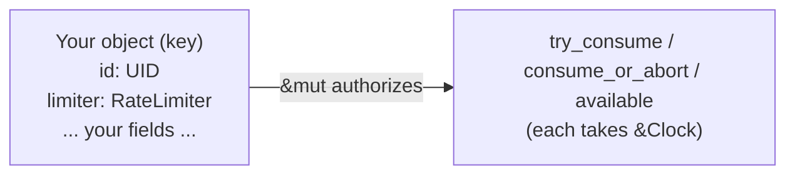
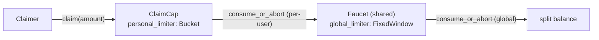

<Callout type="warn">
The example code snippets used in this guide are experimental and have not been audited. They simply help exemplify usage of the OpenZeppelin Sui Package.
</Callout>

The `rate_limiter` module provides an embeddable rate-limiting primitive for Sui Move. Unlike most building blocks, `RateLimiter` is **not** a Sui object: it is a `store + drop` value you embed as a field inside an object you already own, and call on the hot path. Its scope is exactly that parent object — there is no registry, no shared policy object, and no ID to track.



Because the limiter lives inside your object, `&mut` to that object is what authorizes both consuming and reconfiguring it. Authorization is whatever guards that `&mut` — the module makes no access-control claim of its own.

## What we will build

This guide builds **one** end-to-end example — a token faucet — and runs it on testnet from start to finish.

The faucet hands out a fixed-supply token (`RARE_COIN`), throttled two ways at once:

- A **global** `FixedWindow` limiter on the shared `Faucet`: at most `100` coins may be claimed per rolling hour, *collectively across every claimer*.
- A **personal** `Bucket` limiter carried inside each holder's `ClaimCap`: it caps how much that specific holder can claim, refilling over time.

A claim must satisfy **both** limiters. That makes the faucet a compact tour of the primitive's range in a single module:

- embedding a limiter in a shared object (the global window),
- embedding a limiter in a per-user capability (the personal bucket),
- composing two limiters of *different variants* across two objects,
- running the rate-limit check *before* the side effect, and
- observing each limiter become the binding constraint in turn.



## Prerequisites

To follow the on-chain walkthrough you need:

- The [Sui CLI](https://docs.sui.io/references/cli) installed, with an address configured for **testnet** and funded from the [faucet](https://docs.sui.io/guides/developer/getting-started/get-coins).
- [`jq`](https://jqlang.org/) for pulling object IDs out of JSON output.

It also helps to be familiar with Sui Move shared objects, capabilities, the shared `Clock` at `0x6`, and programmable transaction blocks (PTBs).

## Add the dependency

Add the utilities package to `Move.toml`:

```toml
[dependencies]
openzeppelin_utils = { r.mvr = "@openzeppelin-move/utils" }
```

Then import the module from your Move code:

```move
use openzeppelin_utils::rate_limiter::{Self, RateLimiter};
```

## The token to dispense

A faucet needs something to hand out. We use a minimal fixed-supply coin, `RARE_COIN`, that mints its entire supply to the publisher on creation.

```move title="sources/rare_coin.move"
module rate_limiter_example::rare_coin;

public struct RARE_COIN has drop {}

fun init(witness: RARE_COIN, ctx: &mut TxContext) {
    let (mut currency, mut treasury_cap) = sui::coin_registry::new_currency_with_otw(
        witness,
        0,
        "RARE_COIN",
        "Rare Coin",
        "",
        "",
        ctx,
    );

    let coins = treasury_cap.mint(10_000, ctx);
    currency.make_supply_fixed(treasury_cap);
    currency.finalize_and_delete_metadata_cap(ctx);
    transfer::public_transfer(coins, ctx.sender());
}
```

## The faucet module

The faucet itself is one module. The shared `Faucet` holds the funds and the global window; each `ClaimCap` holds its owner's personal bucket. `claim` charges the personal bucket, then the global window, and only then splits the coins — so a refusal on either limiter never touches the balance.

```move title="sources/faucet.move"
module rate_limiter_example::faucet;

use openzeppelin_utils::rate_limiter::{Self, RateLimiter};
use sui::balance::Balance;
use sui::clock::Clock;
use sui::coin::{Self, Coin};
use rate_limiter_example::rare_coin::RARE_COIN;

// === Constants ===

const HOUR: u64 = 60 * 60 * 1000;

const HOURLY_LIMIT: u64 = 100;

// === Structs ===

/// Shared faucet with one global claim limiter shared by every holder.
public struct Faucet has key {
    id: UID,
    balance: Balance<RARE_COIN>,
    global_limiter: RateLimiter,
}

/// Handed to whoever funds the faucet; authorizes issuing `ClaimCap`s with per-holder limits.
public struct AdminCap has key, store { id: UID }

/// Presented on every claim. Carries a personal bucket limiter that caps this holder.
public struct ClaimCap has key, store {
    id: UID,
    personal_limiter: RateLimiter,
}

// === Public Functions ===

/// Share a faucet whose global budget is 100 coins per hour, and return an `AdminCap`
/// for issuing claim capabilities.
public fun new(funds: Coin<RARE_COIN>, clock: &Clock, ctx: &mut TxContext): AdminCap {
    // FixedWindow: a hard quota of 100 per rolling hour, anchored at now, starting full.
    let global_limiter = rate_limiter::new_fixed_window(
        HOURLY_LIMIT, // capacity (units per window)
        HOUR, // window_ms (1 hour)
        clock.timestamp_ms(), // window_start_ms (anchor at now)
        HOURLY_LIMIT, // initial_available (start full)
        clock,
    );

    transfer::share_object(Faucet {
        id: object::new(ctx),
        balance: funds.into_balance(),
        global_limiter,
    });
    AdminCap { id: object::new(ctx) }
}

/// Issue a claim capability with a personal token-bucket limit: at most `per_user_cap`
/// outstanding, refilling `refill_amount` every `refill_interval_ms`, starting full.
public fun issue_claim_cap(
    _: &AdminCap,
    recipient: address,
    per_user_cap: u64,
    refill_amount: u64,
    refill_interval_ms: u64,
    clock: &Clock,
    ctx: &mut TxContext,
) {
    let personal_limiter = rate_limiter::new_bucket(
        per_user_cap, // capacity
        refill_amount,
        refill_interval_ms,
        clock.timestamp_ms(), // last_refill_ms (anchor at now)
        per_user_cap, // initial_available (start full)
        clock,
    );
    transfer::transfer(ClaimCap { id: object::new(ctx), personal_limiter }, recipient);
}

/// Claim `amount`, charging the holder's personal bucket first, then the global window.
/// Both checks run before the balance split, so a denial on either never touches `balance`.
public fun claim(
    self: &mut Faucet,
    cap: &mut ClaimCap,
    amount: u64,
    clock: &Clock,
    ctx: &mut TxContext,
): Coin<RARE_COIN> {
    cap.personal_limiter.consume_or_abort(amount, clock); // per-user cap
    self.global_limiter.consume_or_abort(amount, clock); // global cap
    coin::from_balance(self.balance.split(amount), ctx)
}

// === View helpers ===

/// This holder's currently-available personal allowance (projects refill on read).
public fun personal_allowance(cap: &ClaimCap, clock: &Clock): u64 {
    cap.personal_limiter.available(clock)
}

/// The faucet's currently-available global allowance (projects window rollover on read).
public fun global_allowance(self: &Faucet, clock: &Clock): u64 {
    self.global_limiter.available(clock)
}
```

A few things worth highlighting:

- **Two variants, one API.** The global limiter is a `FixedWindow` and the personal limiter is a `Bucket`, yet both are consumed with the same `consume_or_abort(amount, clock)` call. Only the constructor differs.
- **Both limiters are independent.** The personal bucket refills smoothly over time; the global window resets on its own hourly boundary. A holder is bounded by whichever is tighter at the moment of the call.
- **Check before effect.** Both `consume_or_abort` calls run before `balance.split`, so a denied claim aborts `ERateLimited` and the whole transaction reverts without moving any funds.
- **The cap governs *who*, the limiter governs *how much*.** Holding a `ClaimCap` is what lets you call `claim` at all; the limiters bound the throughput once you can.

## Deploy and try it on testnet

The walkthrough below takes the faucet from a fresh publish to exercising *both* rate limits. Make sure your CLI is pointed at testnet first:

```bash
sui client switch --env testnet
```

### 1. Publish the package

Publishing creates `RARE_COIN`, mints its full supply (`10_000`) to you, and installs the faucet module. We capture the output as JSON and pull out the IDs we need.

```bash
ADDR=$(sui client active-address)

sui client publish --build-env testnet --gas-budget 200000000 --json > /tmp/pub.json
```

```bash
PKG=$(jq -r '.objectChanges[] | select(.type=="published") | .packageId' /tmp/pub.json)

COIN=$(jq -r '.objectChanges[]
  | select(.type=="created" and (.objectType|test("coin::Coin<.*::rare_coin::RARE_COIN>")))
  | .objectId' /tmp/pub.json)

CURRENCY=$(jq -r '.objectChanges[]
  | select(.type=="created" and (.objectType|test("coin_registry::Currency")))
  | .objectId' /tmp/pub.json)
```

### 2. Register the coin currency

Finalize the `RARE_COIN` registration in the on-chain coin registry (`0xc`):

```bash
sui client ptb --move-call 0x2::coin_registry::finalize_registration "<$PKG::rare_coin::RARE_COIN>" @0xc @$CURRENCY
```

Confirm the full supply landed with you:

```bash
sui client balance --coin-type $PKG::rare_coin::RARE_COIN
```

```
╭──────────────────────────────────────────────────╮
│ Balance of coins owned by this address           │
├──────────────────────────────────────────────────┤
│ ╭──────────────────────────────────────────────╮ │
│ │ coin       balance (raw)  balance            │ │
│ ├──────────────────────────────────────────────┤ │
│ │ Rare Coin  10000          10.00K RARE_COIN   │ │
│ ╰──────────────────────────────────────────────╯ │
╰──────────────────────────────────────────────────╯
```

### 3. Create and fund the faucet

`new` takes the coin to dispense, shares the `Faucet` (carrying the global limiter), and *returns* an `AdminCap`. We capture the returned cap and transfer it to ourselves in the same PTB. The shared `Clock` is the object at `0x6`.

```bash
sui client ptb \
  --move-call $PKG::faucet::new @$COIN @0x6 \
  --assign admin_cap \
  --transfer-objects "[admin_cap]" @$ADDR \
  --gas-budget 100000000 --json > /tmp/new.json
```

Grab the shared `Faucet` and the owned `AdminCap` that transaction created:

```bash
FAUCET=$(jq -r '.objectChanges[] | select(.type=="created" and (.objectType|test("::faucet::Faucet"))) | .objectId' /tmp/new.json)

ADMIN=$(jq -r '.objectChanges[] | select(.type=="created" and (.objectType|test("::faucet::AdminCap"))) | .objectId' /tmp/new.json)
```

The faucet now holds the full balance, and its global window starts at the full `100`/hour allowance:

```bash
sui client object $FAUCET --json | jq -r '.content.balance'
```

```
10000
```

```bash
sui client object $FAUCET --json | jq -r '.content.global_limiter.available'
```

```
100
```

### 4. Issue yourself a claim capability

Issue a `ClaimCap` with a personal token-bucket cap of `10` coins, refilling `10` every hour, starting full:

```bash
CAP=$(sui client ptb \
  --move-call $PKG::faucet::issue_claim_cap @$ADMIN @$ADDR 10 10 3600000 @0x6 \
  --gas-budget 100000000 \
  --json | jq -r '.objectChanges[] | select(.type=="created" and (.objectType|test("::faucet::ClaimCap"))) | .objectId')
```

The personal bucket starts full at `10`:

```bash
sui client object $CAP --json | jq -r '.content.personal_limiter.available'
```

```
10
```

### 5. Claim — and watch both limiters get charged

Claim `5` `RARE_COIN`, presenting the `Faucet` and your `ClaimCap`, and forward the coin to yourself in the same PTB:

```bash
sui client ptb \
  --move-call $PKG::faucet::claim @$FAUCET @$CAP 5 @0x6 \
  --assign coin \
  --transfer-objects "[coin]" @$ADDR \
  --gas-budget 100000000
```

```
...
│ Status: Success                                  │
...
╭────────────────────────────────────────────────────────────────────╮
│ Balance Changes                                                      │
├────────────────────────────────────────────────────────────────────┤
│  CoinType: ...::rare_coin::RARE_COIN   Amount: 5                     │
╰────────────────────────────────────────────────────────────────────╯
```

The faucet balance dropped by `5`, and *both* limiters were charged — the personal bucket `10 → 5` and the global window `100 → 95`:

```bash
sui client object $FAUCET --json | jq -r '.content.balance'
```

```
9995
```

```bash
sui client object $CAP --json | jq -r '.content.personal_limiter.available'
```

```
5
```

```bash
sui client object $FAUCET --json | jq -r '.content.global_limiter.available'
```

```
95
```

### 6. The personal bucket binds

Try to claim `6` with the same cap. The global window still has `95` left, but the **personal** bucket only has `5`, so the claim aborts `ERateLimited` and the whole PTB reverts:

```bash
sui client ptb \
  --move-call $PKG::faucet::claim @$FAUCET @$CAP 6 @0x6 \
  --assign coin \
  --transfer-objects "[coin]" @$ADDR \
  --gas-budget 100000000
```

```
Error executing transaction '...': 1st command aborted within function
'...::rate_limiter::consume_or_abort' ... Aborted with error code 0
--'ERateLimited' -- 'Rate limited'
```

### 7. The global window binds

Now show the *other* limiter becoming the binding constraint. Issue a second cap with a generous personal cap of `1000`, so the personal bucket can never bind for this holder:

```bash
CAP2=$(sui client ptb \
  --move-call $PKG::faucet::issue_claim_cap @$ADMIN @$ADDR 1000 1000 3600000 @0x6 \
  --gas-budget 100000000 \
  --json | jq -r '.objectChanges[] | select(.type=="created" and (.objectType|test("::faucet::ClaimCap"))) | .objectId')
```

The personal bucket has `1000` available, but the global window only has `95` left:

```bash
sui client object $CAP2 --json | jq -r '.content.personal_limiter.available'
```

```
1000
```

```bash
sui client object $FAUCET --json | jq -r '.content.global_limiter.available'
```

```
95
```

Try to claim `96` with the generous cap. The personal bucket has room, but the **global** window only allows `95`, so it aborts — the global cap binds across all holders:

```bash
sui client ptb \
  --move-call $PKG::faucet::claim @$FAUCET @$CAP2 96 @0x6 \
  --assign coin \
  --transfer-objects "[coin]" @$ADDR \
  --gas-budget 100000000
```

```
Error executing transaction '...': 1st command aborted within function
'...::rate_limiter::consume_or_abort' ... Aborted with error code 0
--'ERateLimited' -- 'Rate limited'
```

And because both checks run before the balance split, the failed claims never moved any funds — the faucet balance is still `9995`:

```bash
sui client object $FAUCET --json | jq -r '.content.balance'
```

```
9995
```

## What this showed

In one module, the faucet exercised the core integration pattern end to end:

- A `RateLimiter` is embedded as a field of an object you own — the shared `Faucet` for the global window, and each `ClaimCap` for a per-holder bucket — never as a standalone object.
- Different variants (`FixedWindow` and `Bucket`) share one `consume_or_abort` / `available` API, and compose cleanly across objects within a single PTB.
- Running the check before the side effect makes every denial all-or-nothing: a refused claim reverts the transaction without touching funds.
- Authorization (`ClaimCap`) and throughput (the limiters) are separate concerns — the module decides *how much*, the capability decides *who*.

To change a limiter's configuration after deployment, there are no in-place setters: snapshot the current values through the getters, build a fresh `RateLimiter`, and overwrite the field, gating that entry function with the same `AdminCap`. See the [Rate Limiter module guide](/contracts-sui/1.x/rate-limiter) for key concepts and the common-mistakes reference, and the [Utilities API reference](/contracts-sui/1.x/api/utils) for function signatures, parameters, and errors.
