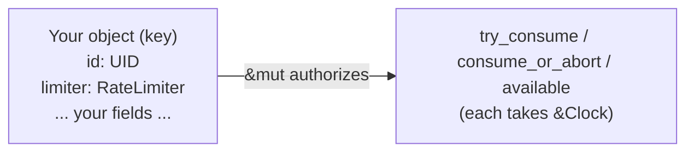
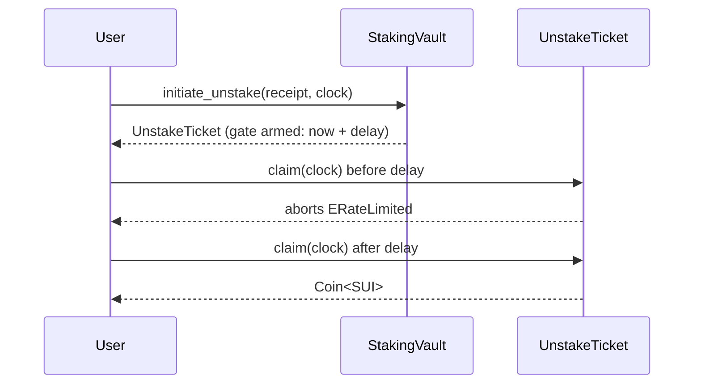

<Callout type="warn">
The example code snippets used in this guide are experimental and have not been audited. They simply help exemplify usage of the OpenZeppelin Sui Package.
</Callout>

The `rate_limiter` module provides an embeddable rate-limiting primitive for Sui Move. Unlike most building blocks, `RateLimiter` is **not** a Sui object: it is a `store + drop` value you embed as a field inside an object you already own, and call on the hot path. Its scope is exactly that parent object — there is no registry, no shared policy object, and no ID to track.



Because the limiter lives inside your object, `&mut` to that object is what authorizes both consuming and reconfiguring it. Authorization is whatever guards that `&mut` — the module makes no access-control claim of its own.

This guide builds four examples that showcase the range of the primitive:

1. A globally throttled vault — one limiter shared by all withdrawers.
2. A vault that mixes the global limiter with a per-user limit carried in each capability.
3. A mage duel — many limiters of different variants inside one type, outside of DeFi.
4. A staking vault — a cooldown that adds a delay *before* an action can execute.

## Prerequisites

It helps to be familiar with Sui Move shared objects, capabilities, the shared `Clock` at `0x6`, and programmable transaction blocks (PTBs). The examples reference those concepts throughout.

## Add the dependency

Add the utilities package to `Move.toml`:

```toml
[dependencies]
openzeppelin_utils = { r.mvr = "@openzeppelin-move/utils" }
```

Then import the module from your Move code:

```move
use openzeppelin_utils::rate_limiter::{Self, RateLimiter};
```

## Example 1: A globally throttled vault

The simplest integration: one `RateLimiter` field on a shared `Vault` throttles *all* withdrawals collectively. Here it is a `FixedWindow` — a hard quota of 1,000 units per rolling hour. Withdrawing requires presenting a `WithdrawCap`, so the limiter governs throughput while the capability governs who may withdraw.

```move
module my_protocol::simple_vault;

use openzeppelin_utils::rate_limiter::{Self, RateLimiter};
use sui::balance::{Self, Balance};
use sui::clock::Clock;
use sui::coin::{Self, Coin};
use sui::sui::SUI;

/// Shared vault holding pooled funds behind one global withdrawal limiter.
public struct Vault has key {
    id: UID,
    limiter: RateLimiter,
    funds: Balance<SUI>,
}

/// Held by the publisher; authorizes issuing `WithdrawCap`s.
public struct AdminCap has key, store { id: UID }

/// Presented on every withdrawal. Holding one marks a legitimate withdrawer.
public struct WithdrawCap has key, store { id: UID }

/// On publish, hand the publisher an `AdminCap` for issuing withdraw capabilities.
fun init(ctx: &mut TxContext) {
    transfer::transfer(AdminCap { id: object::new(ctx) }, ctx.sender());
}

/// Share a vault whose withdrawals are capped at 1_000 SUI per hour, globally across all holders.
public fun create(clock: &Clock, ctx: &mut TxContext) {
    // FixedWindow: a hard quota of 1_000 per rolling hour, anchored at now, starting full.
    let limiter = rate_limiter::new_fixed_window(
        1_000, // capacity (units per window)
        3_600_000, // window_ms (1 hour)
        clock.timestamp_ms(), // window_start_ms (anchor at now)
        1_000, // initial_available (start full)
        clock,
    );
    transfer::share_object(Vault { id: object::new(ctx), limiter, funds: balance::zero() });
}

/// Deposit funds into the vault (no rate limit on the way in).
public fun deposit(self: &mut Vault, payment: Coin<SUI>) {
    self.funds.join(payment.into_balance());
}

/// Issue a withdraw capability to `recipient`. Admin-gated so the global budget is only
/// shared among legitimate holders.
public fun issue_withdraw_cap(_: &AdminCap, recipient: address, ctx: &mut TxContext) {
    transfer::transfer(WithdrawCap { id: object::new(ctx) }, recipient);
}

/// Withdraw `amount`, charging the global limiter first. The rate-limit check runs before the
/// balance split, so a denied withdrawal never touches `funds`.
public fun withdraw(
    self: &mut Vault,
    _: &WithdrawCap,
    amount: u64,
    clock: &Clock,
    ctx: &mut TxContext,
): Coin<SUI> {
    self.limiter.consume_or_abort(amount, clock);
    coin::from_balance(self.funds.split(amount), ctx)
}

/// How much the vault will allow to be withdrawn right now (projects window rollover on read).
public fun withdrawable_now(self: &Vault, clock: &Clock): u64 {
    self.limiter.available(clock)
}
```

Because the `Vault` is shared, every caller draws from the same per-window budget. `consume_or_abort` is the ergonomic path: it aborts `ERateLimited` and the whole transaction reverts if the budget is exhausted.

### Publish and call it

Publish the package and record the IDs from the output:

```bash
sui client publish
```

```bash
export PKG=0x...           # published package
export ADMIN_CAP=0x...     # AdminCap transferred to the publisher
export ME=0x...            # your address
```

Create and fund the vault, then issue yourself a withdraw capability. The shared `Clock` is the object at `0x6`:

```bash
sui client ptb \
  --move-call $PKG::simple_vault::create @0x6
```

```bash
export VAULT=0x...         # shared Vault from the create output

sui client ptb \
  --split-coins gas "[5000]" \
  --assign funding \
  --move-call $PKG::simple_vault::deposit @$VAULT funding.0 \
  --move-call $PKG::simple_vault::issue_withdraw_cap @$ADMIN_CAP @$ME
```

Withdraw within the window and forward the coin in the same PTB:

```bash
export WITHDRAW_CAP=0x...  # WithdrawCap from the previous output

sui client ptb \
  --move-call $PKG::simple_vault::withdraw @$VAULT @$WITHDRAW_CAP 250 @0x6 \
  --assign coin \
  --transfer-objects "[coin]" @$ME
```

A withdrawal that overruns the remaining per-window budget aborts `ERateLimited` (error code `0`) and the whole PTB reverts:

```bash
sui client ptb \
  --move-call $PKG::simple_vault::withdraw @$VAULT @$WITHDRAW_CAP 1000 @0x6 \
  --assign coin \
  --transfer-objects "[coin]" @$ME
# Aborts: consume_or_abort -> ERateLimited. The window only had 750 left.
```

## Example 2: Mixing a global limiter with per-user limits

The same global window as before, but now each `WithdrawCap` carries its *own* `RateLimiter` — a token bucket capping that specific holder. A withdrawal must satisfy **both**: the holder's personal bucket and the vault's global window. This shows two limiters of different variants composed across two objects.


```move
module my_protocol::tiered_vault;

use openzeppelin_utils::rate_limiter::{Self, RateLimiter};
use sui::balance::{Self, Balance};
use sui::clock::Clock;
use sui::coin::{Self, Coin};
use sui::sui::SUI;

/// Shared vault with one global withdrawal limiter shared by every holder.
public struct Vault has key {
    id: UID,
    global_limiter: RateLimiter,
    funds: Balance<SUI>,
}

/// Held by the publisher; authorizes issuing `WithdrawCap`s with per-holder limits.
public struct AdminCap has key, store { id: UID }

/// Presented on every withdrawal. Carries a personal bucket limiter that caps this holder.
public struct WithdrawCap has key, store {
    id: UID,
    personal_limiter: RateLimiter,
}

/// On publish, hand the publisher an `AdminCap` for issuing withdraw capabilities.
fun init(ctx: &mut TxContext) {
    transfer::transfer(AdminCap { id: object::new(ctx) }, ctx.sender());
}

/// Share a vault whose global budget is 1_000 SUI per hour.
public fun create(clock: &Clock, ctx: &mut TxContext) {
    let global_limiter = rate_limiter::new_fixed_window(
        1_000, // capacity per window
        3_600_000, // 1 hour window
        clock.timestamp_ms(),
        1_000, // start full
        clock,
    );
    transfer::share_object(Vault { id: object::new(ctx), global_limiter, funds: balance::zero() });
}

/// Deposit funds into the vault (no rate limit on the way in).
public fun deposit(self: &mut Vault, payment: Coin<SUI>) {
    self.funds.join(payment.into_balance());
}

/// Issue a withdraw capability with a personal token-bucket limit: at most `per_user_cap`
/// outstanding, refilling `refill_amount` every `refill_interval_ms`, starting full.
public fun issue_withdraw_cap(
    _: &AdminCap,
    recipient: address,
    per_user_cap: u64,
    refill_amount: u64,
    refill_interval_ms: u64,
    clock: &Clock,
    ctx: &mut TxContext,
) {
    let personal_limiter = rate_limiter::new_bucket(
        per_user_cap,
        refill_amount,
        refill_interval_ms,
        per_user_cap, // start full
        clock.timestamp_ms(),
        clock,
    );
    transfer::transfer(WithdrawCap { id: object::new(ctx), personal_limiter }, recipient);
}

/// Withdraw `amount`, charging the holder's personal bucket first, then the global window.
/// Both checks run before the balance split, so a denial on either never touches `funds`.
public fun withdraw(
    self: &mut Vault,
    cap: &mut WithdrawCap,
    amount: u64,
    clock: &Clock,
    ctx: &mut TxContext,
): Coin<SUI> {
    cap.personal_limiter.consume_or_abort(amount, clock); // per-user cap
    self.global_limiter.consume_or_abort(amount, clock); // global cap
    coin::from_balance(self.funds.split(amount), ctx)
}

/// This holder's currently-available personal allowance (projects refill on read).
public fun personal_allowance(cap: &WithdrawCap, clock: &Clock): u64 {
    cap.personal_limiter.available(clock)
}

/// The vault's currently-available global allowance (projects window rollover on read).
public fun global_allowance(self: &Vault, clock: &Clock): u64 {
    self.global_limiter.available(clock)
}
```

The two limiters are fully independent: the personal bucket refills smoothly over time, while the global window resets on its own hourly boundary. A holder is bounded by whichever is tighter at the moment of the call.

### Publish and call it

```bash
sui client publish
```

```bash
export PKG=0x...
export ADMIN_CAP=0x...
export ME=0x...
```

Create and fund the vault, then issue a capability with a personal cap of 100, refilling 10 per second:

```bash
sui client ptb \
  --move-call $PKG::tiered_vault::create @0x6
```

```bash
export VAULT=0x...

sui client ptb \
  --split-coins gas "[5000]" \
  --assign funding \
  --move-call $PKG::tiered_vault::deposit @$VAULT funding.0 \
  --move-call $PKG::tiered_vault::issue_withdraw_cap @$ADMIN_CAP @$ME 100 10 1000 @0x6
```

A withdrawal of 80 fits under the personal cap of 100 (and the global 1,000):

```bash
export WITHDRAW_CAP=0x...

sui client ptb \
  --move-call $PKG::tiered_vault::withdraw @$VAULT @$WITHDRAW_CAP 80 @0x6 \
  --assign coin \
  --transfer-objects "[coin]" @$ME
```

A further withdrawal of 50 aborts `ERateLimited`: the personal bucket has only about 20 left, even though the global window still allows it.

```bash
sui client ptb \
  --move-call $PKG::tiered_vault::withdraw @$VAULT @$WITHDRAW_CAP 50 @0x6 \
  --assign coin \
  --transfer-objects "[coin]" @$ME
# Aborts: the personal bucket is the binding limit here.
```

## Example 3: Many limiters in one type (a mage duel)

Rate limiting is not only for DeFi. This example models a two-player duel where each `Mage` packs **four** limiters of mixed variants, one per game resource:

- `health` (`Bucket`) — consuming is taking damage; refill is passive regeneration.
- `mana` (`Bucket`) — consuming is paying a spell's cost; refill is mana regeneration.
- `spell_a_cd` (`Cooldown`, capacity 1) — gated after a single cast.
- `spell_b_cd` (`Cooldown`, capacity 3) — gated after three casts.

A mage casts one of two spells at its opponent. Each spell costs mana, deals damage, and burns one charge of that spell's cooldown. When a mage's health reaches zero it is defeated, and because `Mage` is a `store + drop` value, removing it from the duel destroys it.

```move
module my_protocol::mage_duel;

use openzeppelin_utils::rate_limiter::{Self, RateLimiter};
use sui::clock::Clock;
use std::string::String;

#[error(code = 0)]
const EDuelOver: vector<u8> = b"The duel already has a winner";

const MAX_HEALTH: u64 = 100;
const MAX_MANA: u64 = 60;
const CD_MS: u64 = 10_000; // 10s cooldown after a spell is exhausted

// Spell A: cheap, light hit, single charge before cooldown.
const SPELL_A_COST: u64 = 10;
const SPELL_A_DAMAGE: u64 = 15;
// Spell B: pricier, heavier hit, three charges before cooldown.
const SPELL_B_COST: u64 = 20;
const SPELL_B_DAMAGE: u64 = 30;

/// A single combatant. A plain `store + drop` value — destroyed by being dropped on defeat.
public struct Mage has store, drop {
    name: String,
    health: RateLimiter,
    mana: RateLimiter,
    spell_a_cd: RateLimiter,
    spell_b_cd: RateLimiter,
}

/// Shared arena holding both mages by value. Index 0 and 1 identify the combatants.
public struct Duel has key {
    id: UID,
    mages: vector<Mage>,
}

/// Start a duel between two freshly-spawned, full-health mages.
public fun start(name_0: String, name_1: String, clock: &Clock, ctx: &mut TxContext) {
    let mages = vector[new_mage(name_0, clock), new_mage(name_1, clock)];
    transfer::share_object(Duel { id: object::new(ctx), mages });
}

/// Mage at `attacker_idx` casts spell A at its opponent.
public fun cast_spell_a(self: &mut Duel, attacker_idx: u64, clock: &Clock) {
    cast(self, attacker_idx, true, clock);
}

/// Mage at `attacker_idx` casts spell B at its opponent.
public fun cast_spell_b(self: &mut Duel, attacker_idx: u64, clock: &Clock) {
    cast(self, attacker_idx, false, clock);
}

/// Resolve a cast: burn a cooldown charge, pay mana, then damage the opponent. Aborts (reverting
/// the whole transaction) if the spell is on cooldown or the caster cannot afford the mana.
fun cast(self: &mut Duel, attacker_idx: u64, is_spell_a: bool, clock: &Clock) {
    assert!(self.mages.length() == 2, EDuelOver);
    let target_idx = 1 - attacker_idx;

    // Attacker pays: a cooldown charge and the spell's mana cost.
    let attacker = &mut self.mages[attacker_idx];
    if (is_spell_a) {
        attacker.spell_a_cd.consume_or_abort(1, clock);
        attacker.mana.consume_or_abort(SPELL_A_COST, clock);
    } else {
        attacker.spell_b_cd.consume_or_abort(1, clock);
        attacker.mana.consume_or_abort(SPELL_B_COST, clock);
    };

    // Opponent takes damage. Clamp to remaining health so an overkill blow doesn't get rejected
    // by the limiter's all-or-nothing consume; guard the zero case (a zero-unit consume aborts).
    let damage = if (is_spell_a) SPELL_A_DAMAGE else SPELL_B_DAMAGE;
    let target = &mut self.mages[target_idx];
    let dealt = damage.min(target.health.available(clock));
    if (dealt > 0) target.health.consume_or_abort(dealt, clock);

    // Defeated when no health remains: pull the mage out of the duel and let it drop.
    if (target.health.available(clock) == 0) {
        self.mages.remove(target_idx);
    }
}

/// A mage's current health (projects regeneration on read). `idx` must be a live combatant.
public fun health_of(self: &Duel, idx: u64, clock: &Clock): u64 {
    self.mages[idx].health.available(clock)
}

/// A mage's current mana (projects regeneration on read). `idx` must be a live combatant.
public fun mana_of(self: &Duel, idx: u64, clock: &Clock): u64 {
    self.mages[idx].mana.available(clock)
}

/// Whether the duel has ended (one mage has been defeated).
public fun is_over(self: &Duel): bool {
    self.mages.length() < 2
}

/// Spawn a full-health, full-mana mage with both spells ready.
fun new_mage(name: String, clock: &Clock): Mage {
    let now = clock.timestamp_ms();
    Mage {
        name,
        // Health as a bucket: starts full, regenerates 1 every 2s up to MAX_HEALTH.
        health: rate_limiter::new_bucket(MAX_HEALTH, 1, 2_000, MAX_HEALTH, now, clock),
        // Mana as a bucket: starts full, regenerates 5 every second up to MAX_MANA.
        mana: rate_limiter::new_bucket(MAX_MANA, 5, 1_000, MAX_MANA, now, clock),
        // Spell A: 1 charge, then a CD_MS cooldown. Starts ready (granted seed).
        spell_a_cd: rate_limiter::new_cooldown(1, CD_MS, 1, 0, clock),
        // Spell B: 3 charges, then a CD_MS cooldown. Starts ready (granted seed).
        spell_b_cd: rate_limiter::new_cooldown(3, CD_MS, 3, 0, clock),
    }
}
```

Two things are worth highlighting:

- **Different cooldown capacities, same variant.** Spell A's `Cooldown` has capacity 1, so it gates after a single cast; spell B's has capacity 3, so it allows three casts before gating. The two cooldowns are independent — using one never touches the other.
- **The clamp before damage.** `try_consume` and `consume_or_abort` are all-or-nothing, so consuming more than `available` is rejected outright. For health, an overkill blow should still be lethal, so the code clamps damage to `available(clock)` and guards the zero case — the documented footgun of passing `0` to a consume.

### Publish and call it

```bash
sui client publish
```

```bash
export PKG=0x...
```

Start a duel, then have mage 0 cast spell A at mage 1:

```bash
sui client ptb \
  --move-call $PKG::mage_duel::start "'Alice'" "'Bob'" @0x6
```

```bash
export DUEL=0x...          # shared Duel from the start output

sui client ptb \
  --move-call $PKG::mage_duel::cast_spell_a @$DUEL 0 @0x6
```

Spell A has a single charge, so casting it again before its cooldown elapses aborts `ERateLimited`:

```bash
sui client ptb \
  --move-call $PKG::mage_duel::cast_spell_a @$DUEL 0 @0x6
# Aborts: spell A is on cooldown after one use.
```

Spell B has its own, independent cooldown with three charges, so it is still castable:

```bash
sui client ptb \
  --move-call $PKG::mage_duel::cast_spell_b @$DUEL 0 @0x6
```

## Example 4: A cooldown that delays an action (staking)

A `Cooldown` does not have to throttle a repeated action — seeded as an *armed* gate, it can sit in front of a single action and delay it. This staking vault has no yield; its only job is to enforce an unbonding delay. Initiating an unstake hands the user an `UnstakeTicket` whose cooldown gate is armed to release `unbond_delay_ms` in the future. The user can only `claim` once that gate elapses.



```move
module my_protocol::staking_vault;

use openzeppelin_utils::rate_limiter::{Self, RateLimiter};
use sui::balance::{Self, Balance};
use sui::clock::Clock;
use sui::coin::{Self, Coin};
use sui::sui::SUI;

/// Shared staking pool. `unbond_delay_ms` is the cooldown applied before staked funds can be claimed.
public struct StakingVault has key {
    id: UID,
    funds: Balance<SUI>,
    unbond_delay_ms: u64,
}

/// Proof of a staked position, held by the staker.
public struct StakeReceipt has key, store {
    id: UID,
    amount: u64,
}

/// Issued when unstaking begins. Releases the reserved coins only after its cooldown gate elapses.
public struct UnstakeTicket has key, store {
    id: UID,
    coins: Balance<SUI>,
    gate: RateLimiter,
}

/// Share a staking vault with the given unbonding delay.
public fun create(unbond_delay_ms: u64, ctx: &mut TxContext) {
    transfer::share_object(StakingVault {
        id: object::new(ctx),
        funds: balance::zero(),
        unbond_delay_ms,
    });
}

/// Stake `payment`, returning a receipt for the staked amount.
public fun stake(self: &mut StakingVault, payment: Coin<SUI>, ctx: &mut TxContext): StakeReceipt {
    let amount = payment.value();
    self.funds.join(payment.into_balance());
    StakeReceipt { id: object::new(ctx), amount }
}

/// Begin unstaking: burn the receipt, reserve the coins into a ticket, and arm a cooldown that
/// releases `unbond_delay_ms` from now.
public fun initiate_unstake(
    self: &mut StakingVault,
    receipt: StakeReceipt,
    clock: &Clock,
    ctx: &mut TxContext,
): UnstakeTicket {
    let StakeReceipt { id, amount } = receipt;
    id.delete();

    let coins = self.funds.split(amount);
    // Armed cooldown (gated seed): no charge available now, gate releases at now + delay.
    let gate = rate_limiter::new_cooldown(
        1, // capacity: a single claim
        self.unbond_delay_ms, // cooldown_ms
        0, // initial_available: nothing claimable yet
        clock.timestamp_ms() + self.unbond_delay_ms, // cooldown_end_ms: release time
        clock,
    );
    UnstakeTicket { id: object::new(ctx), coins, gate }
}

/// Claim unstaked coins. Consuming the gate aborts `ERateLimited` until the unbonding cooldown
/// has elapsed; once it has, the gate releases and the coins are returned.
public fun claim(ticket: UnstakeTicket, clock: &Clock, ctx: &mut TxContext): Coin<SUI> {
    let UnstakeTicket { id, coins, mut gate } = ticket;
    gate.consume_or_abort(1, clock);
    id.delete();
    coin::from_balance(coins, ctx)
}

/// Whether the ticket's cooldown has elapsed and the coins can be claimed now.
public fun is_claimable(ticket: &UnstakeTicket, clock: &Clock): bool {
    ticket.gate.available(clock) > 0
}
```

The armed-gate seed (`initial_available == 0`, `cooldown_end_ms > now`) is the key. Until the release time, `available(clock)` projects to `0` and `consume_or_abort` aborts; once `now >= cooldown_end_ms`, the gate releases, `available(clock)` projects to `capacity` (here `1`), and the claim succeeds. The limiter holds no funds itself — it only decides *when* the surrounding `UnstakeTicket` may release them.

### Publish and call it

```bash
sui client publish
```

```bash
export PKG=0x...
export ME=0x...
```

Create a vault with a short unbonding delay (3 seconds, to observe the gate release), stake some SUI, and keep the receipt:

```bash
sui client ptb \
  --move-call $PKG::staking_vault::create 3000
```

```bash
export STAKING_VAULT=0x...

sui client ptb \
  --split-coins gas "[1000]" \
  --assign stake_coin \
  --move-call $PKG::staking_vault::stake @$STAKING_VAULT stake_coin.0 \
  --assign receipt \
  --transfer-objects "[receipt]" @$ME
```

Initiate the unstake to receive a ticket with an armed cooldown:

```bash
export RECEIPT=0x...

sui client ptb \
  --move-call $PKG::staking_vault::initiate_unstake @$STAKING_VAULT @$RECEIPT @0x6 \
  --assign ticket \
  --transfer-objects "[ticket]" @$ME
```

Claiming immediately aborts `ERateLimited` — the unbonding cooldown has not elapsed:

```bash
export UNSTAKE_TICKET=0x...

sui client ptb \
  --move-call $PKG::staking_vault::claim @$UNSTAKE_TICKET @0x6 \
  --assign coin \
  --transfer-objects "[coin]" @$ME
# Aborts: the gate is still armed.
```

After the delay elapses, the same call succeeds and returns the coins:

```bash
sui client ptb \
  --move-call $PKG::staking_vault::claim @$UNSTAKE_TICKET @0x6 \
  --assign coin \
  --transfer-objects "[coin]" @$ME
```

## Reconfiguration

There are no in-place `reconfigure_*` functions. To change a limiter's configuration or runtime state, snapshot the current values through the getters, build a fresh `RateLimiter`, and overwrite the field. The anchor getters (`last_refill_ms`, `window_start_ms`) return the *projected* anchor at `now` and pair with `available(clock)`, so reading both and reconstructing preserves the limiter's phase. Gate any reconfigure entry function with whatever authorization you require — here, the same `AdminCap` used to issue capabilities.

Rate guarantees hold *between* reconstructions, not *across* one: a backdated anchor pre-credits elapsed time on the first projection. Anchor at `clock.timestamp_ms()` unless you are deliberately preserving phase.

## Operational checklist

- Embed `RateLimiter` as a field of an object you own; never expect it to be a standalone object.
- Choose the variant deliberately: `Bucket` for a smooth ceiling with bursts, `FixedWindow` for hard per-window quotas, `Cooldown` for burst-then-pause or a one-shot delay.
- Run the limiter check *before* the side effect so a denied call has no partial effects.
- Use `consume_or_abort` to revert on refusal, or `try_consume` to branch on it.
- Guard against passing `0` to a consume; clamp with `available(clock)` and an `if (n > 0)` check where overkill is possible.
- Gate the `&mut` to your object with a capability, [`openzeppelin_access`](/contracts-sui/1.x/access), governance, or a multisig — the module authorizes no one.
- Reconfigure by reconstruction, anchoring at `clock.timestamp_ms()` unless you intend to preserve phase.

For key concepts and the common-mistakes reference, see the [Rate Limiter module guide](/contracts-sui/1.x/rate-limiter). For function signatures, parameters, and errors, see the [Utilities API reference](/contracts-sui/1.x/api/utils).
