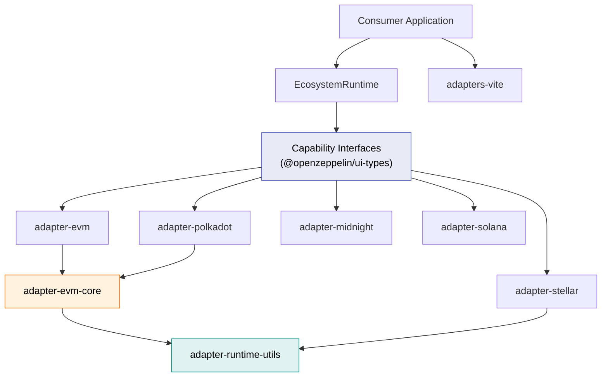
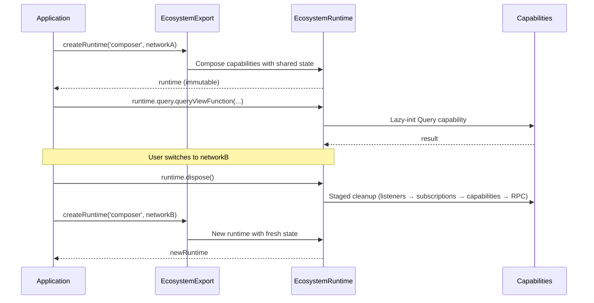
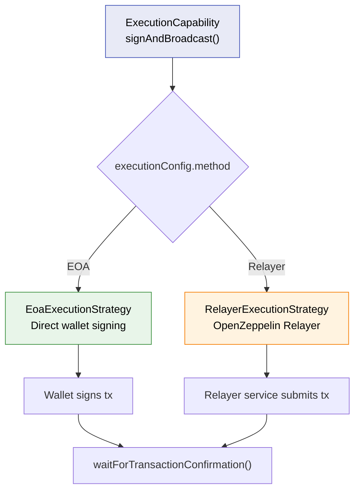

This page describes the capability-based architecture that underpins all OpenZeppelin Ecosystem Adapters. Understanding this architecture will help you choose the right profile for your application, consume capabilities efficiently, and — if needed — build your own adapter.

## Package Topology

The adapter system is split across several packages with clear dependency boundaries:



- **`@openzeppelin/ui-types`** defines all 13 capability interfaces. It is the single source of truth.
- **`adapter-runtime-utils`** provides profile composition, lazy capability instantiation, and staged disposal.
- **`adapter-evm-core`** centralizes reusable EVM implementations shared by `adapter-evm` and `adapter-polkadot`.
- Each public adapter exposes an `ecosystemDefinition` conforming to `EcosystemExport`.

## Capability Tiers

Adapter functionality is decomposed into **13 capability interfaces** organized across **3 tiers**. The tiers reflect increasing levels of runtime requirements: stateless metadata, network-aware schema operations, and stateful wallet-dependent interactions.

| Tier | Category | Network | Wallet | Capabilities |
| --- | --- | --- | --- | --- |
| **1** | Lightweight | No | No | `Addressing`, `Explorer`, `NetworkCatalog`, `UiLabels` |
| **2** | Schema | Yes | No | `ContractLoading`, `Schema`, `TypeMapping`, `Query` |
| **3** | Runtime | Yes | Yes | `Execution`, `Wallet`, `UiKit`, `Relayer`, `AccessControl` |

### Tier Import Rules

Tier isolation is enforced physically through sub-path exports, not tree-shaking:

- **Tier 1** modules must not import from Tier 2 or Tier 3 modules
- **Tier 2** modules may import from Tier 1
- **Tier 3** modules may import from Tier 1 and Tier 2

This means importing `@openzeppelin/adapter-evm/addressing` will never pull in wallet SDKs, RPC clients, or access control code — regardless of your bundler configuration.

### Capability Reference

| Capability | Interface | Tier | Key Methods |
| --- | --- | --- | --- |
| Addressing | `AddressingCapability` | 1 | `isValidAddress` |
| Explorer | `ExplorerCapability` | 1 | `getExplorerUrl`, `getExplorerTxUrl` |
| NetworkCatalog | `NetworkCatalogCapability` | 1 | `getNetworks` |
| UiLabels | `UiLabelsCapability` | 1 | `getUiLabels` |
| ContractLoading | `ContractLoadingCapability` | 2 | `loadContract`, `getContractDefinitionInputs` |
| Schema | `SchemaCapability` | 2 | `isViewFunction`, `getWritableFunctions` |
| TypeMapping | `TypeMappingCapability` | 2 | `mapParameterTypeToFieldType`, `getTypeMappingInfo` |
| Query | `QueryCapability` | 2 | `queryViewFunction`, `formatFunctionResult`, `getCurrentBlock` |
| Execution | `ExecutionCapability` | 3 | `signAndBroadcast`, `formatTransactionData`, `validateExecutionConfig` |
| Wallet | `WalletCapability` | 3 | `connectWallet`, `disconnectWallet`, `getWalletConnectionStatus` |
| UiKit | `UiKitCapability` | 3 | `getAvailableUiKits`, `configureUiKit` |
| Relayer | `RelayerCapability` | 3 | `getRelayers`, `getNetworkServiceForms` |
| AccessControl | `AccessControlCapability` | 3 | `registerContract`, `grantRole`, and 17 more |

## Profiles

Profiles are pre-composed bundles of capabilities that match common application archetypes. They exist for convenience — you can always consume individual capabilities directly via the `CapabilityFactoryMap`.

Each profile is a strict superset of Declarative — higher profiles add capabilities incrementally:

### Profile–Capability Matrix

| Capability | Declarative | Viewer | Transactor | Composer | Operator |
| --- | --- | --- | --- | --- | --- |
| `Addressing` | ✅ | ✅ | ✅ | ✅ | ✅ |
| `Explorer` | ✅ | ✅ | ✅ | ✅ | ✅ |
| `NetworkCatalog` | ✅ | ✅ | ✅ | ✅ | ✅ |
| `UiLabels` | ✅ | ✅ | ✅ | ✅ | ✅ |
| `ContractLoading` | | ✅ | ✅ | ✅ | ✅ |
| `Schema` | | ✅ | ✅ | ✅ | ✅ |
| `TypeMapping` | | ✅ | ✅ | ✅ | ✅ |
| `Query` | | ✅ | | ✅ | ✅ |
| `Execution` | | | ✅ | ✅ | ✅ |
| `Wallet` | | | ✅ | ✅ | ✅ |
| `UiKit` | | | | ✅ | ✅ |
| `Relayer` | | | | ✅ | |
| `AccessControl` | | | | | ✅ |

### Profile Selection Guide

| If your application needs to… | Choose |
| --- | --- |
| Validate addresses, list networks, link to explorers | **Declarative** |
| Read contract state without sending transactions | **Viewer** |
| Send transactions without reading contract state first | **Transactor** |
| Build full contract interaction UIs with relayer support | **Composer** |
| Manage contract roles and permissions | **Operator** |

## Runtime Lifecycle

Runtimes are **immutable** and **network-scoped**. When a user switches networks, the consuming application must dispose the current runtime and create a new one.



### Dispose Contract

- `dispose()` is **idempotent** — calling it multiple times is a no-op
- After `dispose()`, any method or property access throws `RuntimeDisposedError`
- Pending async operations (e.g., in-flight `signAndBroadcast`) are rejected with `RuntimeDisposedError`
- Cleanup follows a staged order: mark disposed → reject pending operations → clean up listeners and subscriptions → dispose capabilities → release wallet and RPC resources
- Runtime disposal does **not** disconnect the wallet — disconnect is always an explicit user action

## Execution Strategies

The Execution capability uses a **strategy pattern** to support multiple transaction submission methods. Each adapter can provide its own set of strategies.



The EVM and Stellar adapters ship with both EOA and Relayer strategies. Adapter authors can implement custom strategies by conforming to the `AdapterExecutionStrategy` interface.

## Sub-Path Exports

Each adapter publishes every implemented capability and profile as a dedicated sub-path export:

```ts
// Tier 1 — no wallet, no RPC, no heavy dependencies
import { createAddressing } from '@openzeppelin/adapter-stellar/addressing';
import { createExplorer } from '@openzeppelin/adapter-stellar/explorer';

// Tier 2 — network-aware
import { createQuery } from '@openzeppelin/adapter-stellar/query';

// Tier 3 — wallet-dependent
import { createExecution } from '@openzeppelin/adapter-stellar/execution';

// Profile runtimes
import { createRuntime } from '@openzeppelin/adapter-stellar/profiles/composer';

// Metadata and networks
import { networks } from '@openzeppelin/adapter-stellar/networks';
```

This structure ensures that a Declarative-profile consumer never bundles wallet SDKs, and that individual capabilities can be tested in isolation.
