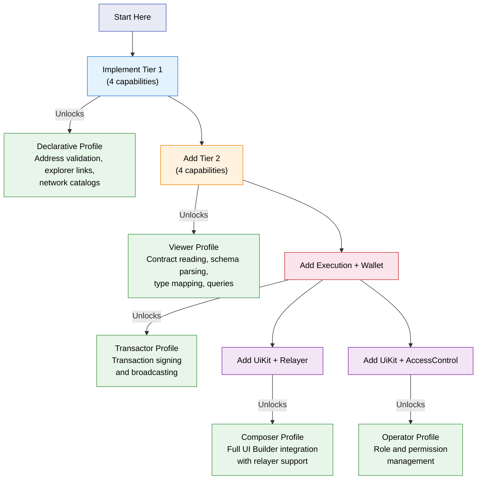

This guide walks through implementing a new ecosystem adapter from scratch. By the end, you'll have a working adapter that integrates with any application using the OpenZeppelin adapter architecture.

## How Much Do You Need to Implement?

Adapters are **incrementally adoptable**. You don't need to implement all 13 capabilities to ship a useful adapter. Start small and add capabilities as your ecosystem's support matures.



## Package Structure

Follow the standard adapter package layout:

```
packages/adapter-<chain>/
├── src/
│   ├── capabilities/          # Capability factory functions
│   │   ├── addressing.ts
│   │   ├── explorer.ts
│   │   ├── network-catalog.ts
│   │   ├── ui-labels.ts
│   │   ├── contract-loading.ts    # Tier 2+
│   │   ├── schema.ts
│   │   ├── type-mapping.ts
│   │   ├── query.ts
│   │   ├── execution.ts           # Tier 3+
│   │   ├── wallet.ts
│   │   ├── ui-kit.ts
│   │   ├── relayer.ts
│   │   ├── access-control.ts
│   │   └── index.ts
│   ├── profiles/              # Profile runtime factories
│   │   ├── shared-state.ts
│   │   └── index.ts
│   ├── networks/              # Network configurations
│   │   └── index.ts
│   ├── index.ts               # ecosystemDefinition export
│   ├── metadata.ts
│   └── vite-config.ts
├── package.json
├── tsconfig.json
├── tsdown.config.ts
└── vitest.config.ts
```

Not every adapter needs every file. A Tier 1-only adapter may only have `addressing.ts`, `explorer.ts`, `network-catalog.ts`, and `ui-labels.ts` in `capabilities/`.

## Implementation Guide

### Step 1: Implement Tier 1 Capabilities

Start with the four stateless capabilities that every adapter must provide:

```ts
// capabilities/addressing.ts
import type { AddressingCapability } from '@openzeppelin/ui-types';
import { isAddress } from 'viem';

export function createAddressing(): AddressingCapability {
  return {
    isValidAddress(address: string): boolean {
      // EVM: prefer viem's isAddress (as in @openzeppelin/adapter-evm) over a hand-rolled regex;
      // it covers checksums and library-maintained rules.
      // Other chains, for example:
      // Stellar StrKey (account): /^G[A-Z0-9]{55}$/ (simplified; use StrKey helpers in production)
      // Polkadot SS58: @polkadot/util-crypto validateAddress / decodeAddress
      return isAddress(address);
    },
  };
}
```

```ts
// capabilities/explorer.ts
import type { ExplorerCapability, NetworkConfig } from '@openzeppelin/ui-types';

export function createExplorer(config?: NetworkConfig): ExplorerCapability {
  const baseUrl = config?.explorerUrl ?? 'https://explorer.example.com';
  return {
    getExplorerUrl: (address) => `${baseUrl}/address/${address}`,
    getExplorerTxUrl: (txHash) => `${baseUrl}/tx/${txHash}`,
  };
}
```

```ts
// capabilities/network-catalog.ts
import type { NetworkCatalogCapability } from '@openzeppelin/ui-types';
import { networks } from '../networks';

export function createNetworkCatalog(): NetworkCatalogCapability {
  return { getNetworks: () => networks };
}
```

```ts
// capabilities/ui-labels.ts
import type { UiLabelsCapability } from '@openzeppelin/ui-types';

export function createUiLabels(): UiLabelsCapability {
  return {
    getUiLabels: () => ({ transactionLabel: 'Transaction' }),
  };
}
```

### Step 2: Define the CapabilityFactoryMap

Wire all capability factories into the capability map:

```ts
// capabilities/index.ts
import type { CapabilityFactoryMap } from '@openzeppelin/ui-types';
import { createAddressing } from './addressing';
import { createExplorer } from './explorer';
import { createNetworkCatalog } from './network-catalog';
import { createUiLabels } from './ui-labels';

export const capabilities: CapabilityFactoryMap = {
  addressing: createAddressing,
  explorer: createExplorer,
  networkCatalog: createNetworkCatalog,
  uiLabels: createUiLabels,
};
```

### Step 3: Wire Profile Runtimes

Use `adapter-runtime-utils` to compose capabilities into profile runtimes:

```ts
// profiles/index.ts
import type { NetworkConfig, ProfileName } from '@openzeppelin/ui-types';
import { createRuntimeFromFactories } from '@openzeppelin/adapter-runtime-utils';
import { capabilities } from '../capabilities';

export function createRuntime(
  profile: ProfileName,
  config: NetworkConfig,
  factoryMap = capabilities,
  options?: { uiKit?: string }
) {
  return createRuntimeFromFactories(profile, config, factoryMap, options);
}
```

`createRuntimeFromFactories` handles:
- Validating that all required capabilities for the profile are present
- Throwing `UnsupportedProfileError` with a list of missing capabilities if validation fails
- Lazy capability instantiation with caching
- Staged disposal

### Step 4: Export the Ecosystem Definition

The `ecosystemDefinition` is the public entry point that consuming applications use:

```ts
// index.ts
import type { EcosystemExport } from '@openzeppelin/ui-types';
import { capabilities } from './capabilities';
import { metadata } from './metadata';
import { networks } from './networks';
import { createRuntime } from './profiles';

export const ecosystemDefinition: EcosystemExport = {
  ...metadata,
  networks,
  capabilities,
  createRuntime: (profile, config, options) =>
    createRuntime(profile, config, capabilities, options),
};
```

### Step 5: Configure Sub-Path Exports

Add sub-path exports to `package.json` for physical tier isolation:

```json
{
  "exports": {
    ".": { "import": "./dist/index.mjs" },
    "./addressing": { "import": "./dist/capabilities/addressing.mjs" },
    "./explorer": { "import": "./dist/capabilities/explorer.mjs" },
    "./network-catalog": { "import": "./dist/capabilities/network-catalog.mjs" },
    "./ui-labels": { "import": "./dist/capabilities/ui-labels.mjs" },
    "./metadata": { "import": "./dist/metadata.mjs" },
    "./networks": { "import": "./dist/networks.mjs" },
    "./vite-config": { "import": "./dist/vite-config.mjs" }
  }
}
```

Add more entries as you implement higher-tier capabilities.

### Step 6: Add a Vite Config Export

Every adapter must publish a `./vite-config` entry that returns build-time requirements:

```ts
// vite-config.ts
import type { UserConfig } from 'vite';

export function getViteConfig(): UserConfig {
  return {
    resolve: {
      dedupe: ['@your-chain/sdk'],
    },
    optimizeDeps: {
      include: ['@your-chain/sdk'],
    },
  };
}
```

## Adding Higher-Tier Capabilities

Once Tier 1 is working, add capabilities incrementally. Each Tier 2+ factory function must:

1. Accept a `NetworkConfig` parameter
2. Return a capability object that includes a `dispose()` method
3. Follow the tier import rules (Tier 2 may import Tier 1, Tier 3 may import Tier 1 and 2)

Here's an example Query capability:

```ts
// capabilities/query.ts
import type { QueryCapability, NetworkConfig } from '@openzeppelin/ui-types';

export function createQuery(config: NetworkConfig): QueryCapability {
  let client: YourRpcClient | null = null;

  function getClient() {
    if (!client) client = new YourRpcClient(config.rpcUrl);
    return client;
  }

  return {
    networkConfig: config,

    async queryViewFunction(address, functionId, args) {
      return getClient().call(address, functionId, args);
    },

    formatFunctionResult(result, schema, functionId) {
      return { raw: result, formatted: String(result) };
    },

    async getCurrentBlock() {
      return getClient().getBlockNumber();
    },

    dispose() {
      client?.close();
      client = null;
    },
  };
}
```

## Shared EVM Core

If your chain is EVM-compatible, you don't need to reimplement everything. Depend on `@openzeppelin/adapter-evm-core` and reuse its capability implementations:

```ts
import { createExecution } from '@openzeppelin/adapter-evm-core/execution';
import { createQuery } from '@openzeppelin/adapter-evm-core/query';
```

This is exactly what `adapter-polkadot` does. It delegates ABI loading, queries, transaction execution, and wallet infrastructure to the shared EVM core while adding Polkadot-specific metadata and network configurations.

## Lazy Capability Factories

For capabilities that depend on each other (e.g., Query needs ContractLoading for schema resolution), use `createLazyRuntimeCapabilityFactories` from `adapter-runtime-utils`:

```ts
import {
  createLazyRuntimeCapabilityFactories,
} from '@openzeppelin/adapter-runtime-utils';

const lazyFactories = createLazyRuntimeCapabilityFactories(config, {
  contractLoading: () => createContractLoading(config),
  query: (deps) => createQuery(config, {
    getContractLoading: () => deps.contractLoading,
  }),
});
```

This avoids circular dependency issues while maintaining shared state within a profile runtime.

## Contribution Checklist

Before submitting your adapter:

1. All Tier 1 capabilities are implemented and exported via sub-path exports
2. `ecosystemDefinition` conforms to `EcosystemExport` with `capabilities` and `createRuntime`
3. `metadata`, `networks`, and `vite-config` exports are present
4. Profile runtimes use `adapter-runtime-utils` for composition
5. Unsupported profiles throw `UnsupportedProfileError` with missing capabilities listed
6. Tier isolation is verified: Tier 1 sub-path imports don't pull Tier 2/3 dependencies
7. Tests cover each capability factory and profile runtime creation
8. `package.json` includes sub-path exports for every implemented capability and profile
9. `tsdown.config.ts` includes entry points for all sub-path exports
10. Build-time requirements are validated with `pnpm validate:vite-configs`

<Callout type="info">
The `pnpm lint:adapters` CI check validates tier isolation and export structure automatically. Run it locally before submitting your PR.
</Callout>
