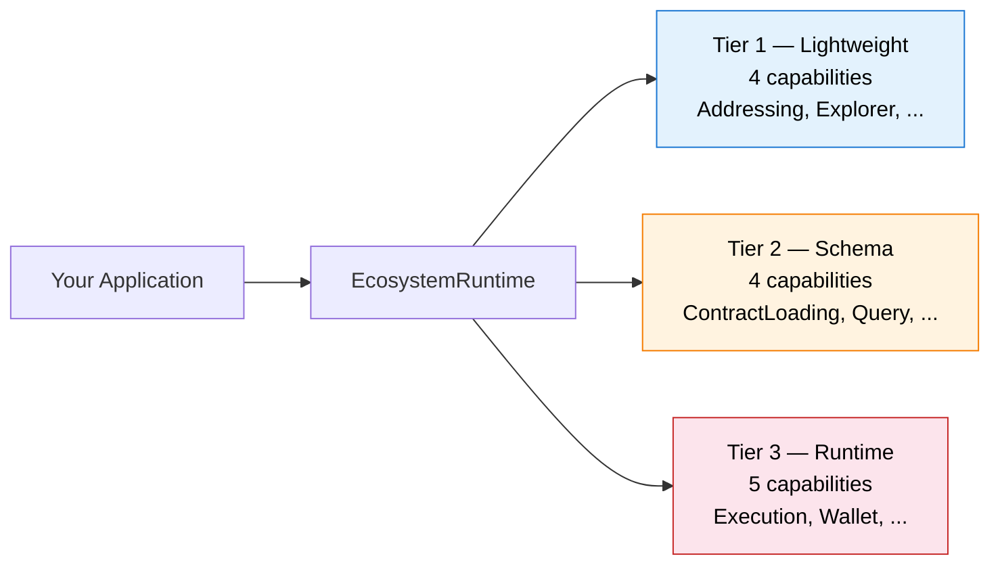

**OpenZeppelin Ecosystem Adapters** are a set of modular, chain-specific integration packages that let applications interact with any supported blockchain through a single, unified interface. Built on 13 composable capability interfaces organized in 3 tiers, each adapter encapsulates everything needed — contract loading, type mapping, transaction execution, wallet connection, and network configuration — while keeping consuming applications completely chain-agnostic.

<Callout type="info">
**Source code**: The adapters are open-source. Browse the implementation, open issues, and contribute at [**github.com/OpenZeppelin/openzeppelin-adapters**](https://github.com/OpenZeppelin/openzeppelin-adapters).
</Callout>

<Cards>
  <Card href="/ecosystem-adapters/architecture" title="Architecture">
    Understand the capability-based architecture: tiers, profiles, and the runtime lifecycle.
  </Card>
  <Card href="/ecosystem-adapters/getting-started" title="Getting Started">
    Install adapters, configure profiles, and run your first cross-chain interaction.
  </Card>
  <Card href="/ecosystem-adapters/supported-ecosystems" title="Supported Ecosystems">
    Explore the production-ready EVM, Stellar, Polkadot, and Midnight adapters.
  </Card>
  <Card href="/ecosystem-adapters/building-an-adapter" title="Building an Adapter">
    Step-by-step guide to implementing a new adapter for your blockchain.
  </Card>
</Cards>

## Why Adapters?

Building cross-chain tooling traditionally forces developers into one of two traps: a monolithic abstraction that leaks chain details, or per-chain forks that drift apart over time. Adapters solve this with a **capability-based decomposition** — each chain implements only the interfaces it supports, and consuming applications pull in only what they need.

## Key Design Principles

- **Pay for what you use.** Tier 1 capabilities are stateless and never pull in wallet SDKs or RPC clients. Import `addressing` and you get only address validation — nothing more.
- **Profiles simplify consumption.** Five pre-composed profiles (Declarative, Viewer, Transactor, Composer, Operator) match common application archetypes so you don't have to assemble capabilities manually.
- **Adapters own their chains.** All chain-specific logic — ABI parsing, Soroban type mapping, ZK proof orchestration — stays inside the adapter package. The consuming application never touches it.
- **Runtime lifecycle is explicit.** Runtimes are immutable and network-scoped. Switching networks means disposing the old runtime and creating a new one — no hidden state mutations.

## Packages

| Package | Description | Status |
| --- | --- | --- |
| `@openzeppelin/adapter-evm` | Ethereum, Polygon, and EVM-compatible chains | Production |
| `@openzeppelin/adapter-stellar` | Stellar / Soroban | Production |
| `@openzeppelin/adapter-polkadot` | Polkadot Hub, Moonbeam (EVM path) | Production |
| `@openzeppelin/adapter-midnight` | Midnight Network (ZK artifacts, Lace wallet) | Production |
| `@openzeppelin/adapter-solana` | Solana (scaffolding) | In Progress |
| `@openzeppelin/adapter-evm-core` | Shared EVM capability implementations (internal) | Internal |
| `@openzeppelin/adapter-runtime-utils` | Profile composition and lifecycle utilities (internal) | Internal |
| `@openzeppelin/adapters-vite` | Shared Vite/Vitest build integration | Utility |

## Who Uses Adapters?

Adapters are consumed by several OpenZeppelin products:

- [**UI Builder**](https://github.com/OpenZeppelin/ui-builder) — full-featured smart contract interaction UI
- [**OpenZeppelin UI**](https://github.com/OpenZeppelin/openzeppelin-ui) — shared UI components and React integration
- [**Role Manager**](https://github.com/OpenZeppelin/role-manager) — role and permission management tool
- [**RWA Wizard**](https://github.com/OpenZeppelin/rwa-wizard) — real-world asset token generation

Any TypeScript application that needs chain-agnostic blockchain interaction can use adapters directly.
