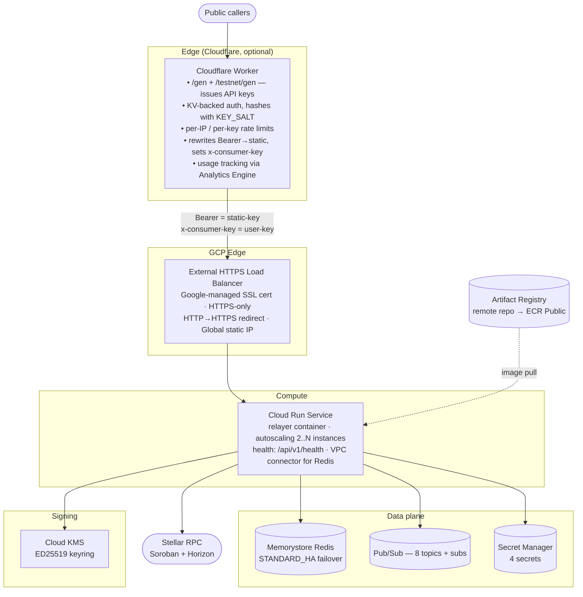
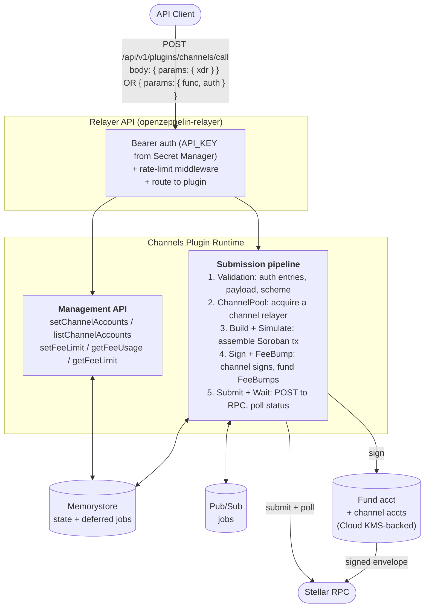
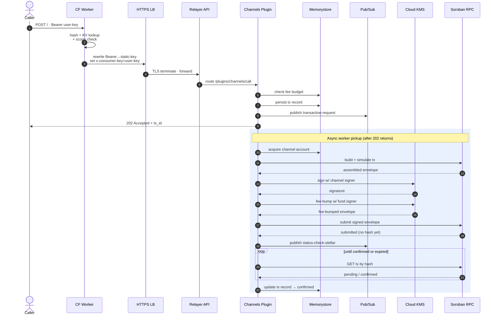
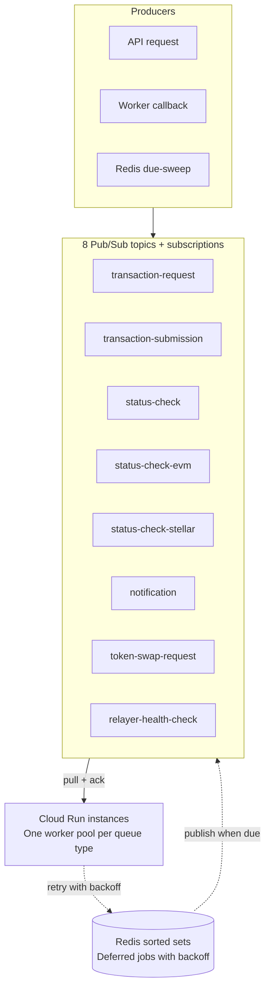

A step-by-step guide for infrastructure teams running a hosted Stellar relayer service on Google Cloud Platform.

**Who this is for:** infrastructure operators who have run production GCP workloads but are new to OpenZeppelin's relayer stack.

**What you get:** a hosted Stellar Channels service in your own GCP project, sized to serve the same workload OpenZeppelin runs today (roughly 2M+ transactions per day across about 2,500 relayers).

## 1. Overview

OpenZeppelin runs a hosted Stellar relayer service at `channels.openzeppelin.com` (mainnet) and `channels.openzeppelin.com/testnet` (testnet). The service takes on the hard parts of submitting Stellar transactions in parallel: managing a pool of channel accounts, fee bumping, arbitrating sequence numbers, and failing over between RPC providers. Downstream callers just talk to a simple HTTP API.

This guide shows you how to run that same service in your own GCP project.

### What You End Up With

By the end of this guide you will have:

- A production-ready hosted Stellar Channels service in your own GCP project, served from a domain you control (for example, `channels.your-company.com`).
- A Cloud Run compute tier with autoscaling, sitting behind an External HTTPS Load Balancer with a Google-managed SSL certificate.
- Memorystore Redis for state and deferred-job scheduling. In production this runs as STANDARD_HA with automatic failover.
- Eight Pub/Sub topics and subscriptions that handle the distributed transaction-processing pipeline (when `queue_backend = "pubsub"`).
- An optional Cloudflare Worker in front of the load balancer for self-serve API-key issuance (the `/gen` flow), per-user rate limiting, and usage analytics.
- A Secret Manager entry for every secret. Secrets are injected as environment variables when the container starts.
- Cloud KMS for ED25519 transaction signing. The module provisions a keyring and an asymmetric signing key.
- An Artifact Registry remote repository configured to proxy the public ECR image, giving Cloud Run a GCP-native pull path.
- Optional Cloud Functions for fund-relayer balance monitoring.

The service handles two transaction-submission modes:

- **Signed XDR mode:** the caller signs a complete Stellar transaction envelope and submits it. The service only fee-bumps and submits.
- **Soroban `func` + `auth` mode:** the caller submits a Soroban host function plus authorization entries. The service assembles the transaction, simulates it, signs with a channel account, fee-bumps, and submits.

### What This Guide Assumes You Already Have

- A strong GCP background: VPC, Cloud Run, IAM, Cloud DNS, Memorystore, Pub/Sub.
- Terraform fluency (1.5.0 or later).
- A target GCP project where you can create the full resource set.
- A domain you control. DNS can live in Route53, Cloud DNS, or another provider.
- Optionally, a Cloudflare account if you want the `/gen` API-key gateway.

## 1.5 How Channels Works on Stellar

Every Stellar transaction has a source account with a monotonically increasing sequence number. Only one transaction per source account can be in-flight at a time. This is the constraint that limits parallel throughput on Stellar.

The Channels service works around it with a pool of dedicated source accounts: the channel accounts. Each in-flight transaction acquires one channel account from the pool, uses its sequence number, and releases it after confirmation. The pool size determines how many transactions can run in parallel.

The fund account is a separate Stellar account that holds the XLM balance. When the service submits a transaction, it wraps the channel-signed envelope in a fee-bump transaction, a Stellar primitive that lets a second account pay the network fee. Both accounts are backed by Cloud KMS ED25519 keys.

The pool size you provision in Step 5.10 is your throughput ceiling. See §10.1 for the sizing formula before you bootstrap.

## 2. Architecture

### Cloud Architecture



The whole stack above is provisioned by the `gcp` Terraform module in `OpenZeppelin/relayer-channels-infra`. You consume it either by cloning the repo or by referencing it as an external module from your own Terraform.

### Components

| Component | GCP Service | Purpose |
| --- | --- | --- |
| Edge gateway | Cloudflare Worker + KV (optional) | API-key issuance, rate limiting, usage tracking |
| Load balancer | External HTTPS LB + Google-managed cert | TLS termination, HTTPS-only, health-checked routing |
| Compute | Cloud Run v2 Service | Runs the relayer container with autoscaling |
| State | Memorystore Redis 7.2 | Transaction records, sequence counters, distributed locks |
| Queue | 8 Pub/Sub topics + 8 subscriptions | Distributed transaction processing pipeline |
| Secrets | Secret Manager | API keys, admin secrets, encryption keys |
| Signing | Cloud KMS (EC_SIGN_ED25519) | Transaction signing for fund + channel accounts |
| Image registry | Artifact Registry (remote repo) | Proxies ECR Public image for Cloud Run |
| Observability | Cloud Logging + Cloud Monitoring | Application logs, metrics |
| Networking | VPC + VPC Connector + Private Service Access | Private connectivity to Memorystore |
| Optional monitors | Cloud Functions + Cloud Scheduler | Balance-check function |

### App Architecture (Channels Plugin Runtime)



### Transaction Lifecycle



### Pub/Sub Queue Topology

The relayer's distributed processing layer uses eight Pub/Sub topics with pull subscriptions. The Pub/Sub backend handles retries through Redis sorted sets (a store-and-run-when-due pattern), so there are no dead-letter topics.



**Deferred job pattern:** Pub/Sub has no native delayed delivery, so deferred jobs (retries with backoff) are stored in Redis sorted sets keyed by their due time. A due-sweep worker runs every 1 to 5 seconds per queue type, claims due jobs from Redis, and publishes them to the topic. The topic only ever carries jobs that are already due.

### Capacity Profile

The reference deployment OpenZeppelin runs handles a growing load of about 3M transactions per day, served by roughly 1,000 relayers (fund and channel-account entities combined). The module defaults are sized conservatively for new deployments. Expect to grow into something closer to the production shape as your workload scales.

| Resource | Module default (prod) | Current GCP deployment |
| --- | --- | --- |
| CPU | 1 vCPU | **4 vCPU** |
| Memory | 2 Gi | **8 Gi** |
| Min instances | 2 | **3** |
| Max instances | 10 | **20** |
| Redis tier | STANDARD_HA | STANDARD_HA |
| Redis memory | 5 GB | 5 GB |

The module defaults work fine for a new deployment that is ramping up. The GCP deployment was raised above defaults to handle concurrent transaction stress testing. Tune further as your workload grows.

---

## 3. Prerequisites

GCP access, tooling, and Stellar-side accounts must be in place before you run `terraform apply`.

### Accounts and Access

- A **GCP project** with billing enabled and permission to create Cloud Run services, Memorystore instances, Pub/Sub topics and subscriptions, Secret Manager secrets, Cloud KMS keyrings and keys, Compute Engine load balancers, VPC connectors, Artifact Registry repositories, and IAM role bindings.
- A **service account** for Terraform with these roles:
    - `roles/editor` for general resource creation
    - `roles/resourcemanager.projectIamAdmin` to grant IAM roles to service accounts
    - `roles/compute.networkAdmin` for VPC peering used by Private Service Access
    - `roles/cloudkms.admin` to create KMS keyrings and keys
    - `roles/pubsub.admin` to create topics and subscriptions and set IAM policies
    - `roles/secretmanager.admin` to create secrets and set IAM policies
    - `roles/run.admin` to manage Cloud Run services
    - `roles/artifactregistry.admin` to create repositories and set IAM policies
- A **domain** you control, with access to create DNS records (Route53, Cloud DNS, or another provider).
- Optionally, a **Cloudflare account** with a zone matching your domain, if you want the `/gen` API-key gateway.

### Tooling

| Tool | Version | Why |
| --- | --- | --- |
| Terraform | 1.5.0 or later | Module language constraints |
| Google provider | 5.0 or later, below 7.0 | Pinned in `versions.tf` |
| Cloudflare provider | ~> 5.0 | Required even when `enable_cloudflare = false` (a Terraform constraint) |
| gcloud CLI | recent stable | Auth, Artifact Registry, debugging |
| Node.js 18+ and pnpm 10+ | recent stable | Only if you modify the Channels plugin |

### Stellar-Side Prerequisites

- **Soroban RPC access:** for mainnet, use at least two independent private providers from different infrastructure operators (QuickNode and Ankr are the providers OpenZeppelin uses). "Independent" means different node operators, not different API wrappers on the same underlying node. The public image ships with a public RPC endpoint by default; override it with private providers after deployment (see Step 5.8).
- **Initial XLM funding:** each Stellar account requires a minimum base reserve of 1 XLM. For 200 channel accounts plus the fund account, budget at least 250 XLM before transaction fees. Fund the fund relayer's Stellar account first — `oz-channels bootstrap` draws channel account balances from it.

### Reference Repositories

| Repo | Role | Visibility |
| --- | --- | --- |
| `OpenZeppelin/relayer-channels-infra` | Terraform modules and operator CLIs (`oz-relayer`, `oz-channels`) | Public |
| `OpenZeppelin/openzeppelin-relayer` | The relayer application | Public |
| `OpenZeppelin/relayer-plugin-channels` | The Channels plugin runtime (TypeScript) | Public |

---

## 4. Environments

We recommend running separate environments with isolated state:

| Environment | Stellar network | GCP project pattern | Cloud Run service | Pub/Sub prefix |
| --- | --- | --- | --- | --- |
| `prod` | Stellar Mainnet | Production project | `relayer-channels-service` | `relayer-mainnet-prod-` |
| `stg` | Stellar Testnet | Same or separate project | `relayer-channels-stg-service` | `relayer-testnet-stg-` |

The module derives service naming from `app_name` plus `environment`. When `environment = "prod"`, the resource-name suffix is dropped. For other environments, names are suffixed with `-<environment>`.

Each environment gets its own:

- Terraform state (use separate GCS backend prefixes).
- Terraform working directory (`examples/gcp/` for stg, `examples/gcp-prod/` for prod).
- VPC connector CIDR range (for example `10.8.0.0/28` for stg and `10.9.0.0/28` for prod if they share a VPC).
- Secret Manager secrets, KMS keys, and Pub/Sub topics.
- Cloudflare Worker, if enabled, with distinct names like `relayer-channels-stg-gcp-gateway`.

---

## 5. Step-by-Step Deployment

Full provisioning sequence from authentication through end-to-end verification. Steps 5.1–5.4 set up credentials and configuration; 5.5–5.6 set up the container image and apply infrastructure; 5.7–5.11 wire up DNS, RPC endpoints, signers, and channel accounts.

### Step 5.1: Set Up Authentication

```bash
export GOOGLE_APPLICATION_CREDENTIALS="$HOME/path/to/service-account-key.json"
```

If your GCP org blocks `gcloud auth application-default login`, use a service account key file instead (IAM & Admin > Service Accounts > Keys > Create new key > JSON).

### Step 5.2: Get the Module

**Option A, reference as an external module (recommended):**

```hcl
module "relayer_channels" {
  source = "git::https://github.com/OpenZeppelin/relayer-channels-infra.git//modules/gcp?ref=main"
  # ... variables
}
```

**Option B, clone the repo:**

```bash
git clone https://github.com/OpenZeppelin/relayer-channels-infra.git
cd relayer-channels-infra/examples/gcp  # or examples/gcp-prod
```

### Step 5.3: Configure the Terraform Backend

In `versions.tf`, configure remote state. Do not keep state on a laptop in production.

```hcl
terraform {
  backend "gcs" {
    bucket = "your-org-terraform-state"
    prefix = "relayer-channels/prod.tfstate"
  }
}
```

Initialize:

```bash
terraform init
```

### Step 5.4: Create Your tfvars

```bash
cp terraform.tfvars.example terraform.tfvars
```

Minimum required configuration:

```hcl
project_id      = "my-gcp-project"
region          = "us-east1"
environment     = "prod"                # or "stg"
network         = "default"
subnetwork      = "default"
domain_name     = "channels.your-company.com"
container_image = "us-east1-docker.pkg.dev/my-project/ecr-public/w5h5k2p1/openzeppelin-relayer-channels:mainnet-latest"
stellar_network = "mainnet"             # or "testnet"
queue_backend   = "pubsub"

# Secrets, never commit these
relayer_api_key        = ""  # set via TF_VAR_relayer_api_key
channels_admin_secret  = ""  # set via TF_VAR_channels_admin_secret
storage_encryption_key = ""  # set via TF_VAR_storage_encryption_key
```

Generate secrets:

```bash
export TF_VAR_relayer_api_key="$(uuidgen | tr '[:upper:]' '[:lower:]')"
export TF_VAR_channels_admin_secret="$(openssl rand -base64 32)"
export TF_VAR_webhook_signing_key="$(openssl rand -hex 32)"
export TF_VAR_storage_encryption_key="$(openssl rand -base64 32)"   # must be base64-encoded 32 bytes
```

### Step 5.5: Set Up Artifact Registry

Cloud Run cannot pull directly from ECR Public. Configure an Artifact Registry remote repository to proxy it:

1. GCP Console > **Artifact Registry** > **Create Repository**
2. Format: **Docker**, Mode: **Remote**, Source: **Custom**, URL: `https://public.ecr.aws`
3. Name it `ecr-public`, choose your region

Then reference the proxied image in your `container_image` tfvar (as shown in Step 5.4).

Tag scheme: `mainnet-<version>` (pinned, recommended for prod), `mainnet-latest` (tracks latest), `testnet-<version>`, `testnet-latest`.

<Callout>
The public image ships with a public Soroban RPC endpoint that rate-limits under production load. Override it with private providers after deployment in Step 5.8.
</Callout>

### Step 5.6: Plan and Apply

```bash
terraform plan -out plan.tfplan
terraform apply plan.tfplan
```

The initial apply takes 10 to 15 minutes. Memorystore provisioning is the slowest leg. Private Service Access peering and SSL cert provisioning also take a few minutes.

**Key outputs:**

| Output | Used for |
| --- | --- |
| `cloud_run_service_name` | Service management, `gcloud run` commands |
| `cloud_run_service_uri` | Direct Cloud Run access (bypasses the LB) |
| `load_balancer_ip` | DNS record creation |
| `redis_host` | Manual Redis inspection (from a VM in the VPC) |
| `pubsub_topics` | Map of queue names to Pub/Sub topic names |
| `kms_signing_key_id` | Full KMS key ID for signer creation |
| `artifact_registry_url` | Artifact Registry URL |

### Step 5.7: Set Up DNS and SSL

The Google-managed SSL certificate needs DNS to point at the load balancer IP before it can provision.

**Without Cloudflare:**

1. Create an A record: `channels.your-company.com` to `<load_balancer_ip>`.
2. Wait 15 to 60 minutes for the certificate to provision (check status in GCP Console > Network Services > Load Balancing > certificate tab).

**With Cloudflare:**

1. Create a Cloudflare A record: `channels.your-company.com` to `<load_balancer_ip>` (proxy OFF initially, grey cloud).
2. Create a Route53 A record: `channels.your-company.com` to `<load_balancer_ip>`.
3. Wait for the Google-managed cert to become ACTIVE.
4. Switch Route53 to a CNAME: `channels.your-company.com` to `channels.your-company.com.cdn.cloudflare.net`.
5. Turn the Cloudflare proxy ON (orange cloud).

### Step 5.8: Override RPC Endpoints

The public image ships with a public Soroban RPC endpoint that rate-limits under production load. After the service is healthy, override it with private providers. This is a one-time call — the config persists in Redis across restarts.

```bash
curl -s \
  -H "Authorization: Bearer <your-relayer-api-key>" \
  -H "Content-Type: application/json" \
  -X PATCH https://channels.your-company.com/api/v1/networks/stellar:mainnet \
  -d '{
    "rpc_urls": [
      { "url": "https://your-primary-rpc.com/key", "weight": 100 },
      { "url": "https://your-secondary-rpc.com/key", "weight": 100 }
    ]
  }'
```

Verify:

```bash
curl -s -H "Authorization: Bearer <your-relayer-api-key>" \
  "https://channels.your-company.com/api/v1/networks?per_page=200" \
  | jq '.data[] | select(.id=="stellar:mainnet") | .rpc_urls'
```

Use at least two independent providers from different operators. The relayer load-balances by weight and rotates on failure.

<Callout>
Re-run this PATCH only if you restart with `RESET_STORAGE_ON_START=true`, which wipes Redis including the network config. Normal restarts and redeployments preserve it.
</Callout>

### Step 5.9: Create the Fund-Relayer Signer

Create a Cloud KMS signer using the provided script:

```bash
ENV=mainnet API_KEY="$TF_VAR_relayer_api_key" \
GCP_SA_KEY_FILE="$HOME/path/to/sa-key.json" \
./scripts/gcp-kms-signer.sh
```

This calls the relayer API with `"type": "google_cloud_kms"` and creates a signer backed by the Cloud KMS key that Terraform provisioned.

Then create the fund relayer:

```bash
curl -s -X POST https://channels.your-company.com/api/v1/relayers \
  -H "Authorization: Bearer $TF_VAR_relayer_api_key" \
  -H "Content-Type: application/json" \
  -d '{
    "id": "channels-fund",
    "name": "channels-fund",
    "network": "mainnet",
    "signer_id": "<signer-id-from-above>",
    "network_type": "stellar",
    "paused": false,
    "policies": { "min_balance": 0, "fee_payment_strategy": "relayer" }
  }'
```

### Step 5.10: Bootstrap the Channel-Account Pool

<Callout>
Size the pool before bootstrapping. Formula: `min_pool = ceil(target_TPS x avg_settlement_seconds x safety_factor)`. Stellar settlement averages 5 to 7 seconds; use 1.5x as a safety factor. At 23 TPS sustained that gives 173 channels minimum (see §10.1 for detail). For a new deployment with no existing traffic, 50 to 100 channels is a reasonable starting point. Use `--dry-run` to preview what will be created before committing.
</Callout>

Install the `oz-channels` CLI from the `cli/` directory in this repo:

```bash
# From the root of relayer-channels-infra
cd cli
bun install
bun run build

# Link the CLIs globally
cd packages/oz-channels && bun link
cd ../oz-relayer && bun link

# Verify
oz-channels --help
oz-relayer --help
```

Requires the [Bun](https://bun.sh) runtime (Node.js 22+ compatible).

Create a profile and bootstrap:

```bash
oz-channels profile init prod-mainnet
# Prompts for: URL, API key, plugin ID (channels), admin secret, network

# Preview
oz-channels bootstrap --to 200 --dry-run -p prod-mainnet

# Provision
oz-channels bootstrap --to 200 -p prod-mainnet
```

### Step 5.11: Verify End-to-End

```bash
# Health check
curl -sS https://channels.your-company.com/api/v1/health

# Generate an API key (if Cloudflare is enabled)
curl -X POST https://channels.your-company.com/gen

# Smoke test
oz-channels smoke run -p prod-mainnet
```

A healthy service returns `{"status":"ok"}` on the health check. The smoke test submits a test transaction end-to-end and polls for confirmation — success prints a confirmed transaction ID. If the smoke test times out without confirmation, check channel pool size (`oz-channels channels list -p prod-mainnet`) and fund account balance (`oz-relayer relayer balance channels-fund -p prod-mainnet`) before debugging further.

---

## 6. Configuration Reference

Reference for all environment variables and secrets the module manages automatically. See §11 for the full Terraform variable listing.

### Module-Managed Container Environment Variables

The Terraform module sets these. Do not override them unless you have a specific reason.

| Env var | Set to | Source |
| --- | --- | --- |
| `HOST` | `0.0.0.0` | Module |
| `STELLAR_NETWORK` | `var.stellar_network` | Module |
| `FUND_RELAYER_ID` | `var.fund_relayer_id` | Module |
| `API_KEY_HEADER` | `x-consumer-key` | Module, keyed to the Cloudflare Worker rewrite |
| `REPOSITORY_STORAGE_TYPE` | `redis` | Module |
| `RESET_STORAGE_ON_START` | `false` | Module |
| `METRICS_ENABLED` | `true` | Module |
| `METRICS_PORT` | `8081` | Module |
| `LOG_FORMAT` | `json` | Module |
| `LOG_LEVEL` | `var.log_level` | Module |
| `REDIS_URL` | `redis://<memorystore-host>:<port>` | Module, derived from Memorystore |
| `REDIS_READER_URL` | `redis://<read-endpoint>:<port>` | Module, falls back to primary on BASIC tier |
| `GCP_PROJECT_ID` | `var.project_id` | Module |
| `GCP_REGION` | `var.region` | Module |
| `DISTRIBUTED_MODE` | `var.distributed_mode` | Module |
| `QUEUE_BACKEND` | `var.queue_backend` (when distributed) | Module |
| `PUBSUB_TOPIC_PREFIX` | Auto-derived: `relayer-{network}-{environment}` | Module |
| `PUBSUB_PROJECT_ID` | `var.project_id` | Module |

### Module-Managed Secrets (from Secret Manager)

| Container env var | Secret Manager ID | Required? | Notes |
| --- | --- | --- | --- |
| `API_KEY` | `{app_name}-relayer-api-key` | Yes | Authenticates all API requests to the relayer |
| `PLUGIN_ADMIN_SECRET` | `{app_name}-channels-admin-secret` | Yes | Required for channel management operations |
| `WEBHOOK_SIGNING_KEY` | `{app_name}-webhook-signing-key` | Optional | Only created when `webhook_signing_key` is set in tfvars. Required if you use webhook notifications, otherwise omit it. |
| `STORAGE_ENCRYPTION_KEY` | `{app_name}-storage-encryption-key` | Optional | Only created when `storage_encryption_key` is set in tfvars. Encrypts sensitive data at rest in Redis. Strongly recommended for production. Must be base64-encoded 32 bytes (`openssl rand -base64 32`). |

The `lifecycle { ignore_changes = [secret_data] }` on secret versions means that once a secret is created, Terraform will not overwrite the value if you rotate it through `gcloud` or the Console.

**Rotation procedure:**

```bash
# Update the secret
echo -n "new-value" | gcloud secrets versions add \
  relayer-channels-relayer-api-key --data-file=- \
  --project=your-project

# Force Cloud Run to pick up the new value
gcloud run services update relayer-channels-service \
  --region=us-east1 --project=your-project \
  --update-labels="redeploy=$(date +%s)"
```

### Production Reference Values

If you are targeting OpenZeppelin's reference scale (about 2M+ tx/day), these are the env-var values to tune:

```hcl
container_environment = [
  # Worker concurrency
  { name = "BACKGROUND_WORKER_TRANSACTION_REQUEST_CONCURRENCY",                 value = "200" },
  { name = "BACKGROUND_WORKER_TRANSACTION_SENDER_CONCURRENCY",                  value = "200" },
  { name = "BACKGROUND_WORKER_TRANSACTION_STATUS_CHECKER_STELLAR_CONCURRENCY",  value = "300" },
  { name = "BACKGROUND_WORKER_TRANSACTION_STATUS_CHECKER_CONCURRENCY",          value = "1" },
  { name = "BACKGROUND_WORKER_TRANSACTION_STATUS_CHECKER_EVM_CONCURRENCY",      value = "1" },
  { name = "BACKGROUND_WORKER_NOTIFICATION_SENDER_CONCURRENCY",                 value = "1" },
  { name = "BACKGROUND_WORKER_SOLANA_TOKEN_SWAP_REQUEST_CONCURRENCY",           value = "1" },
  { name = "BACKGROUND_WORKER_RELAYER_HEALTH_CHECK_CONCURRENCY",                value = "1" },

  # API + plugin concurrency
  { name = "RELAYER_CONCURRENCY_LIMIT",        value = "800" },
  { name = "PLUGIN_MAX_CONCURRENCY",           value = "8000" },
  { name = "MAX_CONNECTIONS",                   value = "4000" },

  # Timeouts
  { name = "REQUEST_TIMEOUT_SECONDS",           value = "60" },
  { name = "PLUGIN_POOL_REQUEST_TIMEOUT_SECS",  value = "60" },
  { name = "PLUGIN_GLOBAL_TIMEOUT_MS",          value = "55000" },
  { name = "PLUGIN_POLLING_TIMEOUT_MS",         value = "45000" },

  # Rate limits
  { name = "RATE_LIMIT_REQUESTS_PER_SECOND",    value = "400" },

  # Redis pools
  { name = "REDIS_POOL_MAX_SIZE",               value = "3000" },
  { name = "REDIS_READER_POOL_MAX_SIZE",        value = "3000" },

  # Transaction cleanup
  { name = "TRANSACTION_EXPIRATION_HOURS",      value = "0.1" },

  # Contract-level pool isolation
  { name = "LIMITED_CONTRACTS",                 value = "C<contract1>,C<contract2>" },
  { name = "CONTRACT_CAPACITY_RATIO",           value = "0.6" },
]
```

### Environment-Based Defaults

| Setting | Production | Non-production |
| --- | --- | --- |
| Min Cloud Run instances | 2 | 1 |
| Max Cloud Run instances | 10 | 4 |
| CPU always allocated | Yes | No |
| Redis tier | STANDARD_HA (failover) | BASIC |
| Redis memory | 5 GB | 1 GB |
| LB deletion protection | Enabled | Disabled |
| Log retention | 30 days | 7 days |

---

## 7. Operational Playbook

Day-2 operations: routine deploys, rollbacks, scaling, channel-pool management, and observability. For initial provisioning, see §5.

### 7.1 Deploys

Routine deploy (new container image):

1. Build and push the new image to Artifact Registry (or update the remote repo tag).
2. Update `container_image` in tfvars to the new tag.
3. Run `terraform apply`. Cloud Run creates a new revision and routes traffic to it.

### 7.2 Rollbacks

Set `container_image` back to the previous tag and run `terraform apply`. Cloud Run keeps previous revisions available for instant rollback.

### 7.3 Scaling

Adjust in tfvars:

```hcl
cpu                = "4"
memory             = "8Gi"
min_instance_count = 3
max_instance_count = 20
```

Running `terraform apply` applies the change without interruption.

### 7.4 Channel-Pool Management

```bash
# Add slots 201..400
oz-channels bootstrap --from 201 --to 400 -p prod-mainnet

# List current channels
oz-channels channels list -p prod-mainnet

# Add or remove individual channels
oz-channels channels add channel-0050 -p prod-mainnet
oz-channels channels remove channel-0050 -p prod-mainnet
```

### 7.5 Monitoring Pub/Sub

Check queue health in **GCP Console > Pub/Sub > Subscriptions > Metrics tab**:

| Metric | Watch for |
| --- | --- |
| `num_undelivered_messages` | A growing backlog means processing is falling behind |
| `oldest_unacked_message_age` | Above 60s sustained means workers may be stuck |
| Pull/Ack operations | Healthy when messages are consumed as fast as they arrive |

### 7.6 Monitoring Redis

Check in **GCP Console > Memorystore > Instance > Monitoring tab**:

| Metric | Watch for |
| --- | --- |
| CPU utilization | Spikes above 75% sustained |
| Memory usage | Climbing past 70% |
| Connected clients | Approaching the connection limit |

### 7.7 Inspecting Transactions

```bash
oz-relayer tx show <tx-id> -r channels-fund -p prod-mainnet --json
oz-relayer tx list -r channels-fund --status pending -p prod-mainnet
oz-relayer relayer balance channels-fund -p prod-mainnet
```

### 7.8 Observability

The relayer emits structured JSON logs and Prometheus-format metrics. On GCP, these map to Cloud Logging and Cloud Monitoring.

#### Cloud Logging

Cloud Run streams `stdout` and `stderr` to Cloud Logging automatically. With `LOG_FORMAT=json`, the relayer produces structured entries with fields like `level`, `target`, `span.tx_id`, `span.relayer_id`, and `span.request_id`.

Viewing logs:

```bash
# Recent errors
gcloud logging read 'resource.type="cloud_run_revision" AND resource.labels.service_name="relayer-channels-service" AND severity>=ERROR' \
  --project=your-project --limit=20 --freshness=1h --format='value(textPayload)'

# Filter by transaction ID
gcloud logging read 'resource.type="cloud_run_revision" AND textPayload:"<tx-id>"' \
  --project=your-project --limit=20 --freshness=1h

# Live tail
gcloud logging tail 'resource.type="cloud_run_revision" AND resource.labels.service_name="relayer-channels-service"' \
  --project=your-project
```

In the Console: Cloud Logging > Logs Explorer, then filter by `resource.type="cloud_run_revision"` and `resource.labels.service_name="<your-service>"`.

#### Cloud Monitoring Built-In Metrics

Cloud Run and Pub/Sub emit metrics to Cloud Monitoring automatically, with no agent required.

Cloud Run metrics (GCP Console > Cloud Run > Service > Metrics tab):

| Metric | What it tells you |
| --- | --- |
| `run.googleapis.com/container/cpu/utilization` | CPU usage per instance. Sustained above 80% means scale up. |
| `run.googleapis.com/container/memory/utilization` | Memory usage. Sustained above 70% risks OOM. |
| `run.googleapis.com/request_count` | Request throughput by response code. Watch for 5xx spikes. |
| `run.googleapis.com/request_latencies` | p50/p95/p99 latency. Watch for degradation. |
| `run.googleapis.com/container/instance_count` | Active instances. Confirms autoscaling behavior. |
| `run.googleapis.com/container/startup_latencies` | Cold-start time. High values affect first-request latency. |

Pub/Sub metrics (GCP Console > Pub/Sub > Subscription > Metrics tab):

| Metric | What it tells you |
| --- | --- |
| `pubsub.googleapis.com/subscription/num_undelivered_messages` | Queue depth. A growing backlog means processing is falling behind. |
| `pubsub.googleapis.com/subscription/oldest_unacked_message_age` | How long the oldest message has waited. Above 60s sustained means workers may be stuck. |
| `pubsub.googleapis.com/subscription/pull_message_operation_count` | Pull throughput. Confirms workers are active. |
| `pubsub.googleapis.com/subscription/ack_message_operation_count` | Ack throughput. Confirms messages are being processed. |

Memorystore metrics (GCP Console > Memorystore > Instance > Monitoring tab):

| Metric | What it tells you |
| --- | --- |
| `redis.googleapis.com/stats/cpu_utilization` | Redis CPU. Spikes above 75% sustained need attention. |
| `redis.googleapis.com/stats/memory/usage_ratio` | Memory usage. Climbing past 70% means you should plan capacity. |
| `redis.googleapis.com/stats/connected_clients` | Connection count. Watch for approaching limits. |
| `redis.googleapis.com/stats/commands_processed` | Command throughput. Correlates with transaction volume. |

#### Log-Based Metrics

Create custom metrics from log patterns in **Cloud Logging > Log-based Metrics > Create Metric**:

| Metric name | Filter | Purpose |
| --- | --- | --- |
| `relayer/errors` | `resource.type="cloud_run_revision" AND severity>=ERROR` | Total error rate |
| `relayer/pool_capacity` | `textPayload:"POOL_CAPACITY"` | Channel pool exhaustion events |
| `relayer/provider_paused` | `textPayload:"provider paused"` | RPC failover events |
| `relayer/tx_confirmed` | `textPayload:"confirmed"` | Transaction confirmation rate |

Or through gcloud:

```bash
gcloud logging metrics create relayer-errors \
  --project=your-project \
  --description="Relayer error count" \
  --log-filter='resource.type="cloud_run_revision" AND resource.labels.service_name="relayer-channels-service" AND severity>=ERROR'
```

#### Alerting

Create alert policies in **Cloud Monitoring > Alerting > Create Policy**:

| Alert | Metric | Condition | Severity |
| --- | --- | --- | --- |
| High error rate | `relayer/errors` (log-based) | More than 50 errors in 5 min | Critical |
| Cloud Run high CPU | `container/cpu/utilization` | Above 80% for 10 min | Warning |
| Cloud Run high memory | `container/memory/utilization` | Above 70% for 10 min | Warning |
| Pub/Sub backlog growing | `subscription/num_undelivered_messages` | Above 5000 for 10 min | Warning |
| Pub/Sub old messages | `subscription/oldest_unacked_message_age` | Above 300s for 5 min | Critical |
| Pool exhaustion | `relayer/pool_capacity` (log-based) | Above 0 in 5 min | Critical |

Configure notification channels (email, Slack, PagerDuty) in **Cloud Monitoring > Alerting > Notification Channels**.

#### Prometheus Metrics

The relayer exposes Prometheus-format metrics on port `8081` at `/debug/metrics/scrape` (enabled by `METRICS_ENABLED=true`). When `enable_prometheus = true`, the Cloud Run service account has `monitoring.metricWriter` permissions for Google Cloud Managed Prometheus.

To scrape these metrics:

- Use Google Cloud Managed Prometheus with a sidecar collector.
- Run a self-hosted Prometheus instance that scrapes the Cloud Run service.
- Rely on the built-in Cloud Run metrics above for most operational needs.

### 7.9 Stellar-Side Monitoring

GCP metrics reflect service health. These signals reflect Stellar network health; monitor both.

**Fund account balance:**

```bash
oz-relayer relayer balance channels-fund -p prod-mainnet
```

Alert when the balance drops below 50 XLM. A depleted fund account fails all fee-bumps silently — transactions submit but cannot be paid for.

**Ledger close time:** Stellar closes a ledger roughly every 5 seconds under normal conditions. Sustained close times above 10 seconds indicate network stress; settlement latency will exceed the assumptions used in your channel pool sizing. Query Horizon to check:

```bash
curl -sS "https://horizon.stellar.org/ledgers?order=desc&limit=5" | jq '._embedded.records[] | {sequence, closed_at}'
```

**`TRY_AGAIN_LATER` in logs:** Horizon is rejecting transactions due to fee competition. This is a Stellar congestion event, not a service failure. Raise `MAX_FEE` (see §10.7). If `TRY_AGAIN_LATER` appears alongside `provider paused`, check RPC provider health first — an unresponsive provider can force retries against a congested fallback.

**RPC provider health:** Confirm both endpoints are reachable:

```bash
curl -sS -X POST <your-rpc-url> \
  -H 'Content-Type: application/json' \
  -d '{"jsonrpc":"2.0","id":1,"method":"getHealth"}' | jq .
```

---

## 8. Debugging Guide

### How to Think About Errors

Almost every failure in this system belongs to one of several layers, and the fastest way to debug is to decide which layer owns the symptom before you start reading logs. A request travels from the edge (Cloudflare) to the load balancer, to Cloud Run, into the Channels plugin. The plugin then talks to Redis, Pub/Sub, Cloud KMS, and the Stellar RPC. A 5xx returned at the edge is a different problem from a transaction that was accepted, queued, signed, and then rejected by Horizon.

So when something breaks, work in this order:

1. **Where did it fail?** A request that never returns a `tx_id` failed before or during the synchronous path (edge, LB, auth, fee budget, enqueue). A request that returned a `tx_id` but never confirmed failed in the async path (channel acquisition, build/simulate, sign, fee-bump, submit, status poll).
2. **What layer owns that step?** Match it to a component: auth and rate limits live at the edge and the relayer API, sequence and channel contention live in Redis and the plugin, signing lives in KMS, and the final accept or reject comes from the RPC and Horizon.
3. **Pull the logs for that layer** using the entry points below, then match against the common patterns.

The point of this ordering is to avoid reading the wrong logs. Pool exhaustion, sequence drift, and an RPC throttle all look like "transactions are failing" from the outside, but each one lives in a different layer and has a different fix.

### Entry Points

| You have | Start with |
| --- | --- |
| Transaction ID | `oz-relayer tx show <tx-id> -r channels-fund --json -p <env>` |
| Error message | Search Cloud Logging for the error pattern |
| Time window | `gcloud logging read` with `--freshness` |
| Stellar tx hash | Query Horizon, then work backwards to the relayer's tx record |
| "What's failing right now" | Filter logs by `severity>=ERROR` |

### Common Log Patterns

| Pattern | What it means |
| --- | --- |
| `provider paused` | RPC failover triggered |
| `sequence`, `counter` | Sequence-number drift or contention |
| `POOL_CAPACITY` | Channel-account pool exhausted |
| `LOCKED_CONFLICT` | Two workers tried to acquire the same channel |
| `TRY_AGAIN_LATER` | Horizon-side throttling |

### Redis Inspection

Connect from a VM in the same VPC:

```bash
redis-cli -h <redis_host> -p <redis_port>
KEYS *tx:*
GET "oz-relayer:relayer:channels-fund:tx:<tx-id>"
```

---

## 9. Security Model

Covers secrets handling, network isolation, IAM role assignments, TLS posture, and KMS key management. Review before modifying IAM bindings or network ingress settings.

### 9.1 Secrets Handling

All secrets are stored in Secret Manager. They are currently passed as plain environment variables to Cloud Run. See Known Issues for the plan to switch to `secret_key_ref` references.

### 9.2 Network Isolation

- **Cloud Run ingress:** restricted to internal plus load balancer traffic (`INGRESS_TRAFFIC_INTERNAL_LOAD_BALANCER` in production, `INGRESS_TRAFFIC_ALL` for testing).
- **Cloud Run egress:** a VPC Connector with `PRIVATE_RANGES_ONLY`. Private traffic goes through the VPC (to Memorystore), and public traffic (Stellar RPC, KMS API) goes direct.
- **Memorystore:** reachable only through Private Service Access (VPC peering). No public IP.
- **Pub/Sub:** IAM-scoped. Only the Cloud Run service account has publisher and subscriber access to the relayer's topics.

### 9.3 IAM Least-Privilege

The Cloud Run service account (`{app_name}-run`) has:

| Role | Scope | Purpose |
| --- | --- | --- |
| `secretmanager.secretAccessor` | Per-secret | Read secrets at startup |
| `monitoring.metricWriter` | Project | Write custom metrics |
| `logging.logWriter` | Project | Write application logs |
| `monitoring.viewer` | Project | Read Pub/Sub backlog depth |
| `cloudkms.signerVerifier` | Per-key | Sign transactions |
| `cloudkms.publicKeyViewer` | Per-key | Read the public key |
| `pubsub.publisher` | Per-topic | Publish job messages |
| `pubsub.subscriber` | Per-subscription | Pull and ack messages |
| `artifactregistry.reader` | Per-repository | Pull container images |

### 9.4 TLS Posture

- **Load balancer:** Google-managed SSL certificate, HTTPS on 443, HTTP redirects to HTTPS.
- **Memorystore:** transit encryption is disabled, since Private Service Access provides network-level isolation. Enable it if your compliance requirements call for it and the relayer binary supports TLS (see Known Issues).
- **Cloudflare to LB:** set the Cloudflare zone SSL mode to "Full" for end-to-end TLS.

### 9.5 Cloud KMS for Stellar Signers

- **Key algorithm:** `EC_SIGN_ED25519` (the Stellar-compatible ED25519 curve).
- **Protection level:** `SOFTWARE`. HSM is also supported but adds latency.
- **IAM:** the Cloud Run SA has `signerVerifier` and `publicKeyViewer` on the key.
- **Rotation:** provision a new key, register a new signer and relayer, fund the new on-chain account, drain the old one, then retire it.

---

## 10. Key Gotchas

Operational sharp edges encountered in production deployments. Each item describes a failure mode, its cause, and the fix.

### 10.1 Channel-Account Exhaustion (`POOL_CAPACITY`)

Sizing formula:

```
min_pool = ceil(target_TPS x avg_settlement_seconds x safety_factor)
```

At about 23 TPS sustained, with roughly 5s Stellar settlement and a 1.5x safety factor: `23 x 5 x 1.5 = 173` channels minimum.

Recovery: `oz-channels bootstrap --from <existing+1> --to <new-total>`.

### 10.2 SSL Certificate Provisioning

Google-managed certificates need DNS to point at the LB IP before they provision. With Cloudflare enabled, you have to temporarily point DNS straight at the LB IP (bypassing the Cloudflare proxy), wait for the cert to become ACTIVE, then switch to the Cloudflare CNAME.

<Callout>
If the cert is stuck in `FAILED_NOT_VISIBLE` for more than 30 minutes, it usually needs to be recreated. Bump the cert name suffix in `load-balancer.tf` (for example `-cert-v2` to `-cert-v3`) and re-apply. The `create_before_destroy` lifecycle provisions the new cert before removing the old one, so there is no downtime.
</Callout>

### 10.3 VPC Connector CIDR Overlap

If you run multiple environments (stg and prod) in the same VPC, each one needs a unique `connector_ip_cidr_range` (for example `10.8.0.0/28` for stg and `10.9.0.0/28` for prod).

### 10.4 Private Service Access (Shared Connection)

A VPC can hold only one Private Service Access connection to `servicenetworking.googleapis.com`. If stg creates it first, prod's apply will fail unless `update_on_creation_fail = true` is set on the `google_service_networking_connection` resource. The module handles this.

### 10.5 Pub/Sub Topic Prefix and Image Compatibility

The `PUBSUB_TOPIC_PREFIX` env var has to match what the container image expects. Different image versions may or may not append a trailing dash to the prefix. If you see "topic does not exist" errors with double dashes (`relayer-mainnet-prod--`), remove the trailing dash from the prefix. If topics are missing entirely (no dash), add it back.

### 10.6 STORAGE_ENCRYPTION_KEY Format

The encryption key has to be base64-encoded 32 bytes (44 characters with `=` padding). Generate it with `openssl rand -base64 32`. Hex-encoded keys fail silently with "Invalid key length: expected 32 bytes, got 0".

### 10.7 Fee-Bump Tuning Under Congestion

Set this through the `MAX_FEE` env var (default `1000000` stroops, which is 0.1 XLM). Under network congestion, raise it to `10000000` (1 XLM). The Channels plugin uses static fees, so it does not dynamically bump on `INSUFFICIENT_FEE`.

---

## 11. Terraform Variables Reference

Complete listing of all module variables. Required variables must be set in `terraform.tfvars`; optional variables document their module defaults here.

### Required

| Name | Type | Description |
| --- | --- | --- |
| `project_id` | `string` | GCP project ID |
| `region` | `string` | GCP region (for example `us-east1`) |
| `environment` | `string` | Deployment environment (`prod`, `stg`). 1 to 16 chars. |
| `network` | `string` | VPC network name or self_link |
| `subnetwork` | `string` | Subnet name or self_link |
| `domain_name` | `string` | FQDN for the service |
| `container_image` | `string` | Container image URI |
| `relayer_api_key` | `string` | Relayer API key (sensitive) |
| `channels_admin_secret` | `string` | Admin secret (sensitive) |

### Optional, Core

| Name | Type | Default | Description |
| --- | --- | --- | --- |
| `app_name` | `string` | `"relayer-channels"` | Resource name prefix |
| `name_suffix_environment` | `bool` | `true` | Append `-{env}` to names (auto-off for prod) |
| `labels` | `map(string)` | `{}` | Labels for all resources |

### Optional, Networking

| Name | Type | Default | Description |
| --- | --- | --- | --- |
| `connector_machine_type` | `string` | `"e2-micro"` | VPC connector machine type |
| `connector_min_instances` | `number` | `2` | Min connector instances |
| `connector_max_instances` | `number` | `3` | Max connector instances |
| `connector_ip_cidr_range` | `string` | `"10.8.0.0/28"` | CIDR for the VPC connector (/28, must not overlap) |

### Optional, Container / Cloud Run

| Name | Type | Default | Description |
| --- | --- | --- | --- |
| `container_port` | `number` | `8080` | Container port |
| `cpu` | `string` | `"1"` | CPU allocation (`"1"`, `"2"`, `"4"`) |
| `memory` | `string` | `"2Gi"` | Memory allocation |
| `min_instance_count` | `number` | `null` | Min instances. Auto: 2 (prod), 1 (non-prod) |
| `max_instance_count` | `number` | `null` | Max instances. Auto: 10 (prod), 4 (non-prod) |
| `cpu_always_allocated` | `bool` | `null` | Always allocate CPU. Auto: true (prod) |
| `health_check_path` | `string` | `"/api/v1/health"` | Probe path |
| `container_environment` | `list(object)` | `[]` | Additional env vars (user overrides win) |

### Optional, Application

| Name | Type | Default | Description |
| --- | --- | --- | --- |
| `stellar_network` | `string` | `"testnet"` | `mainnet` or `testnet` |
| `fund_relayer_id` | `string` | `"channels-fund"` | Fund relayer ID |
| `distributed_mode` | `bool` | `true` | Enable distributed queue processing |
| `queue_backend` | `string` | `"pubsub"` | `pubsub` (recommended) or `redis` |
| `log_level` | `string` | `"warn"` | Application log level |

### Optional, Secrets

| Name | Type | Default | Description |
| --- | --- | --- | --- |
| `webhook_signing_key` | `string` | `""` | Webhook signing key (sensitive). Only set it if you use webhook notifications, otherwise omit it. |
| `storage_encryption_key` | `string` | `""` | Encrypts data at rest in Redis. Must be base64-encoded 32 bytes (sensitive). Strongly recommended for production. |

### Optional, Redis

| Name | Type | Default | Description |
| --- | --- | --- | --- |
| `redis_tier` | `string` | `null` | `BASIC` or `STANDARD_HA`. Auto per environment. |
| `redis_memory_size_gb` | `number` | `null` | Memory in GB. Auto: 5 (prod), 1 (non-prod). |
| `redis_version` | `string` | `"REDIS_7_2"` | Redis version |

### Optional, Cloudflare

| Name | Type | Default | Description |
| --- | --- | --- | --- |
| `enable_cloudflare` | `bool` | `false` | Enable the Cloudflare Workers gateway |
| `cloudflare_zone_id` | `string` | `""` | Required when Cloudflare is enabled |
| `cloudflare_account_id` | `string` | `""` | Required when Cloudflare is enabled |
| `relayer_static_api_key` | `string` | `""` | Static API key injected by the Worker upstream (sensitive). Use the same value as `relayer_api_key`. |
| `key_salt` | `string` | `""` | Salt for hashing user API keys before storing in KV (sensitive). Generate with `openssl rand -base64 32`. |
| `gen_ip_rate_hour` | `number` | `2` | Max `/gen` per IP per hour |
| `relay_rpm_per_key` | `number` | `60` | Max relay RPM per key |

### Optional, Load Balancer

| Name | Type | Default | Description |
| --- | --- | --- | --- |
| `lb_deletion_protection` | `bool` | `null` | Auto: true (prod), false (non-prod) |
| `lb_log_sample_rate` | `number` | `0` | Request log sampling (0 disables it) |

### Outputs

| Name | Description |
| --- | --- |
| `cloud_run_service_name` | Cloud Run service name |
| `cloud_run_service_uri` | Cloud Run service URI (internal) |
| `cloud_run_service_account_email` | Cloud Run service account email |
| `load_balancer_ip` | Global static IP of the HTTPS LB |
| `domain_name` | Service domain name |
| `redis_host` / `redis_port` / `redis_read_endpoint` | Memorystore connection info |
| `pubsub_topics` / `pubsub_subscriptions` | Map of queue names to Pub/Sub resource names |
| `secret_ids` | Map of secret names to Secret Manager IDs |
| `kms_key_ring_name` / `kms_signing_key_name` / `kms_signing_key_id` | Cloud KMS key info |
| `artifact_registry_repository` / `artifact_registry_url` | Artifact Registry info |
| `cloudflare_worker_name` | Worker name (null if disabled) |

---

## 12. Known Issues

Tracked limitations with current workarounds. These are active constraints, not historical bugs.

### Memorystore Redis TLS

Transit encryption is disabled because the relayer binary is not compiled with TLS support for Redis connections. This is acceptable because Memorystore is reachable only through Private Service Access (VPC peering), so traffic never leaves Google's network.

### Secret Manager References

Secrets are currently passed as plain environment variables to Cloud Run instead of using `secret_key_ref` Secret Manager references. This is a workaround for a 0-byte issue hit during the initial deployment. The plan is to switch back to Secret Manager references for a better security posture.
