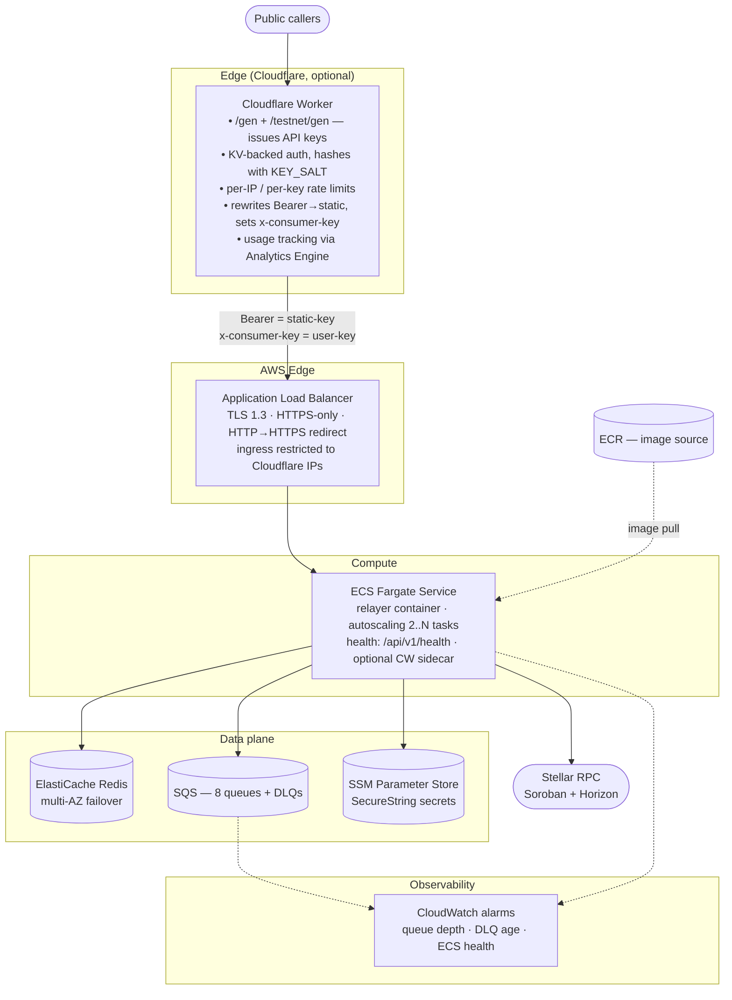
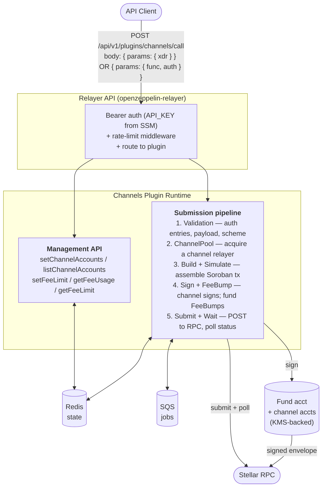
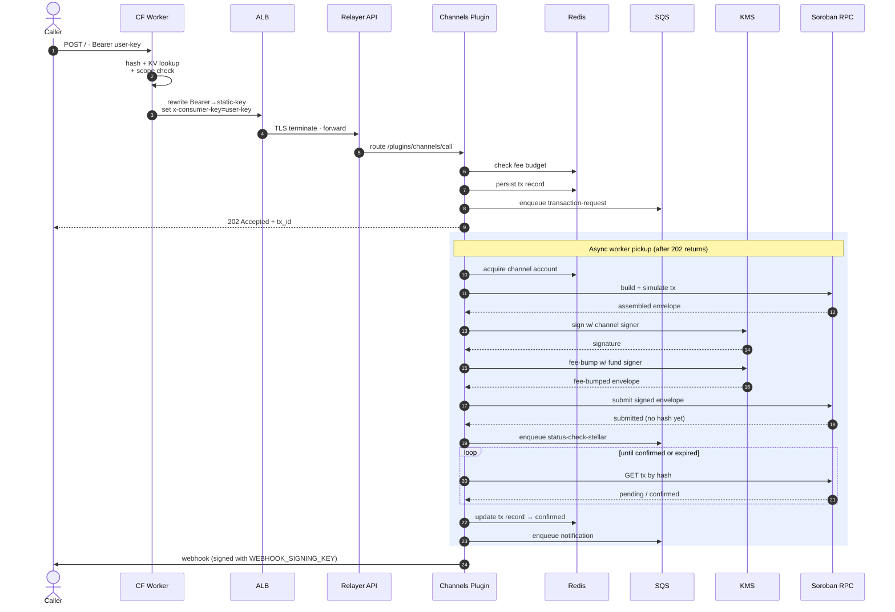
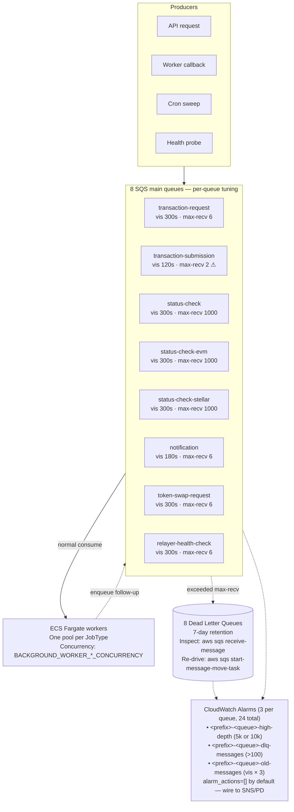
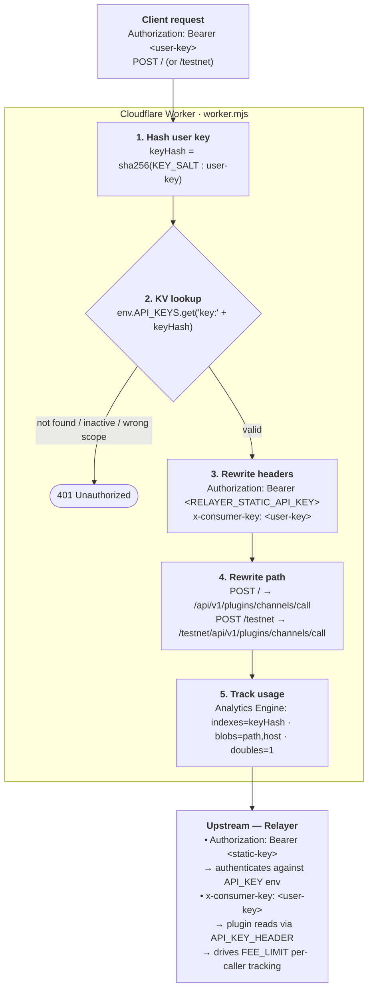
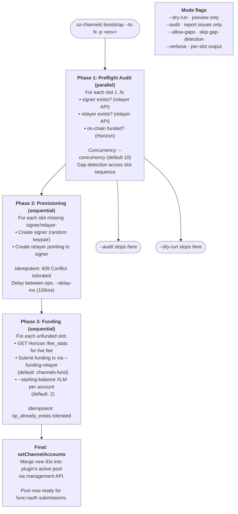
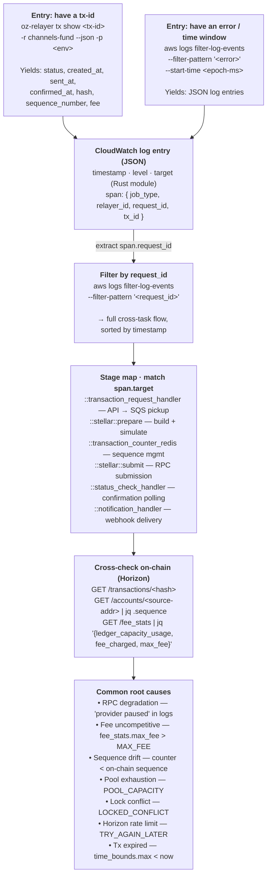

A step-by-step guide for infrastructure teams (such as Blockdaemon or SDF) deploying a hosted Stellar relayer service that mirrors OpenZeppelin's existing production setup.

**Audience:** infrastructure operators who have run production AWS workloads but are new to OpenZeppelin's relayer stack.

**Outcome:** a hosted Stellar Channels service in your own AWS account capable of serving the same workload profile OpenZeppelin currently runs (roughly 2M+ transactions per day across roughly 2,500 relayers).

For the GCP deployment, see the [GCP Operator Deployment Guide](/relayer/guides/stellar-relayer-gcp-operator-guide).

---

## 1. Overview

OpenZeppelin currently runs a hosted Stellar relayer service at `channels.openzeppelin.com` (mainnet) and `channels.openzeppelin.com/testnet` (testnet). The service absorbs the operational complexity of parallel Stellar transaction submission (channel-account pool management, fee bumping, sequence-number arbitration, multi-RPC failover) and exposes a simple HTTP API to downstream callers.

This guide is for infrastructure teams deploying a hosted relayer service for SDF providing the same throughput as OpenZeppelin. Blockdaemon is the first such operator; this guide is written to be portable to others.

### What You Will End Up With

After following this guide, you will have:

- A production-ready hosted Stellar Channels service running in your own AWS account, exposed at a domain you control (for example, `channels.your-company.com`).
- An ECS Fargate-backed compute tier with autoscaling, fronted by an Application Load Balancer with TLS 1.3.
- ElastiCache Redis (in production: multi-AZ with failover) for state and rate-limit accounting.
- Eight SQS queues and DLQs handling the distributed transaction-processing pipeline.
- Optional Cloudflare Worker fronting the ALB for self-serve API-key issuance (the `/gen` flow), per-user rate limiting, and usage analytics.
- AWS SSM Parameter Store SecureString entries for every secret. No secrets in environment variables, no secrets in container images.
- **Observability:** CloudWatch Logs and CloudWatch Metrics by default. Optionally, an Amazon Managed Prometheus workspace that remote-writes the same metric set if you operate your own Grafana or alerting stack.
- **Alerting:** CloudWatch Alarms wired to SNS topics that fan out to PagerDuty (or your on-call channel of choice). The module provisions the alarm resources but leaves `alarm_actions` empty by default so you bind the SNS topic ARNs that route to your existing incident pipeline.
- Optional Lambda functions for fund-relayer balance monitoring and ECS auto-restart on alarm.

The system handles two transaction-submission modes:

- **Signed XDR mode:** the caller signs a complete Stellar transaction envelope and submits it; the service only handles fee-bumping and submission.
- **Soroban `func` + `auth` mode:** the caller submits a Soroban host function and authorization entries; the service assembles, simulates, signs with a channel account, fee-bumps, and submits.

### What This Guide Assumes You Already Have

- Strong AWS infrastructure background (VPC, ECS, ALB, IAM, Route53, ACM, ElastiCache, SQS).
- Terraform fluency (1.5.0 or later).
- A target AWS account where you can create the full resource set, or an account-pair pattern with Route53 in a separate account (cross-account assume-role is supported).
- A domain in Route53 you control.
- (Optional) A Cloudflare account if you want the `/gen` API-key gateway.

If you are looking for your own development or any other use cases which serve lower throughput, see the upstream Stellar Operator Guide (different audience,, different deployment shape.

---

## 2. Architecture

### Cloud Architecture



**Module:** the entire stack above is provisioned by the `relayer-channels` Terraform module in `OpenZeppelin/relayer-channels-infra`. Operators consume it either by cloning the repo (standalone mode) or referencing it as an external module from their own Terraform.

**Components at a Glance:**

| Component | AWS resource | Purpose |
| --- | --- | --- |
| Edge gateway | Cloudflare Worker + KV namespace (optional) | API-key issuance, per-key rate limiting, usage tracking, static-key injection upstream |
| Load balancer | Application Load Balancer + ACM cert | TLS termination, HTTPS-only, health-checked routing to Fargate |
| Compute | ECS Fargate Service (`launch_type = "FARGATE"`) | Runs the relayer container (and optional metrics sidecar). Autoscaling by CPU. |
| State | ElastiCache Redis 7.1 replication group, in-transit TLS | Relayer state (transaction records, sequence counters), distributed locks, rate-limit buckets |
| Queue | 8 SQS standard queues + 8 DLQs | Distributed transaction processing (request → submit → status check → notification, etc.) |
| Secrets | SSM Parameter Store `SecureString` | `API_KEY`, `PLUGIN_ADMIN_SECRET`, `WEBHOOK_SIGNING_KEY`, `STORAGE_ENCRYPTION_KEY` |
| Observability | CloudWatch Logs + Metrics + (optional) Amazon Managed Prometheus | App logs (JSON format), per-queue depth alarms, optional metrics-remote-write |
| Image registry | ECR Public (module-created) or your own ECR | Container image source for the Fargate task |
| Signing | KMS (out-of-module, operator-provisioned per relayer-side signer config) | ED25519 keys for the fund relayer + channel-account signers |
| Optional monitors | Lambda + EventBridge | Balance-check Lambda; ECS restart-on-alarm Lambda |

### App Architecture (Channels Plugin Runtime)



**Source references:**
- Relayer API: `openzeppelin-relayer`
- Channels Plugin: `relayer-plugin-channels` (see `src/plugin/` for the runtime, `src/client/` for the TypeScript SDK)
- The Docker image deployed to Fargate is built from `openzeppelin-relayer/examples/channels-plugin-example`

### Transaction Lifecycle

End-to-end flow for a Soroban `func` + `auth` submission through the hosted service.



**What Each Stage Costs:**

| Stage | Latency contributors |
| --- | --- |
| CF Worker auth | KV lookup (~10ms) + sha256 hash |
| ALB to Fargate | TLS termination + intra-VPC hop (~1-5ms) |
| Validation | Redis lookups for fee budget (~1ms each) |
| Channel acquire | Redis distributed lock (~1ms; queue wait if pool exhausted) |
| Build + simulate | Soroban RPC `simulateTransaction` (~50-200ms) |
| Sign + fee-bump | KMS `Sign` × 2 (channel + fund) (~10-50ms each, region-local) |
| Submit | Soroban RPC `sendTransaction` (~10-100ms) |
| Status check | Per-poll RPC call (~10-50ms); ledger settlement adds ~5s base |

The 202 response is returned synchronously; the rest happens asynchronously via SQS workers. Status is queryable any time via `oz-relayer tx show <tx-id>`.

### Capacity Profile

The reference deployment OpenZeppelin runs handles a **growing ~3M transactions per day** sustained, served by **~1,000 relayers** (fund and channel-account entities combined). Two recent windows:

| Window | Total tx (7d) | Daily avg | Sustained tx/s | Peak day | Peak tx/s |
| --- | --- | --- | --- | --- | --- |
| Apr 28 – May 4 | 19.19M | 2.74M | ~31.7 | May 4 (3.90M) | ~45 |
| **May 5 – May 11** | **20.88M (+8.8% WoW)** | **2.98M** | **~34.5** | **May 8 (3.67M)** | **~42.5** |

The deployment is **trending up** WoW (+8.8% in the most recent window) and routinely absorbs daily peaks **~25–30% above the 7-day average**. Plan for headroom; autoscaling minimums should comfortably cover the **peak day**, not the average.

**`LIMITED_CONTRACTS` and pool isolation.** In practice, a small number of Soroban contracts tend to dominate the channel-account pool's submission queue. `LIMITED_CONTRACTS` lists the contract IDs to cap, and `CONTRACT_CAPACITY_RATIO` (a value between 0 and 1) sets the maximum fraction of the pool those listed contracts may collectively occupy at any one moment. This keeps high-throughput contracts from starving other callers of channel capacity. The full env-var tuning is in section 6.

**The Terraform module defaults are sized for `environment = "prod"` workloads but tuned conservatively.** For reference, here is the actual production configuration OpenZeppelin runs at this scale (sanitized):

| Resource | Module default (per `relayer-channels-infra`) | OpenZeppelin production (actual resource capacity) |
| --- | --- | --- |
| ECS task CPU | 1024 (1 vCPU) | **8192 (8 vCPU)** |
| ECS task memory | 2048 MiB | **16384 MiB** |
| ECS desired count | 2 | **11** |
| ECS autoscaling min | 2 | **11** |
| ECS autoscaling max | 10 | **25** |
| Container CPU (within task) | 1024 | **6144** (rest reserved for sidecars) |
| Container memory (within task) | 2048 | **9216** |
| Redis node type | `cache.t4g.medium` (non-prod) / `cache.r7g.large` (prod) | `cache.r7g.large` family (multi-AZ failover) |
| Redis pool max size | 500 | **3000** |
| Redis reader pool max size | 1000 | **3000** |
| Max connections (relayer) | 256 | **4000** |
| Rate limit (req/sec) | 100 | **400** |
| Rate limit burst | 300 | **500** |

The module defaults are operationally fine for a new deployment ramping up; expect to grow into something closer to the production shape as your workload approaches the OpenZeppelin scale. The full env-var tuning is in section 6.

**Sidecar pattern:** OpenZeppelin runs a `cloudwatch-exporter` sidecar in every task that scrapes `:8081/debug/metrics/scrape` and pushes Prometheus metrics into CloudWatch under namespaces like `RelayerChannelsMainnetTransactions`. The module exposes this as an optional feature via `enable_cloudwatch_exporter` and `cloudwatch_exporter_image`.

<Callout>
Traffic figures above are drawn from internal traffic analysis covering Apr 28 – May 11 on the channels-fund mainnet deployment (CloudWatch + per-contract instrumentation). Refresh this section quarterly or whenever a new WoW snapshot is generated.
</Callout>

### SQS Queue Topology

The relayer's distributed processing layer is eight SQS standard queues, each backed by a Dead Letter Queue. Producers, consumers, and DLQ relationships:



**Why the Per-Queue Tuning Matters:**

- `transaction-submission` has `max-recv = 2` because a failed RPC submission should not retry indefinitely (retrying a maybe-submitted tx risks double-spend semantics on the chain). Two attempts, then DLQ for human inspection.
- `status-check-*` queues have `max-recv = 1000` because status polling is *expected* to retry many times before a transaction confirms. Long ledger settlement means many poll attempts. A DLQ entry here means the tx never confirmed despite ~1000 polling rounds.
- Other queues sit at `max-recv = 6`, a reasonable default for retriable transient failures.

---

## 3. Prerequisites

### Accounts and Access

- **AWS account** with permissions to create: ECS clusters/services, ECR Public repositories, Application Load Balancers, ACM certificates, Route53 records, ElastiCache replication groups, SQS queues, IAM roles/policies, SSM Parameter Store, CloudWatch Logs + Metrics + Alarms, Lambda functions, EventBridge rules, Amazon Managed Prometheus workspaces. (Cross-account variants supported via assume-role; see section 5.)
- **Route53 hosted zone** for the domain you want to serve from (for example, `channels.your-company.com`). The zone can live in the same account or in a different one (cross-account assume-role).
- **(Optional) Cloudflare account** with a zone matching your domain. Required if you want the `/gen` API-key flow, per-IP/per-key rate limiting at the edge, and Cloudflare Analytics-Engine-backed usage tracking.
- **GitHub account** with access to the four reference repositories listed below. None of the repositories are required to be forked; you can consume Terraform modules directly via the `source` block.

### Tooling

| Tool | Version | Why |
| --- | --- | --- |
| Terraform | ≥ 1.5.0 | Module language constraints |
| AWS provider | < 6.0.0 | Pinned in `versions.tf` |
| Cloudflare provider | ~> 5.0 | Required as a provider even when `enable_cloudflare = false` (Terraform constraint) |
| Docker | recent stable | If building the container image rather than consuming the published one |
| AWS CLI v2 | recent stable | For ECR login, SSM updates, manual debugging |
| Node.js ≥ 18 + pnpm ≥ 10 | recent stable | If you intend to modify the Channels plugin (uncommon; most operators consume the published npm package) |

### Stellar-Side Prerequisites

- **Soroban RPC access:** at least two independent providers for mainnet (for example, Stellar Foundation plus a commercial provider). The module does not provision RPC; you configure RPC URLs at the relayer configuration layer.
- **KMS keys for signers:** for production, you will create one AWS KMS key per fund relayer (ED25519 key spec, asymmetric sign). The **fund relayer** is the Stellar account that signs and pays for the **fee-bump envelope** wrapping every channel-account submission: channel signers sign the inner transaction with their own keys, and the fund relayer's fee-bump signature is what commits XLM to confirm the bundle onchain. So every successful submission consumes (a) one channel-signer signature and (b) one fund-relayer signature plus its inclusion fee. Channel-account signers may use the encrypted local keystore pattern (development-only); for production, both should be KMS-backed. See Section 9 for the full security framing.
- **Initial XLM funding:** bootstrapping happens in two explicit steps:
    1. **Fund the fund relayer's Stellar account.** On **mainnet**, this is a manual one-time top-up sent from your treasury or an exchange to the fund relayer's address. On **testnet**, fund it via Friendbot.
    2. **Bootstrap channel accounts from that balance.** `oz-channels bootstrap --to N` creates `N` channel accounts and sends `--starting-balance` XLM (default **2 XLM**) to each, drawing from the fund relayer.

    **Sizing the fund-relayer balance:**

    - **Provisioning (one-time):** `2 XLM × N` channel accounts. A 1,000-channel pool requires **at minimum 2,000 XLM** in the fund relayer before `bootstrap` can run.
    - **Operating buffer (ongoing):** covers fee bumps for live traffic. At ~34 tx/s sustained (per section 2) and a 100-stroop base fee, a multi-day buffer typically runs in the range of tens to hundreds of XLM depending on congestion-driven fee multipliers. Top up via the balance-monitoring Lambda described in section 7.

### Reference Repositories

You will refer to three repositories during deployment:

| Repo | Role | Visibility |
| --- | --- | --- |
| `OpenZeppelin/relayer-channels-infra` | Primary Terraform modules | Public |
| `OpenZeppelin/openzeppelin-relayer`, `examples/channels-plugin-example` | The example used to build the Docker image | Public |
| `OpenZeppelin/relayer-plugin-channels` | The Channels plugin runtime (TypeScript) | Public |

---

## 4. Environments

OpenZeppelin's reference deployment uses three environments. We recommend operators mirror this separation:

| Environment | Stellar network | AWS profile pattern | ECS cluster | Log group |
| --- | --- | --- | --- | --- |
| `prod-mainnet` | Stellar Mainnet | Production AWS account | `relayer-channels-prod-mainnet-cluster` | `/aws/ecs/relayer-channels-prod-mainnet/task` |
| `prod-testnet` | Stellar Testnet | Production AWS account | `relayer-channels-prod-testnet-cluster` | `/aws/ecs/relayer-channels-prod-testnet/task` |
| `stg` | Stellar Testnet | Staging AWS account | `relayer-channels-stg-cluster` | `/aws/ecs/relayer-channels-stg/task` |

The cluster and log-group naming is auto-derived by the module from `app_name` + `environment`. When `environment = "prod"` the resource-name suffix is dropped; for other environments, names are suffixed with `-<environment>`.

### Configuration Shape

Operators typically maintain a small structured config that maps environment names to their AWS profile, region, ECS cluster, log group, and Stellar Horizon endpoint. This avoids hard-coding values in operational scripts and CI/CD. A reasonable shape:

```yaml
environments:
prod-mainnet:
aws_profile: <your-prod-profile>
aws_region: us-east-1
ecs_cluster: relayer-channels-prod-mainnet-cluster
log_group: /aws/ecs/relayer-channels-prod-mainnet/task
horizon: https://horizon.stellar.org
stellar_network: mainnet
relayer_id: channels-fund
prod-testnet:
aws_profile: <your-prod-profile>
aws_region: us-east-1
ecs_cluster: relayer-channels-prod-testnet-cluster
log_group: /aws/ecs/relayer-channels-prod-testnet/task
horizon: https://horizon-testnet.stellar.org
stellar_network: testnet
relayer_id: channels-fund
stg:
aws_profile: <your-stg-profile>
aws_region: us-east-1
ecs_cluster: relayer-channels-stg-cluster
log_group: /aws/ecs/relayer-channels-stg/task
horizon: https://horizon-testnet.stellar.org
stellar_network: testnet
relayer_id: channels-fund
```

This same shape is consumed by the operator CLIs (`oz-relayer`, `oz-channels`) described in section 7; they read profile config from `~/.config/oz-relayer/config.yaml` and `~/.config/oz-channels/config.yaml`.

---

## 5. Step-by-Step Deployment

This section walks the happy-path deployment using the Terraform module in standalone mode. After the first deploy, day-2 operations are described in section 7.

### Step 5.1: Clone the Repository

```bash
git clone https://github.com/OpenZeppelin/relayer-channels-infra.git
cd relayer-channels-infra
```

<Callout>
Cloning the repo is useful for exploring the code and contributing. You can also consume the Terraform module directly without cloning, by referencing it via the `source` block from your own Terraform configuration.
</Callout>

The repo layout:

```
relayer-channels-infra/
├── main.tf                       # Root module — instantiates the relayer-channels submodule
├── variables.tf                  # Root variables
├── outputs.tf                    # Root outputs
├── versions.tf                   # Terraform + provider versions
├── terraform.tfvars.example      # Annotated example tfvars
└── modules/
    └── relayer-channels/         # The actual module
        ├── main.tf
        ├── ecs.tf
        ├── sqs.tf
        ├── redis.tf
        ├── cloudflare.tf
        ├── dns.tf
        ├── lambda.tf
        ├── prometheus.tf
        ├── worker.mjs            # Cloudflare Worker source
        ├── relayer_balance.mjs   # Balance-check Lambda source
        └── restart_ecs_on_alarm.mjs   # ECS-restart Lambda source
```

### Step 5.2: Configure Terraform Backend

In `versions.tf`, uncomment and edit the `backend "s3"` block so Terraform state is stored remotely (do not store state on a laptop in production). Example:

```hcl
terraform {
  required_version = ">= 1.5.0"

  backend "s3" {
    bucket         = "your-org-terraform-state"
    key            = "relayer-channels/prod-mainnet.tfstate"
    region         = "us-east-1"
    dynamodb_table = "your-org-terraform-locks"
    encrypt        = true
  }
}
```

Initialize:

```bash
terraform init
```

### Step 5.3: Create Your tfvars

Copy the example:

```bash
cp terraform.tfvars.example terraform.tfvars
```

The example file (annotated) covers the full surface. The minimum set required for a first standalone deploy:

```hcl
aws_region        = "us-east-1"
environment       = "prod-mainnet"          # or "prod-testnet" / "stg"
vpc_id            = "vpc-XXXXXXXXXXXXXXXXX"
vpc_cidr          = "172.31.0.0/16"
public_subnet_ids = ["subnet-AAA", "subnet-BBB"]    # 2+ AZs required

domain_name       = "channels.your-company.com"
route53_zone_name = "your-company.com"               # OR route53_zone_id

# Container image — either OpenZeppelin's published image or your own ECR
container_image = "public.ecr.aws/<oz-alias>/openzeppelin-relayer-channels:mainnet-1.4.2"  # look up <oz-alias> via the ECR Public Gallery

# Secrets — never commit these. Set via TF_VAR_<name> or a secrets-managed CI pipeline
relayer_api_key       = "" # required — set via TF_VAR_relayer_api_key
channels_admin_secret = "" # required — set via TF_VAR_channels_admin_secret

# Stellar
stellar_network  = "mainnet"
fund_relayer_id  = "channels-fund"
distributed_mode = true                              # production: true; backed by SQS
log_level        = "warn"
```

Pass secrets as environment variables to avoid them ever touching the working directory:

```bash
export TF_VAR_relayer_api_key="$(openssl rand -hex 32)"            # ≥ 32 chars; relayer enforces minimum length
export TF_VAR_channels_admin_secret="$(openssl rand -hex 32)"      # admin secret for management API
export TF_VAR_webhook_signing_key="$(openssl rand -hex 32)"        # if using webhooks
export TF_VAR_storage_encryption_key="$(openssl rand -hex 32)"     # for at-rest encryption in Redis
```

### Step 5.4: Decide on the Container Image Strategy

Two options:

**Option A: Consume OpenZeppelin's Published Image (recommended).** OpenZeppelin publishes pre-built images to ECR Public at `public.ecr.aws/<oz-alias>/openzeppelin-relayer-channels:<tag>` (look up the live alias from the ECR Public Gallery). The image bundles `openzeppelin-relayer` compiled from a pinned `main` revision with the `@openzeppelin/relayer-plugin-channels` package, runs as `nonroot` (UID 65532) on a Wolfi base, and ships with public Stellar RPC endpoints baked in (no secrets, no paid-RPC URLs). It is the same image OpenZeppelin runs in production.

Tag scheme:

| Tag pattern | Points at |
| --- | --- |
| `mainnet-<version>` (for example `mainnet-1.4.2`) | Stellar mainnet build, pinned. **Use this in production.** |
| `mainnet-latest` | Most recent mainnet build. Convenient for dev; will move under you. |
| `testnet-<version>` / `testnet-latest` | Stellar testnet equivalents. |

```hcl
container_image = "public.ecr.aws/<oz-alias>/openzeppelin-relayer-channels:mainnet-1.4.2"
```

Build provenance and SBOM attestations are attached to every push. Verify with:

```bash
docker buildx imagetools inspect \
  public.ecr.aws/<oz-alias>/openzeppelin-relayer-channels:mainnet-1.4.2 \
  --format '{{ json .Provenance }}'
```

The published image is built and pushed by OpenZeppelin's internal CI pipeline (one workflow per network: mainnet and testnet). The pipeline refuses to publish if any private-RPC pattern is detected in the baked `stellar.json`, which is the guardrail that makes the public image safe for downstream operators to consume. You don't need access to that pipeline to deploy; the published image at `public.ecr.aws/<oz-alias>/openzeppelin-relayer-channels:<tag>` is the contract.

**Option B: Build Your Own Image** from the example and publish to your own ECR. Leave `container_image = ""` in tfvars; the module will create an ECR Public repository for you. Build steps mirror what the OpenZeppelin workflows do:

```bash
git clone https://github.com/OpenZeppelin/openzeppelin-relayer.git
cd openzeppelin-relayer/examples/channels-plugin-example
# Build the Channels plugin TypeScript wrapper
(cd channel && pnpm install && pnpm run build)
# Build the Docker image
docker build -t my-relayer-channels:latest -f ../../Dockerfile.production .
```

You can run this build locally as shown, or wire it into the CI tool of your choice (GitHub Actions, GitLab CI, CircleCI, Buildkite, etc.). The build itself is a standard `docker build`; no OpenZeppelin-specific tooling is required to reproduce it.

**What the public image baked-in config does NOT include** (you provide at runtime via mounted `config.json` and env vars):

- Relayer definitions (`relayers[]`)
- Signer keys
- Redis (state and optional queue backend)
- SQS queues (if running in distributed mode)
- IAM roles for KMS / SQS / Secrets Manager / CloudWatch

To override the baked public-RPC endpoints with paid/private RPCs, mount your own `stellar.json` at `/app/config/networks/stellar.json`. The file format mirrors the default: one entry per Stellar network (`mainnet`, `testnet`), each with a `rpc_urls[]` array of `{ url, weight }` objects. The relayer load-balances across the listed URLs by weight and rotates on failures (see the `RPC_*` and `PROVIDER_*` env vars in section 6 for failover tuning).

After the first `terraform apply` (next step), push to the module-created ECR:

```bash
aws ecr-public get-login-password --region us-east-1 \
  | docker login --username AWS --password-stdin public.ecr.aws

# Tag using the ECR URL output by terraform
ECR_URL=$(terraform output -raw ecr_repository_url)
docker tag my-relayer-channels:latest "$ECR_URL:latest"
docker push "$ECR_URL:latest"
```

### Step 5.5: Plan and Apply

```bash
terraform plan -out plan.tfplan
terraform apply plan.tfplan
```

Initial apply takes ~15–20 minutes (ElastiCache provisioning is the slowest leg; the ALB and ACM cert validation also take a few minutes each).

Outputs include:

| Output | Used for |
| --- | --- |
| `ecs_cluster_name` | Manual ECS Exec, AWS CLI scripting |
| `ecs_service_name` | Service updates, manual restart |
| `ecr_repository_url` | Container image pushes (Option B) |
| `alb_dns_name` | Direct ALB access if Cloudflare is disabled |
| `domain_name` | Public service URL |
| `redis_primary_endpoint`, `redis_reader_endpoint` | Manual Redis CLI access (via bastion) |
| `sqs_queue_urls` | Map of queue names to URLs for direct SQS inspection |
| `prometheus_endpoint` | If AMP enabled, the remote-write endpoint |
| `ssm_parameter_prefix` | Path prefix for SSM secret manipulation |

### Step 5.6: Verify the Service Is Up

```bash
# Health check
curl -sS https://channels.your-company.com/api/v1/health
# Expect: 200 OK with body "OK"

# Readiness — checks Redis, queue, plugin
curl -sS https://channels.your-company.com/api/v1/ready
# Expect: 200 with JSON { "ready": true, "status": "healthy", ... }
```

If either fails, the same checks are available via CLI or the AWS Console:

- **ECS service events:**
    - CLI: `aws ecs describe-services --cluster <ecs_cluster_name> --services <ecs_service_name>`
    - Console: **ECS → Clusters → `<your-cluster>` → Services → `<your-service>` → Events**.
- **Task logs:**
    - CLI: `aws logs tail "/aws/ecs/<app_name>-<environment>/task" --since 10m --follow`
    - Console: **CloudWatch → Log groups → `/aws/ecs/<app_name>-<environment>/task` → Live tail**.
- **Target health (ALB):**
    - Console: **EC2 → Target groups → `<your-target-group>` → Targets**. Useful when health checks fail but tasks look running.

The most common first-deploy failures are: secrets not set (relayer panics with `Security error: API_KEY must be at least 32 characters long`), Redis not yet healthy (wait ~5 more minutes), or ACM cert validation lag (verify the Route53 alias was created).

### Step 5.7: Enable Cloudflare (If Using the `/gen` Flow)

If you set `enable_cloudflare = true` in step 5.3, the module provisions:

- A KV namespace named `<app_name>-api-keys` for storing hashed user API keys
- A Cloudflare Worker named `<app_name>-gateway` running `worker.mjs`
- A Workers route binding to `${domain_name}/*` so all traffic to your domain transits the Worker
- A 100%-traffic deployment strategy (no Workers-level canary)

The Worker exposes:

| Path | Method | Behavior |
| --- | --- | --- |
| `/gen` | GET | Issues a mainnet API key. Salt+hashes with `KEY_SALT`, stores in KV with 365d TTL, returns raw key once |
| `/testnet/gen` | GET | Same for testnet scope |
| `/` (POST) | POST | Proxies to relayer's `/api/v1/plugins/channels/call` (mainnet path) |
| `/testnet` (POST) | POST | Proxies to relayer's `/testnet/api/v1/plugins/channels/call` |
| `/usage/me` | GET | Queries Cloudflare Analytics Engine for the caller's usage |

The Worker injects authentication headers upstream: the upstream `Bearer` token becomes the static API key (`RELAYER_STATIC_API_KEY`), while the user's original key becomes `x-consumer-key`. This is why the ECS module sets `API_KEY_HEADER=x-consumer-key`; the relayer is told to use that header for per-user fee tracking inside the Channels plugin.

Rate limits (defaults; tunable via tfvars):

| Variable | Default | Meaning |
| --- | --- | --- |
| `gen_ip_rate_hour` | 2 | Max `/gen` requests per IP per hour (anti-abuse) |
| `relay_rpm_per_key` | 60 | Max relay POSTs per minute per user key |

The Worker source (`worker.mjs`) is identical between the public module and the internal OpenZeppelin deployment: same KV-backed auth, same header rewrites, same usage tracking via Cloudflare Analytics Engine. The module defaults for the rate limits (`gen_ip_rate_hour=2`, `relay_rpm_per_key=60`) are reasonable conservative starting points; tune to your traffic profile.

**Worker Auth-Rewrite: What Actually Happens to Headers:**

This is the non-obvious part of the Worker. Per-caller API keys go in, a single static API key goes out, and the original caller identity is carried in a different header for downstream fee tracking.



**Operational consequence:** the upstream relayer never sees user-supplied keys directly. A compromised user key only compromises that user's quota; it cannot escalate to relayer-level admin operations because those require the static key (which only the Worker holds).

### Step 5.8: Bootstrap the Channel-Account Pool

The module deploys the *infrastructure* but does not provision the *channel accounts* (Stellar entities). For this you use the `oz-channels` CLI included in the `cli/` directory of this repo.

Install the CLI:

```bash
# From the root of this repo
cd cli
bun install
bun run build

# Link the CLIs globally
cd packages/oz-channels && bun link
cd ../oz-relayer && bun link

# Verify
oz-channels --help
oz-relayer --help
```

<Callout>
Requires the [Bun](https://bun.sh) runtime (Node.js 22+ compatible).
</Callout>

Set up a profile for your environment:

```bash
oz-channels profile init prod-mainnet
# Prompts for: URL (your channels.your-company.com), API key, plugin ID (channels),
#              admin secret, network (mainnet), test account
```

Then provision the pool. Start small on testnet to validate, then scale on mainnet:

```bash
# Preview (no changes)
oz-channels bootstrap --to 200 --dry-run -p prod-mainnet

# Provision
oz-channels bootstrap --to 200 -p prod-mainnet
```

The bootstrap workflow runs three phases:

1. **Preflight audit** (parallel, configurable concurrency): checks each slot's signer existence, relayer existence, and onchain funding.
2. **Provisioning** (sequential): creates signers and relayers via the relayer's management API; tolerates 409s if records already exist.
3. **Funding** (sequential): submits funding transactions through the fund relayer using a competitive fee from Horizon `/fee_stats`; tolerates `op_already_exists`.

After all three phases complete, the bootstrap merges the new accounts into the Channels plugin's pool via `setChannelAccounts`.

**Workflow at a Glance:**



**Production sizing reference:** the reference deployment runs ~1,000 relayers total. For a fresh deploy that needs to handle the full reference load, bootstrap several hundred channel accounts. For lower-load deployments, start with 50–100 and scale incrementally.

#### Scaling Beyond ~100 Channels

When scaling the pool aggressively (e.g. 100 → 1000 channels), `oz-channels bootstrap` will start failing with `TRY_AGAIN_LATER` or `tx_bad_seq` errors from Horizon. This happens because every `createAccount` operation uses the fund relayer (`channels-fund`) as the transaction source, serializing all submissions on a single sequence number. Under high concurrency, Horizon rejects the overlapping submissions.

Use `scripts/fund-new-channels.ts` instead; it routes the transaction source through an existing funded channel account (e.g. `channel-0001`) while keeping the fund relayer as the operation source (so the treasury still pays). It also batches up to 100 `createAccount` ops per transaction, so a 100→1000 scale-up fits in ~9 submissions.

```bash
npx tsx scripts/fund-new-channels.ts \
  --env mainnet \
  --api-key <key> \
  --source-relayer channel-0001 \
  --fund-relayer channels-fund \
  --from 101 --to 1000 \
  --starting-balance 2 \
  --report fund-report.json
```

The script is idempotent; it preflights every slot via the relayer API and Horizon, skipping any account already funded onchain. Safe to re-run.

#### Gap Detection

Gap-detection guards against accidentally provisioning a sparse pool:

```bash
# Will error if slots 11–19 don't exist
oz-channels bootstrap --from 20 --to 25 -p prod-mainnet
# Error: Gap detected in slot sequence: 11-19

# Override only if intentional
oz-channels bootstrap --from 20 --to 25 --allow-gaps -p prod-mainnet
```

### Step 5.9: Verify End-to-End

Once channels are provisioned and registered, run a smoke test:

```bash
oz-channels smoke setup -p prod-mainnet      # Deploys a smoke contract (testnet only; mainnet uses bundled contract)
oz-channels smoke run -p prod-mainnet        # Submits real transactions through the pool
```

Tests covered include both `xdr` and `func + auth` modes against the deployed pool. Test failures here indicate misconfiguration between the infra layer (Terraform) and the application layer (relayer config + plugin config).

---

## 6. Configuration Reference

### Module-Managed Container Environment Variables

These are set inside the ECS task definition by the Terraform module and should not be overridden unless you have a specific reason:

| Env var | Set to | Source |
| --- | --- | --- |
| `HOST` | `0.0.0.0` | Module |
| `STELLAR_NETWORK` | `var.stellar_network` (`mainnet` or `testnet`) | Module |
| `FUND_RELAYER_ID` | `var.fund_relayer_id` (default `channels-fund`) | Module |
| `API_KEY_HEADER` | `x-consumer-key` | Module: keyed to Cloudflare Worker rewriting |
| `REPOSITORY_STORAGE_TYPE` | `redis` | Module: required for production |
| `RESET_STORAGE_ON_START` | `false` | Module |
| `METRICS_ENABLED` | `true` | Module |
| `METRICS_PORT` | `8081` | Module |
| `LOG_FORMAT` | `json` | Module |
| `LOG_LEVEL` | `var.log_level` (default `warn`) | Module |
| `REDIS_URL` | `redis://<primary-endpoint>:6379` | Module: derived from ElastiCache output |
| `REDIS_READER_URL` | `redis://<reader-endpoint>:6379` | Module: read/write split for ElastiCache |
| `AWS_REGION` | Module-derived | Module |
| `AWS_ACCOUNT_ID` | Module-derived | Module |
| `DISTRIBUTED_MODE` | `var.distributed_mode` (default `true`) | Module |
| `QUEUE_BACKEND` | `sqs` (when distributed) or `memory` | Module |
| `SQS_QUEUE_URL_PREFIX` | `https://sqs.<region>.amazonaws.com/<account>/<prefix>-` | Module |

### Optional Module-Managed Env Vars

| Env var | Activated by | Purpose |
| --- | --- | --- |
| `ALLOWED_FUND_RELAYER_IDS` | `var.allowed_fund_relayer_ids` non-empty | Per-request fund-relayer override (used by x402 patterns) |

### Production Reference Values

For operators targeting OpenZeppelin's reference scale (~2M tx/day, ~1000 relayers, 11–25 Fargate tasks of 8 vCPU / 16 GB), these are the env-var values OpenZeppelin actually runs in production. Use them as a calibration point; do not blindly copy without sizing your downstream dependencies (Redis, RPC, KMS rate limits) to match.

```hcl
container_environment = [
  # Worker concurrency — the biggest tuning surface
  { name = "BACKGROUND_WORKER_TRANSACTION_REQUEST_CONCURRENCY",            value = "200" },
  { name = "BACKGROUND_WORKER_TRANSACTION_SENDER_CONCURRENCY",             value = "200" },
  { name = "BACKGROUND_WORKER_TRANSACTION_STATUS_CHECKER_STELLAR_CONCURRENCY", value = "300" },
  # Non-Stellar workers parked at 1 (Stellar-only deployment)
  { name = "BACKGROUND_WORKER_TRANSACTION_STATUS_CHECKER_CONCURRENCY",     value = "1" },
  { name = "BACKGROUND_WORKER_TRANSACTION_STATUS_CHECKER_EVM_CONCURRENCY", value = "1" },
  { name = "BACKGROUND_WORKER_NOTIFICATION_SENDER_CONCURRENCY",            value = "1" },
  { name = "BACKGROUND_WORKER_SOLANA_TOKEN_SWAP_REQUEST_CONCURRENCY",      value = "1" },
  { name = "BACKGROUND_WORKER_RELAYER_HEALTH_CHECK_CONCURRENCY",           value = "1" },

  # API + plugin concurrency caps
  { name = "RELAYER_CONCURRENCY_LIMIT",        value = "800" },
  { name = "PLUGIN_MAX_CONCURRENCY",           value = "8000" },   # master knob — see below
  { name = "MAX_CONNECTIONS",                  value = "4000" },

  # Timeouts (production uses longer timeouts than defaults)
  { name = "REQUEST_TIMEOUT_SECONDS",          value = "60" },
  { name = "PLUGIN_POOL_REQUEST_TIMEOUT_SECS", value = "60" },
  { name = "PLUGIN_GLOBAL_TIMEOUT_MS",         value = "55000" },
  { name = "PLUGIN_POLLING_TIMEOUT_MS",        value = "45000" },

  # Rate limits
  { name = "RATE_LIMIT_REQUESTS_PER_SECOND",   value = "400" },
  { name = "RATE_LIMIT_BURST",                 value = "500" },

  # Fee tracking — 100 XLM (1e9 stroops) per API key per 24h
  { name = "FEE_LIMIT",                  value = "1000000000" },
  { name = "FEE_RESET_PERIOD_SECONDS",   value = "86400" },

  # Redis connection pools — sized for 11-task deployment
  { name = "REDIS_POOL_MAX_SIZE",         value = "3000" },
  { name = "REDIS_READER_POOL_MAX_SIZE",  value = "3000" },

  # Aggressive cleanup of completed transactions (6 minutes)
  { name = "TRANSACTION_EXPIRATION_HOURS", value = "0.1" },

  # SQS polling tuning
  { name = "SQS_TRANSACTION_REQUEST_WAIT_TIME_SECONDS",   value = "2" },
  { name = "SQS_TRANSACTION_SUBMISSION_WAIT_TIME_SECONDS", value = "2" },
  { name = "SQS_TRANSACTION_REQUEST_POLLER_COUNT",         value = "3" },
  { name = "SQS_TRANSACTION_SUBMISSION_POLLER_COUNT",      value = "3" },

  # Contract-level pool isolation (sample contract IDs — substitute your own)
  { name = "LIMITED_CONTRACTS",       value = "C<contract1>,C<contract2>" },
  { name = "CONTRACT_CAPACITY_RATIO", value = "0.6" },

  # Alternative fund relayer for x402 traffic class (if applicable)
  { name = "ALLOWED_FUND_RELAYER_IDS", value = "x402-fund-relayer-id" },

  { name = "NODE_OPTIONS", value = "--no-deprecation" },
]
```

**`PLUGIN_MAX_CONCURRENCY` is the master knob** for the Channels plugin's worker pool. Per the public-image documentation: it auto-derives most other plugin-internal settings; don't override the derived values.

### User-Overridable Env Vars

Anything in `var.container_environment` is merged with the managed list; **user-provided values take precedence**. Common overrides:

```hcl
container_environment = [
  # Channels plugin-specific
  { name = "FEE_LIMIT",               value = "100000000" },        # stroops per API key per period
  { name = "FEE_RESET_PERIOD_SECONDS", value = "86400" },           # 24h rolling window
  { name = "LOCK_TTL_SECONDS",        value = "30" },               # channel-account lock TTL (range 3-30)
  { name = "MAX_FEE",                 value = "1000000" },          # max stroops per tx
  { name = "LIMITED_CONTRACTS",       value = "CABC...,CDEF..." },  # contracts with restricted pool access
  { name = "CONTRACT_CAPACITY_RATIO", value = "0.2" },              # restrict listed contracts to 20% of pool

  # Worker concurrency overrides (defaults are sane; tune under load)
  { name = "BACKGROUND_WORKER_TRANSACTION_SENDER_CONCURRENCY",            value = "150" },
  { name = "BACKGROUND_WORKER_TRANSACTION_STATUS_CHECKER_STELLAR_CONCURRENCY", value = "100" },

  # RPC failover tuning
  { name = "PROVIDER_FAILURE_THRESHOLD",       value = "3" },       # consecutive fails before pause
  { name = "PROVIDER_PAUSE_DURATION_SECS",     value = "60" },      # pause window
  { name = "PROVIDER_FAILURE_EXPIRATION_SECS", value = "60" },      # how long failures count
  { name = "RPC_TIMEOUT_MS",                   value = "10000" },
]
```

<Callout>
**What `LIMITED_CONTRACTS` does.** A small number of Soroban contracts often dominate the channel-account pool's submission queue. In the OpenZeppelin reference deployment, two limited contracts together account for ~99%+ of all transactions, and the top single contract takes 73–97% of daily volume depending on its onchain phase (for example, long-running mining/harvest cycles). Left unmanaged, contracts at this concentration would starve every other contract of channel-account capacity. `LIMITED_CONTRACTS` lists the contract IDs to cap, and `CONTRACT_CAPACITY_RATIO` (between 0 and 1) sets the maximum fraction of the pool those listed contracts may collectively occupy at any one moment. **OpenZeppelin runs `CONTRACT_CAPACITY_RATIO=0.6`** in production; high-traffic contracts can take up to 60% of the pool, leaving 40% reserved for everyone else (which keeps long-tail traffic responsive even under sustained mining-protocol load).

**How to populate the list.** Identify offenders empirically: watch per-contract channel-account-checkout metrics over hours or days (the `cloudwatch-exporter` sidecar exposes per-contract counters), and add any contract whose share of in-flight submissions consistently exceeds the rest of the population by an order of magnitude. The contracts in OpenZeppelin's list are publicly identifiable, high-throughput Soroban protocols whose normal operation generates millions of submissions per day; your offenders will be specific to your customer mix. The placeholder values shown above (`CABC...`, `CDEF...`) are illustrative; substitute your own.
</Callout>

### Module-Managed Secrets (from SSM Parameter Store)

The module creates SSM `SecureString` parameters and wires them into the ECS task's `secrets` block. They are referenced by ARN, not by value, so secret rotation can be done in-place via `aws ssm put-parameter` without touching Terraform.

| Container env var | SSM parameter | Required? |
| --- | --- | --- |
| `API_KEY` | `<prefix>/relayer-api-key` | Yes |
| `PLUGIN_ADMIN_SECRET` | `<prefix>/channels-admin-secret` | Yes |
| `WEBHOOK_SIGNING_KEY` | `<prefix>/webhook-signing-key` | Conditional (set when `var.webhook_signing_key` non-empty) |
| `STORAGE_ENCRYPTION_KEY` | `<prefix>/storage-encryption-key` | Conditional (set when `var.storage_encryption_key` non-empty) |

The Terraform `lifecycle { ignore_changes = [value] }` on these parameters means: once created, Terraform will not overwrite the SSM value if you rotate it out-of-band via AWS CLI or Console. This is intentional; it lets you rotate secrets without doing a Terraform apply.

### Plugin Configuration (Channels Plugin Runtime)

Beyond the env vars above, the Channels plugin reads configuration baked into the Docker image via `config/config.json`. The `examples/channels-plugin-example` directory in `openzeppelin-relayer` is the reference. Key sections:

- `relayers[]`: one entry per relayer ID, including the fund relayer (`channels-fund`) with `concurrent_transactions: true`, and one entry per channel account. The bootstrap workflow creates these via the management API, so the JSON file typically contains only the fund relayer; channels are added dynamically.
- `signers[]`: one signer per relayer. For production, every signer should be `aws_kms` (or `google_cloud_kms` if you're on GCP) with an ED25519 key spec.
- `networks[]`: Stellar network definitions including `rpc_urls`. For production, list two independent providers.
- `notifications[]`: webhook endpoints (signed with `WEBHOOK_SIGNING_KEY`).
- `plugins[]`: the Channels plugin registration; ID is `channels` (matches the API path `/api/v1/plugins/channels/call`).

The published image ships with an **empty `config.json` stub** (empty `relayers[]`, `signers[]`, `notifications[]`. Operators must provide their own at runtime by mounting `/app/config/config.json`. Two patterns:

- **Mount a file:** simplest; commit your `config.json` to a private artifact store and mount via ECS task volume.
- **Render at startup from secrets:** more secure; use an entrypoint wrapper that fetches signer keys from AWS Secrets Manager or Vault and writes `/app/config/config.json` before the relayer starts.

<Callout>
**Minimal `config.json` shape:** four top-level arrays.

- `signers[]`: start with one entry: your fund-relayer's `aws_kms` signer (key ARN, region, key-spec `ECC_NIST_EDWARDS25519`).
- `relayers[]`: one entry for the fund relayer (`id: "channels-fund"`, points at the signer above, `concurrent_transactions: true`).
- `networks[]`: one Stellar network entry with `rpc_urls[]` weights.
- `plugins[]`: one entry registering the Channels plugin (`id: "channels"`, which is what makes the API path `/api/v1/plugins/channels/call` resolve).

Channel-account signers and relayers are added at runtime by `oz-channels bootstrap` (section 5.8); they don't need to live in `config.json` at image-build time.
</Callout>

### Channel-Account Funding Policy

Per the `oz-channels bootstrap` defaults: 2 XLM per channel at creation. Each channel needs at minimum the Stellar account reserve (1 XLM = 0.5 XLM × 2 entries) to exist onchain; the extra 1 XLM is operational buffer. Tune via `--starting-balance`.

The fund relayer pays all fee bumps. Its working balance needs to cover sustained traffic × per-bump fee. At ~23 tx/s sustained and 100 stroops base fee, a multi-day buffer is typically tens to hundreds of XLM depending on congestion-driven fee multipliers.

### Fee-Bump Policy

Set via the Channels plugin's `MAX_FEE` env var (default `1000000` stroops = 0.1 XLM). This caps the fee any single transaction can spend. Under network congestion, transactions exceeding this cap are rejected by the plugin rather than submitted with a fee too low to confirm.

For per-fund-relayer overrides (when `ALLOWED_FUND_RELAYER_IDS` is in use), the `relayer-plugin-channels` README documents per-fund-relayer fee overrides including dynamic inclusion fees.

---

## 7. Operational Playbook

This section describes routine day-2 operations. The `oz-relayer` and `oz-channels` CLIs (in the `cli/` directory of this repo) are the operator-facing interface for most of these.

### 7.1: Deploys

The deploy unit is the container image. The Terraform module is "infra-mostly-stable"; you re-apply it only when adding/removing AWS resources or changing module config.

**Routine deploy** (new container image):

1. Push the new image to ECR with a versioned tag (for example, `mainnet-1.3.40`).
2. Update `container_image` in tfvars to point at the new tag.
3. `terraform apply`: this triggers an ECS service update with `deployment_minimum_healthy_percent = 100` and `deployment_maximum_percent = 200`, so the service stays available throughout (new tasks come up, then old ones go down).

**ALB health-check semantics during deploy:** the ALB target group uses `path = /api/v1/health` with 5-second deregistration delay, 60-second interval, 30-second timeout. Tasks are added to the target group only after passing health checks; old tasks are drained gracefully.

**Canary deployments (the pattern OpenZeppelin runs in production):** the `relayer-channels-infra` public module ships a single ECS service. OpenZeppelin's internal production stack runs **two ECS services behind one ALB**: a stable service (`<app>-service-mainnet`) and a canary service (`<app>-service-canary`), both pointing at the same ECS cluster, ElastiCache Redis, and SQS queue prefix. The ALB's HTTPS listener uses `weighted_forward` across two target groups, currently configured `{stable: 100, canary: 0}` with stickiness enabled (600s duration) so a given caller stays on one variant across requests.

To roll out a new image with canary:

1. Push the new image to ECR with a versioned tag (for example, `mainnet-1.4.3`).
2. Update the canary service's `container_image` to the new tag and bump its `desired_count` (from the "parked" 0 to a small number (for example, 2 tasks) for a ~10% slice.
3. Shift ALB weights from `{stable: 100, canary: 0}` to `{stable: 90, canary: 10}` (or whatever ramp you want).
4. `terraform apply`.
5. Monitor canary-specific metrics for the agreed bake time (the CloudWatch namespace per task is distinct: `RelayerChannelsMainnetCanaryTransactions` vs `RelayerChannelsMainnetTransactions` for stable).
6. Promote: shift weights to `{stable: 0, canary: 100}`, then redeploy stable with the canary's image, then shift weights back to `{stable: 100, canary: 0}` and scale canary back to 0.

The canary service inherits all the same env vars but with concurrency slightly lower (~150 vs 200 across the worker pools) to limit blast radius if the new image misbehaves.

<Callout>
Extending the public `relayer-channels-infra` module to add a canary service is a mechanical addition: copy the existing `ecs_service` block, name it `-canary`, and update the ALB listener's `forward` action to `weighted_forward` with two target groups. The public module doesn't include this today; section 10.10 sketches the key resources and pitfalls.
</Callout>

### 7.2: Rollbacks

To roll back to a previous container image:

1. Update `container_image` tfvars to the older tag (for example, `mainnet-1.3.39`).
2. `terraform apply`.

The same blue/green-ish ECS deployment semantics apply: rollback proceeds with `min_healthy = 100`, so the service stays available.

### 7.3: Scaling Fargate

The module sets autoscaling bounds via:

| Variable | Production default |
| --- | --- |
| `desired_count` | 2 |
| `autoscaling_min_capacity` | 2 (defaults to `desired_count`) |
| `autoscaling_max_capacity` | 10 |

The autoscaling policy details are inherited from the upstream `terraform-aws-modules/ecs/aws//modules/service` module (CPU-based by default). To raise the ceiling under sustained load:

```hcl
desired_count            = 4
autoscaling_min_capacity = 4
autoscaling_max_capacity = 20
```

`terraform apply` applies the change without interruption.

### 7.4: Channel-Pool Management

The pool grows as your traffic grows. Adding to the pool is non-destructive and idempotent:

```bash
# Existing pool is 1..200; add slots 201..400
oz-channels bootstrap --from 201 --to 400 -p prod-mainnet

# List current channels in the plugin's pool
oz-channels channels list -p prod-mainnet

# Manually adjust (with caution; protected profiles prompt for confirmation)
oz-channels channels add channel-0050 -p prod-mainnet
oz-channels channels remove channel-0050 -p prod-mainnet
```

`oz-channels channels set` replaces the entire registered list (destructive); use `add`/`remove` for incremental changes.

### 7.5: Per-API-Key Fee Budget Management

The Channels plugin tracks per-API-key fee consumption when `FEE_LIMIT` and `FEE_RESET_PERIOD_SECONDS` are set. To inspect or adjust:

```bash
oz-channels fee usage <user-api-key> -p prod-mainnet           # see consumption
oz-channels fee limit <user-api-key> -p prod-mainnet           # see configured limit
oz-channels fee set-limit <user-api-key> 5000000000 -p prod-mainnet   # custom limit (stroops)
oz-channels fee delete-limit <user-api-key> -p prod-mainnet    # remove custom limit
```

This is the surface you will expose to per-customer billing reconciliation: when a customer claims they hit limits, this CLI gives you the source of truth.

### 7.6: Monitoring Queues

The Terraform module creates three CloudWatch alarms per queue:

| Alarm | Threshold | Period |
| --- | --- | --- |
| `<prefix>-<queue>-high-depth` | 10,000 messages (status-check queues) or 5,000 (others) | 2 consecutive 5-min periods |
| `<prefix>-<queue>-dlq-messages` | 100 messages in DLQ | 1 × 5-min period |
| `<prefix>-<queue>-old-messages` | `visibility_timeout × 3` (oldest message age) | 1 × 5-min period |

By default, `alarm_actions = []`; you must wire these alarms to an SNS topic or PagerDuty integration as a post-deploy operator step. The alarm names follow the `<prefix>-<queue>` pattern so a single SNS subscription on those alarm names captures all queue health alerts.

### 7.7: Monitoring Redis

ElastiCache emits standard CloudWatch metrics. Key signals:

| Metric | Watch for |
| --- | --- |
| `EngineCPUUtilization` | Spikes above 75% sustained |
| `DatabaseMemoryUsagePercentage` | Climb past 70%; capacity headroom for spikes |
| `ReplicationLag` | > 1s sustained (multi-cluster failover scenarios) |
| `CurrConnections` | Near `maxclients` (default 65000) |

The module emits Redis slow-log and engine-log to `/aws/elasticache/<app_name>-redis`. Tail with `aws logs tail`.

### 7.8: Inspecting Transactions and Relayer State

The `oz-relayer` CLI is the per-transaction inspection surface:

```bash
# Transaction details
oz-relayer tx show <tx-id> -r channels-fund -p prod-mainnet --json

# List recent transactions by status
oz-relayer tx list -r channels-fund --status pending -p prod-mainnet

# Relayer-level state (balance, sequence)
oz-relayer relayer status channels-fund -p prod-mainnet
oz-relayer relayer balance channels-fund -p prod-mainnet

# Cancel a pending transaction
oz-relayer tx cancel <tx-id> -r channels-fund -p prod-mainnet
```

For programmatic access, every command accepts `--json` for stable, parseable output.

### 7.9: Post-Restart Checklist

If you ever restart with `RESET_STORAGE_ON_START=true` (which wipes Redis), you need to redo the following (the service will be up but non-functional until these are done):

1. **Re-create the signer:** call the `/api/v1/signers` endpoint with your KMS key config
2. **Re-create the fund relayer:** via the relayer API using the new signer ID
3. **Re-run the RPC override:** the PATCH to `/api/v1/networks/stellar:mainnet` with your private providers
4. **Re-bootstrap channels:** `oz-channels bootstrap --to <N> -p <env>`
5. **Fund the fund relayer:** if the onchain account was recreated, send XLM to the new address

Normal restarts and redeployments (without `RESET_STORAGE_ON_START=true`) preserve everything in Redis; none of the above is needed.

### 7.10: Optional Lambda Monitors

Two opt-in Lambda functions are provided by the module:

**Balance-check Lambda** (`var.enable_balance_check_lambda = true`):
- EventBridge-scheduled (`balance_check_schedule`, default `rate(5 minutes)`)
- Polls the relayer API for fund/channel balances; emits CloudWatch metrics
- Source: `relayer_balance.mjs` in the module

**ECS restart-on-alarm Lambda** (`var.enable_restart_on_alarm_lambda = true`):
- Subscribes to CloudWatch alarms (you wire which alarms it listens to)
- On alarm `OK → ALARM` transition, forces an ECS service `update-service --force-new-deployment` to rebuild tasks
- Use sparingly; a flapping alarm can cause restart loops. Source: `restart_ecs_on_alarm.mjs`

---

## 8. Debugging Guide

When a transaction fails, times out, or behaves unexpectedly, locate the failure in the request lifecycle before pulling logs.

Every transaction follows two paths. The synchronous path covers everything from the client request through auth, fee-budget check, and SQS enqueue, and returns a `tx_id` as the 202 acknowledgment. The async path covers everything after: channel acquisition, transaction build and simulation, channel signing, fund-account fee-bump, RPC submission, and status polling to confirmation. Match the symptom to the path before opening CloudWatch.

If the request never returned a `tx_id`, the failure is in the synchronous path. Check ECS service events, ALB target health, and the relayer logs for the inbound request. If the request returned a `tx_id` but the transaction never confirmed, the failure is in the async path. Start with `oz-relayer tx show <tx-id>` to get the transaction's current state, then trace from there.

Pool exhaustion, sequence drift, and an RPC throttle can all present as "transactions are failing" from the outside; each lives in a different layer and has a different fix.

**Failure Taxonomy**

| Symptom | Layer | First action |
| --- | --- | --- |
| No `tx_id` returned | Synchronous: auth, fee budget, or enqueue | Check ECS service events and ALB target health; tail relayer logs for the inbound request |
| `tx_id` returned, never confirmed | Async: channel acquire, build, sign, submit, or poll | `oz-relayer tx show <tx-id> -r channels-fund --json -p <env>` |
| `POOL_CAPACITY` errors | Channel pool exhausted | §10.1; then bootstrap more channels |
| `INSUFFICIENT_FEE` / stuck at `submitted` | Fee ceiling below network floor | §10.2; raise `MAX_FEE` |
| `TRY_AGAIN_LATER` in logs | Horizon throttle or per-channel saturation | §10.3; check fund account balance and RPC provider health |
| `provider paused` in logs | RPC failover triggered | §8.4; query each RPC provider's health endpoint |
| Sequence errors / `LOCKED_CONFLICT` | Redis sequence counter drift or lock contention | §8.7; inspect the affected channel's Redis key |
| DLQ accumulation | Repeated worker failures | §10.5; inspect DLQ messages for the root error |

The debugging workflow correlates data across three sources: the relayer API, CloudWatch logs, and the Stellar Horizon API.

### 8.1: Pick Your Entry Point

| You have | Start with |
| --- | --- |
| Transaction ID (UUID) | `oz-relayer tx show <tx-id> -r channels-fund --json -p <env>` |
| Error message | Search logs for the error pattern |
| Time window | Tail logs for that period |
| Stellar tx hash | Query Horizon, then work backwards to the relayer's tx record |
| "What's failing right now" | Run the error-aggregation workflow (Section 8.5) |

### 8.2: Transaction-ID to Request-ID Correlation

Relayer logs are JSON with a `span` field containing correlation identifiers:

```json
{
  "timestamp": "2026-01-28T16:17:45.595556Z",
  "level": "DEBUG",
  "fields": { "message": "..." },
  "target": "openzeppelin_relayer::domain::transaction::stellar::submit",
  "span": {
    "job_type": "TransactionRequest",
    "relayer_id": "channels-fund",
    "request_id": "Some(\"req-1769617060067-9\")",
    "tx_id": "f4a33a34-6a0f-491a-8654-821efcea35ec"
  }
}
```

The workflow:

1. Get the transaction record: `oz-relayer tx show <tx-id> -r channels-fund --json -p <env>`: gives you `created_at` (for log time-window) and the full state machine history.
2. Filter logs by `tx_id`:

    ```bash
    aws logs filter-log-events \
      --log-group-name "/aws/ecs/<app_name>-<env>/task" \
      --start-time $(date -u -v-30M +%s000) \
      --filter-pattern "<tx-id>"
    ```

3. Extract `request_id` from any matching log span.
4. Filter logs by `request_id` for the complete cross-task flow (a single request can hop between tasks via SQS).

**Correlation Flow at a Glance:**



### 8.3: Key Log Targets

When grepping logs, these targets point at specific stages:

| Log target | Stage |
| --- | --- |
| `openzeppelin_relayer::domain::transaction::stellar::prepare` | Transaction preparation (build + simulate) |
| `openzeppelin_relayer::domain::transaction::stellar::submit` | Transaction submission to Soroban RPC |
| `openzeppelin_relayer::repositories::transaction_counter::transaction_counter_redis` | Sequence counter updates |
| `openzeppelin_relayer::jobs::handlers::transaction_request_handler` | Job pickup from SQS |

### 8.4: Common Log Patterns to Search

| Pattern | Indicates |
| --- | --- |
| `provider paused` | RPC failover triggered; one or more providers degraded |
| `error`, `failed`, `timeout` | Generic failure terms |
| `sequence`, `counter` | Sequence-number drift or contention |
| `max_fee.*insufficient` | Fee bump below network minimum during congestion |
| `POOL_CAPACITY` | Channel-account pool exhausted |
| `LOCKED_CONFLICT` | Two workers attempted to acquire the same channel |
| `TRY_AGAIN_LATER` | Horizon-side throttling |

### 8.5: Error-Aggregation Workflow

When the question is "what's failing right now":

1. Query the last hour of logs filtering on error severity:

    ```bash
    aws logs filter-log-events \
      --log-group-name "/aws/ecs/<app_name>-<env>/task" \
      --start-time $(date -u -v-1H +%s000) \
      --filter-pattern '{ $.level = "ERROR" }'
    ```

2. Categorize errors by stage (fee / sequence / timeout / RPC / signer).
3. Count by transaction status: are these tx that never submitted, submitted but didn't confirm, or confirmed-but-the-caller-saw-an-error?
4. Identify temporal clustering; bursts often correlate with provider events or deploys.

### 8.6: Stuck-Transaction Workflow

For a transaction that never confirms:

1. Check tx status: `oz-relayer tx show <tx-id> ... --json`. If `submitted` with a hash, the relayer believes it sent.
2. Check onchain state: `curl https://horizon.stellar.org/transactions/<hash>`: does Horizon see it?
3. Compare fee competitiveness:

    ```bash
    curl -s https://horizon.stellar.org/fee_stats | jq '{ledger_capacity_usage, fee_charged, max_fee}'
    ```

    If your fee bump is below `max_fee.mode`, the transaction may sit in the mempool until expiry.

4. Look for `TRY_AGAIN_LATER` or `provider paused` near the submission timestamp.
5. Verify the transaction's `time_bounds.max` hasn't passed.

### 8.7: Redis Sequence-Counter Inspection

The relayer maintains per-account sequence counters in Redis under the key pattern:

```
relayer:transaction_counter:channels-fund:<stellar-address>
```

To inspect (requires a bastion or AWS Session Manager into a task with Redis access; ElastiCache is VPC-scoped):

```bash
# From inside a task or bastion with VPC access
redis-cli -h <redis_primary_endpoint> --tls
> GET relayer:transaction_counter:channels-fund:GCABCDEF...
```

If the relayer's counter is behind the onchain sequence (for example, after a restart or Redis snapshot restore), the next submission will fail with a sequence-conflict error. The relayer has self-healing for this via the `RelayerHealthCheck` job type, but acute drift may need a manual restart of the affected task.

### 8.8: When to Escalate to ECS Exec

The Fargate tasks have `enable_execute_command = true`. You can shell into a running task:

```bash
aws ecs execute-command \
  --cluster <ecs_cluster_name> \
  --task <task-id> \
  --container <app_name> \
  --interactive \
  --command "/bin/sh"
```

Use sparingly; production tasks should not need this for routine operations. Common legitimate uses: capturing a network trace during a suspected RPC issue, inspecting in-process state when logs don't tell a clear story.

---

## 9. Security Model

### 9.1: Secrets Handling

All secrets are stored as `SecureString` in AWS SSM Parameter Store. The ECS task references them by ARN in the task definition's `secrets` block; ECS injects them into container environment variables at task start. No secret ever appears in:

- The container image
- Terraform state (only ARNs)
- ECS task definition JSON
- CloudWatch logs (unless your application logs them (which the relayer does not))

The Terraform `lifecycle { ignore_changes = [value] }` on SSM parameters means: once provisioned, you can rotate secrets directly via `aws ssm put-parameter --overwrite` without involving Terraform.

**Rotation procedure for `API_KEY`:**

```bash
aws ssm put-parameter \
  --name "/<app_name>-<env>/relayer-api-key" \
  --value "$(openssl rand -hex 32)" \
  --type SecureString \
  --overwrite
```

Then force a task restart so the new value is picked up:

```bash
aws ecs update-service \
  --cluster <ecs_cluster_name> \
  --service <ecs_service_name> \
  --force-new-deployment
```

### 9.2: Network Isolation

- **ALB ingress:** when Cloudflare is enabled, the ALB security group is restricted to Cloudflare's published IP ranges (the module pulls these from Cloudflare's API). Public ingress to the ALB directly is blocked. When Cloudflare is disabled, you must explicitly populate `alb_allowed_ipv4_cidrs`; by default, an empty allow-list means `0.0.0.0/0` is allowed.
- **ALB egress:** restricted to the VPC CIDR (only the ECS service can be reached).
- **ECS task egress:** allowed to `0.0.0.0/0` (the task needs to reach Soroban RPC, Horizon, AWS APIs, and any webhook destinations).
- **ECS task ingress:** restricted to the ALB security group on the container port; metrics port (8081) is `self` only (sidecar containers only).
- **Redis:** security group allows ingress on port 6379 from the VPC CIDR only. In-transit encryption is enabled (`transit_encryption_enabled = true`, mode `preferred`).
- **SQS:** queues are private by default. The ECS task IAM role has scoped access (`SendMessage`, `ReceiveMessage`, `DeleteMessage`, etc.) on resources matching `<prefix>-*`.

### 9.3: IAM Least-Privilege

The ECS task IAM role is scoped to:

- `ssm:GetParameter*` on `arn:aws:ssm:<region>:<account>:parameter/<app_name>-<env>/*`
- `sqs:*` on the relayer's queue ARN pattern
- `logs:CreateLogStream`, `logs:PutLogEvents`, `logs:CreateLogGroup` on the relayer's log group
- `cloudwatch:PutMetricData` (unscoped; CloudWatch metrics namespacing happens application-side)
- `aps:RemoteWrite` on the AMP workspace (when Prometheus is enabled)
- `ssmmessages:*` for ECS Exec

The ECS execution IAM role additionally has:

- `ssm:GetParameters` on the same SSM prefix (used to inject secrets at task start)

No `kms:*` permissions are granted to the task role by this module; KMS access for signers is configured at the relayer-config layer per signer (operator provisions a KMS key per fund relayer or per channel-account signer).

**OpenZeppelin's production pattern for KMS access:** rather than granting `kms:Sign` and `kms:GetPublicKey` permissions through the ECS task IAM role, the production deployment attaches the task role's principal to the **KMS key's resource policy**. This puts authorization on the key (and thus auditable in the key's CloudTrail data plane) rather than on the role. Either pattern works; the resource-policy approach scales better when you have many keys (one per fund relayer or per channel signer at scale).

```hcl
# Sketch — attach the ECS task role to a KMS key's resource policy
resource "aws_kms_key_policy" "signer_key" {
  key_id = aws_kms_key.signer.id
  policy = jsonencode({
    Statement = [
      {
        Sid    = "AllowRelayerTaskRoleSign"
        Effect = "Allow"
        Principal = {
          AWS = [module.relayer_channels.ecs_task_role_arn]
        }
        Action   = ["kms:Sign", "kms:GetPublicKey", "kms:DescribeKey"]
        Resource = "*"
      }
    ]
  })
}
```

### 9.4: TLS Posture

- **ALB:** TLS 1.3 policy (`ELBSecurityPolicy-TLS13-1-2-2021-06`), HTTPS on 443, HTTP redirects to HTTPS with 301.
- **Redis:** in-transit encryption enabled, mode `preferred` (clients may connect over TLS or not; operator can tighten to `required` if all clients support TLS).
- **Cloudflare to ALB:** the **edge certificate** (client-facing TLS) is issued automatically by Cloudflare the moment a DNS record for your domain is created in the zone; there is no manual cert-provisioning step and no Terraform plumbing required for it (Universal SSL handles this). For end-to-end TLS between Cloudflare and your ALB, set the **zone SSL mode** to "Full (strict)" so Cloudflare validates the ALB's ACM cert on the back-half. The SSL-mode setting is independent of edge-cert issuance and is configured either via the Cloudflare dashboard or under Terraform control via the Cloudflare provider (`cloudflare_zone_settings_override`).

### 9.5: Cloudflare-Side Auth Pattern

The Worker (`worker.mjs`) does two distinct things to inbound requests:

1. **User-key validation:** caller-provided `Authorization: Bearer <user-key>` is hashed (`SHA-256(KEY_SALT:user-key)`) and looked up in KV. Match required, scope (mainnet/testnet) enforced.
2. **Upstream injection:** the request is rewritten before forwarding to the ALB: `Authorization` becomes `Bearer <static-api-key>`, and a new `x-consumer-key: <user-key>` header is added.

This means:
- The upstream relayer always sees the static API key (one secret to manage).
- The relayer's Channels plugin uses `x-consumer-key` for per-caller fee tracking (configured via `API_KEY_HEADER=x-consumer-key`).
- A user key being compromised does not compromise the upstream relayer's auth; only that user's quota.

**Key salt rotation:** `KEY_SALT` is the salt mixed into the hash. Rotating it invalidates all existing user keys (they hash to a different value). Plan key-salt rotations as a forced re-issue event; communicate ahead, run `/gen` again, and accept downtime for callers who don't re-fetch.

### 9.6: KMS for Stellar Signers

Channel-account and fund-relayer signers should use AWS KMS for production. Per signer:

- **KMS key spec:** `ECC_NIST_EDWARDS25519`: the AWS KMS asymmetric-sign Ed25519 curve. This is what Stellar requires. Supported signing algorithms on this KeySpec: `ED25519_SHA_512` and `ED25519_PH_SHA_512` (pre-hashed variant). For comparison, EVM signers use `ECC_SECG_P256K1` (secp256k1).
- **IAM grants on the KMS key:** `kms:Sign` and `kms:GetPublicKey` to the ECS task role's principal.
- **CloudTrail Data Access logging** should be enabled on the key for compliance; every signature is then auditable with caller IAM principal, timestamp, request ID, and outcome.

For rotation, follow the side-by-side procedure: provision a new KMS key, register a new signer/relayer ID, fund the new onchain account, drain the old, retire. On Stellar the onchain account address is derived from the signer's public key, so rotation always means a new account.

### 9.7: What Is NOT in This Module

- KMS keys for signers (operator provisions per signer)
- VPC, subnets, NAT gateway (operator provides; the module attaches to your existing VPC)
- Bastion / Session Manager access to Redis (operator's choice of access pattern)
- WAF rules on the ALB (operator's choice; module provides ingress IP restriction only)
- Multi-region replication of the deployment (single-region only)

---

## 10. Key Gotchas

### 10.1: Channel-Account Exhaustion (`POOL_CAPACITY`)

**Symptom:** API responses contain `POOL_CAPACITY` errors; logs show requests waiting on channel acquisition.

**Root cause:** the channel pool is too small for current concurrent in-flight transaction count.

**Sizing formula:**

```
min_pool = ceil(target_TPS × avg_settlement_seconds × safety_factor)
```

For Stellar with ~5s settlement, `safety_factor = 1.5–2.0`. At 23 TPS sustained, `23 × 5 × 1.5 = 173` channels minimum.

**Recovery:** `oz-channels bootstrap --from <existing+1> --to <new-total>` adds capacity incrementally.

**Prevention:** alert on pool utilization above 80%, not just on `POOL_CAPACITY` errors.

### 10.2: Fee-Bump Tuning Under Congestion

**Symptom:** transactions submitted successfully but never confirm; Horizon `fee_stats` shows `max_fee.mode` above your configured `MAX_FEE`.

**Root cause:** the Stellar fee market shifted above your static fee ceiling, so submissions are stuck at `INSUFFICIENT_FEE` (or sit unconfirmed until they expire).

<Callout>
**Channels Fee Policy: Read This Before Tuning.**

The Channels plugin uses **static fee values for both limited and non-limited contracts** (the single `MAX_FEE` setting applies to everything). On `INSUFFICIENT_FEE`, the plugin **does not dynamically bump the fee**; it simply resubmits the transaction at the same fee until it confirms or expires.

This is a deliberate policy. Because channels absorbs the inclusion fee on behalf of callers, automatic fee-bumping on `INSUFFICIENT_FEE` would cause the service's own in-flight transactions to compete against each other on price, dragging the effective fee floor up for the whole pool and turning every congestion spike into a self-inflicted fee-escalation spiral. Static fee + resubmit keeps the price floor an operator-controlled knob rather than a market-driven one, particularly important for a service that is free at the API boundary.
</Callout>

**Recovery:** raise `MAX_FEE` in the container env vars and re-deploy. Range to consider: `1,000,000` (0.1 XLM, default) up to `10,000,000` (1 XLM) for sustained congestion. The change applies uniformly across limited and non-limited contracts; there is no per-class fee override.

**Prevention:**

- Alert on transaction confirmation lag exceeding your SLA; sustained lag is the leading indicator that the market has overtaken `MAX_FEE`.
- Periodically diff Horizon `/fee_stats.max_fee.mode` against your configured `MAX_FEE`. If the market mode sits above your ceiling for more than a few minutes, in-flight submissions are likely stuck.
- Treat `MAX_FEE` as a control-plane setting, not a per-transaction parameter. Re-evaluate it during congestion events and after any sustained mainnet-wide fee shifts.

### 10.3: `TRY_AGAIN_LATER` from RPC (Provider Throttle and Per-Channel Saturation)

**Symptom:** `TRY_AGAIN_LATER` errors from RPC, or `provider paused` log entries.

**Root cause:** two distinct origins, only one of which is a provider-side rate limit.

1. **Provider throttling:** your RPC provider's per-key rate limit is being hit. The Terraform module does not configure RPC URLs (that lives in the relayer config inside the Docker image), so the recovery lever is at the relayer-config layer, not the infra layer.
2. **Per-channel saturation:** Stellar RPC also returns `TRY_AGAIN_LATER` when a single channel account (one relayer) has more in-flight transactions than the network or provider will accept on its behalf. This has been observed both during channel-account creation/scaling and during steady-state high-throughput broadcasting.

<Callout>
**Plugin auto-mitigation.** On `TRY_AGAIN_LATER`, the Channels plugin pulls a different *idle* channel from the pool (stack-based selection) and resubmits the transaction on that one. In steady state this manifests as a brief retry, not a user-visible failure; but if the entire pool is saturated and no idle channel is available, the error surfaces to the caller.
</Callout>

**Recovery:**

- *Provider throttling:* add a secondary provider via `custom_rpc_urls` per-relayer or `rpc_urls` per-network. Use weights to load-balance.
- *Pool saturation:* bootstrap more channel accounts via `oz-channels bootstrap --to <larger N>`. The plugin spreads load across the wider pool automatically.

**Prevention:**

- Always run at least two independent RPC providers for mainnet. Negotiate rate limits at peak load against your projected throughput.
- Size the channel-account pool with headroom; if peak in-flight transaction count routinely exceeds ~70% of pool size, you are a burst away from saturation and the per-channel path will start surfacing to callers.

### 10.4: Redis Sizing Under Burst

**Symptom:** `EngineCPUUtilization` or `DatabaseMemoryUsagePercentage` near 100%; queue depths climbing.

**Root cause:** the `cache.r7g.large` default may be undersized for sustained 23 TPS with the full ~1000-relayer pool.

**Recovery:** scale up: `redis_node_type = "cache.r7g.xlarge"` or larger; `terraform apply`. ElastiCache supports online resize but expect a brief failover during the operation if `redis_num_cache_clusters > 1`.

**Prevention:** alert when memory usage exceeds 70%; baseline CPU during expected peak before sizing.

### 10.5: SQS DLQ Accumulation

**Symptom:** the `<prefix>-<queue>-dlq-messages` CloudWatch alarm fires.

**Root cause:** a class of messages is being received more than `max_receive_count` times (6 for most queues; 2 for `transaction-submission`; 1000 for status-check variants). The 2-receive limit on `transaction-submission` is intentional; submission failures should not retry many times.

**Recovery:**
- Inspect DLQ messages: `aws sqs receive-message --queue-url <dlq-url> --max-number-of-messages 10`.
- The most common DLQ pattern is `transaction-submission` failures from a sustained RPC outage. Investigate root cause; if it's transient, you can re-drive from DLQ back to the main queue:
  ```bash
  aws sqs start-message-move-task --source-arn <dlq-arn> --destination-arn <main-queue-arn>
  ```
- For persistent failures, delete the messages and root-cause the underlying issue.

**Prevention:** wire the DLQ alarm to a high-priority pager; DLQ growth is rarely transient.

### 10.6: Cloudflare KV Rate Limits

**Symptom:** users reporting `/gen` failures or `Forbidden Access` errors at low rates.

**Root cause:** the Worker enforces `gen_ip_rate_hour` (default 2) on the `/gen` endpoint. A user behind a shared NAT may share an IP with other API-key generators.

**Recovery:** raise `gen_ip_rate_hour` cautiously. Higher values reduce the friction for legitimate users but reduce anti-abuse effectiveness.

**Prevention:** if you front the service with multiple IP egress points (for example, a corporate VPN), set IP-aware rate limits in Cloudflare's WAF rather than in `worker.mjs`.

### 10.7: `API_KEY_HEADER` Mismatch

**Symptom:** users report `Unauthorized` from the relayer even though Cloudflare accepts their key.

**Root cause:** if you have overridden `API_KEY_HEADER` to something other than `x-consumer-key`, the Cloudflare Worker (which still sends `x-consumer-key`) and the relayer's plugin (looking for whatever `API_KEY_HEADER` says) are mismatched.

**Recovery:** either leave `API_KEY_HEADER` at the module default (`x-consumer-key`) or update the Worker code in lockstep.

### 10.8: Bootstrap Gap Detection

**Symptom:** `oz-channels bootstrap --from 20 --to 25` errors with "Gap detected in slot sequence: 11-19".

**Root cause:** the bootstrap guards against accidentally provisioning a sparse pool, which can complicate ops.

**Recovery:** if the gap is intentional, pass `--allow-gaps`. Otherwise fill the gap first.

### 10.9: Cloudflare Worker Deployment Is 100% Strategy

**Symptom:** none, but be aware.

**Root cause:** the Terraform module deploys the Worker via `cloudflare_workers_deployment` with `strategy = "percentage"` and `versions = [{ percentage = 100, version_id = ... }]`. There is no canary at the Cloudflare-Worker level.

**Recovery:** if you want gradual Worker rollout, deploy two `cloudflare_worker_version` resources and adjust the `percentage` field over time. Doing this from Terraform alone is awkward; typically operators do this via Wrangler CLI for Workers and treat the Terraform-managed version as the production reference.

### 10.10: Canary Deployment at the ECS Layer

**The public `relayer-channels-infra` Terraform module is a single ECS service with autoscaling.** OpenZeppelin's internal production stack adds a second ECS service for canary traffic; that pattern is documented in section 7.1 of this guide. Recap:

- Two ECS services in one cluster: `<app>-service-mainnet` (stable) and `<app>-service-canary`. Both share Redis, SQS, secrets, and IAM.
- One ALB with HTTPS listener using `weighted_forward` across two target groups. Default split `{stable: 100, canary: 0}`; canary parked at `desired_count = 0`.
- Stickiness enabled (600s) so a caller stays on one variant per session.
- Promote/rollback by adjusting target-group weights and image tags.

**Building this on top of the public module:** copy the existing `ecs_service` resource and parameterize the variant name (for example, add a `variant` input that defaults to `mainnet` and accepts `canary`); declare a second target group bound to the canary service; and change the ALB listener's `forward` action to `weighted_forward` across the two target groups, with stickiness enabled. Park the canary at `desired_count = 0` initially; raise it when promoting. Until the public module ships canary natively, this is operator-side composition.

**Pitfalls to plan around:**

- **Shared Redis means state mixes.** A bad canary that corrupts state in Redis affects all callers. Keep canary images conservative; only promote *fully validated* image candidates to canary, not first-pass builds.
- **Stickiness blinds you to small-percentage canary issues.** If your canary takes 5% of traffic but 95% of users get stuck to the stable variant, you only learn from 5% of caller behavior. Decide canary bake-times accordingly; at 10% canary, plan a 6-hour minimum bake; at 25%, a 2-hour minimum.
- **Auto-restart Lambda and canary is dangerous.** If you wire the optional ECS-restart-on-alarm Lambda (section 7.10) to canary alarms, a flapping canary will force restarts that mask the underlying issue. Either disable the Lambda for canary alarms or set very conservative alarm thresholds.

---

## 11. Appendix

### Reference Repositories

| Repo | Purpose |
| --- | --- |
| `OpenZeppelin/relayer-channels-infra` | Terraform modules: the deployment unit |
| `OpenZeppelin/openzeppelin-relayer`, `examples/channels-plugin-example` | Source of the Docker image that runs in Fargate |
| `OpenZeppelin/relayer-plugin-channels` | The Channels plugin runtime (TypeScript) |

### Reference: SQS Queue Tuning Summary

| Queue | Visibility timeout | Max receives | Purpose |
| --- | --- | --- | --- |
| `transaction-request` | 300s | 6 | Initial transaction requests |
| `transaction-submission` | 120s | 2 | Submission to Stellar RPC |
| `status-check` | 300s | 1000 | Generic status polling |
| `status-check-evm` | 300s | 1000 | EVM status polling (unused for Stellar-only deployments) |
| `status-check-stellar` | 300s | 1000 | Stellar status polling |
| `notification` | 180s | 6 | Webhook delivery |
| `token-swap-request` | 300s | 6 | Token swap processing (Solana-specific; unused for Stellar) |
| `relayer-health-check` | 300s | 6 | Periodic relayer-state probes |

The `max_receive_count = 1000` on status-check queues reflects that status polling is expected to retry many times before a transaction confirms; the `max_receive_count = 2` on submission queues reflects that submission failures should not retry indefinitely. These values are baked into `sqs.tf` and not exposed as Terraform variables; change them by modifying the module.

### Reference: Module Outputs

| Output | Description |
| --- | --- |
| `ecs_cluster_name` | Name of the ECS cluster |
| `ecs_cluster_arn` | ARN of the ECS cluster |
| `ecs_service_name` | Name of the ECS service |
| `ecr_repository_name` | Name of the ECR repository (if created by the module) |
| `ecr_repository_url` | URL of the ECR repository |
| `alb_dns_name` | DNS name of the Application Load Balancer |
| `domain_name` | The configured domain name for the service |
| `acm_certificate_arn` | ARN of the ACM certificate in use |
| `redis_primary_endpoint` | Primary endpoint for Redis writes |
| `redis_reader_endpoint` | Reader endpoint for Redis reads |
| `sqs_queue_urls` | Map of queue name to URL for all 8 SQS queues |
| `prometheus_workspace_id` | ID of the Amazon Managed Prometheus workspace (if enabled) |
| `prometheus_endpoint` | Remote-write endpoint for the Prometheus workspace |
| `ssm_parameter_prefix` | SSM Parameter Store path prefix used by the module |
| `cloudflare_worker_name` | Name of the Cloudflare Worker (if Cloudflare is enabled) |

### Reference: Environment-Based Defaults

Variables whose defaults differ by the `environment` input variable value:

| Variable | `prod` | All other environments |
| --- | --- | --- |
| `desired_count` | 2 | 1 |
| `autoscaling_max_capacity` | 10 | 4 |
| `redis_node_type` | `cache.r7g.large` | `cache.t4g.medium` |
| `redis_num_cache_clusters` | 2 | 1 |
| `alb_deletion_protection` | `true` | `false` |
| `log_retention_days` | 30 | 7 |
| `task_log_retention_days` | 365 | 7 |
| Resource name suffix | _(none)_ | `-<environment>` |

### Reference: Conditional Resource Creation

Resources provisioned only when specific inputs are set:

| Condition | Resources created or skipped |
| --- | --- |
| `container_image = ""` | Creates an ECR repository; otherwise uses the supplied image URI |
| `acm_certificate_arn = ""` | Requests a new ACM certificate via DNS validation; otherwise uses the provided ARN |
| `enable_cloudflare = true` | Deploys a Cloudflare Worker and wires the ALB behind Cloudflare |
| `enable_cloudflare = false` | ALB is exposed directly without Cloudflare proxy |
| `enable_balance_check_lambda = true` | Deploys the fund-relayer balance check Lambda and its CloudWatch alarm |
| `enable_restart_on_alarm_lambda = true` | Deploys the ECS restart Lambda triggered by CloudWatch alarms |
| `enable_cloudwatch_exporter = true` | Deploys the CloudWatch metrics exporter sidecar |
| `enable_prometheus = true` | Creates an Amazon Managed Prometheus workspace and configures the exporter |
| `webhook_signing_key != ""` | Stores the key in SSM and enables webhook HMAC signature verification |
| `storage_encryption_key != ""` | Stores the key in SSM and enables Redis data encryption at rest |
| `alb_access_logs_bucket != ""` | Enables ALB access logging to the specified S3 bucket |

---

## Support and Feedback

For questions on this guide, deployment issues, or improvements to the reference repositories, contact OpenZeppelin engineering through your established channel. Public-facing community channels:

- OpenZeppelin Forum
- Issues on the relevant reference repository (Terraform module: `relayer-channels-infra`; plugin: `relayer-plugin-channels`; relayer core: `openzeppelin-relayer`)
