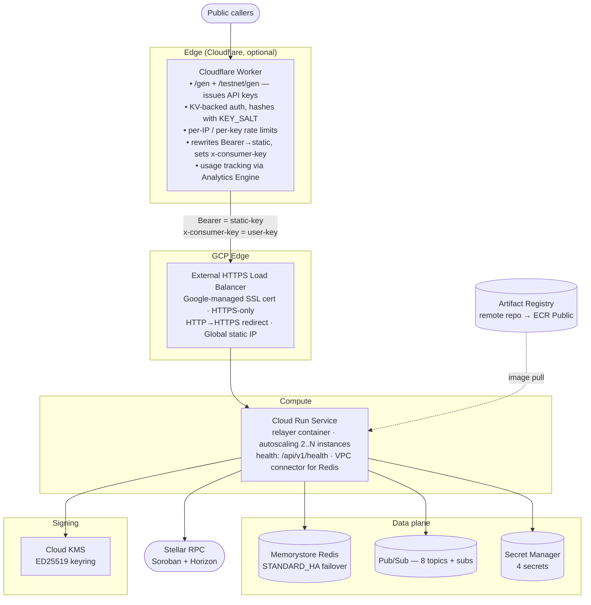
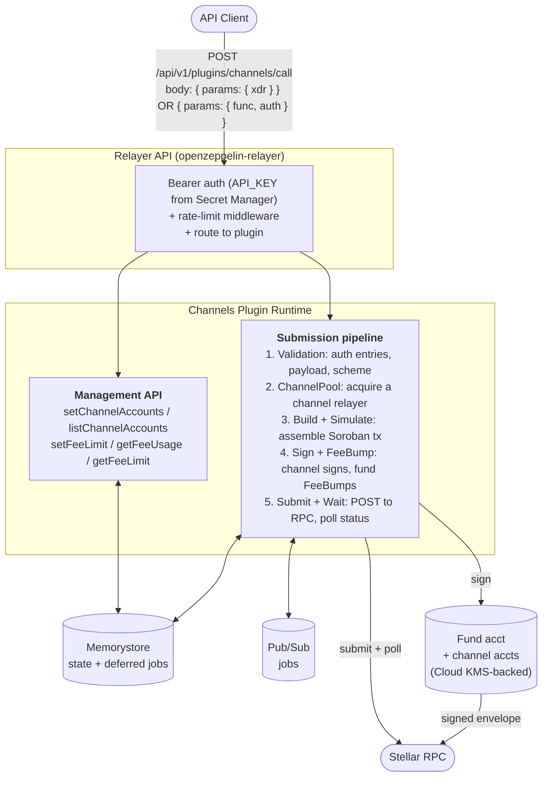
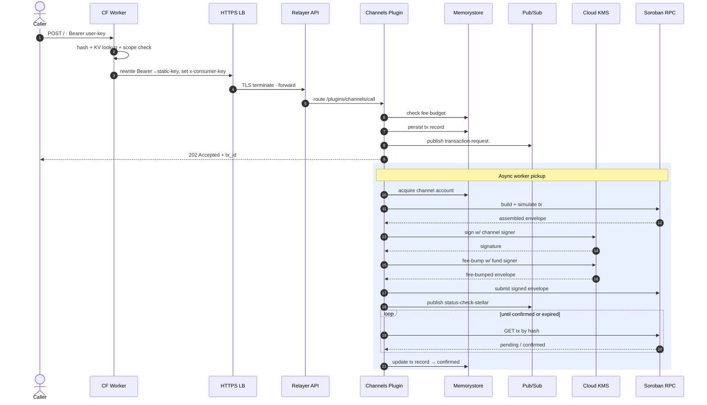
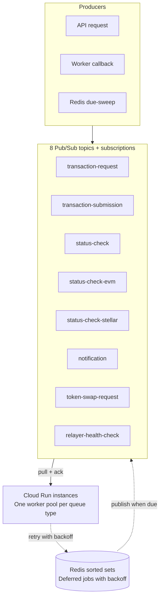

This guide covers deploying and operating the Stellar Relayer Channels service on GCP. The infrastructure runs on Cloud Run backed by Memorystore Redis, Pub/Sub for distributed job processing, and Cloud KMS for transaction signing, with optional Cloudflare Workers for API-key management and per-user rate limiting.

Work through the deployment steps in order; each step produces configuration or keys that later steps depend on. For the AWS deployment, see the [AWS Operator Deployment Guide](/relayer/guides/stellar-relayer-aws-operator-guide).

---

## 1. Architecture

The service connects several GCP-managed components into a single transaction processing pipeline. Understanding this layout helps with capacity planning and narrows the search space when diagnosing failures. Most operational issues map to one specific layer.

### 1.1. Cloud Architecture



| Component | GCP Service | Purpose |
| --- | --- | --- |
| Edge gateway | Cloudflare Worker + KV (optional) | API-key issuance, rate limiting, usage tracking |
| Load balancer | External HTTPS LB + Google-managed cert | TLS termination, health-checked routing |
| Compute | Cloud Run v2 | Runs the relayer container with autoscaling |
| State | Memorystore Redis 7.2 | Transaction records, sequence counters, distributed locks |
| Queue | 8 Pub/Sub topics + subscriptions | Distributed transaction processing |
| Secrets | Secret Manager | API keys, admin secrets, encryption keys |
| Signing | Cloud KMS (EC_SIGN_ED25519) | Transaction signing for fund + channel accounts |
| Image registry | Artifact Registry (remote repo) | Proxies ECR Public image for Cloud Run |
| Networking | VPC + VPC Connector + Private Service Access | Private connectivity to Memorystore |

### 1.2. App Architecture (Channels Plugin Runtime)



### 1.3. Transaction Lifecycle



### 1.4. How Pub/Sub Queues Work

Eight topics with pull subscriptions handle the transaction pipeline. Pub/Sub has no native delayed delivery, so deferred jobs (retries with backoff) sit in Redis sorted sets until due, then get published to the topic. The topic only ever carries ready-to-process jobs; no dead-letter topics needed.



### 1.5. How Channels Works on Stellar

Every Stellar transaction has a source account with a monotonically increasing sequence number. Only one transaction per source account can be in-flight at a time; this is the constraint that caps parallel throughput on Stellar.

The Channels service works around it with a pool of dedicated source accounts (channel accounts). Each in-flight transaction acquires one channel account from the pool, uses its sequence number, and releases it after confirmation. A separate fund account holds the XLM balance. When submitting, the service wraps the channel-signed envelope in a fee-bump transaction, a Stellar primitive that lets a second account pay the network fee. Both accounts are backed by Cloud KMS ED25519 keys.

The pool size you provision in [section 4.10](#410-bootstrap-channels) is your throughput ceiling. See [section 12.1](#121-channel-pool-exhaustion) for the sizing formula.

### 1.6. Resource Sizing

Module defaults work for getting started. Operators are advised to bump them as traffic grows.

| Resource | Module default (prod) | Current GCP deployment |
| --- | --- | --- |
| CPU | 1 vCPU | 4 vCPU |
| Memory | 2 Gi | 8 Gi |
| Min instances | 2 | 3 |
| Max instances | 10 | 20 |
| Redis tier | STANDARD_HA | STANDARD_HA |
| Redis memory | 5 GB | 5 GB |

The module auto-adjusts sizing by environment (`prod` vs everything else):

| Setting | prod | other |
|---------|------|-------|
| Min instances | 2 | 1 |
| Max instances | 10 | 4 |
| CPU always allocated | yes | no |
| Redis tier | STANDARD_HA | BASIC |
| Redis memory | 5 GB | 1 GB |
| LB deletion protection | on | off |
| Log retention | 30 days | 7 days |

---

## 2. Prerequisites

Gather everything in this section before running `terraform apply`. Missing any item will block either the initial deployment or the post-deploy bootstrap steps.

### 2.1. Accounts and Access

- **GCP project** with billing enabled and permission to create Cloud Run services, Memorystore instances, Pub/Sub topics and subscriptions, Secret Manager secrets, Cloud KMS keyrings and keys, Compute Engine load balancers, VPC connectors, Artifact Registry repositories, and IAM role bindings.
- **Service account** for Terraform with these roles: `editor`, `resourcemanager.projectIamAdmin`, `compute.networkAdmin`, `cloudkms.admin`, `pubsub.admin`, `secretmanager.admin`, `run.admin`, `artifactregistry.admin`
- **Domain** with DNS access (Route53, Cloud DNS, or other)
- (Optional) **Cloudflare account** for the `/gen` API-key flow

### 2.2. Tooling

| Tool | Version | Why |
| --- | --- | --- |
| Terraform | 1.5.0 or later | Module language constraints |
| Google provider | 5.0 or later, below 7.0 | Pinned in `versions.tf` |
| Cloudflare provider | ~> 5.0 | Required even when `enable_cloudflare = false` |
| gcloud CLI | recent stable | Auth, Artifact Registry, debugging |
| Node.js 18+ and pnpm 10+ | recent stable | Only if you modify the Channels plugin |

### 2.3. Stellar-Side Prerequisites

- **Soroban RPC access:** at least two independent private providers from different operators recommended for mainnet. The public image ships with the default public RPC; you override it after deployment (see [section 4.7](#47-dns-and-ssl)).
- **XLM** to fund the relayer's Stellar account and bootstrap channel accounts. Budget at least 250 XLM for 200 channel accounts plus the fund account.

### 2.4. Repos You'll Reference

| Repo | What it is |
| --- | --- |
| `OpenZeppelin/relayer-channels-infra` | This repo: Terraform modules + operator CLIs |
| `OpenZeppelin/openzeppelin-relayer` | The relayer application |
| `OpenZeppelin/relayer-plugin-channels` | Channels plugin (TypeScript) |

---

## 3. Environments

Run stg and prod as separate Terraform workspaces with isolated state:

| Env | Network | Working directory | Pub/Sub prefix | VPC connector CIDR |
| --- | --- | --- | --- | --- |
| `stg` | testnet | `examples/gcp/` | `relayer-testnet-stg-` | `10.8.0.0/28` |
| `prod` | mainnet | `examples/gcp-prod/` | `relayer-mainnet-prod-` | `10.9.0.0/28` |

Use different CIDRs if both environments share a VPC. Resource names auto-suffix with `-<environment>` except for `prod`.

---

## 4. Deployment

Work through the steps below in order on a fresh deployment. Each step produces output or configuration that later steps depend on.

### 4.1. Authenticate

```bash
export GOOGLE_APPLICATION_CREDENTIALS="$HOME/path/to/service-account-key.json"
```

If your org blocks `gcloud auth application-default login`, create a service account key in IAM & Admin > Service Accounts > Keys.

### 4.2. Get the Module

Reference it directly from GitHub:

```hcl
module "relayer_channels" {
  source = "git::https://github.com/OpenZeppelin/relayer-channels-infra.git//modules/gcp?ref=main"
  # ...
}
```

Or clone and use the examples:

```bash
git clone https://github.com/OpenZeppelin/relayer-channels-infra.git
cd relayer-channels-infra/examples/gcp       # stg
cd relayer-channels-infra/examples/gcp-prod   # prod
```

### 4.3. Configure the Terraform Backend

In `versions.tf`, configure remote state:

```hcl
terraform {
  backend "gcs" {
    bucket = "your-org-terraform-state"
    prefix = "relayer-channels/prod.tfstate"
  }
}
```

### 4.4. Create Your Tfvars

```bash
cp terraform.tfvars.example terraform.tfvars
```

Minimum config:

```hcl
project_id      = "my-gcp-project"
region          = "us-east1"
environment     = "prod"
network         = "default"
subnetwork      = "default"
domain_name     = "channels.your-company.com"
stellar_network = "mainnet"
queue_backend   = "pubsub"
container_image = "us-east1-docker.pkg.dev/my-project/ecr-public/w5h5k2p1/openzeppelin-relayer-channels:mainnet-latest"

# Secrets — never commit these
relayer_api_key        = ""  # set via TF_VAR_relayer_api_key
channels_admin_secret  = ""  # set via TF_VAR_channels_admin_secret
storage_encryption_key = ""  # set via TF_VAR_storage_encryption_key
```

Generate secrets:

```bash
export TF_VAR_relayer_api_key="$(uuidgen | tr '[:upper:]' '[:lower:]')"
export TF_VAR_channels_admin_secret="$(openssl rand -base64 32)"
export TF_VAR_webhook_signing_key="$(openssl rand -hex 32)"
export TF_VAR_storage_encryption_key="$(openssl rand -base64 32)"   # must be base64, not hex
```

### 4.5. Set Up Artifact Registry

Cloud Run can't pull from ECR Public directly. Set up a remote repo to proxy it:

1. GCP Console > **Artifact Registry** > **Create Repository**
2. Format: **Docker**, Mode: **Remote**, Source: **Custom**, URL: `https://public.ecr.aws`
3. Name it `ecr-public`, pick your region

Then reference it in `container_image` in your tfvars (as shown in [section 4.4](#44-create-your-tfvars)).

Tag scheme: `mainnet-<version>` (pinned, use in prod), `mainnet-latest` (moves), `testnet-<version>`, `testnet-latest`.

<Callout>
The public image ships with `mainnet.sorobanrpc.com` as the default RPC. Override it with private providers after deployment (see [section 4.7](#47-dns-and-ssl)).
</Callout>

### 4.6. Deploy

```bash
terraform init
terraform plan -out plan.tfplan
terraform apply plan.tfplan
```

Takes 10–15 min. Memorystore creation is the slowest part.

Key outputs:

| Output | Used for |
| --- | --- |
| `load_balancer_ip` | DNS record creation |
| `cloud_run_service_name` | Service management |
| `kms_signing_key_id` | Signer creation |
| `artifact_registry_url` | Image pull path |

### 4.7. DNS and SSL

The Google-managed cert needs DNS pointing at the LB IP before it provisions.

**Without Cloudflare:**
1. Create an A record: `channels.your-company.com` → `<load_balancer_ip>`
2. Wait 15–60 min for cert to go ACTIVE

**With Cloudflare:**
1. Create Cloudflare A record → LB IP (proxy OFF, grey cloud)
2. Create Route53 A record → LB IP
3. Wait for cert to go ACTIVE
4. Change Route53 to CNAME → `channels.your-company.com.cdn.cloudflare.net`
5. Turn Cloudflare proxy ON (orange cloud)

<Callout>
If the cert stays `FAILED_NOT_VISIBLE` for 30+ min, bump the cert name suffix in `load-balancer.tf` (e.g. `-cert-v2` → `-cert-v3`) and re-apply. `create_before_destroy` swaps it without downtime.
</Callout>

### 4.8. Override RPC Endpoints

The public image uses the free public Soroban RPC, which rate-limits under load. After the service is healthy, override it with your private providers. This is a **one-time call** (the config persists in Redis).

```bash
curl -s \
  -H "Authorization: Bearer <your-relayer-api-key>" \
  -H "Content-Type: application/json" \
  -X PATCH https://channels.your-company.com/api/v1/networks/stellar:mainnet \
  -d '{
    "rpc_urls": [
      { "url": "https://your-primary-rpc.com/key", "weight": 100 },
      { "url": "https://your-secondary-rpc.com/key", "weight": 100 }
    ]
  }'
```

Verify:

```bash
curl -s -H "Authorization: Bearer <your-relayer-api-key>" \
  "https://channels.your-company.com/api/v1/networks?per_page=200" \
  | jq '.data[] | select(.id=="stellar:mainnet") | .rpc_urls'
```

Use at least two independent providers from different operators. The relayer load-balances by weight and rotates on failure.

<Callout>
You only need to re-run this after a `RESET_STORAGE_ON_START=true` restart, which wipes Redis. Normal restarts preserve it.
</Callout>

### 4.9. Create the Signer

```bash
ENV=mainnet API_KEY="$TF_VAR_relayer_api_key" \
GCP_SA_KEY_FILE="$HOME/path/to/sa-key.json" \
./scripts/gcp-kms-signer.sh
```

Then create the fund relayer via the relayer API:

```bash
curl -s -X POST https://channels.your-company.com/api/v1/relayers \
  -H "Authorization: Bearer $TF_VAR_relayer_api_key" \
  -H "Content-Type: application/json" \
  -d '{
    "id": "channels-fund",
    "name": "channels-fund",
    "network": "mainnet",
    "signer_id": "<signer-id-from-above>",
    "network_type": "stellar",
    "paused": false,
    "policies": { "min_balance": 0, "fee_payment_strategy": "relayer" }
  }'
```

### 4.10. Bootstrap Channels

<Callout>
Size the pool before bootstrapping. Formula: `min_pool = ceil(target_TPS × avg_settlement_seconds × 1.5)`. Stellar settlement averages 5–7 seconds. At 23 TPS sustained that gives 173 channels minimum. Use `--dry-run` to preview before committing.
</Callout>

Install the CLI from `cli/` in this repo:

```bash
cd cli && bun install && bun run build
cd packages/oz-channels && bun link
cd ../oz-relayer && bun link
```

Set up a profile and bootstrap:

```bash
oz-channels profile init prod-mainnet

oz-channels bootstrap --to 200 --dry-run -p prod-mainnet   # preview
oz-channels bootstrap --to 200 -p prod-mainnet             # provision
```

#### 4.10.1. Scaling Beyond ~100 Channels

When scaling the pool aggressively (e.g. 100 → 1000 channels), `oz-channels bootstrap` will start failing with `TRY_AGAIN_LATER` or `tx_bad_seq` errors from Horizon. This happens because every `createAccount` operation uses the fund relayer (`channels-fund`) as the transaction source, serializing all submissions on a single sequence number. Under high concurrency, Horizon rejects the overlapping submissions.

Use `scripts/fund-new-channels.ts` instead, it routes the transaction source through an existing funded channel account (e.g. `channel-0001`) while keeping the fund relayer as the operation source (so the treasury still pays). It also batches up to 100 `createAccount` ops per transaction, so a 100→1000 scale-up fits in ~9 submissions.

```bash
npx tsx scripts/fund-new-channels.ts \
  --env mainnet \
  --api-key <key> \
  --source-relayer channel-0001 \
  --fund-relayer channels-fund \
  --from 101 --to 1000 \
  --starting-balance 2 \
  --report fund-report.json
```

The script is idempotent, it preflights every slot via the relayer API and Horizon, skipping any account already funded onchain. Safe to re-run.

### 4.11. Verify

```bash
curl -sS https://channels.your-company.com/api/v1/health
oz-channels smoke run -p prod-mainnet
```

A healthy service returns `{"status":"ok"}`. The smoke test submits a test transaction end-to-end and polls for confirmation; success prints a confirmed transaction ID. If it times out, check channel pool size and fund account balance before debugging further.

---

## 5. Configuration Reference

Most environment variables are managed by the Terraform module and should not be overridden without a specific reason. The tables below document what the module sets automatically and which values operators should tune for production scale.

### 5.1. Module-Managed Container Environment Variables

The Terraform module sets these. Do not override them unless you have a specific reason.

| Env var | Set to | Source |
| --- | --- | --- |
| `HOST` | `0.0.0.0` | Module |
| `STELLAR_NETWORK` | `var.stellar_network` | Module |
| `FUND_RELAYER_ID` | `var.fund_relayer_id` | Module |
| `API_KEY_HEADER` | `x-consumer-key` | Module |
| `REPOSITORY_STORAGE_TYPE` | `redis` | Module |
| `RESET_STORAGE_ON_START` | `false` | Module |
| `METRICS_ENABLED` | `true` | Module |
| `METRICS_PORT` | `8081` | Module |
| `LOG_FORMAT` | `json` | Module |
| `LOG_LEVEL` | `var.log_level` | Module |
| `REDIS_URL` | `redis://<memorystore-host>:<port>` | Module |
| `REDIS_READER_URL` | `redis://<read-endpoint>:<port>` | Module |
| `GCP_PROJECT_ID` | `var.project_id` | Module |
| `GCP_REGION` | `var.region` | Module |
| `DISTRIBUTED_MODE` | `var.distributed_mode` | Module |
| `QUEUE_BACKEND` | `var.queue_backend` | Module |
| `PUBSUB_TOPIC_PREFIX` | `relayer-{network}-{environment}` | Module |
| `PUBSUB_PROJECT_ID` | `var.project_id` | Module |

### 5.2. Module-Managed Secrets

| Container env var | Secret Manager ID | Required? | Notes |
| --- | --- | --- | --- |
| `API_KEY` | `{app_name}-relayer-api-key` | Yes | Authenticates all API requests |
| `PLUGIN_ADMIN_SECRET` | `{app_name}-channels-admin-secret` | Yes | Required for channel management |
| `WEBHOOK_SIGNING_KEY` | `{app_name}-webhook-signing-key` | Optional | Only set if using webhook notifications |
| `STORAGE_ENCRYPTION_KEY` | `{app_name}-storage-encryption-key` | Optional | Encrypts data at rest in Redis. Strongly recommended for prod. Must be base64-encoded 32 bytes. |

Rotation procedure:

```bash
echo -n "new-value" | gcloud secrets versions add \
  relayer-channels-relayer-api-key --data-file=- \
  --project=your-project

gcloud run services update relayer-channels-service \
  --region=us-east1 --project=your-project \
  --update-labels="redeploy=$(date +%s)"
```

### 5.3. Production Reference Values

If you are targeting OpenZeppelin's reference scale (~2M+ tx/day), these are the env vars to tune:

```hcl
container_environment = [
  { name = "BACKGROUND_WORKER_TRANSACTION_REQUEST_CONCURRENCY",                value = "200" },
  { name = "BACKGROUND_WORKER_TRANSACTION_SENDER_CONCURRENCY",                 value = "200" },
  { name = "BACKGROUND_WORKER_TRANSACTION_STATUS_CHECKER_STELLAR_CONCURRENCY", value = "300" },
  { name = "BACKGROUND_WORKER_TRANSACTION_STATUS_CHECKER_CONCURRENCY",         value = "1" },
  { name = "BACKGROUND_WORKER_TRANSACTION_STATUS_CHECKER_EVM_CONCURRENCY",     value = "1" },
  { name = "BACKGROUND_WORKER_NOTIFICATION_SENDER_CONCURRENCY",                value = "1" },
  { name = "BACKGROUND_WORKER_SOLANA_TOKEN_SWAP_REQUEST_CONCURRENCY",          value = "1" },
  { name = "BACKGROUND_WORKER_RELAYER_HEALTH_CHECK_CONCURRENCY",               value = "1" },
  { name = "RELAYER_CONCURRENCY_LIMIT",       value = "800" },
  { name = "PLUGIN_MAX_CONCURRENCY",          value = "8000" },
  { name = "MAX_CONNECTIONS",                  value = "4000" },
  { name = "REQUEST_TIMEOUT_SECONDS",          value = "60" },
  { name = "PLUGIN_POOL_REQUEST_TIMEOUT_SECS", value = "60" },
  { name = "PLUGIN_GLOBAL_TIMEOUT_MS",         value = "55000" },
  { name = "PLUGIN_POLLING_TIMEOUT_MS",        value = "45000" },
  { name = "RATE_LIMIT_REQUESTS_PER_SECOND",   value = "400" },
  { name = "REDIS_POOL_MAX_SIZE",              value = "3000" },
  { name = "REDIS_READER_POOL_MAX_SIZE",       value = "3000" },
  { name = "TRANSACTION_EXPIRATION_HOURS",     value = "0.1" },
  { name = "LIMITED_CONTRACTS",               value = "C<contract1>,C<contract2>" },
  { name = "CONTRACT_CAPACITY_RATIO",          value = "0.6" },
]
```

---

## 6. Cloudflare (Optional)

When enabled, a Cloudflare Worker handles API-key issuance (`/gen`), per-key rate limiting, and proxies requests to the LB with static-key injection.

```hcl
enable_cloudflare      = true
cloudflare_api_token   = "your-token"
cloudflare_zone_id     = "your-zone-id"
cloudflare_account_id  = "your-account-id"
relayer_static_api_key = "same-as-your-relayer_api_key"
key_salt               = "<openssl rand -base64 32>"
cf_analytics_api_token = "your-token"
```

`relayer_static_api_key` should match your `relayer_api_key`; the Worker swaps every user's Bearer token for this key upstream. `key_salt` is used to hash user keys before storing in KV.

### 6.1. Without Cloudflare

The `/gen` endpoint is not available; there's no self-service API-key generation. Callers authenticate directly with the `relayer_api_key` you configured. If you need per-user keys or rate limiting without Cloudflare, build that into your own API gateway layer in front of the load balancer.

---

## 7. Operations

Routine operations follow the same `terraform apply` workflow as the initial deployment. Stellar-specific operations (managing the channel pool, inspecting transactions) use the CLIs in `cli/`.

### 7.1. Deploys

To deploy a new version, update `container_image` in your tfvars and run `terraform apply`. Cloud Run creates a new revision and shifts traffic over automatically with no downtime.

### 7.2. Rollbacks

To roll back, set `container_image` to the previous version tag in your tfvars and run `terraform apply`.

### 7.3. Scaling

```hcl
cpu                = "4"
memory             = "8Gi"
min_instance_count = 3
max_instance_count = 20
```

Run `terraform apply` to pick up the new limits. Cloud Run handles the transition without downtime.

### 7.4. Channel Pool

```bash
oz-channels bootstrap --from 201 --to 400 -p prod-mainnet   # grow the pool
oz-channels channels list -p prod-mainnet
oz-channels channels add channel-0050 -p prod-mainnet
oz-channels channels remove channel-0050 -p prod-mainnet
```

### 7.5. Transactions

```bash
oz-relayer tx show <tx-id> -r channels-fund -p prod-mainnet --json
oz-relayer tx list -r channels-fund --status pending -p prod-mainnet
oz-relayer relayer balance channels-fund -p prod-mainnet
```

---

## 8. Observability

The service emits structured JSON logs to Cloud Logging, Cloud Run request metrics, and Pub/Sub queue metrics. Set up the log-based metrics and alerting policies below before putting the service under production load.

### 8.1. Logs

Cloud Run streams structured JSON logs to Cloud Logging.

```bash
# Errors in the last hour
gcloud logging read 'resource.type="cloud_run_revision" AND resource.labels.service_name="relayer-channels-service" AND severity>=ERROR' \
  --project=your-project --limit=20 --freshness=1h --format='value(textPayload)'

# Filter by tx ID
gcloud logging read 'resource.type="cloud_run_revision" AND textPayload:"<tx-id>"' \
  --project=your-project --limit=20 --freshness=1h

# Live tail
gcloud logging tail 'resource.type="cloud_run_revision" AND resource.labels.service_name="relayer-channels-service"' \
  --project=your-project
```

### 8.2. Cloud Run Metrics

Console > Cloud Run > Service > Metrics:

| Metric | Signal |
| --- | --- |
| `container/cpu/utilization` | >80% sustained → scale up |
| `container/memory/utilization` | >70% → risk of OOM |
| `request_count` by status | 5xx spikes |
| `request_latencies` | p95/p99 degradation |
| `container/instance_count` | autoscaling behavior |

### 8.3. Pub/Sub Metrics

Console > Pub/Sub > Subscription > Metrics:

| Metric | Signal |
| --- | --- |
| `num_undelivered_messages` | growing backlog → falling behind |
| `oldest_unacked_message_age` | >60s → workers stuck |
| `pull_message_operation_count` | confirms workers are active |

### 8.4. Memorystore Metrics

Console > Memorystore > Instance > Monitoring:

| Metric | Signal |
| --- | --- |
| CPU utilization | >75% sustained |
| Memory usage ratio | >70% |
| Connected clients | near limit |

### 8.5. Log-Based Metrics

Create in Cloud Logging > Log-based Metrics > Create Metric:

| Metric name | Filter | Purpose |
| --- | --- | --- |
| `relayer/errors` | `severity>=ERROR` | Total error rate |
| `relayer/pool_capacity` | `textPayload:"POOL_CAPACITY"` | Pool exhaustion events |
| `relayer/provider_paused` | `textPayload:"provider paused"` | RPC failover events |

### 8.6. Alerting

Key alert policies to set up in Cloud Monitoring > Alerting:

| Alert | Condition | Severity |
| --- | --- | --- |
| High error rate | >50 errors in 5 min | Critical |
| Cloud Run high CPU | >80% for 10 min | Warning |
| Cloud Run high memory | >70% for 10 min | Warning |
| Pub/Sub backlog | >5000 messages for 10 min | Warning |
| Pub/Sub old messages | >300s for 5 min | Critical |
| Pool exhaustion | `POOL_CAPACITY` log > 0 in 5 min | Critical |

### 8.7. Prometheus

The relayer exposes metrics at `:8081/debug/metrics/scrape`. Scrape with Google Cloud Managed Prometheus or your own Prometheus instance.

### 8.8. Stellar-Side Monitoring

GCP metrics reflect service health. These check the Stellar network side; monitor both.

**Fund account balance:**

```bash
oz-relayer relayer balance channels-fund -p prod-mainnet
```

Alert when balance drops below 50 XLM. A depleted fund account fails all fee-bumps silently.

**Ledger close time:** Stellar closes a ledger roughly every 5 seconds normally. Sustained close times above 10 seconds indicate network stress and inflate settlement latency beyond your pool sizing assumptions.

```bash
curl -sS "https://horizon.stellar.org/ledgers?order=desc&limit=5" | jq '._embedded.records[] | {sequence, closed_at}'
```

**`TRY_AGAIN_LATER` in logs:** Horizon is rejecting transactions due to fee competition. Raise `MAX_FEE` (see [section 12.7](#127-fee-bump-tuning-under-congestion)). If it appears alongside `provider paused`, check RPC provider health first.

**RPC provider health:**

```bash
curl -sS -X POST <your-rpc-url> \
  -H 'Content-Type: application/json' \
  -d '{"jsonrpc":"2.0","id":1,"method":"getHealth"}' | jq .
```

---

## 9. Debugging

Almost every failure belongs to a specific layer. Identify the layer first, then pull the logs for that component.

A request that never returns a `tx_id` failed in the synchronous path (edge, LB, auth, fee budget, enqueue). A request that returned a `tx_id` but never confirmed failed in the async path (channel acquisition, build/simulate, sign, fee-bump, submit, status poll). Match the symptom to the layer, then pull the logs for that component.

Pool exhaustion, sequence drift, and an RPC throttle all look like "transactions are failing" from the outside; each lives in a different layer and has a different fix.

| You have | Do this |
| --- | --- |
| Transaction ID | `oz-relayer tx show <tx-id> -r channels-fund --json -p <env>` |
| Error message | Search Cloud Logging: `textPayload:"<error>"` |
| "What's broken right now" | `gcloud logging read ... AND severity>=ERROR` |
| Stellar tx hash | Check Horizon, then find the relayer tx record |

Common log patterns:

| Pattern | Means |
| --- | --- |
| `provider paused` | RPC failover kicked in |
| `POOL_CAPACITY` | Channel pool exhausted; bootstrap more |
| `LOCKED_CONFLICT` | Two workers grabbed the same channel |
| `TRY_AGAIN_LATER` | Horizon throttling |

### 9.1. Redis Inspection

Connect from a VM in the same VPC:

```bash
redis-cli -h <redis_host> -p 6379
KEYS *tx:*
GET "oz-relayer:relayer:channels-fund:tx:<tx-id>"
```

---

## 10. Security

This section documents the security posture of the deployed infrastructure. Review it before go-live and consult it when rotating credentials or adjusting network ingress rules.

### 10.1. Secrets

All secrets are stored in Secret Manager, passed as env vars to Cloud Run. See Known Issues for the plan to switch to `secret_key_ref` references.

### 10.2. Network Isolation

- **Cloud Run ingress:** `INGRESS_TRAFFIC_INTERNAL_LOAD_BALANCER` in prod; `INGRESS_TRAFFIC_ALL` for testing.
- **Cloud Run egress:** VPC Connector with `PRIVATE_RANGES_ONLY`. Private traffic goes through the VPC (to Memorystore); public traffic (Stellar RPC, KMS API) goes direct.
- **Memorystore:** Private Service Access only, no public IP.
- **Pub/Sub:** IAM-scoped per topic/subscription.

### 10.3. IAM

The Cloud Run SA (`{app_name}-run`) gets:

| Role | Scope |
| --- | --- |
| `secretmanager.secretAccessor` | per-secret |
| `monitoring.metricWriter` | project |
| `logging.logWriter` | project |
| `monitoring.viewer` | project |
| `cloudkms.signerVerifier` | per-key |
| `cloudkms.publicKeyViewer` | per-key |
| `pubsub.publisher` | per-topic |
| `pubsub.subscriber` | per-subscription |
| `artifactregistry.reader` | per-repo |

### 10.4. TLS

- **Load balancer:** Google-managed SSL cert, HTTPS on 443, HTTP redirects to HTTPS.
- **Memorystore:** transit encryption is disabled (see Known Issues). Private Service Access provides network-level isolation.
- **Cloudflare to LB:** set the Cloudflare zone SSL mode to "Full" for end-to-end TLS.

### 10.5. Cloud KMS

`EC_SIGN_ED25519`, SOFTWARE protection. Rotation: provision a new key, register a new signer and relayer, fund the new onchain account, drain the old one, retire it.

---

## 11. Post-Restart Checklist

If you ever restart with `RESET_STORAGE_ON_START=true` (which wipes Redis), you need to redo the following (the service will be up but non-functional until these are done):

1. **Re-create the signer:** `./scripts/gcp-kms-signer.sh` ([section 4.9](#49-create-the-signer))
2. **Re-create the fund relayer:** via the relayer API using the new signer ID
3. **Re-run the RPC override:** the PATCH to `/api/v1/networks/stellar:mainnet` ([section 4.8](#48-override-rpc-endpoints))
4. **Re-bootstrap channels:** `oz-channels bootstrap --to <N> -p <env>` ([section 4.10](#410-bootstrap-channels))
5. **Fund the fund relayer:** if the onchain account was recreated, send XLM to the new address

Normal restarts and redeployments (without `RESET_STORAGE_ON_START=true`) preserve everything in Redis; none of the above is needed.

---

## 12. Gotchas

Common deployment and operational pitfalls, with fixes. Check here first when something does not behave as expected.

### 12.1. Channel Pool Exhaustion

`min_pool = ceil(TPS × settlement_seconds × 1.5)`. At 23 TPS with 5s settlement: 173 channels minimum. Fix: `oz-channels bootstrap --from <next> --to <new-total>`.

### 12.2. SSL Cert Provisioning

Google needs DNS pointing at the LB IP before it issues the cert. With Cloudflare, turn proxy off first, wait for ACTIVE, then proxy back on. If the cert stays `FAILED_NOT_VISIBLE` for 30+ min, bump the cert name suffix in `load-balancer.tf` and re-apply (`create_before_destroy` swaps it without downtime).

### 12.3. VPC Connector CIDR Overlap

Each environment in the same VPC needs a different `/28` CIDR range (e.g. `10.8.0.0/28` for stg, `10.9.0.0/28` for prod).

### 12.4. Private Service Access Shared Connection

A VPC can hold only one Private Service Access connection to `servicenetworking.googleapis.com`. If stg creates it first, prod's apply will fail unless `update_on_creation_fail = true` is set on the connection resource. The module handles this.

### 12.5. Pub/Sub Topic Prefix

`PUBSUB_TOPIC_PREFIX` must match what the image expects. Double-dash errors (`relayer-mainnet-prod--`) mean the prefix has a trailing dash the image doesn't expect. Adjust via `container_environment` if needed.

### 12.6. Encryption Key Format

`storage_encryption_key` must be base64-encoded 32 bytes (`openssl rand -base64 32`). Hex keys fail silently with "Invalid key length: expected 32 bytes, got 0".

### 12.7. Fee-Bump Tuning Under Congestion

`MAX_FEE` defaults to 1M stroops (0.1 XLM). Raise to 10M during network congestion. The plugin uses static fees with no automatic bumping on `INSUFFICIENT_FEE`.

---

## 13. Variables

Full variable reference for the Terraform module. Required variables must be set in your tfvars file; optional variables have defaults that the module adjusts automatically based on the environment value.

### 13.1. Required

| Name | Type | Description |
|------|------|-------------|
| `project_id` | `string` | GCP project ID |
| `region` | `string` | GCP region |
| `environment` | `string` | `prod`, `stg`, etc. (1–16 chars) |
| `network` | `string` | VPC network name or self_link |
| `subnetwork` | `string` | Subnet name or self_link |
| `domain_name` | `string` | FQDN for the service |
| `container_image` | `string` | Container image URI |
| `relayer_api_key` | `string` | Relayer API key (sensitive) |
| `channels_admin_secret` | `string` | Admin secret (sensitive) |

### 13.2. Optional: Core

| Name | Type | Default | Description |
|------|------|---------|-------------|
| `app_name` | `string` | `"relayer-channels"` | Resource name prefix |
| `name_suffix_environment` | `bool` | `true` | Append `-{env}` to names (auto-off for prod) |
| `labels` | `map(string)` | `{}` | Labels for all resources |

### 13.3. Optional: Networking

| Name | Type | Default | Description |
|------|------|---------|-------------|
| `connector_machine_type` | `string` | `"e2-micro"` | VPC connector machine type |
| `connector_min_instances` | `number` | `2` | Min connector instances |
| `connector_max_instances` | `number` | `3` | Max connector instances |
| `connector_ip_cidr_range` | `string` | `"10.8.0.0/28"` | CIDR for the VPC connector (/28, must not overlap) |

### 13.4. Optional: Container / Cloud Run

| Name | Type | Default | Description |
|------|------|---------|-------------|
| `container_port` | `number` | `8080` | Listen port |
| `cpu` | `string` | `"1"` | CPU (`"1"`, `"2"`, `"4"`) |
| `memory` | `string` | `"2Gi"` | Memory |
| `min_instance_count` | `number` | `null` | Auto: 2 prod, 1 other |
| `max_instance_count` | `number` | `null` | Auto: 10 prod, 4 other |
| `cpu_always_allocated` | `bool` | `null` | Auto: true prod |
| `health_check_path` | `string` | `"/api/v1/health"` | Probe path |
| `container_environment` | `list(object)` | `[]` | Additional env vars (user overrides win) |

### 13.5. Optional: Application

| Name | Type | Default | Description |
|------|------|---------|-------------|
| `stellar_network` | `string` | `"testnet"` | `mainnet` or `testnet` |
| `fund_relayer_id` | `string` | `"channels-fund"` | Fund relayer ID |
| `distributed_mode` | `bool` | `true` | Enable distributed queue processing |
| `queue_backend` | `string` | `"pubsub"` | `pubsub` (recommended) or `redis` |
| `log_level` | `string` | `"warn"` | App log level |

### 13.6. Optional: Secrets

| Name | Type | Default | Description |
|------|------|---------|-------------|
| `webhook_signing_key` | `string` | `""` | Only set if using webhooks |
| `storage_encryption_key` | `string` | `""` | Base64-encoded 32 bytes. Recommended for prod. |

### 13.7. Optional: Redis

| Name | Type | Default | Description |
|------|------|---------|-------------|
| `redis_tier` | `string` | `null` | `BASIC` or `STANDARD_HA` (auto per env) |
| `redis_memory_size_gb` | `number` | `null` | Auto: 5 prod, 1 other |
| `redis_version` | `string` | `"REDIS_7_2"` | Redis version |

### 13.8. Optional: Cloudflare

| Name | Type | Default | Description |
|------|------|---------|-------------|
| `enable_cloudflare` | `bool` | `false` | Enable Workers gateway |
| `cloudflare_zone_id` | `string` | `""` | Required when Cloudflare is enabled |
| `cloudflare_account_id` | `string` | `""` | Required when Cloudflare is enabled |
| `relayer_static_api_key` | `string` | `""` | Static key injected by the Worker (sensitive) |
| `key_salt` | `string` | `""` | Salt for hashing user keys in KV (sensitive) |
| `gen_ip_rate_hour` | `number` | `2` | Max `/gen` per IP per hour |
| `relay_rpm_per_key` | `number` | `60` | Max relay RPM per key |

### 13.9. Optional: Load Balancer

| Name | Type | Default | Description |
|------|------|---------|-------------|
| `lb_deletion_protection` | `bool` | `null` | Auto: true prod |
| `lb_log_sample_rate` | `number` | `0` | Request log sampling (0 disables) |

See `variables.tf` for the full list including Cloud Functions and additional networking options.

---

## 14. Outputs

The module exposes these outputs for use in downstream Terraform modules or post-deployment scripts.

| Name | Description |
|------|-------------|
| `cloud_run_service_name` / `cloud_run_service_uri` | Service name and URL |
| `load_balancer_ip` | Static IP for DNS |
| `redis_host` / `redis_port` / `redis_read_endpoint` | Memorystore connection |
| `pubsub_topics` / `pubsub_subscriptions` | Queue resource names |
| `kms_key_ring_name` / `kms_signing_key_name` / `kms_signing_key_id` | Cloud KMS key info |
| `artifact_registry_repository` / `artifact_registry_url` | Artifact Registry info |
| `secret_ids` | Secret Manager IDs |
| `cloudflare_worker_name` | Worker name (null if disabled) |

---

## 15. Known Issues

**Redis TLS disabled:** the relayer binary doesn't support TLS for Redis connections. Memorystore is only reachable via Private Service Access (VPC peering), so traffic stays within Google's network.

**Secrets as plain env vars:** secrets are passed as Cloud Run env vars rather than Secret Manager `secret_key_ref` references. This is a workaround for a deployment issue. Plan to switch to proper secret references.
