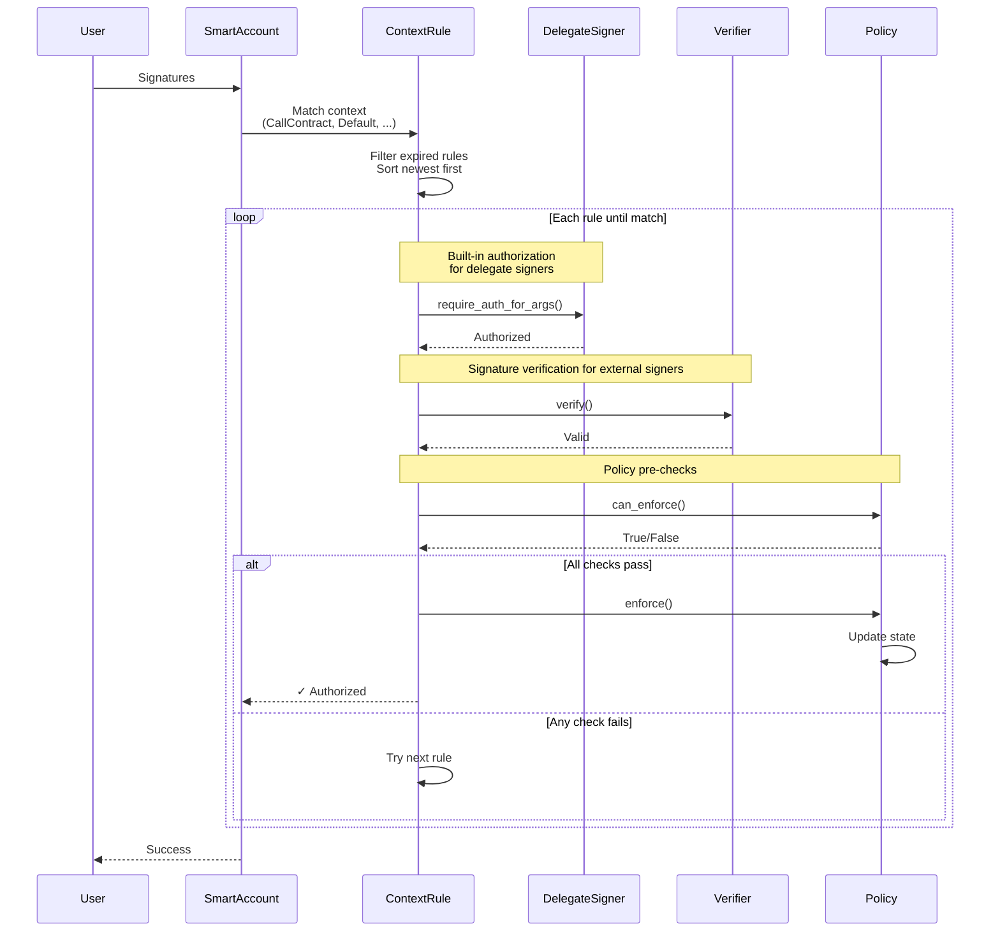

Authorization in smart accounts is determined by matching the current context against the account's context rules. Rules are gathered, ordered by recency, and evaluated until one satisfies the requirements. If a matching rule is found, its policies (if any) are enforced. Otherwise, authorization fails.

## Detailed Flow


### 1. Rule Collection

The smart account gathers all relevant context rules for evaluation:

- Retrieve all non-expired rules for the specific context type
- Include default rules that apply to any context
- Sort specific and default rules by creation time (newest first)

**Context Type Matching:**
- For a `CallContract(address)` context, both specific `CallContract(address)` rules and `Default` rules are collected
- For a `CreateContract(wasm_hash)` context, both specific `CreateContract(wasm_hash)` rules and `Default` rules are collected
- For any other context, only `Default` rules are collected

**Expiration Filtering:**
Rules with `valid_until` set to a ledger sequence that has passed are automatically filtered out during collection.

### 2. Rule Evaluation

For each rule in order (newest and most specific first):

#### Step 2.1: Signer Filtering

Extract authenticated signers from the rule's signer list. A signer is considered authenticated if:

- **Delegated Signer**: The address has authorized the operation via `require_auth_for_args(payload)`
- **External Signer**: The verifier contract confirms the signature is valid for the public key

Only authenticated signers proceed to the next step.

#### Step 2.2: Policy Validation

If the rule has attached policies, verify that all can be enforced:

```rust
for policy in rule.policies {
    if !policy.can_enforce(e, account, rule_id, signers, auth_context) {
        // This rule fails, try the next rule
    }
}
```

If any policy's `can_enforce()` returns false, the rule fails and evaluation moves to the next rule.

#### Step 2.3: Authorization Check

The authorization check depends on whether policies are present:

**With Policies:**
- Success if all policies passed `can_enforce()`
- The presence of authenticated signers is verified during policy evaluation

**Without Policies:**
- Success if all signers in the rule are authenticated
- At least one signer must be authenticated for the rule to match

#### Step 2.4: Rule Precedence

The first matching rule wins. Newer rules take precedence over older rules for the same context type. This allows overwriting old rules.

### 3. Policy Enforcement

If authorization succeeds, the smart account calls `enforce()` on all matched policies in order:

```rust
for policy in matched_rule.policies {
    policy.enforce(e, account, rule_id, signers, auth_context);
}
```

This triggers any necessary state changes such as updating spending counters, recording timestamps, emitting audit events, or modifying allowances.

Policy enforcement requires the smart account's authorization, ensuring that policies can only be enforced by the account itself.

### 4. Result

**Success:** Authorization is granted and the transaction proceeds. All policy state changes are committed.

**Failure:** Authorization is denied and the transaction reverts. No state changes are committed.

## Examples

### Specific Context with Policy

**Configuration:**
```rust
// DEX-specific rule with session key and spending limit
ContextRule {
    id: 2,
    context_type: CallContract(dex_address),
    valid_until: Some(current_ledger + 24_hours),
    signers: [passkey],
    policies: [spending_limit_policy]
}

// Default admin rule
ContextRule {
    id: 1,
    context_type: Default,
    signers: [ed25519_alice, ed25519_bob],
    policies: []
}
```

**Call Context:** `CallContract(dex_address)`

**Authorization Entries:** `[passkey_signature]`

**Flow:**
1. Collect: Rules 2 (specific) and 1 (default)
2. Evaluate Rule 2:
   - Signer filtering: Passkey authenticated
   - Policy validation: Spending limit check passes
   - Authorization check: All policies enforceable → Success
3. Enforce: Update spending counters, emit events
4. Result: Authorized

If the spending limit had been exceeded, Rule 2 would fail and evaluation would continue to Rule 1 (which would also fail since the passkey doesn't match Alice or Bob).

### Fallback to Default

**Configuration:**
```rust
// Session rule (expired)
ContextRule {
    id: 2,
    context_type: CallContract(dex_address),
    valid_until: Some(current_ledger - 100), // Expired
    signers: [session_key],
    policies: [spending_limit_policy]
}

// Default admin rule
ContextRule {
    id: 1,
    context_type: Default,
    signers: [ed25519_alice, ed25519_bob],
    policies: []
}
```

**Call Context:** `CallContract(dex_address)`

**Authorization Entries:** `[ed25519_alice_signature, ed25519_bob_signature]`

**Flow:**
1. Collect: Rule 2 filtered out (expired), only Rule 1 collected
2. Evaluate Rule 1: Both Alice and Bob authenticated → Success
3. Enforce: No policies to enforce
4. Result: Authorized

The expired session rule is automatically filtered out, and authorization falls back to the default admin rule.

### Authorization Failure

**Configuration:**
```rust
// Default rule requiring 2-of-3 threshold
ContextRule {
    id: 1,
    context_type: Default,
    signers: [alice, bob, carol],
    policies: [threshold_policy(2)]
}
```

**Call Context:** `CallContract(any_address)`

**Authorization Entries:** `[alice_signature]`

**Flow:**
1. Collect: Default rule retrieved
2. Evaluate:
   - Signer filtering: Only Alice authenticated
   - Policy validation: Threshold policy requires 2 signers, only 1 present → Fail
3. No more rules to evaluate
4. Result: Denied (transaction reverts)

## Performance Considerations

Protocol 23 optimizations make the authorization flow efficient:
- **Marginal storage read costs**: Reading multiple context rules has negligible cost
- **Cheaper cross-contract calls**: Calling verifiers and policies is substantially cheaper

The framework enforces limits to maintain predictability:
- Maximum context rules per smart account: 15
- Maximum signers per context rule: 15
- Maximum policies per context rule: 5

## See Also

- [Smart Account](/stellar-contracts/accounts/smart-account)
- [Context Rules](/stellar-contracts/accounts/context-rules)
- [Signers and Verifiers](/stellar-contracts/accounts/signers-and-verifiers)
- [Policies](/stellar-contracts/accounts/policies)
