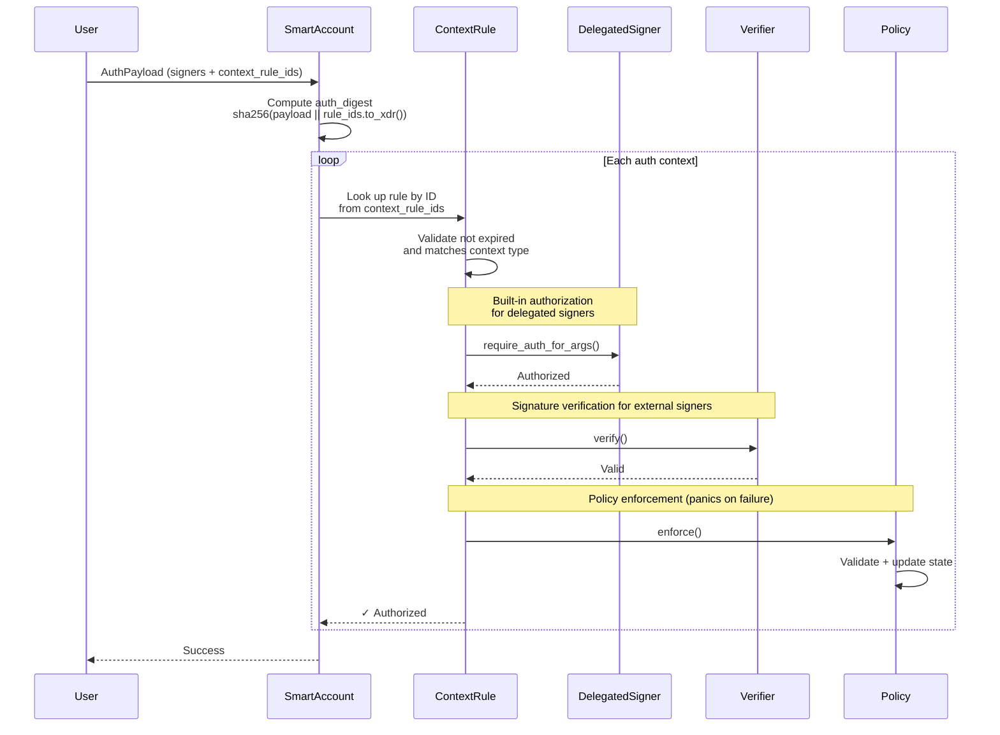

Authorization in smart accounts is determined by matching each auth context against explicitly selected context rules. The off-chain client specifies which rule to use for each operation via `context_rule_ids` in the `AuthPayload`. The selected rule is validated, its signers authenticated, and its policies enforced. If any step fails, authorization is denied.

## Detailed Flow

```mermaid
sequenceDiagram
    participant User
    participant SmartAccount
    participant ContextRule
    participant DelegatedSigner
    participant Verifier
    participant Policy

    User->>SmartAccount: AuthPayload (signers + context_rule_ids)
    SmartAccount->>SmartAccount: Compute auth_digest<br/>sha256(payload || rule_ids.to_xdr())

    loop Each auth context
        SmartAccount->>ContextRule: Look up rule by ID<br/>from context_rule_ids
        ContextRule->>ContextRule: Validate not expired<br/>and matches context type

        Note over ContextRule,DelegatedSigner: Built-in authorization <br/>for delegated signers
        ContextRule->>DelegatedSigner: require_auth_for_args()
        DelegatedSigner-->>ContextRule: Authorized

        Note over ContextRule,Verifier: Signature verification for external signers
        ContextRule->>Verifier: verify()
        Verifier-->>ContextRule: Valid

        Note over ContextRule,Policy: Policy enforcement (panics on failure)
        ContextRule->>Policy: enforce()
        Policy->>Policy: Validate + update state

        ContextRule-->>SmartAccount: ✓ Authorized
    end

    SmartAccount-->>User: Success
```

### 1. Rule Lookup

The smart account reads the `context_rule_ids` from the `AuthPayload`. There must be exactly one rule ID per auth context — a mismatch is rejected with `ContextRuleIdsLengthMismatch`.

For each auth context, the corresponding rule ID is used to look up the context rule directly. The rule must:

- Exist in the account's storage
- Not be expired (if `valid_until` is set, it must be ≥ current ledger sequence)
- Match the context type: a `CallContract(address)` rule matches a `CallContract(address)` context, and `Default` rules match any context

### 2. Rule Evaluation

For each rule in order (newest and most specific first):

#### Step 2.1: Signer Filtering

Extract authenticated signers from the rule's signer list. A signer is considered authenticated if:

- **Delegated Signer**: The address has authorized the operation via `require_auth_for_args(payload)`
- **External Signer**: The verifier contract confirms the signature is valid for the public key

Only authenticated signers proceed to the next step.

#### Step 2.2: Policy Enforcement

If the rule has attached policies, the smart account calls `enforce()` on each policy. The `enforce()` method both validates conditions and applies state changes — it panics if the policy conditions are not satisfied:

```rust
for policy in rule.policies {
    policy.enforce(e, context, authenticated_signers, context_rule, smart_account);
    // Panics if policy conditions aren't satisfied, causing the rule to fail
}
```

If any policy panics, authorization fails for that context.

Policy enforcement requires the smart account's authorization, ensuring that policies can only be enforced by the account itself.

#### Step 2.3: Authorization Check

The authorization check depends on whether policies are present:

**With Policies:**
- Success if all policies' `enforce()` calls completed without panicking

**Without Policies:**
- Success if all signers in the rule are authenticated
- At least one signer must be authenticated for the rule to match

### 3. Result

**Success:** Authorization is granted and the transaction proceeds. All policy state changes are committed.

**Failure:** Authorization is denied and the transaction reverts. No state changes are committed.

## Examples

### Specific Context with Policy

**Configuration:**
```rust
// DEX-specific rule with session key and spending limit
ContextRule {
    id: 2,
    context_type: CallContract(dex_address),
    valid_until: Some(current_ledger + 24_hours),
    signers: [passkey],
    policies: [spending_limit_policy]
}

// Default admin rule
ContextRule {
    id: 1,
    context_type: Default,
    signers: [ed25519_alice, ed25519_bob],
    policies: []
}
```

**Call Context:** `CallContract(dex_address)`

**Authorization Entries:** `[passkey_signature]`

**Flow:**
1. Lookup: Client specifies rule ID 2 in `context_rule_ids`
2. Evaluate Rule 2:
   - Rule matches `CallContract(dex_address)` context and is not expired
   - Signer filtering: Passkey authenticated
   - Policy enforcement: Spending limit validates and updates counters
   - Authorization check: All policies enforced successfully → Success
3. Result: Authorized

If the spending limit had been exceeded, Rule 2 would fail and evaluation would continue to Rule 1 (which would also fail since the passkey doesn't match Alice or Bob).

### Fallback to Default

**Configuration:**
```rust
// Session rule (expired)
ContextRule {
    id: 2,
    context_type: CallContract(dex_address),
    valid_until: Some(current_ledger - 100), // Expired
    signers: [session_key],
    policies: [spending_limit_policy]
}

// Default admin rule
ContextRule {
    id: 1,
    context_type: Default,
    signers: [ed25519_alice, ed25519_bob],
    policies: []
}
```

**Call Context:** `CallContract(dex_address)`

**Authorization Entries:** `[ed25519_alice_signature, ed25519_bob_signature]`

**Flow:**
1. Lookup: Client specifies rule ID 1 in `context_rule_ids` (rule 2 is known to be expired)
2. Evaluate Rule 1: Both Alice and Bob authenticated, no policies to enforce → Success
3. Result: Authorized

The client ignores the expired session rule and explicitly selects the default admin rule (ID 1) in `context_rule_ids`.

### Authorization Failure

**Configuration:**
```rust
// Default rule requiring 2-of-3 threshold
ContextRule {
    id: 1,
    context_type: Default,
    signers: [alice, bob, carol],
    policies: [threshold_policy(2)]
}
```

**Call Context:** `CallContract(any_address)`

**Authorization Entries:** `[alice_signature]`

**Flow:**
1. Lookup: Client specifies default rule ID in `context_rule_ids`
2. Evaluate:
   - Signer filtering: Only Alice authenticated
   - Policy enforcement: Threshold policy requires 2 signers, only 1 present → Panics
3. Result: Denied (transaction reverts)

## Performance Considerations

Protocol 23 optimizations make the authorization flow efficient:
- **Marginal storage read costs**: Reading multiple context rules has negligible cost
- **Cheaper cross-contract calls**: Calling verifiers and policies is substantially cheaper

The framework enforces limits to maintain predictability:
- Maximum context rules per smart account: 15
- Maximum signers per context rule: 15
- Maximum policies per context rule: 5

## See Also

- [Smart Account](/stellar-contracts/accounts/smart-account)
- [Context Rules](/stellar-contracts/accounts/context-rules)
- [Signers and Verifiers](/stellar-contracts/accounts/signers-and-verifiers)
- [Policies](/stellar-contracts/accounts/policies)
