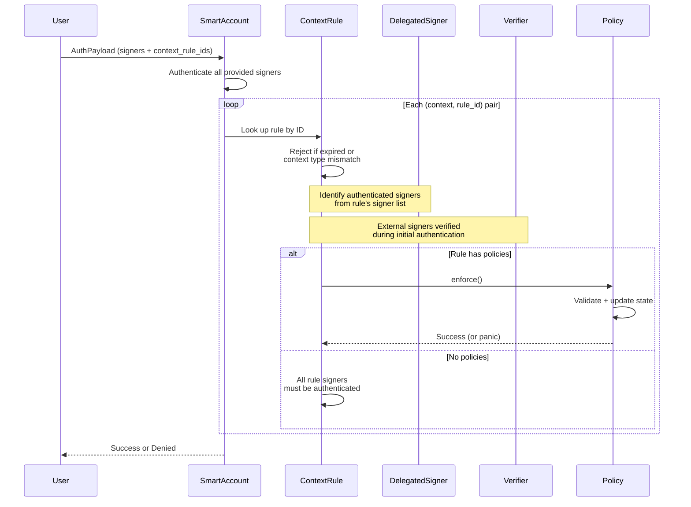

Authorization in smart accounts is determined by matching the current context against explicitly selected context rules. The caller supplies `context_rule_ids` in the `AuthPayload`, specifying exactly one rule per auth context. If the selected rule passes all checks, its policies (if any) are enforced. Otherwise, authorization fails.

## AuthPayload

The `AuthPayload` structure is passed as the signature data in `__check_auth`:

```rust
#[contracttype]
pub struct AuthPayload {
    /// Signature data mapped to each signer.
    pub signers: Map<Signer, Bytes>,
    /// Per-context rule IDs, aligned by index with `auth_contexts`.
    pub context_rule_ids: Vec<u32>,
}
```

Each entry in `context_rule_ids` specifies the rule ID to validate against for the corresponding auth context (by index). Its length must equal `auth_contexts.len()`.

<Callout type="warning">
The `context_rule_ids` are bound into the signed digest: `sha256(signature_payload || context_rule_ids.to_xdr())`. This prevents rule-selection downgrade attacks where an attacker could redirect a signature to a less restrictive rule.
</Callout>

## Detailed Flow


```mermaid
sequenceDiagram
    participant User
    participant SmartAccount
    participant ContextRule
    participant DelegatedSigner
    participant Verifier
    participant Policy

    User->>SmartAccount: AuthPayload (signers + context_rule_ids)
    SmartAccount->>SmartAccount: Authenticate all provided signers

    loop Each (context, rule_id) pair
        SmartAccount->>ContextRule: Look up rule by ID
        ContextRule->>ContextRule: Reject if expired or<br/>context type mismatch

        Note over ContextRule,DelegatedSigner: Identify authenticated signers<br/>from rule's signer list
        Note over ContextRule,Verifier: External signers verified<br/>during initial authentication

        alt Rule has policies
            ContextRule->>Policy: enforce()
            Policy->>Policy: Validate + update state
            Policy-->>ContextRule: Success (or panic)
        else No policies
            ContextRule->>ContextRule: All rule signers<br/>must be authenticated
        end
    end

    SmartAccount-->>User: Success or Denied
```

### 1. Signer Authentication

All signers in the `AuthPayload` are authenticated upfront:

- **Delegated Signer**: The address has authorized the operation via `require_auth_for_args(payload)`
- **External Signer**: The verifier contract confirms the signature is valid for the public key

Any signer in the `AuthPayload` that is not part of any selected context rule is rejected.

### 2. Rule Evaluation

For each (context, rule_id) pair:

#### Step 2.1: Rule Lookup and Validation

The rule is looked up by its explicit ID. The rule is rejected if:
- It does not exist
- It is expired (`valid_until` has passed)
- Its context type does not match the actual context (`Default` rules match any context)

#### Step 2.2: Signer Matching

Authenticated signers are identified from the rule's signer list.

#### Step 2.3: Authorization Check

The authorization check depends on whether policies are present:

**With Policies:**
- `enforce()` is called on each policy. If any `enforce()` panics, the authorization fails.
- Signer validation is deferred to the policies (e.g., threshold checks).

**Without Policies:**
- All signers in the rule must be authenticated.
- At least one signer must be present.

### 3. Policy Enforcement

Policy enforcement happens during rule evaluation. When `enforce()` is called, policies both validate conditions and perform state changes (updating spending counters, recording timestamps, emitting audit events, etc.).

Policy enforcement requires the smart account's authorization, ensuring that policies can only be enforced by the account itself.

### 4. Result

**Success:** Authorization is granted and the transaction proceeds. All policy state changes are committed.

**Failure:** Authorization is denied and the transaction reverts. No state changes are committed.

## Examples

### Specific Context with Policy

**Configuration:**
```rust
// DEX-specific rule with session key and spending limit
ContextRule {
    id: 2,
    context_type: CallContract(dex_address),
    valid_until: Some(current_ledger + 24_hours),
    signers: [passkey],
    policies: [spending_limit_policy]
}

// Default admin rule
ContextRule {
    id: 1,
    context_type: Default,
    signers: [ed25519_alice, ed25519_bob],
    policies: []
}
```

**Call Context:** `CallContract(dex_address)`

**AuthPayload:** `{ signers: [passkey_signature], context_rule_ids: [2] }`

**Flow:**
1. Authenticate: Passkey signature verified
2. Look up Rule 2: Not expired, context type matches
3. Enforce: Spending limit policy validates and updates counters
4. Result: Authorized

### Fallback to Default

**Configuration:**
```rust
// Session rule (expired)
ContextRule {
    id: 2,
    context_type: CallContract(dex_address),
    valid_until: Some(current_ledger - 100), // Expired
    signers: [session_key],
    policies: [spending_limit_policy]
}

// Default admin rule
ContextRule {
    id: 1,
    context_type: Default,
    signers: [ed25519_alice, ed25519_bob],
    policies: []
}
```

**Call Context:** `CallContract(dex_address)`

**AuthPayload:** `{ signers: [alice_sig, bob_sig], context_rule_ids: [1] }`

**Flow:**
1. Authenticate: Alice and Bob signatures verified
2. Look up Rule 1: Default rule matches any context, not expired
3. No policies: Both Alice and Bob authenticated → Success
4. Result: Authorized

### Authorization Failure

**Configuration:**
```rust
// Default rule requiring 2-of-3 threshold
ContextRule {
    id: 1,
    context_type: Default,
    signers: [alice, bob, carol],
    policies: [threshold_policy(2)]
}
```

**Call Context:** `CallContract(any_address)`

**AuthPayload:** `{ signers: [alice_signature], context_rule_ids: [1] }`

**Flow:**
1. Authenticate: Alice signature verified
2. Look up Rule 1: Default rule, not expired
3. Enforce: Threshold policy requires 2 signers, only 1 present → panics
4. Result: Denied (transaction reverts)

## Performance Considerations

Protocol 23 optimizations make the authorization flow efficient:
- **Marginal storage read costs**: Reading context rules has negligible cost
- **Cheaper cross-contract calls**: Calling verifiers and policies is substantially cheaper

The framework enforces per-rule limits to maintain predictability:
- Maximum signers per context rule: 15
- Maximum policies per context rule: 5

## See Also

- [Smart Account](/stellar-contracts/accounts/smart-account)
- [Context Rules](/stellar-contracts/accounts/context-rules)
- [Signers and Verifiers](/stellar-contracts/accounts/signers-and-verifiers)
- [Policies](/stellar-contracts/accounts/policies)
