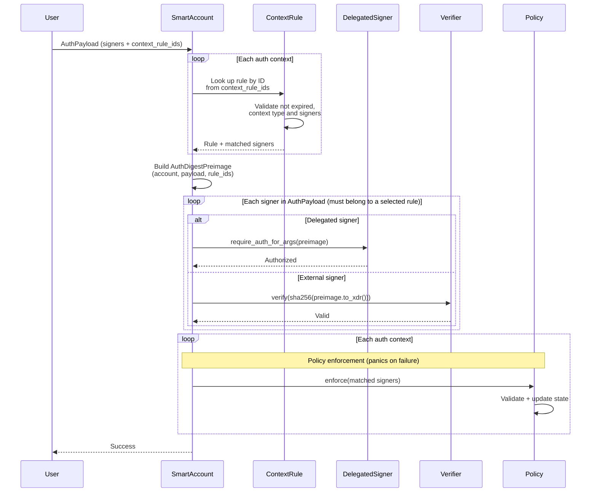

Authorization in smart accounts is determined by matching each auth context against explicitly selected context rules. The caller supplies `context_rule_ids` in the `AuthPayload`, specifying exactly one rule per auth context. If the selected rule passes all checks, its policies (if any) are enforced. Otherwise, authorization fails.

## AuthPayload

The `AuthPayload` structure is passed as the signature data in `__check_auth`:

```rust
#[contracttype]
pub struct AuthPayload {
    /// Signature data mapped to each signer.
    pub signers: Map<Signer, Bytes>,
    /// Per-context rule IDs, aligned by index with `auth_contexts`.
    pub context_rule_ids: Vec<u32>,
}
```

Each entry in `context_rule_ids` specifies the rule ID to validate against for the corresponding auth context (by index). Its length must equal `auth_contexts.len()`.

## AuthDigestPreimage

Signers never sign the raw `signature_payload` that the host passes to `__check_auth`. Instead, the smart account wraps it in a structured message that every signer commits to:

```rust
#[contracttype]
pub struct AuthDigestPreimage {
    /// The smart account performing the authorization check.
    pub account: Address,
    /// The 32-byte payload provided by the host to `__check_auth`.
    pub signature_payload: BytesN<32>,
    /// Per-context rule IDs, aligned by index with `auth_contexts`.
    pub context_rule_ids: Vec<u32>,
}
```

How a signer commits to the preimage depends on its type:

- **External signers** sign the **auth digest**, `sha256(preimage.to_xdr())`, which the smart account passes to their verifier contract.
- **Delegated signers** authorize the preimage itself through `require_auth_for_args((preimage,))`.

Binding `context_rule_ids` prevents rule-selection downgrade attacks, where an attacker collects signatures under a strict rule and then swaps `context_rule_ids` to point to a less restrictive one: any change to the rule IDs invalidates every signature. Binding `account` scopes each signature to a single smart account.

See [Auth Digest Computation](/stellar-contracts/accounts/signers-and-verifiers#auth-digest-computation) for how off-chain clients build the preimage and sign it.

## Detailed Flow

```mermaid
sequenceDiagram
    participant User
    participant SmartAccount
    participant ContextRule
    participant DelegatedSigner
    participant Verifier
    participant Policy

    User->>SmartAccount: AuthPayload (signers + context_rule_ids)

    loop Each auth context
        SmartAccount->>ContextRule: Look up rule by ID<br/>from context_rule_ids
        ContextRule->>ContextRule: Validate not expired,<br/>context type and signers
        ContextRule-->>SmartAccount: Rule + matched signers
    end

    SmartAccount->>SmartAccount: Build AuthDigestPreimage<br/>(account, payload, rule_ids)

    loop Each signer in AuthPayload (must belong to a selected rule)
        alt Delegated signer
            SmartAccount->>DelegatedSigner: require_auth_for_args(preimage)
            DelegatedSigner-->>SmartAccount: Authorized
        else External signer
            SmartAccount->>Verifier: verify(sha256(preimage.to_xdr()))
            Verifier-->>SmartAccount: Valid
        end
    end

    loop Each auth context
        Note over SmartAccount,Policy: Policy enforcement (panics on failure)
        SmartAccount->>Policy: enforce(matched signers)
        Policy->>Policy: Validate + update state
    end

    SmartAccount-->>User: Success
```

### 1. Rule Lookup

The smart account reads the `context_rule_ids` from the `AuthPayload`. There must be exactly one rule ID per auth context — a mismatch is rejected with `ContextRuleIdsLengthMismatch`.

For each auth context, the corresponding rule ID is used to look up the context rule directly. The rule must:

- Exist in the account's storage
- Not be expired (if `valid_until` is set, it must be ≥ current ledger sequence)
- Match the context type: a `CallContract(address)` rule matches a call to that contract, a `CreateContract(wasm_hash)` rule matches a deployment from that WASM hash, a `CreateContractExternalRef(owner, tag)` rule matches a deployment from that executable reference, and `Default` rules match any context

### 2. Signer Matching

For each (context, rule) pair, the smart account determines the rule's **matched signers**: the signers of the rule that appear as keys in `AuthPayload.signers`. No signature is checked at this stage.

- **Rule without policies**: every signer of the rule must be present in the payload. Otherwise, the context is rejected with `UnvalidatedContext`.
- **Rule with policies**: any subset of the rule's signers can be present. The policies decide in step 4 whether the matched signers are sufficient.

### 3. Signature Authentication

The smart account then builds the [`AuthDigestPreimage`](#authdigestpreimage) and goes through every entry of `AuthPayload.signers` once, across all auth contexts:

- A signer that is not part of any selected rule is rejected with `UnauthorizedSigner`. This prevents a payload from making the smart account call arbitrary verifier contracts.
- **Delegated Signer**: The address must have authorized `require_auth_for_args((preimage,))`.
- **External Signer**: The verifier contract must confirm that the signature over the auth digest, `sha256(preimage.to_xdr())`, is valid for the public key. Otherwise, authorization fails with `ExternalVerificationFailed`.

Invalid signatures are not skipped: a single failed signature aborts the whole authorization, even if the remaining signers would satisfy every rule.

### 4. Policy Enforcement

Once all signatures are authenticated, the smart account calls `enforce()` on each policy of each selected rule, passing the rule's matched signers. The `enforce()` method both validates conditions and applies state changes — it panics if the policy conditions are not satisfied:

```rust
for policy in rule.policies {
    policy.enforce(e, context, matched_signers, context_rule, smart_account);
    // Panics if policy conditions aren't satisfied, causing authorization to fail
}
```

If any policy panics, authorization fails.

Policy enforcement requires the smart account's authorization, ensuring that policies can only be enforced by the account itself.

A rule without policies has no further checks: all of its signers are present (step 2) and authenticated (step 3).

### 5. Result

**Success:** Authorization is granted and the transaction proceeds. All policy state changes are committed.

**Failure:** Authorization is denied and the transaction reverts. No state changes are committed.

## Examples

### Specific Context with Policy

**Configuration:**
```rust
// DEX-specific rule with session key and spending limit
ContextRule {
    id: 2,
    context_type: CallContract(dex_address),
    valid_until: Some(current_ledger + 24_hours),
    signers: [passkey],
    policies: [spending_limit_policy]
}

// Default admin rule
ContextRule {
    id: 1,
    context_type: Default,
    signers: [ed25519_alice, ed25519_bob],
    policies: []
}
```

**Call Context:** `CallContract(dex_address)`

**Authorization Entries:** `[passkey_signature]`

**Flow:**
1. Lookup: Client specifies rule ID 2 in `context_rule_ids`
2. Evaluate Rule 2:
   - Rule matches `CallContract(dex_address)` context and is not expired
   - Signer matching: Passkey is a signer of rule 2
   - Signature authentication: Passkey signature over the auth digest is valid
   - Policy enforcement: Spending limit validates and updates counters → Success
3. Result: Authorized


### Fallback to Default

**Configuration:**
```rust
// Session rule (expired)
ContextRule {
    id: 2,
    context_type: CallContract(dex_address),
    valid_until: Some(current_ledger - 100), // Expired
    signers: [session_key],
    policies: [spending_limit_policy]
}

// Default admin rule
ContextRule {
    id: 1,
    context_type: Default,
    signers: [ed25519_alice, ed25519_bob],
    policies: []
}
```

**Call Context:** `CallContract(dex_address)`

**Authorization Entries:** `[ed25519_alice_signature, ed25519_bob_signature]`

**Flow:**
1. Lookup: Client specifies rule ID 1 in `context_rule_ids` (rule 2 is known to be expired)
2. Evaluate Rule 1: Alice and Bob, the rule's only signers, are both present and their signatures are valid; no policies to enforce → Success
3. Result: Authorized

### Authorization Failure

**Configuration:**
```rust
// Default rule requiring 2-of-3 threshold
ContextRule {
    id: 1,
    context_type: Default,
    signers: [alice, bob, carol],
    policies: [threshold_policy(2)]
}
```

**Call Context:** `CallContract(any_address)`

**Authorization Entries:** `[alice_signature]`

**Flow:**
1. Lookup: Client specifies default rule ID in `context_rule_ids`
2. Evaluate:
   - Signer matching: Only Alice is present
   - Signature authentication: Alice's signature is valid
   - Policy enforcement: Threshold policy requires 2 signers, only 1 present → Panics
3. Result: Denied (transaction reverts)

## Performance Considerations

Protocol 23 optimizations make the authorization flow efficient:
- **Marginal storage read costs**: Reading multiple context rules has negligible cost
- **Cheaper cross-contract calls**: Calling verifiers and policies is substantially cheaper

The framework enforces per-rule limits to maintain predictability:
- Maximum signers per context rule: 15
- Maximum policies per context rule: 5

There is no upper limit on the total number of context rules per smart account.

## See Also

- [Smart Account](/stellar-contracts/accounts/smart-account)
- [Context Rules](/stellar-contracts/accounts/context-rules)
- [Signers and Verifiers](/stellar-contracts/accounts/signers-and-verifiers)
- [Policies](/stellar-contracts/accounts/policies)
