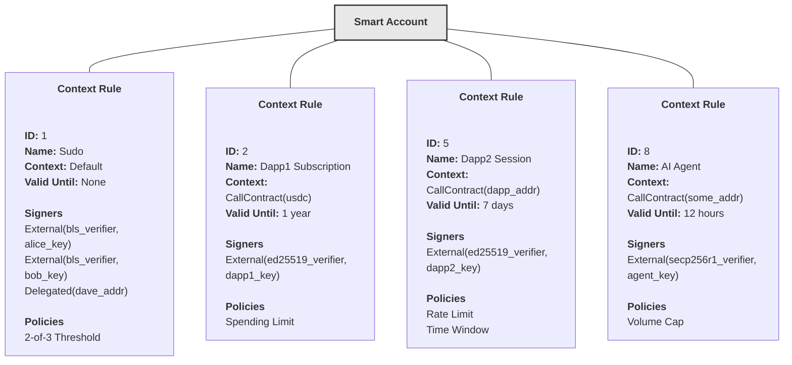

[Source Code](https://github.com/OpenZeppelin/stellar-contracts/tree/main/packages/accounts/src/smart_account)

Context rules function like routing tables for authorization. For each context, they specify scope, lifetime, and the conditions (signers and policies) that must be satisfied before execution proceeds.

## Structure

A context rule contains the following components:

#### ID
Unique identifier for the rule within the smart account.

#### Name
Human-readable description of the rule's purpose (e.g., "Admin Access", "DeFi Session").

#### Context Type
Defines the scope where the rule applies:

- `Default`: Applies to any context. Used for admin-like authorization that spans all operations.
- `CallContract(Address)`: Applies to specific contract calls. Useful for scoped permissions like session logins to a particular dApp.
- `CreateContract(BytesN<32>)`: Applies to contract deployments with a specific WASM hash. Enables control over which contracts can be deployed.

#### Valid Until
Optional expiration defined by a ledger sequence. Rules with expiration automatically become invalid after the specified ledger, enabling time-limited permissions like 24-hour sessions.

#### Signers
List of authorized signers (maximum 15 per rule). Signers can be either delegated (any Soroban address) or external (using verifier contracts).

For detailed documentation on signers, see [Signers](/stellar-contracts/accounts/signers-and-verifiers).

#### Policies
List of policy contracts (maximum 5 per rule). Policies act as enforcement modules that perform read-only prechecks and state-changing enforcement logic.

For detailed documentation on policies, see [Policies](/stellar-contracts/accounts/policies).

## Key Properties

### Requirement Flexibility
Each rule must contain at least one signer OR one policy. This enables pure policy-based authorization (like a spending limit without signature checks) or pure signature-based authorization (like an n-of-n multisig).

### Multiple Rules Per Context
Multiple rules can exist for the same context type with different signer sets and policies. This allows progressive authorization models where different combinations of credentials grant access to the same operations.

### Rule Precedence
Rules are evaluated in reverse chronological order (newest first). The first matching rule wins. This enables seamless permission updates: adding a new rule with different requirements immediately takes precedence over older rules for the same context.

### Automatic Expiration
Expired rules are automatically filtered out during authorization evaluation.

## Context Rule Limits

The framework enforces limits to keep costs predictable and encourage proactive context rule management (remove expired or non-valid rules):

- Maximum context rules per smart account: 15
- Maximum signers per context rule: 15
- Maximum policies per context rule: 5

## Authorization Matching

During authorization, the framework:

1. Gathers all non-expired rules matching the context type plus default rules
2. Sorts rules by creation time (newest first)
3. Evaluates rules in order until one matches
4. Returns the first matching rule or fails if none match

For detailed documentation on the authorization flow, see [Authorization Flow](/stellar-contracts/accounts/authorization-flow).

## Example Configuration




```rust
use soroban_sdk::{map, vec, Env, String}
use stellar_accounts::smart_account::{self as smart_account, ContextRuleType};

// This rule applies to all contexts and requires 2-of-3 signatures from Alice, Bob, or Dave.
smart_account::add_context_rule(
    e,
    ContextRuleType::Default,
    String::from_str(e, "Sudo"),
    vec![
        e,
        Signer::External(bls_verifier, alice_key),
        Signer::External(bls_verifier, bob_key),
        Signer::Delegated(dave_addr)
    ],
    map![
        e,
        (threshold_policy, threshold_params) // 2-of-3 Threshold
    ],
    None, // No expiration
);

// This rule applies only to calls to the USDC contract, expires in 1 year,
// requires a dapp1 key signature, and enforces spending limits.
smart_account::add_context_rule(
    e,
    ContextRuleType::CallContract(usdc_addr),
    String::from_str(e, "Dapp1 Subscription"),
    vec![
        e,
        Signer::External(ed25519_verifier, dapp1_key)
    ],
    map![
        e,
        (spending_limit_policy, spending_params)
    ],
    Some(current_ledger + 1_year)
);

// This rule applies only to calls to the dApp contract, expires in 7 days,
// requires a dapp2 key signature, and enforces rate limiting and time window policies.
smart_account::add_context_rule(
    e,
    ContextRuleType::CallContract(dapp_addr),
    String::from_str(e, "Dapp2 Session"),
    vec![
        e,
        Signer::External(ed25519_verifier, dapp2_key)
    ],
    map![
        e,
        (rate_limit_policy, rate_limit_params),
        (time_window_policy, time_window_params)
    ],
    Some(current_ledger + 7_days)
);

// This rule applies only to calls to a specific contract, expires in 12 hours,
// requires an AI agent key signature, and enforces volume caps.
smart_account::add_context_rule(
    e,
    ContextRuleType::CallContract(some_addr),
    String::from_str(e, "AI Agent"),
    vec![
        e,
        Signer::External(secp256r1_verifier, agent_key)
    ],
    map![
        e,
        (volume_cap_policy, volume_cap_params)
    ],
    Some(current_ledger + 12_hours)
);
```

## See Also

- [Smart Account](/stellar-contracts/accounts/smart-account)
- [Signers and Verifiers](/stellar-contracts/accounts/signers-and-verifiers)
- [Policies](/stellar-contracts/accounts/policies)
- [Authorization Flow](/stellar-contracts/accounts/authorization-flow)
