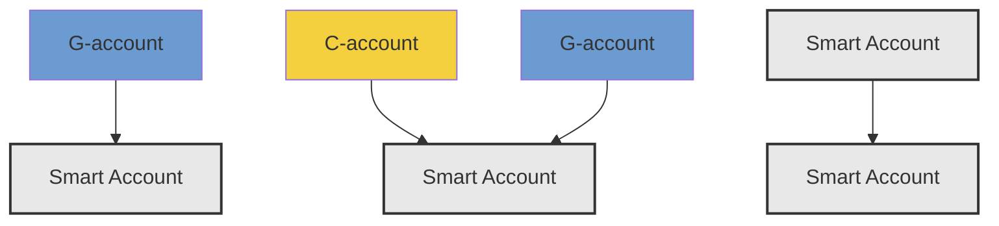
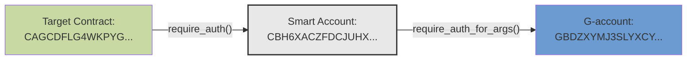
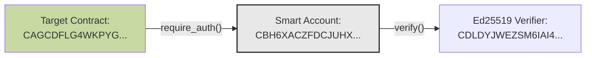

## Signers

[Source Code](https://github.com/OpenZeppelin/stellar-contracts/tree/main/packages/accounts/src/smart_account)

Signers define who can authorize operations in a smart account. The framework supports two variants that accommodate different authorization patterns and cryptographic schemes.

```rust
#[contracttype]
pub enum Signer {
    Delegated(Address),
    External(Address, Bytes),
}
```

### Delegated

```rust
Signer::Delegated(Address)
```

Delegated signers represent any Soroban address (C-account, G-account) and delegate authorization checks to that address using the built-in `require_auth_for_args()`. This enables using traditional Stellar account address (G-accounts) as signers, but also makes possible powerful composition patterns such as nested smart accounts (one smart account authorizing on behalf of another) and contract-based signers with custom authorization logic. This variant is particularly useful for building multi-level authorization hierarchies.



#### Transaction Simulation Behavior

However, there is a caveat when using delegated signers: authorization entries are not automatically included in transaction simulation results and clients must manually construct these entries, which adds additional implementation complexity. This limitation may be overcome with future protocol improvements such as [CAP-71](https://github.com/stellar/stellar-protocol/blob/master/core/cap-0071.md).

When building transactions in Soroban, clients typically simulate them first to obtain the authorization trees and nonces needed for signing. The simulation mechanism precomputes the `SorobanAuthorizedInvocation` trees that must be authorized by the `Address`es for all `require_auth`/`require_auth_for_args` checks to pass.

The usual flow is: simulate, collect the returned auth trees and nonces, have each `Address` sign those payloads, and then submit the final transaction that combines the simulation output with the corresponding signatures. See the [official docs](https://developers.stellar.org/docs/learn/fundamentals/contract-development/contract-interactions/transaction-simulation#authorization) for details.

When `require_auth_for_args` is called from within `__check_auth` (as with delegated signers), the authorization entry for that signer is **not included** in the simulation output.

```rust
#[contracttype]
pub struct Signatures(pub Map<Signer, Bytes>);

#[contract]
pub struct MySmartAccount;

#[contractimpl]
impl CustomAccountInterface for MySmartAccount {
    fn __check_auth(
        e: Env,
        payload: Hash<32>,
        signatures: Signatures,
        auth_contexts: Vec<Context>,
    ) -> Result<(), SmartAccountError> {
          for (signer, _) in signatures.0.iter() {
            match signer {
                // ...
                Signer::Delegated(addr) => {
                    let payload = (payload.clone(),).into_val(e);
                    addr.require_auth_for_args(payload);
                }
            }
        }
        // ...
    }
}
```

**Example Scenario**

Consider a scenario where a target contract `CAGCDFLG4WKPYG...` requires authorization from a smart account `CBH6XACZFDCJUHX...`. The smart account will grant authorization only if the G-account `GBDZXYMJ3SLYXCY...` has signed, meaning `Map<Signer, Bytes>` has to contain one element that is `Signer::Delegated("GBDZXYMJ3SLYXCY...")`. 



When simulating this transaction, the following authorization entry is returned. Note that `"auth"` contains a single element and the delegated signer address (G-account) is not present at all:
```json
{
  "tx": {
    // ...
    "auth": [
      {
        "credentials": {
          "address": {
            "address": "CBH6XACZFDCJUHX...", // the Smart Account
            "nonce": "7346653005027720525",
            "signature_expiration_ledger": 0,
            "signature": "void"
          }
        },
        "root_invocation": {
          "function": {
            "contract_fn": {
              "contract_address": "CAGCDFLG4WKPYG...", // the Target Contract that's initially invoked
              "function_name": "some_fn",
              "args": [/* fn args if any */]
            }
          },
          "sub_invocations": []
        }
      }
    ]
    // ...
  }
}
```

The client implementation requires constructing two authorization entries:

1. Replace `"signature": "void"` with the proper `Signatures(Map<Signer, Bytes>)` structure
2. Create the missing authorization entry for the delegated signer's `__check_auth` call

The following typescript code demonstrates this process:

```typescript
async function signAndSendTx(
    contract: string,
    fnName: string,
    fnArgs: ScVal[],
    signer: Keypair
) {
    const baseTx = new TransactionBuilder(...)
        .addOperation(
            Operation.invokeContractFunction({ contract, function: fnName, args: fnArgs }),
        )
        .setTimeout(600)
        .build();

    const simRes = await server.simulateTransaction(baseTx);
    // we assume only one authorization is returned
    const simAuth = simRes.result.auth[0];
    
    const signedAuths: SorobanAuthorizationEntry[] = [];

    // 1) Construct the 1st auth entry: `Signatures(pub Map<Signer, Bytes>)` with `Signer::Delegated(Address)`
    const sigInnerMap = ScVal.scvMap([
        new xdr.ScMapEntry({
            key: ScVal.scvVec([
                ScVal.scvSymbol("Delegated"),
                Address.fromString(signer.publicKey()).toScVal(), // "GBDZXYMJ3SLYXCY..."
            ]),
            val: ScVal.scvBytes(""),
        }),
    ]);

    simAuth.credentials().address().signature(ScVal.scvVec([sigInnerMap]));
    simAuth.credentials().address().signatureExpirationLedger(validUntil);
    signedAuths.push(simAuth);

    // 2) Construct the 2nd auth entry for `__check_auth` and sign the invocation
    const payload = HashIdPreimage.envelopeTypeSorobanAuthorization(
        new HashIdPreimageSorobanAuthorization({
            networkId,
            nonce: simAuth.credentials().address().nonce(),
            signatureExpirationLedger: validUntil,
            invocation: simAuth.rootInvocation(),
        }),
    ).toXDR();
    const hashed_payload = hash(payload);

    const args = new InvokeContractArgs({
        contractAddress: Address.fromString(contract).toScAddress(),
        functionName: "__check_auth", 
        args: [ScVal.scvBytes(hashed_payload)]
    });
    const invocation = new SorobanAuthorizedInvocation({
        function: SorobanAuthorizedFunction.sorobanAuthorizedFunctionTypeContractFn(args),
        subInvocations: [],
    });
    const signedEntry = await authorizeInvocation(
        signer,
        validUntil,
        invocation,
        signer.publicKey(),
        Networks.TESTNET,
    );
    signedAuths.push(signedEntry);
    
    // rebuild transaction with both auth entries in signedAuths
    // re-simulate
}
```

After including both authorization entries in `signedAuths` and re-simulating the transaction, the `"auth"` array contains now two elements:

```json
{
  "tx": {
    // ...
    "auth": [
      {
        "credentials": {
          "address": {
            "address": "CBH6XACZFDCJUHX...", // the Smart Account
            "nonce": "7346653005027720525",
            "signature_expiration_ledger": 1256083,
            "signature": {
              "vec": [
                {
                  "map": [
                    {
                      "key": {
                        "vec": [
                          {
                            "symbol": "Delegated"
                          },
                          {
                            "address": "GBDZXYMJ3SLYXCY..." // the delegated signer (G-account)
                          }
                        ]
                      },
                      "val": {
                        "bytes": "" // `Bytes` value from `Map<Signer, Bytes>` is empty here (it's used only for the `Signer::External`)
                      }
                    }
                  ]
                }
              ]
            }
          }
        },
        "root_invocation": {
          // ...
        }
      },
      {
        "credentials": {
          "address": {
            "address": "GBDZXYMJ3SLYXCY...", // the delegated signer
            "nonce": "172051086",
            "signature_expiration_ledger": 1256083,
            "signature": {
              "vec": [
                {
                  "map": [
                    {
                      "key": {
                        "symbol": "public_key"
                      },
                      "val": {
                        "bytes": "479be189dc978b8b3b463a0c6f..."
                      }
                    },
                    {
                      "key": {
                        "symbol": "signature"
                      },
                      "val": {
                        "bytes": "c54aae899cc29374ef81745bf46612...."
                      }
                    }
                  ]
                }
              ]
            }
          }
        },
        "root_invocation": {
          "function": {
            "contract_fn": {
              "contract_address": "CBH6XACZFDCJUHX...", // the Smart Account
              "function_name": "__check_auth",
              "args": [
                {
                  "bytes": "ed0cfe2903d64e5383..." // the signature payload
                }
              ]
            }
          },
        }
      }
    ]
    // ...
  }
}
```

#### Future Improvements

While delegated signers currently require manual authorization entry construction, future protocol changes like [CAP-71](https://github.com/stellar/stellar-protocol/blob/master/core/cap-0071.md) aim to streamline this process. These improvements would eliminate the need for the additional authorization entry, making delegated signers more intuitive and reducing transaction overhead.

Despite the current complexity, delegated signers are valuable both for simple scenarios using traditional Stellar accounts (G-accounts) as signers and for advanced use cases requiring multi-level authorization or custom contract-based signing logic.


### External

Each `External` signer pairs a verifier address with a public key.

```rust
Signer::External(Address, Bytes)
```

In the case of external signers verification is offloaded to specialized verifier contracts. During authorization, the smart account makes a cross-contract call to the verifier contract to validate the signature, as shown in the example below where `VerifierClient::new(e, &verifier).verify()` invokes the external verifier's verification logic.

```rust
#[contracttype]
pub struct Signatures(pub Map<Signer, Bytes>);

#[contract]
pub struct MySmartAccount;

#[contractimpl]
impl CustomAccountInterface for MySmartAccount {
    fn __check_auth(
        e: Env,
        payload: Hash<32>,
        signatures: Signatures,
        auth_contexts: Vec<Context>,
    ) -> Result<(), SmartAccountError> {
          for (signer, sig_data) in signatures.0.iter() {
            match signer {
                Signer::External(verifier, key_data) => {
                    let sig_payload = Bytes::from_array(e, &signature_payload.to_bytes().to_array());
                    if !VerifierClient::new(e, &verifier).verify(
                        &sig_payload,
                        &key_data.into_val(e),
                        &sig_data.into_val(e),
                    ) {
                        panic_with_error!(e, SmartAccountError::ExternalVerificationFailed)
                    }
                }
                // ...
            }
        }
        // ...
    }
}
```

This design separates cryptographic logic from the smart account to facilitate support for diverse schemes (ed25519, secp256k1, secp256r1, BLS, RSA, zero-knowledge proofs). It also minimizes setup costs by allowing many accounts to reuse the same verifier contracts. 

This separation provides forward compatibility: when new cryptographic curves are added on Soroban, smart accounts can adopt them immediately by referencing the appropriate verifier contract. If signature verification were embedded directly in the account, adopting a new scheme would require either upgrading the account (if upgradeable) or migrating to an entirely new account.

**Example Scenario**

Consider again a target contract `CAGCDFLG4WKPYG...` that requires authorization from a smart account `CBH6XACZFDCJUHX...`. This time the smart account will grant authorization only if the Ed25519 public key `2b6bad0cfdb3d4b6f2cd...` has signed, meaning `Map<Signer, Bytes>` has to contain one element that is `Signer::External("CDLDYJWEZSM6IAI4...", "2b6bad0cfdb3d4b6f2cd...")` and its signature. 



In contrast to `Delegated` signers, constructing the auth entry for an `External` signer is straightforward:
```json
{
  "tx": {
    // ...
    "auth": [
      {
        "credentials": {
          "address": {
            "address": "CBH6XACZFDCJUHX...", // the Smart Account
            "nonce": "7346653005027720525",
            "signature_expiration_ledger": 1256083,
            "signature": {
              "vec": [
                {
                  "map": [
                    {
                      "key": {
                        "vec": [
                          {
                            "symbol": "External"
                          },
                          {
                            "address": "CDLDYJWEZSM6IAI4..." // the Ed25519 Verifier
                          },
                          {
                            "bytes": "2b6bad0cfdb3d4b6f2cd..." // Signer's public key
                          }
                        ]
                      },
                      "val": {
                        "bytes": "6ead27ab6e8cab36..." // Signer's signature
                      }
                    }
                  ]
                }
              ]
            }
          }
        },
        "root_invocation": {
          // ...
        }
      }
    ]
    // ...
  }
}
```

See the [Verifiers](#verifiers) section below for architecture details and the `Verifier` trait that external signers rely on.

## Signer Management

The [`SmartAccount`](https://github.com/OpenZeppelin/stellar-contracts/blob/main/packages/accounts/src/smart_account/mod.rs) trait provides functions for managing signers within context rules:

### Adding Signers

```rust
fn add_signer(
    e: &Env,
    context_rule_id: u32,
    signer: Signer,
);
```

Adds a signer to an existing context rule. The rule must not exceed the maximum of 15 signers.

<Callout>
**Important:** 
When adding signers to rules with threshold policies, administrators must manually update policy thresholds to maintain security guarantees. See the Policies documentation for details.
</Callout>

### Removing Signers

```rust
fn remove_signer(
    e: &Env,
    context_rule_id: u32,
    signer: Signer,
);
```

Removes a signer from an existing context rule. The rule must maintain at least one signer OR one policy after removal.

<Callout>
**Important:** 
When removing signers from rules with threshold policies, verify that the threshold remains achievable with the remaining signers.
</Callout>

## Verifiers

[Source Code](https://github.com/OpenZeppelin/stellar-contracts/tree/main/packages/accounts/src/verifiers)

Verifiers serve as cryptographic oracles for signature validation: specialized, trusted contracts that validate signatures on behalf of smart accounts. They are the foundation for `External` signers, providing the actual signature verification logic.

Each signer is represented as a `(verifier_address, public_key)` pair, where the verifier address points to shared verification logic and the public key identifies the specific signer. A single verifier contract can validate signatures for any number of keys.

This architecture separates verification logic from smart accounts, enabling a clean division of concerns and promoting code reuse across the ecosystem.

The `Verifier` trait defines the interface for verifier contracts:

```rust
pub trait Verifier {
    type KeyData: FromVal;
    type SigData: FromVal;

    /// # Arguments
    ///
    /// * `e` - Access to the Soroban environment.
    /// * `hash` - The hash of the data that was signed (typically 32 bytes).
    /// * `key_data` - The public key data in the format expected by this verifier.
    /// * `sig_data` - The signature data in the format expected by this verifier.
    fn verify(e: &Env, hash: Bytes, key_data: Self::KeyData, sig_data: Self::SigData) -> bool;
}
```
The trait uses associated types to allow different verifiers to define their own data structures for keys and signatures.

### Advantages of the Verifier Pattern

**No Setup Costs**: Once a verifier is deployed, new keys can be used immediately without any on-chain setup. Users simply reference the verifier address and provide their public key when creating signers.

**Cryptographic Flexibility**: The verifier pattern supports diverse cryptographic schemes from standard curves to emerging authentication methods like zero-knowledge proofs and email-based signing. Developers can implement custom verifiers for specialized cryptographic schemes.

**Address-less Keys**: Keys remain separate from account addresses, maintaining clear boundaries between accounts (which hold assets) and the keys that control them. This separation improves security and flexibility.

**Shared Security**: Verification logic is centralized in well-audited, immutable contracts. The entire network benefits from shared security guarantees, reduced deployment overhead, community-reviewed implementations, and consistent verification behavior.

**Ecosystem Trust**: Well-known verifier addresses build trust as they are used across many accounts. A small set of thoroughly audited verifiers can serve the entire ecosystem.

### Implementation Recommendations

Verifiers logic should be implemented as pure verification functions with the following characteristics:

- **Stateless**: No internal state that could be manipulated
- **Immutable**: Not upgradeable once deployed, minimizing the trust
- **Deterministic**: Same inputs always produce the same output
- **Efficient**: Optimized for gas costs and performance

## Example Verifiers

The "accounts" package provides utility functions for implementing **Ed25519** and **WebAuthn** verifiers:

### Ed25519

[Source Code](https://github.com/OpenZeppelin/stellar-contracts/tree/main/packages/accounts/src/verifiers/ed25519.rs)

The `ed25519` verifier utilities package provides standard Ed25519 signature verification for external signers in smart accounts. This enables using Ed25519 keys that are not native Soroban addresses, such as keys generated by external systems or hardware wallets.

Ed25519 public keys must be exactly **32 bytes**:

```rust
let public_key = Bytes::from_array(e, &[
    0x12, 0x34, 0x56, 0x78, // ... 32 bytes total
]);
```

Ed25519 signatures must be exactly **64 bytes**:

```rust
let signature = Bytes::from_array(e, &[
    0xab, 0xcd, 0xef, 0x01, // ... 64 bytes total
]);
```

### WebAuthn (Passkeys)

[Source Code](https://github.com/OpenZeppelin/stellar-contracts/blob/main/packages/accounts/src/verifiers/webauthn.rs)

[WebAuthn (Web Authentication)](https://www.w3.org/TR/webauthn-2/) is a web standard for passwordless authentication that allows users to authenticate using:

- **Passkeys**: Biometric authentication (Face ID, Touch ID, Windows Hello)
- **Hardware Keys**: Physical security keys (YubiKey, Titan Key)
- **Platform Authenticators**: Built-in device authenticators

WebAuthn uses secp256r1 (P-256) public keys, which must be exactly **65 bytes** in uncompressed format:

```rust
let public_key = Bytes::from_array(e, &[
    0x04, // Uncompressed point indicator
    // ... 32 bytes for X coordinate
    // ... 32 bytes for Y coordinate
]);
```

Unlike simpler signature schemes, WebAuthn signature data is a complex structure that must be XDR-encoded. The signature data contains three components:

```rust
#[contracttype]
pub struct WebAuthnSigData {
    /// The cryptographic signature (64 bytes for secp256r1)
    pub signature: BytesN<64>,
    /// Raw authenticator data from the WebAuthn response
    pub authenticator_data: Bytes,
    /// Raw client data JSON from the WebAuthn response
    pub client_data: Bytes,
}
```

Components:

- **`signature`**: The secp256r1 signature (64 bytes)
- **`authenticator_data`**: Binary data from the authenticator (minimum 37 bytes), containing:
  - RP ID hash (32 bytes)
  - Flags byte (1 byte) - indicates user presence, user verification, and backup state
  - Signature counter (4 bytes)
- **`client_data`**: JSON string from the browser/platform (max 1024 bytes), containing:
  - `type`: Must be `"webauthn.get"` for authentication
  - `challenge`: Base64url-encoded signature payload
  - `origin`: The origin where authentication occurred

The `sig_data` parameter passed to the verifier must be the XDR-encoded representation of this structure to ensure proper serialization and deserialization.

## See Also

- [Smart Account](/stellar-contracts/accounts/smart-account)
- [Context Rules](/stellar-contracts/accounts/context-rules)
- [Policies](/stellar-contracts/accounts/policies)
- [Authorization Flow](/stellar-contracts/accounts/authorization-flow)
