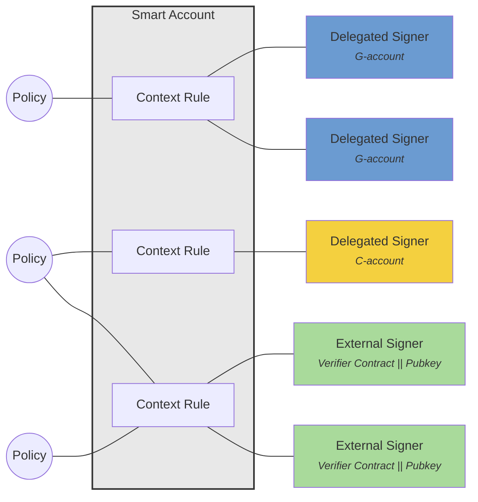

[Source Code](https://github.com/OpenZeppelin/stellar-contracts/tree/main/packages/accounts)

Smart accounts are contracts that manage the composition of authorization intents coming from multiple sources, such as policies, signing keys from different cryptographic curves or other Soroban accounts. This lays the ground for flexible combinations where multiple authorization mechanisms work together seamlessly.

## Overview

The [accounts](https://github.com/OpenZeppelin/stellar-contracts/tree/main/packages/accounts) package provides a comprehensive smart account framework, enabling programmable authorization. Rather than hard-coding signature checks directly into the account contract, this framework organizes authorization as a composition of three core elements: context rules, signers, and policies.

To achieve this composability, smart accounts implement the `CustomAccountInterface` and define authorization as data and behavior that can evolve over time. The framework takes a context-centric approach, separating three distinct concerns: who is allowed to act (signers), what they are allowed to do (scope or context rules), and how those permissions are enforced (policies).

This separation is made practical by externalizing parts of the logic and state to dedicated contracts. Specifically, policies are external contracts that enforce constraints and can maintain their own state, while verifiers are external contracts that handle signature validation logic. This modular architecture enables flexibility and allows multiple smart accounts to share well-audited verification and policy logic. The Protocol 23 improvements make this design efficient, with substantially cheaper cross-contract calls enabling practical composition of multiple external contracts.

## Core Components

The framework separates three distinct concerns:

- **What** (Context Rules): Defines the scope and conditions
- **Who** (Signers): Identifies the authorized entities
- **How** (Policies): Enforces business logic and constraints

### Context Rules
Context rules function like routing tables for authorization. For each context, they specify scope, lifetime, and the conditions (signers and policies) that must be satisfied before execution proceeds.

#### Examples
1. Subscription: A dapp public key (signer) can withdraw 100 USDC every month (policy) for one year (lifetime)
2. Deployment: 2-of-3 (policy) Ed25519 keys (signers) can deploy a new contract
3. Vote: 3-of-3 P256 keys (signers) can cast a vote at a specific voting contract

For detailed documentation, see [Context Rules](/stellar-contracts/accounts/context-rules).

### Signers and Verifiers
Signers define who can authorize operations. The framework supports both **delegated** signers (any Soroban address) and **external** signers that use specialized verifier contracts for signature validation. Verifiers can be seen as some sort of cryptographic oracles that validate signatures for external signers.

For detailed documentation, see [Signers and Verifiers](/stellar-contracts/accounts/signers-and-verifiers).

### Policies
Policies act as enforcement modules attached to context rules. They perform read-only prechecks and can update state to enforce limits or workflows.

For detailed documentation, see [Policies](/stellar-contracts/accounts/policies).

This separation allows for clean composition of authorization requirements while maintaining auditability and flexibility.

## Authorization Flow

Authorization is determined by matching the current call context against the account's context rules:

1. **Rule Collection**: Retrieve all non-expired rules for the specific context type and default rules
2. **Rule Evaluation**: For each rule (newest first), authenticate signers and validate policies
3. **Policy Enforcement**: If enough signers are authenticated and policy prechecks succeed, trigger policy state changes
4. **Result**: Grant or deny authorization

For detailed documentation, see [Authorization Flow](/stellar-contracts/accounts/authorization-flow).
