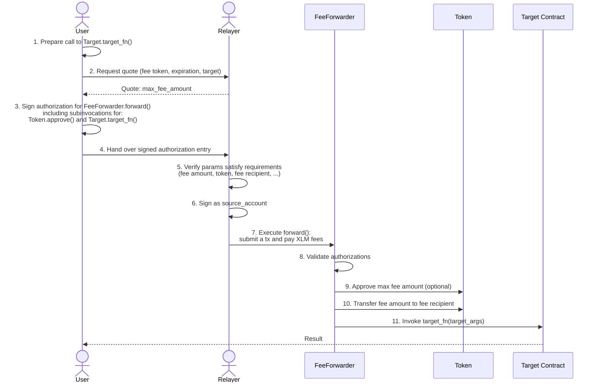
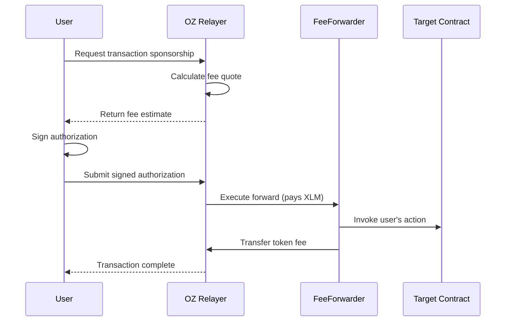

[Source Code](https://github.com/OpenZeppelin/stellar-contracts/tree/main/packages/fee-abstraction)

Fee abstraction enables users to pay for Stellar transactions with tokens (e.g., USDC) instead of native XLM. A relayer covers the XLM network fees and is compensated in the user's chosen token through an intermediary contract.

## Overview

The [fee-abstraction](https://github.com/OpenZeppelin/stellar-contracts/tree/main/packages/fee-abstraction) package provides utilities for implementing fee forwarding contracts on Stellar. The system works by having a relayer submit transactions on behalf of users, then atomically collecting token payment from the user as compensation.

The flow involves an off-chain negotiation between the user and a relayer (quote request, fee agreement), but the actual execution happens through an intermediary contract called a **FeeForwarder**. This contract enforces that the user is charged at most `max_fee_amount`, the cap they signed. The relayer determines the actual `fee_amount` at submission time based on network conditions, but can never exceed the user's authorized maximum.

### Benefits

Fee abstraction provides different advantages depending on the account type. For Stellar classic accounts, users don't need to acquire XLM beyond the [minimum required account balance](https://developers.stellar.org/docs/learn/fundamentals/stellar-data-structures/accounts#base-reserves-and-subentries) just to transact. It’s a great UX improvement by allowing users to use dapps with stablecoins or other tokens they already hold.

Unlike classic accounts, smart accounts (contract-based accounts) don't need to maintain a minimum XLM balance, but they need a mechanism to compensate relayers who submit transactions on their behalf. The proposed fee abstraction model significantly improves smart accounts usability.

### How It Works



## Features

### Target Invocation (Forwarding) and Fee Collection

First and foremost, the user intention is to invoke a function on a target contract which might require an authorization from the user. In that case, the minimal authorization tree the user needs to sign is:

```
FeeForwarder.forward()
    └─ Target.target_fn() ← nested sub-invocation (if needed)
```

Equally important for the fee abstraction model is enabling the relayer to collect the compensation fee. This is done through the common 2-step fungible token flow of `approve` + `transfer_from`. Soroban authorization framework allows embedding the approval step in the same transaction, so the user might also need to sign `Token.approve()`.

To guarantee the atomicity of both, the target invocation and the fee collection, the [fee-abstraction](https://github.com/OpenZeppelin/stellar-contracts/tree/main/packages/fee-abstraction) package exposes the function `collect_fee_and_invoke()`, which, in most of the cases, will require signing an authorization tree that contains one entry with two sub-invocations:

```
FeeForwarder.forward()
    └─ Token.approve()
    └─ Target.target_fn()
```

The approval sub-invocation might be optional depending on the chosen approval strategy. The package supports two approval strategies:

1. **Lazy**
    
    The user pre-approves a lump sum to the FeeForwarder contract in a separate transaction. Each forwarded call then draws from this existing allowance. This strategy is more resource efficient per call, but requires an initial approval transaction and trust in the FeeForwarder contract.
    
2. **Eager**
    
    The approval is embedded directly in the authorization entry as a sub-invocation for every call, no preliminary transactions needed. This strategy is self-contained with no  trust assumptions, but more expensive per call (~25%) due to the nested approval.

## Fee Token Allowlist

The package includes optional allowlist functionality to restrict which tokens can be used for fee payment:

```rust
// Enable a token for fee payments
set_allowed_fee_token(e, &usdc_token, true);

// Disable a token
set_allowed_fee_token(e, &deprecated_token, false);

// Check if a token is allowed
let is_allowed = is_allowed_fee_token(e, &token);
```

The allowlist uses a swap-and-pop algorithm for efficient O(1) removal and automatically extends TTL for frequently-used tokens.

## Token Sweeping

For permissioned implementations where fees accumulate in the contract, the package provides a sweep function:

```rust
// Transfer all accumulated tokens to a recipient
let amount = sweep_token(e, &fee_token, &treasury);
```

This is typically restricted to manager roles.

## Security Considerations

### Relayer Safety

Relayers **must** ensure the call to the target contract is safe before submitting a transaction. A malicious user could craft a call that harms the relayer or the FeeForwarder contract in a permissioned setup. In most cases, relayers should **simulate the transaction off-chain** before submission to verify:
- The target contract call will succeed
- The fee collection will complete
- The overall transaction outcome is acceptable

This off-chain task is critical for relayer protection and should be part of any production relayer implementation.

## Implementation Examples

### Permissioned FeeForwarder

A role-based implementation where only authorized executors can relay transactions. Fees accumulate in the contract for later distribution.

**Characteristics:**
- Uses `#[only_role]` macro for executor authorization
- Collects fees to the contract (not directly to relayer)
- Managers can sweep accumulated fees to designated recipients
- Uses lazy approval strategy (requires pre-approval transaction)
- Suitable for trusted relayer networks

```rust
#[only_role(relayer, "executor")]
pub fn forward(
    e: &Env,
    fee_token: Address,
    fee_amount: i128,
    max_fee_amount: i128,
    expiration_ledger: u32,
    target_contract: Address,
    target_fn: Symbol,
    target_args: Vec<Val>,
    user: Address,
    relayer: Address,
) -> Val {
    collect_fee_then_invoke(
        e,
        &fee_token,
        fee_amount,
        max_fee_amount,
        expiration_ledger,
        &target_contract,
        &target_fn,
        &target_args,
        &user,
        &e.current_contract_address(), // fees go to contract
        FeeAbstractionApproval::Lazy,
    )
}
```

### Permissionless FeeForwarder

An open implementation where anyone can act as a relayer. Fees go directly to the relayer, creating a competitive market.

**Characteristics:**
- No role restrictions
- Fees transfer directly to the relayer
- Uses eager approval strategy (approval embedded in each call)
- Suitable for open relayer markets

```rust
pub fn forward(
    e: &Env,
    fee_token: Address,
    fee_amount: i128,
    max_fee_amount: i128,
    expiration_ledger: u32,
    target_contract: Address,
    target_fn: Symbol,
    target_args: Vec<Val>,
    user: Address,
    relayer: Address,
) -> Val {
    relayer.require_auth();

    collect_fee_and_invoke(
        e,
        &fee_token,
        fee_amount,
        max_fee_amount,
        expiration_ledger,
        &target_contract,
        &target_fn,
        &target_args,
        &user,
        &relayer, // fees go directly to relayer
        FeeAbstractionApproval::Eager,
    )
}
```

## Integration with OpenZeppelin Relayer

The fee abstraction package is designed to work seamlessly with [OpenZeppelin Relayer](/relayer/1.3.x). The Relayer can:

1. **Submit sponsored transactions**: Pay XLM fees on behalf of users
2. **Calculate optimal fees**: Determine the actual fee based on network conditions
3. **Handle fee collection**: Coordinate with fee forwarder contracts to collect token payment

### Sponsored Transaction Flow



For detailed integration instructions, see the [Stellar Sponsored Transactions Guide](/relayer/1.3.x/guides/stellar-sponsored-transactions-guide).

## See Also

- [Smart Accounts](/stellar-contracts/accounts/smart-account)
- [Access Control](/stellar-contracts/access/access-control)
- [OpenZeppelin Relayer](/relayer/1.3.x)
- [Stellar Sponsored Transactions Guide](/relayer/1.3.x/guides/stellar-sponsored-transactions-guide)
