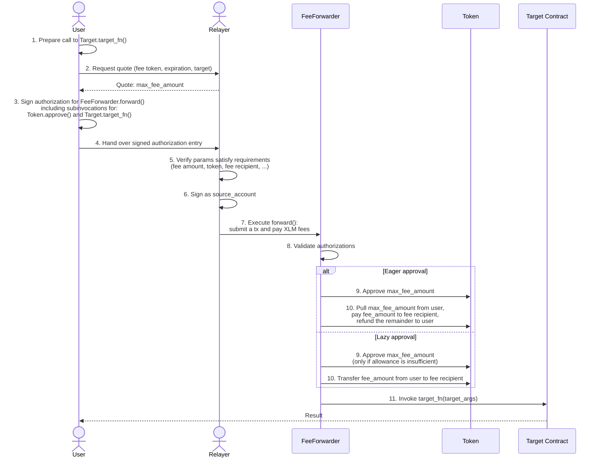
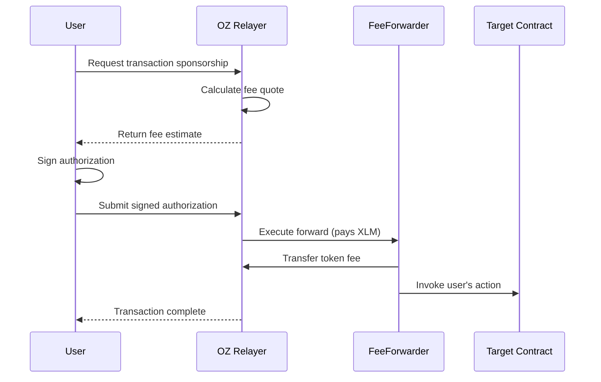

[Source Code](https://github.com/OpenZeppelin/stellar-contracts/tree/main/packages/fee-abstraction)

Fee abstraction enables users to pay for Stellar transactions with tokens (e.g., USDC) instead of native XLM. A relayer covers the XLM network fees and is compensated in the user's chosen token through an intermediary contract.

## Overview

The [fee-abstraction](https://github.com/OpenZeppelin/stellar-contracts/tree/main/packages/fee-abstraction) package provides utilities for implementing fee forwarding contracts on Stellar. The system works by having a relayer submit transactions on behalf of users, then atomically collecting token payment from the user as compensation.

The flow involves an off-chain negotiation between the user and a relayer (quote request, fee agreement), but the actual execution happens through an intermediary contract called a **FeeForwarder**. This contract enforces that the user is charged at most `max_fee_amount`, the cap they signed. The relayer determines the actual `fee_amount` at submission time based on network conditions, but can never exceed the user's authorized maximum.

### Benefits

Fee abstraction provides different advantages depending on the account type. For Stellar classic accounts, users don't need to acquire XLM beyond the [minimum required account balance](https://developers.stellar.org/docs/learn/fundamentals/stellar-data-structures/accounts#base-reserves-and-subentries) just to transact. It’s a great UX improvement by allowing users to use dapps with stablecoins or other tokens they already hold.

Unlike classic accounts, smart accounts (contract-based accounts) don't need to maintain a minimum XLM balance, but they need a mechanism to compensate relayers who submit transactions on their behalf. The proposed fee abstraction model significantly improves smart accounts usability.

### How It Works


```mermaid
sequenceDiagram
    actor User
    actor Relayer
    participant FeeForwarder
    participant Token
    participant Target Contract

    User->>User: 1. Prepare call to Target.target_fn()
    User->>Relayer: 2. Request quote (fee token, expiration, target)
    Relayer-->>User: Quote: max_fee_amount
    
    User->>User: 3. Sign authorization for FeeForwarder.forward()<br/>including subinvocations for:<br/> Token.approve() and Target.target_fn()
    User->>Relayer: 4. Hand over signed authorization entry
    
    Relayer->>Relayer: 5. Verify params satisfy requirements<br/>(fee amount, token, fee recipient, ...)
    Relayer->>Relayer: 6. Sign as source_account
    Relayer->>FeeForwarder: 7. Execute forward():<br/>submit a tx and pay XLM fees
    
    FeeForwarder->>FeeForwarder: 8. Validate authorizations
    alt Eager approval
        FeeForwarder->>Token: 9. Approve max_fee_amount
        FeeForwarder->>Token: 10. Pull max_fee_amount from user,<br/>pay fee_amount to fee recipient,<br/>refund the remainder to user
    else Lazy approval
        FeeForwarder->>Token: 9. Approve max_fee_amount<br/>(only if allowance is insufficient)
        FeeForwarder->>Token: 10. Transfer fee_amount from user to fee recipient
    end
    FeeForwarder->>Target Contract: 11. Invoke target_fn(target_args)
    Target Contract-->>User: Result
```

## Features

### Target Invocation (Forwarding) and Fee Collection

First and foremost, the user intention is to invoke a function on a target contract which might require an authorization from the user. In that case, the minimal authorization tree the user needs to sign is:

```
FeeForwarder.forward()
    └─ Target.target_fn() ← nested sub-invocation (if needed)
```

Equally important for the fee abstraction model is enabling the relayer to collect the compensation fee. This relies on the fungible token allowance mechanism: the user approves the FeeForwarder, which then pulls the tokens with `transfer_from`. Soroban authorization framework allows embedding the approval step in the same transaction, so the user might also need to sign `Token.approve()`.

To guarantee the atomicity of both, the target invocation and the fee collection, the [fee-abstraction](https://github.com/OpenZeppelin/stellar-contracts/tree/main/packages/fee-abstraction) package exposes the function `collect_fee_and_invoke()`, which, in most of the cases, will require signing an authorization tree that contains one entry with two sub-invocations:

```
FeeForwarder.forward()
    └─ Token.approve()
    └─ Target.target_fn()
```

The approval sub-invocation might be optional depending on the chosen approval strategy. The package supports two approval strategies:

1. **Lazy**
    
    The FeeForwarder approves `max_fee_amount` only when the user's current allowance is below it, then transfers
    `fee_amount` from the user directly to the fee recipient with `transfer_from`. The `Token.approve()` sub-invocation
    is thus needed only when the allowance is insufficient, and calls covered by an existing allowance (left over from
    a previous call or approved separately) don't need it. The unspent remainder stays approved for later calls, which
    makes this strategy cheaper per call, but requires trust in the FeeForwarder contract.
    
2. **Eager**
    
    The FeeForwarder always approves `max_fee_amount` (overwriting any existing allowance), pulls the full
    `max_fee_amount` from the user with `transfer_from`, pays `fee_amount` to the fee recipient (skipped when the
    recipient is the FeeForwarder itself) and refunds the remainder to the user. The approval is embedded as a
    sub-invocation in every call, but no allowance is left behind, so there are no trust assumptions. This strategy is
    more expensive per call due to the approval and the extra transfers, and the user needs a spendable balance of at
    least `max_fee_amount`, not just `fee_amount`.

<Callout type="warning">
Eager requires a balance-conserving fee token, i.e. one whose transfers credit the receiver exactly the amount
debited from the sender. The FeeForwarder pays out the fee and the remainder regardless of the amount it received, so
with fee-on-transfer or other non-conserving tokens the shortfall is drawn from the FeeForwarder's own balance, or the
call reverts when that balance is insufficient. Use Lazy for such tokens, as it transfers directly from the user to
the fee recipient. In both strategies, the `fee_collected` event reports the requested `fee_amount`, which can exceed
what the recipient actually receives from a non-conserving token.
</Callout>

## Fee Token Allowlist

The package includes optional allowlist functionality to restrict which tokens can be used for fee payment. The
allowlist is enabled implicitly once at least one token is added: while it is empty (including after the last token
is removed), every token is allowed. `is_fee_token_allowlist_enabled` reports whether it is currently enabled.

```rust
// Enable a token for fee payments
set_allowed_fee_token(e, &usdc_token, true);

// Disable a token
set_allowed_fee_token(e, &deprecated_token, false);

// Check if a token is allowed
let is_allowed = is_allowed_fee_token(e, &token);
```

Allowing a token that is already allowed panics with `FeeTokenAlreadyAllowed`, and disallowing a token that is not
allowed panics with `FeeTokenNotAllowed`.

The allowlist uses a swap-and-pop algorithm for efficient O(1) removal and automatically extends TTL for frequently-used
tokens. When a removal moves the last token into the freed slot, the TTL of the moved token's storage entries is
extended as well.

## Token Sweeping

For permissioned implementations where fees accumulate in the contract, the package provides a sweep function:

```rust
// Transfer all accumulated tokens to a recipient
let amount = sweep_token(e, &fee_token, &treasury);
```

This is typically restricted to manager roles.

## Security Considerations

### Relayer Safety

Relayers **must** ensure the call to the target contract is safe before submitting a transaction. A malicious user could craft a call that harms the relayer or the FeeForwarder contract in a permissioned setup. In most cases, relayers should **simulate the transaction off-chain** before submission to verify:
- The target contract call will succeed
- The fee collection will complete
- The overall transaction outcome is acceptable

This off-chain task is critical for relayer protection and should be part of any production relayer implementation.

## Implementation Examples

### Permissioned FeeForwarder

A role-based implementation where only authorized executors can relay transactions. Fees accumulate in the contract for later distribution.

**Characteristics:**
- Uses `#[only_role]` macro for executor authorization
- Collects fees to the contract (not directly to relayer)
- Managers can sweep accumulated fees to designated recipients
- Uses lazy approval strategy (`Token.approve()` sub-invocation needed only when the allowance is insufficient)
- Suitable for trusted relayer networks

```rust
#[only_role(relayer, "executor")]
pub fn forward(
    e: &Env,
    fee_token: Address,
    fee_amount: i128,
    max_fee_amount: i128,
    expiration_ledger: u32,
    target_contract: Address,
    target_fn: Symbol,
    target_args: Vec<Val>,
    user: Address,
    relayer: Address,
) -> Val {
    collect_fee_and_invoke(
        e,
        &fee_token,
        fee_amount,
        max_fee_amount,
        expiration_ledger,
        &target_contract,
        &target_fn,
        &target_args,
        &user,
        &e.current_contract_address(), // fees go to contract
        FeeAbstractionApproval::Lazy,
    )
}
```

### Permissionless FeeForwarder

An open implementation where anyone can act as a relayer. Fees go directly to the relayer, creating a competitive market.

**Characteristics:**
- No role restrictions
- Fees transfer directly to the relayer
- Uses eager approval strategy (approval embedded in each call, no allowance left behind)
- Suitable for open relayer markets

```rust
pub fn forward(
    e: &Env,
    fee_token: Address,
    fee_amount: i128,
    max_fee_amount: i128,
    expiration_ledger: u32,
    target_contract: Address,
    target_fn: Symbol,
    target_args: Vec<Val>,
    user: Address,
    relayer: Address,
) -> Val {
    relayer.require_auth();

    collect_fee_and_invoke(
        e,
        &fee_token,
        fee_amount,
        max_fee_amount,
        expiration_ledger,
        &target_contract,
        &target_fn,
        &target_args,
        &user,
        &relayer, // fees go directly to relayer
        FeeAbstractionApproval::Eager,
    )
}
```

## Integration with OpenZeppelin Relayer

The fee abstraction package is designed to work seamlessly with [OpenZeppelin Relayer](/relayer/1.5.x). The Relayer can:

1. **Submit sponsored transactions**: Pay XLM fees on behalf of users
2. **Calculate optimal fees**: Determine the actual fee based on network conditions
3. **Handle fee collection**: Coordinate with fee forwarder contracts to collect token payment

### Sponsored Transaction Flow


```mermaid
sequenceDiagram
    participant User
    participant OZ Relayer
    participant Forwarder as FeeForwarder
    participant Target as Target Contract

    User->>OZ Relayer: Request transaction sponsorship
    OZ Relayer->>OZ Relayer: Calculate fee quote
    OZ Relayer-->>User: Return fee estimate
    User->>User: Sign authorization
    User->>OZ Relayer: Submit signed authorization
    OZ Relayer->>Forwarder: Execute forward (pays XLM)
    Forwarder->>OZ Relayer: Transfer token fee
    Forwarder->>Target: Invoke user's action
    OZ Relayer-->>User: Transaction complete
```

For detailed integration instructions, see the [Stellar Sponsored Transactions Guide](/relayer/1.5.x/guides/stellar-sponsored-transactions-guide).

## See Also

- [Smart Accounts](/stellar-contracts/accounts/smart-account)
- [Access Control](/stellar-contracts/access/access-control)
- [OpenZeppelin Relayer](/relayer/1.5.x)
- [Stellar Sponsored Transactions Guide](/relayer/1.5.x/guides/stellar-sponsored-transactions-guide)
