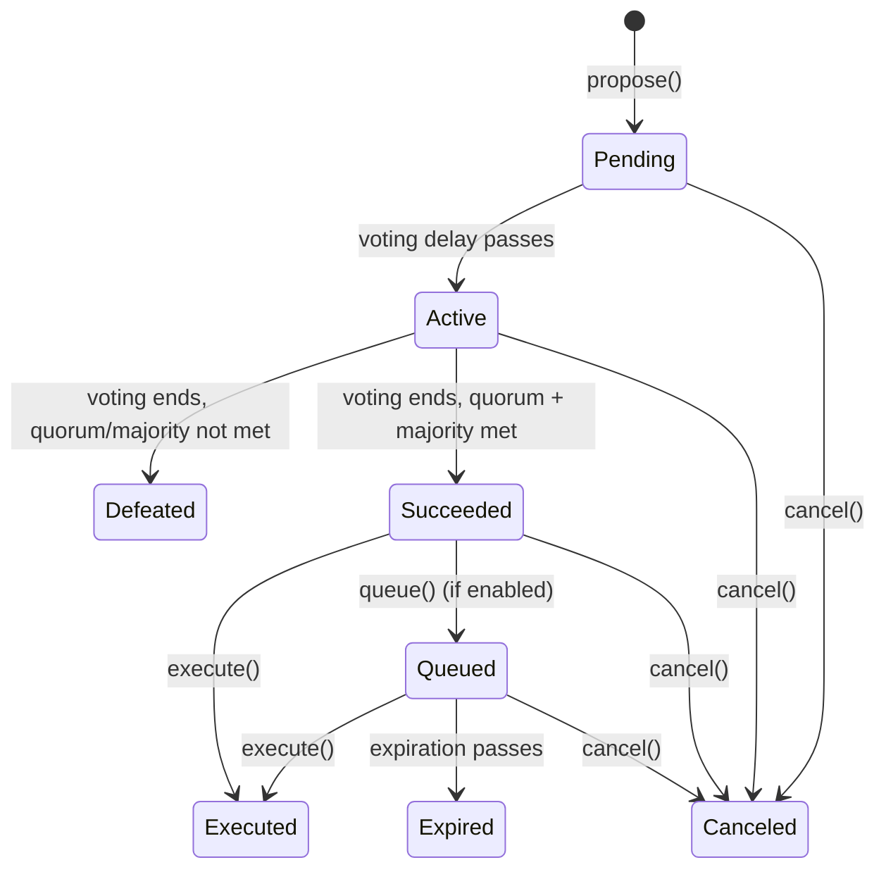

[Source Code](https://github.com/OpenZeppelin/stellar-contracts/tree/main/packages/governance/src/governor)

## Overview

The Governor module brings on-chain governance to Soroban contracts. It enables a community of token holders to collectively decide on protocol changes — proposing actions, debating them through votes, and executing the result on-chain — all without a centralized authority.

A typical governance system involves two contracts working together:

- A **token contract** with the [Votes](/stellar-contracts/governance/votes) extension, which tracks who holds voting power and allows delegation.
- A **governor contract** implementing the `Governor` trait, which manages the proposal lifecycle: creation, voting, counting, and execution.

The Governor does not store or manage voting power directly. Instead, it references the token contract and queries it for historical voting power at specific ledgers. This separation keeps each contract focused on its own concern.

## How Governance Works

### The Proposal Lifecycle

Every governance action starts as a **proposal** — a bundle of on-chain calls (targets, functions, arguments) paired with a human-readable description. Here is how a proposal moves through the system:



1. **Propose**: Anyone with enough voting power (above the `proposal_threshold`) creates a proposal. A **voting delay** begins — a buffer period that gives token holders time to acquire tokens or delegate before the vote opens.

2. **Vote**: Once the delay passes, the proposal becomes **Active** and token holders can vote: Against (0), For (1), or Abstain (2). Each voter's power is looked up at the snapshot ledger (when the voting period started), not at the moment they vote. This prevents flash loan attacks.

3. **Succeed or Defeat**: When the **voting period** ends, the system checks two conditions:
   - **Majority**: Do `for` votes strictly exceed `against` votes?
   - **Quorum**: Does the sum of `for` and `abstain` votes meet or exceed the required quorum?

   If both conditions are met, the proposal moves to **Succeeded**. Otherwise, it is **Defeated**.

4. **Execute**: A succeeded proposal can be executed, which triggers the on-chain calls it contains. Who can call `execute` is up to the implementer — it can be open to anyone or restricted to a specific role.

5. **Cancel**: The proposer (or another authorized role) can cancel a proposal at any point before it is executed, expired, or already cancelled.

### Optional: Queuing with a Timelock

For systems that need a safety delay between a successful vote and execution, the Governor supports an optional **queue** step. When enabled, succeeded proposals must first be queued, which starts a timelock delay. During this delay, community members can review the upcoming change and exit the protocol if they disagree.

This flow becomes: **Propose → Vote → Queue → Execute**

To enable queuing, override `proposals_need_queuing` to return `true`. See [Design Rationale](#queue-logic-is-built-in-but-disabled-by-default) for why this is built into the base trait.

## Voting and Counting

### How Votes Are Counted

The default counting mode is **simple counting**:

| Vote Type | Value | Meaning |
|-----------|-------|---------|
| Against | 0 | Opposes the proposal |
| For | 1 | Supports the proposal |
| Abstain | 2 | Counted toward quorum but not toward majority |

A proposal succeeds when `for > against` **and** the quorum is reached. Quorum values are stored as checkpoints, so updating the quorum does not retroactively change the outcome of existing proposals.

### Custom Counting Strategies

The counting logic is fully pluggable. The default three-type system works for most cases, but you can override the counting methods (`count_vote`, `tally_succeeded`, `quorum_reached`) to implement alternative strategies such as fractional voting or weighted quorum relative to total supply. The `counting_mode()` method returns a symbol identifying the active strategy, which UIs can use for display purposes.

### Dynamic Quorum

The default `quorum()` uses a fixed checkpoint-based value. For supply-relative quorum (e.g., "10% of total supply"), override `quorum()` to compute the value dynamically.

<Callout>
When overriding `quorum()`, ensure that configurable parameters are themselves queried at the historical ledger to avoid retroactively changing the outcome of existing proposals.
</Callout>

## Design Rationale

### Voting Power Lives on the Token

The `Governor` trait does not include vote-querying methods. Instead, voting power is managed entirely by a separate token contract implementing the [Votes](/stellar-contracts/governance/votes) trait. The Governor references this token via `get_token_contract()` and queries it for voting power at specific ledgers. This keeps the Governor focused on proposal lifecycle and counting, while the token handles delegation and checkpointing.

### Queue Logic is Built-In but Disabled by Default

Queuing is integrated into the base `Governor` trait rather than being an external module. This is a deliberate choice: queue state transitions are tightly coupled with the proposal lifecycle — `execute` must know whether to expect a `Succeeded` or `Queued` state, and `proposal_state` must be able to return `Queued` and `Expired` variants. Extracting this into a separate module would force implementers to manually wire these interactions.

By default, `proposals_need_queuing()` returns `false`, making queue logic inert. To enable queuing (e.g., for integration with a [Timelock Controller](/stellar-contracts/governance/timelock-controller)), simply override this single method to return `true`. This activates the full queuing flow — `queue()` transitions proposals from `Succeeded` to `Queued`, and `execute()` then requires the `Queued` state — without touching proposal creation, voting, or execution logic.

### Execution and Cancellation Require Implementation

The `execute` and `cancel` functions have no default implementation. Access control for these operations varies significantly between deployments — an open governance system may allow anyone to trigger execution, while a guarded system may restrict it to a timelock contract or admin role. Forcing an explicit implementation ensures the developer consciously decides their authorization model rather than inheriting a default that may not fit.

Note that the `executor` parameter in `execute` represents the account *triggering* execution, not the entity performing the underlying calls — the Governor contract itself is the caller of the target contracts.

## Security Considerations

### Flash Loan Voting Attack

An attacker could borrow voting tokens, vote, and return them within the same transaction. This implementation mitigates this with **snapshot-based voting power**:

1. **Proposer snapshot** (`current_ledger - 1`): Prevents flash-loaning tokens and creating a proposal in the same transaction.
2. **Voter snapshot** (`vote_start`): Voters' power is looked up at the `vote_start` ledger. Since checkpoints record state after all transactions in a ledger are finalized, a flash loan within the same ledger shows a net-zero balance.

### Proposal Spam

The **proposal threshold** requires proposers to hold a minimum amount of voting power, making spam attacks economically costly.

### Governance Capture

- **Quorum requirements** ensure minimum participation
- **Voting delay** gives token holders time to position themselves before voting starts

## The Governor Trait

The `Governor` trait defines the full governance interface. Most methods have default implementations — you only need to implement `execute` and `cancel` (for access control) and optionally override configuration methods.

### Configuration

```rust
fn name(e: &Env) -> String;
fn version(e: &Env) -> String;
fn voting_delay(e: &Env) -> u32;          // ledgers before voting starts
fn voting_period(e: &Env) -> u32;         // ledgers during which voting is open
fn proposal_threshold(e: &Env) -> u128;   // minimum voting power to propose
fn get_token_contract(e: &Env) -> Address; // the Votes-enabled token contract
fn counting_mode(e: &Env) -> Symbol;      // identifies the counting strategy
fn proposals_need_queuing(e: &Env) -> bool; // defaults to false
```

### Proposal Lifecycle

```rust
fn propose(e: &Env, targets: Vec<Address>, functions: Vec<Symbol>,
    args: Vec<Vec<Val>>, description: String, proposer: Address) -> BytesN<32>;

fn cast_vote(e: &Env, proposal_id: BytesN<32>, vote_type: u32,
    reason: String, voter: Address) -> u128;

fn queue(e: &Env, targets: Vec<Address>, functions: Vec<Symbol>,
    args: Vec<Vec<Val>>, description_hash: BytesN<32>,
    eta: u32, operator: Address) -> BytesN<32>;

fn execute(e: &Env, targets: Vec<Address>, functions: Vec<Symbol>,
    args: Vec<Vec<Val>>, description_hash: BytesN<32>,
    executor: Address) -> BytesN<32>;  // no default — must implement

fn cancel(e: &Env, targets: Vec<Address>, functions: Vec<Symbol>,
    args: Vec<Vec<Val>>, description_hash: BytesN<32>,
    operator: Address) -> BytesN<32>;  // no default — must implement
```

### Query Methods

```rust
fn has_voted(e: &Env, proposal_id: BytesN<32>, account: Address) -> bool;
fn quorum(e: &Env, ledger: u32) -> u128;
fn proposal_state(e: &Env, proposal_id: BytesN<32>) -> ProposalState;
fn proposal_snapshot(e: &Env, proposal_id: BytesN<32>) -> u32;
fn proposal_deadline(e: &Env, proposal_id: BytesN<32>) -> u32;
fn proposal_proposer(e: &Env, proposal_id: BytesN<32>) -> Address;
fn get_proposal_id(e: &Env, targets: Vec<Address>, functions: Vec<Symbol>,
    args: Vec<Vec<Val>>, description_hash: BytesN<32>) -> BytesN<32>;
```

The proposal ID is a deterministic keccak256 hash of the proposal parameters, allowing anyone to compute it without storing the full proposal data.

### Proposal States

```rust
pub enum ProposalState {
    Pending = 0,    // Voting has not started
    Active = 1,     // Voting is ongoing
    Defeated = 2,   // Voting ended without success
    Canceled = 3,   // Cancelled by authorized account
    Succeeded = 4,  // Met quorum and vote thresholds
    Queued = 5,     // Queued for execution (via extension)
    Expired = 6,    // Expired after queuing (via extension)
    Executed = 7,   // Successfully executed
}
```

States are divided into **time-based** (Pending, Active, Defeated) — derived from the current ledger, never stored — and **explicit** (all others) — persisted in storage, taking precedence once set.

## Example

```rust
use soroban_sdk::{contract, contractimpl, Address, BytesN, Env, String, Symbol, Val, Vec};
use stellar_governance::governor::{self, storage, Governor, hash_proposal, get_proposal_snapshot};

#[contract]
pub struct MyGovernor;

#[contractimpl]
impl Governor for MyGovernor {
    // Open execution — anyone can trigger a succeeded proposal
    fn execute(
        e: &Env,
        targets: Vec<Address>,
        functions: Vec<Symbol>,
        args: Vec<Vec<Val>>,
        description_hash: BytesN<32>,
        _executor: Address,
    ) -> BytesN<32> {
        let proposal_id = hash_proposal(e, &targets, &functions, &args, &description_hash);
        let quorum = Self::quorum(e, get_proposal_snapshot(e, &proposal_id));
        storage::execute(
            e, targets, functions, args, &description_hash,
            Self::proposals_need_queuing(e), quorum,
        )
    }

    // Only the original proposer can cancel
    fn cancel(
        e: &Env,
        targets: Vec<Address>,
        functions: Vec<Symbol>,
        args: Vec<Vec<Val>>,
        description_hash: BytesN<32>,
        operator: Address,
    ) -> BytesN<32> {
        let proposal_id = storage::hash_proposal(
            e, &targets, &functions, &args, &description_hash,
        );
        let proposer = storage::get_proposal_proposer(e, &proposal_id);
        assert!(operator == proposer);
        operator.require_auth();
        storage::cancel(e, targets, functions, args, &description_hash)
    }
}
```

## See Also

- [Votes](/stellar-contracts/governance/votes)
- [Timelock Controller](/stellar-contracts/governance/timelock-controller)
- [Fungible Token](/stellar-contracts/tokens/fungible/fungible)
