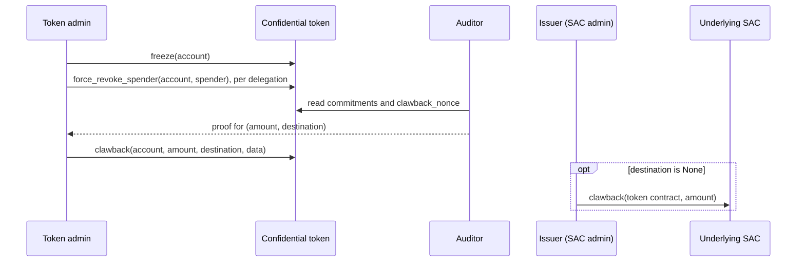

[Source Code](https://github.com/OpenZeppelin/stellar-contracts/tree/main/packages/confidential/src/compliance)

Clawback seizes value from a single frozen confidential account. It reduces the account's confidential claim by a
public amount, proves that amount doesn't exceed what the account holds, and settles the matching underlying
tokens over a public path. The name mirrors clawback on Stellar Classic and SAC assets, but the mechanism is
separate: it is delivered by the opt-in `ConfidentialClawback` trait of the [compliance extension](/stellar-contracts/tokens/confidential/compliance).
A deployment that doesn't implement the trait has no seizure capability at all.

## The Pooled-Custody Problem

Once a user deposits, the underlying SEP-41 ledger lists the confidential token contract as the holder of those
funds, not the depositor. All deposits sit in one pooled balance. An issuer's SAC-level `clawback` against the
contract's address would debit the whole pool and, with it, every holder. Seizing from one account therefore has to
happen at the confidential layer, by reducing that account's committed claim.

The contract doesn't know the target's balance: it stores only commitments. So the amount has to be checked against
the committed values without revealing them, and without trusting the admin's word for them. That check is the job
of the clawback proof.

## Roles

Seizure is coordinated between parties and no single one can carry it out alone:

| Role | Decides | Does |
| ---- | ------- | ---- |
| **Token admin** | *Whether* to seize | Freezes the account, then authorizes `force_revoke_spender` and `clawback` through the deployment's access control. |
| **Auditor** | *How much* and *where to* | Holds the secret key of the auditor the account is bound to, plus the openings of the account's balances. Produces the proof, which binds the amount and the destination. |
| **Issuer** (SAC admin) | How the pool is reconciled | When the underlying is a SAC and the seizure leaves the funds in the pool, extracts the surplus with the SAC's own `clawback`. |

The admin cannot produce the proof and the auditor cannot pass the admin's access check. Deployments usually give
the seizure authority its own role, separate from the role that freezes accounts.

The proof has to come from the auditor. Knowing an account's balance isn't enough. An account whose history is
only registration, deposits, and merges has balances anyone can reconstruct from public events. The circuit
therefore also requires the auditor's secret key, which stops anyone else from proving a seizure of such an account.

## Usage

`ConfidentialClawback` extends `ConfidentialCompliance`, and its two write methods have no default body, for the
same reason. Building on the contract from the [Compliance](/stellar-contracts/tokens/confidential/compliance#usage)
page, with a dedicated `clawback` role:

```rust
use stellar_confidential::{
    compliance::{ClawbackData, ConfidentialClawback},
    storage::decode_data,
};

#[contractimpl(contracttrait)]
impl ConfidentialClawback for ConfidentialTokenContract {
    #[only_role(operator, "clawback")]
    fn clawback(
        e: &Env,
        account: Address,
        amount: i128,
        destination: Option<Address>,
        data: Bytes,
        operator: Address,
    ) {
        let data: ClawbackData = decode_data(e, &data);
        compliance::clawback(e, &account, amount, &destination, &data.proof);
    }

    #[only_role(operator, "clawback")]
    fn force_revoke_spender(e: &Env, account: Address, spender: Address, operator: Address) {
        compliance::force_revoke_spender(e, &account, &spender);
    }
}
```

The `data` argument is an XDR-encoded `ClawbackData { proof }`, not the raw proof bytes. A malformed envelope fails
with `InvalidData`. The verifier also needs the `Clawback` key registered (see
[Registering Verification Keys](/stellar-contracts/tokens/confidential/proof-system#registering-verification-keys)).

The trait also provides `clawback_nonce(account)`, a read that returns how many seizures the account has been
through. The auditor reads it into each new proof (see [Replay Protection](#replay-protection)).

<Callout type="warning">
The freeze precondition only protects the seizure if frozen accounts are actually blocked. The trait bounds don't
enforce this. With `type Hooks = NoHooks`, `freeze` sets a flag that nothing checks, and the target can move its
balance before the seizure lands. The only sign is an `InvalidProof` error. A deployment that implements
`ConfidentialClawback` has to wire `ComplianceHooks`, or a custom `Hooks` that rejects frozen accounts in every
balance-moving callback.
</Callout>

## Seizure Flow



When `clawback` is called, after the access check on `operator`, the contract:

1. **Checks preconditions.** The account must be frozen (`AccountNotFrozen`), `amount` must be strictly positive
   (`InvalidClawbackAmount`), and `destination` must not be the token contract itself (`InvalidClawbackDestination`).
2. **Builds the public inputs** entirely from on-chain state and the call arguments: both of the account's
   commitments, the key of its auditor, the amount, the contract and account addresses, the destination, and the
   account's clawback nonce.
3. **Verifies the proof** against the clawback circuit. The proof shows that the prover holds the auditor's secret
   key, knows the openings of both balances, and that `amount` is no more than spendable plus receiving.
4. **Updates the balances.** The receiving balance is merged into the spendable balance and `amount` is debited, with
   no fresh randomness. The owner and the auditor can both compute the new opening from the public `amount`, so the
   account stays usable once it is unfrozen.
5. **Advances the clawback nonce**, then settles the underlying (below) and emits a `Clawback` event with topics
   `"clawback"` and `account`, and data `amount` and `destination`.

Error codes are listed under [Errors](/stellar-contracts/tokens/confidential/compliance#errors).

Like `force_revoke_spender`, `clawback` runs no `Hooks` callback: a freeze-aware hook would reject the very account
it acts on.

## Settlement

The `destination` argument, bound into the proof by the auditor, decides what happens to the underlying tokens:

| `destination` | Underlying | Pool afterwards |
| ------------- | ---------- | --------------- |
| `Some(d)` | Exactly `amount` is transferred to `d` in the same call. | Still equals the sum of all confidential claims. |
| `None` | Nothing moves. | Holds `amount` more than the claims against it, until the issuer extracts the surplus. |

`d` goes through no compliance check: the auditor chose it when building the proof, and the operator confirms it as
an argument. A proof built for one destination cannot be submitted with another. The underlying's own rules still
apply to the transfer: on a SAC, `d` has to be authorized for the asset (for a `G...` account, an authorized
trustline), or the whole seizure reverts.

`None` relies on the issuer being able to extract the surplus:

- The underlying has to be a SAC whose issuer enabled clawback (`AUTH_CLAWBACK_ENABLED`) before the token
  contract's first deposit. The SAC fixes a contract balance's clawback flag when the balance is created, so
  enabling it later doesn't help.
- Over native XLM or a plain SEP-41 token, nothing can extract the surplus, because the contract has no sweep
  function. Use `Some(d)` there.

<Callout type="warning">
With `destination = None`, **seize first, then extract.** The confidential seizure and the issuer's SAC `clawback`
against the token contract's address are separate transactions, and nothing in the contract enforces their order.
Seizing first leaves the pool briefly over-collateralized, which harms no one. Extracting first leaves it short, and
the holders who withdraw last bear the shortfall. The shortfall becomes permanent if the seizure never goes through,
for example because the auditor produces no proof. An issuer that extracts more than the accumulated surplus creates
the same shortfall.
</Callout>

## Forced Revocation

`clawback` only sees the account's spendable and receiving balances. Allowances escrowed to spenders are out of its
reach. `force_revoke_spender(account, spender, operator)` brings them back. On a frozen account, it performs the
same proofless fold as the owner's `revoke_spender`, under the admin's authorization instead of the owner's. It
emits the same `RevokeSpender` event. Expired delegations can be revoked too: expiry blocks spending, not reclaiming.

Revocation changes the spendable balance, so revoke every delegation **before** the auditor builds the proof. The
auditor's opening survives the fold only if it observed the delegation's last `SetSpender` or `SpenderTransfer`
event (see [Auditing](/stellar-contracts/tokens/confidential/auditing#spender-auditing)).

The contract keeps no list of an account's delegations. Find the spenders from the account's `SetSpender` and
`RevokeSpender` events, and confirm each one with `get_spender_delegation`. The freeze blocks new delegations, so
the list can't grow during the seizure. A delegation that is left out isn't seized, and its spender can use it again
once the account is unfrozen, unless it has expired.

## Replay Protection

Both commitments are public inputs of the proof. Any change between building the proof and submitting it, such as an
inbound transfer, a merge, or a revocation, makes verification fail with `InvalidProof`. The freeze holds the
commitments still during that window. An auditor key rotation in the same window also invalidates the proof.

Matching commitments alone don't prove a proof is fresh. A seizure of `amount` followed by a credit of the same
`amount` with zero blinding can restore the exact commitments the old proof was built against. The **clawback
nonce** closes that gap: it is part of every proof and advances on each seizure, so a proof can execute at most once.

## Wallet and Auditor Consequences

Owners and auditors apply a `Clawback` event as a merge followed by a public debit of `amount`. The event carries no
encrypted balance, so it doesn't count as a checkpoint for the auditor. It resets the receiving side like a merge
does, and the account's next withdrawal, outgoing transfer, or `set_spender` re-anchors the spendable side as usual.
A `RevokeSpender` emitted by `force_revoke_spender` looks exactly like one initiated by the owner.

Wallets, auditors, and indexers have to archive `Clawback` events with the rest of an account's history: recovering
a balance depends on them. See [Indexing and Recovery](/stellar-contracts/tokens/confidential/indexing).

The [clawback specification](https://github.com/OpenZeppelin/stellar-contracts/blob/main/packages/confidential/docs/compliance.md#clawback)
covers the circuit and the contract flow in full.
