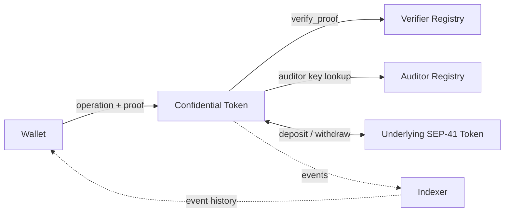

[Source Code](https://github.com/OpenZeppelin/stellar-contracts/tree/main/packages/confidential)

The Confidential Token adds private balances and transfers to any SEP-41 token. Users deposit regular tokens
into a confidential token contract, and from that point on their balances and the amounts they transfer are hidden
from the public while remaining fully verifiable by the network. Every operation that spends private state carries
a zero-knowledge proof that the contract verifies on-chain before updating any balance.

The module provides **confidentiality, not anonymity**: sender and recipient addresses stay visible on-chain,
while amounts and balances do not.

## Overview

The [confidential](https://github.com/OpenZeppelin/stellar-contracts/tree/main/packages/confidential)
module wraps an existing SEP-41 token rather than replacing it. Balances are stored as Pedersen commitments on the
Grumpkin curve, which the contract updates homomorphically (by adding and replacing curve points) without ever
learning the amounts behind them. Recipients and auditors recover the amounts that concern them by decrypting
ciphertexts published in the contract's events.

| Hidden                                                      | Visible                                                                         |
| ----------------------------------------------------------- | ------------------------------------------------------------------------------- |
| Balances (spendable, receiving, and spender allowances)     | Sender and recipient addresses of every operation                               |
| Amounts moved by confidential transfers                     | Deposit and withdrawal amounts, since they cross into or out of the public token |
|                                                             | Which operation was called, and when                                            |

Building confidentiality as a separate contract has several advantages:

- **Works with any SEP-41 token**, including XLM through its Stellar Asset Contract (SAC). No changes are required
  from the issuer, as long as the token satisfies the [underlying token requirements](#underlying-token-requirements).
- **Evolves independently** of the token standard: upgrades to the privacy layer never touch the underlying asset.
- **Is opt-in**: the underlying token keeps working as it does today, and users choose when to move funds into
  and out of the confidential layer.

## Architecture

### Core Components

A deployment consists of three contracts wired together:

- **Confidential Token**: Implements the `ConfidentialToken` trait. It holds all deposited tokens in a single pooled
  balance, stores one `ConfidentialAccount` per registered address and one `SpenderDelegation` per owner-spender pair,
  and calls the verifier for every operation that requires a proof.
- **Auditor Registry**: Implements the `ConfidentialAuditor` trait and stores auditor public keys indexed by
  `auditor_id`. A single registry can serve many tokens. See [Auditing](/stellar-contracts/tokens/confidential/auditing).
- **Verifier Registry**: Implements the `ConfidentialVerifier` trait and stores one UltraHonk verification key per
  circuit. It can be shared by every token that runs the same protocol version.
  See [Proof System](/stellar-contracts/tokens/confidential/proof-system).



### Off-Chain Components

Because the contract never sees balances or confidential transfer amounts, a large part of the protocol runs on the
client:

- **Wallet**: Derives keys, generates proofs, decrypts events, and tracks the openings (value and blinding factor)
  of the account's commitments. See [Wallet Integration](/stellar-contracts/tokens/confidential/wallet-integration).
- **Indexer**: A durable archive of the contract's events, which wallets and auditors need to recover state.
  See [Indexing and Recovery](/stellar-contracts/tokens/confidential/indexing).
- **Circuits**: Six Noir circuits compiled to UltraHonk, shipped in the
  [`circuits`](https://github.com/OpenZeppelin/stellar-contracts/tree/main/packages/confidential/circuits)
  directory together with their pinned verification keys.

<Callout type="info">
The library ships the on-chain modules (traits and storage helpers), example auditor and verifier registry contracts
under [`examples/confidential`](https://github.com/OpenZeppelin/stellar-contracts/tree/main/examples/confidential),
and the Noir circuits. The client SDK, the indexer, and the
[selective disclosure](/stellar-contracts/tokens/confidential/selective-disclosure) layer are specified in the
[protocol documentation](https://github.com/OpenZeppelin/stellar-contracts/blob/main/packages/confidential/docs/README.md)
but are not part of the library.
</Callout>

## Key Concepts

| Concept                   | Description                                                                                                                                                                                                                         |
| ------------------------- | ----------------------------------------------------------------------------------------------------------------------------------------------------------------------------------------------------------------------------------- |
| **Commitment**            | A balance stored as a single curve point `C = v·G + r·H`. The contract sees only the point; the opening `(v, r)` lives in the owner's wallet.                                                                                        |
| **Spendable balance**     | The part of an account's funds available for transfers and withdrawals. Only operations the owner authorizes modify it, apart from the [compliance extension](/stellar-contracts/tokens/confidential/clawback)'s seizure functions. |
| **Receiving balance**     | A separate accumulator where incoming deposits and transfers land.                                                                                                                                                                 |
| **Merge**                 | An owner-authorized operation that folds the receiving balance into the spendable balance. It requires no proof.                                                                                                                  |
| **Zero-knowledge proof**  | Generated by the wallet and attached to an operation. It proves the operation is valid (sufficient funds, correct balance updates, honest encryption) without revealing any amount. See [Zero-Knowledge Setting](#zero-knowledge-setting) for the current status. |
| **Auditor**               | A key chosen by each account at registration. Every transfer (direct or by a spender), withdrawal, and spender setup produces ciphertexts that this key can decrypt.                                                          |
| **Spender**               | A registered address authorized by an owner to spend from a capped, time-limited allowance. See [Spenders](/stellar-contracts/tokens/confidential/spenders).                                                                      |

## Installation

The confidential token lives in its own crate, `stellar-confidential`, separate from `stellar-tokens`. The crate is
not published on crates.io yet, because its UltraHonk verifier backend is itself a git dependency. Add it from the
repository, pinned to a commit:

```toml
[dependencies]
# Use the soroban-sdk version that stellar-contracts uses at the pinned commit.
soroban-sdk = { version = "28.0.0", features = ["alloc"] }
stellar-confidential = { git = "https://github.com/OpenZeppelin/stellar-contracts", rev = "<commit>" }
```

The verifier backend links Rust's `alloc` crate, so every contract that depends on `stellar-confidential` (the token
and both registries) must provide exactly one global allocator. Either enable the `alloc` feature of `soroban-sdk`, as
above, or register your own `#[global_allocator]`, but not both. Without an allocator, the wasm build fails with
`no global memory allocator found but one is required`. See
[Packaging](https://github.com/OpenZeppelin/stellar-contracts/blob/main/packages/confidential/README.md#packaging)
for the reasons behind this setup.

## Usage

Deploying a confidential token involves three steps:

1. Deploy the verifier registry and register the verification key of each circuit.
   See [Proof System](/stellar-contracts/tokens/confidential/proof-system).
2. Deploy an auditor registry, or reuse an existing one, and register at least one auditor key.
   See [Auditing](/stellar-contracts/tokens/confidential/auditing).
3. Deploy the confidential token, passing the underlying token, the verifier registry, and the auditor registry
   to its constructor.

Here's what a basic confidential token contract looks like:

```rust
use soroban_sdk::{contract, contractimpl, Address, Bytes, Env};
use stellar_confidential::{
    storage as confidential, ConfidentialAccount, ConfidentialToken, NoHooks, SpenderDelegation,
}; // `Bytes`, `ConfidentialAccount` and `SpenderDelegation` are used by the trait's default methods

#[contract]
pub struct ConfidentialTokenContract;

#[contractimpl]
impl ConfidentialTokenContract {
    pub fn __constructor(e: &Env, underlying_asset: Address, verifier: Address, auditor: Address) {
        // The SEP-41 token being wrapped. Set once; cannot be changed.
        confidential::set_underlying_asset(e, &underlying_asset);
        // The verifier and auditor registries.
        confidential::set_verifier(e, &verifier);
        confidential::set_auditor(e, &auditor);
        // Binds every proof to this contract's address. Set once; cannot be changed.
        confidential::set_address_as_field_element(e);
    }
}

#[contractimpl(contracttrait)]
impl ConfidentialToken for ConfidentialTokenContract {
    type Hooks = NoHooks;
}
```

The `ConfidentialToken` trait provides default implementations for every entry point: `register`, `deposit`,
`merge`, `withdraw`, `confidential_transfer`, `confidential_transfer_from`, `set_spender`, `revoke_spender`, and the
read methods. Each state-changing entry point authorizes the caller, decodes the `data: Bytes` payload built by the
wallet, runs the matching hook, verifies the proof when one is required, and applies the state change.
See [Operations](/stellar-contracts/tokens/confidential/operations) for what each one does.

### Initialization

The setters in `storage` bypass authorization checks and should only be called from the constructor or from
admin functions that implement their own access control:

- `set_underlying_asset` and `set_address_as_field_element` are **single-shot**: a second call reverts.
  The address field is derived from the contract's own address and bound into every account's key derivation,
  so changing it would invalidate every registered account.
- `set_verifier` and `set_auditor` can be called again. Rotating either one changes which proofs the contract
  accepts or which keys auditor ciphertexts are encrypted under, so any rotation path should sit behind a
  multisig or a timelock. The strongest posture is not to expose one at all. A new auditor registry also
  re-points every account's `auditor_id`: an account whose id is missing from it can no longer spend. Either
  rotation also invalidates proofs that are in flight, which wallets then rebuild with a fresh salt.

## Hooks

The `Hooks` associated type is the extension point of the token. Its callbacks run at every state-changing entry point,
after authorization and payload decoding, and before any state is modified:

- `on_register`, `on_deposit`, `on_merge`, `on_withdraw`
- `on_transfer`, `on_spender_transfer`
- `on_set_spender`, `on_revoke_spender`

Callbacks of operations that carry a payload receive the decoded payload (the proof itself is not forwarded).
Every callback has an empty default body, so an implementation overrides only what it needs, and rejects an operation
by panicking with an error.

Two implementations are provided:

- `NoHooks`: every callback is a no-op. Use it for deployments without additional controls.
- `ComplianceHooks`: account freezing, SAC authorization passthrough, and an external authorization policy.
  See [Compliance](/stellar-contracts/tokens/confidential/compliance).

For pure observability, subscribe to the token's events instead of implementing a hook.

## Underlying Token Requirements

The contract credits and debits confidential balances by the exact amount it passes to the underlying token's
`transfer`, without re-measuring its own balance. The underlying token must therefore:

- **Move exactly the requested amount**: no fee deducted in transit.
- **Not rebase**: the contract's balance changes only through transfers the contract itself initiates.
- **Revert on failure**: a failed `transfer` must revert the whole `deposit` or `withdraw`.

The Stellar Asset Contract and the OpenZeppelin [Fungible Token](/stellar-contracts/tokens/fungible/fungible) meet
these requirements. Wrapping any other token is the deployer's responsibility.

<Callout type="warning">
When the underlying token is a SAC, its issuer has two powers over the contract's pooled balance.
**Freezing or deauthorizing** the contract's address blocks every deposit and withdrawal for all holders until it
is lifted; confidential transfers between registered accounts keep working. **Clawing back** from the contract's
address removes value from the pool, leaving it holding less than the sum of all confidential balances: withdrawals
become first-come-first-served, and whoever exits last cannot fully redeem. See
[Clawback](/stellar-contracts/tokens/confidential/clawback) for how to seize funds from one account without
creating a shortfall for everyone else.
</Callout>

## Security Considerations

### Zero-Knowledge Setting

<Callout type="warning">
The on-chain verifier currently implements only the non-zero-knowledge UltraHonk flavor, so proofs are generated
without the zero-knowledge setting and carry no witness-hiding guarantee: a proof can leak information about its
private inputs, which include keys, balances, blinding factors, and amounts. Until the verifier supports the
zero-knowledge flavor, the confidentiality of balances and amounts is not backed by the proof system. The proving
recipe is provisional and will be finalized together with the verifier. See
[Generating Proofs](/stellar-contracts/tokens/confidential/proof-system#generating-proofs) for the current status.
</Callout>

### Verification Keys

Soundness rests on the verification keys in the verifier registry matching the intended circuits. A wrong key makes
the contract accept forged proofs, so updating a key should be treated as a break-glass operation.
See [Proof System](/stellar-contracts/tokens/confidential/proof-system).

### Griefing Resistance

Incoming deposits and transfers only touch the recipient's receiving balance, while spend proofs reference only the
spendable balance. A third party can therefore not invalidate an owner's in-flight proof by sending funds, and
cannot trigger a merge on someone else's account since merging requires the owner's authorization.

### Replay Protection

Every spend proof takes the current on-chain commitment as a public input, and a successful operation replaces that
commitment. A replayed proof references a commitment that no longer exists and fails verification, so no separate
nonce is needed.

### Key Custody

A viewing key cannot move funds, but it is not a safely shareable read-only credential. Whoever holds it can read
the account's balances and incoming amounts, and can retroactively open the commitments of the transfers the
account sent. Auditor keys deserve the same level of custody. To prove a single fact to a third party, use
[selective disclosure](/stellar-contracts/tokens/confidential/selective-disclosure) instead of sharing a key.

### Confidentiality Limits

Addresses are public, and so are the amounts that enter and leave through `deposit` and `withdraw`. Correlating
those amounts over time can reveal information that the confidential layer otherwise hides, so integrations
should not assume that every amount is private.

## TTL Management

Accounts and spender delegations live in persistent storage. Whenever an operation reads one, the library extends
its TTL back to 30 days once fewer than 29 remain. A new entry starts with the network's minimum persistent TTL
until an operation first reads it. An entry that is not touched for longer than its TTL is archived and must be
restored before its next use.

The underlying token, verifier, auditor, and address field are stored in **instance storage**, whose TTL is the
responsibility of the deployer, as with every other module in this library.

## Specification

This documentation covers what is needed to deploy and integrate the module. The normative
[protocol specification](https://github.com/OpenZeppelin/stellar-contracts/blob/main/packages/confidential/docs/README.md)
covers the cryptographic construction, every circuit constraint, and the companion specifications for compliance,
the SDK, indexing, and selective disclosure.
