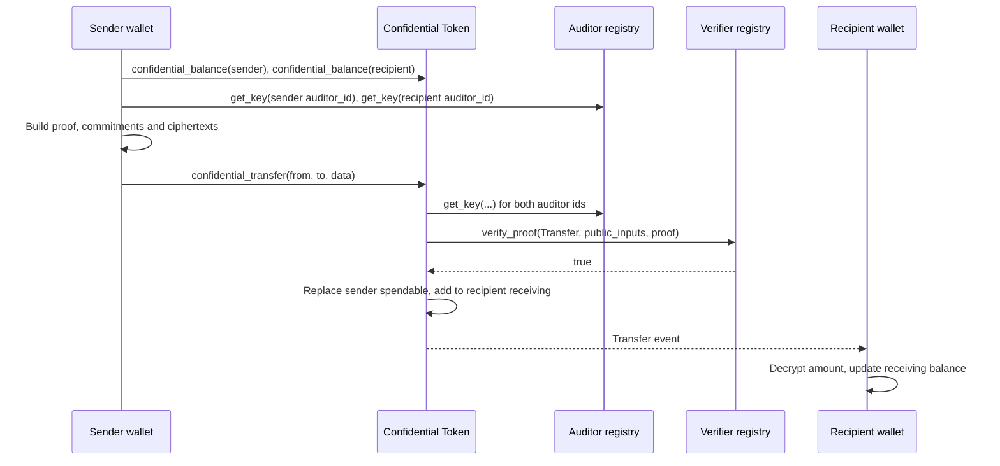

[Source Code](https://github.com/OpenZeppelin/stellar-contracts/tree/main/packages/confidential)

The `ConfidentialToken` trait exposes eight state-changing entry points and three read methods. Every
state-changing entry point authorizes its caller with `require_auth()`. Operations that consume private state also
carry a zero-knowledge proof, which the token checks through the
[verifier registry](/stellar-contracts/tokens/confidential/proof-system) before changing any storage.

This page covers the owner's lifecycle: registering, moving value in and out, and transferring.
Delegated spending has its own page: [Spenders](/stellar-contracts/tokens/confidential/spenders).

## Entry Points

| Function | Authorized by | Proof | Effect |
| --- | --- | --- | --- |
| `register(account, auditor_id, data)` | `account` | Yes | Creates the confidential account, with both balances at zero |
| `deposit(from, to, amount)` | `from` | No | Pulls `amount` of the underlying token into the contract and credits `to`'s receiving balance |
| `merge(account)` | `account` | No | Moves the receiving balance into the spendable balance |
| `confidential_transfer(from, to, data)` | `from` | Yes | Debits `from`'s spendable balance and credits `to`'s receiving balance with a hidden amount |
| `withdraw(from, to, amount, data)` | `from` | Yes | Debits `from`'s spendable balance and sends `amount` of the underlying token to `to` |
| `set_spender(account, spender, live_until_ledger, data)` | `account` | Yes | Locks part of the spendable balance into an allowance for `spender` |
| `confidential_transfer_from(spender, from, to, data)` | `spender` | Yes | Spends from the allowance `from` granted to `spender` |
| `revoke_spender(account, spender)` | `account` | No | Returns the remaining allowance to the spendable balance |

Each entry point checks authorization first, then decodes `data`, then runs the deployment's
[`Hooks`](/stellar-contracts/tokens/confidential/confidential#hooks) callback, then hands off to the storage layer. The
storage layer verifies the proof, updates state and emits the event.

## Spendable and Receiving Balances

Every account holds two balances, each stored as a Pedersen commitment `C = v·G + r·H` that hides the
value `v` behind a blinding factor `r`:

- **Spendable balance**: what the owner can send, withdraw, or delegate. Only operations the owner
  authorizes can change it, except in deployments with the compliance extension, where the admin's
  [`clawback`](/stellar-contracts/tokens/confidential/clawback) and `force_revoke_spender` can too.
- **Receiving balance**: where deposits and incoming transfers land. The contract adds to it
  homomorphically, with no proof or action from the recipient.

The split prevents griefing. A spend proof references the spendable commitment as it is on-chain when
the proof is built. Incoming transfers touch only the receiving commitment, so no other user can
change the commitment an in-flight proof references. An account can also receive any number of transfers
without the owner having to do anything. See
[Griefing Resistance](https://github.com/OpenZeppelin/stellar-contracts/blob/main/packages/confidential/docs/protocol/security.md#griefing-resistance).

A proof is also tied to the auditor keys and the verification key in force when it is built. If the
deployment rotates an [auditor key](/stellar-contracts/tokens/confidential/auditing#key-rotation) or the
[verifier](/stellar-contracts/tokens/confidential/proof-system#updating-a-verification-key) while a proof
is in flight, the call reverts with `InvalidProof` and no state change. The wallet rebuilds the proof with a
fresh salt and resubmits.

The cost is that received funds must be merged before they can be spent.

## Register

An account must register before it can receive deposits or transfers. The wallet derives a spending
key and a viewing key from a single secret (see [Wallet Integration](/stellar-contracts/tokens/confidential/wallet-integration))
and proves the two public keys are well formed and tied to this token contract.

The caller also picks an `auditor_id`. It must exist in the auditor registry; an unknown id reverts with
the registry's `AuditorNotRegistered`. Once set it cannot change,
and it decides which auditor receives the encrypted copies of this account's activity (see
[Auditing](/stellar-contracts/tokens/confidential/auditing)). The core does not restrict which auditor an account
picks; deployments that need to restrict it do so in `Hooks::on_register`.

Registration is single-use: a second call for the same address reverts with `AccountAlreadyRegistered`.
The contract checks this after the auditor lookup and proof verification, so a retry with an invalid
proof fails with `InvalidProof` first. The proof is also bound to the registering address, so published
registration data cannot be replayed to create a duplicate-key account under a different address.

## Deposit

```rust
// `from` authorizes the underlying SEP-41 transfer; `to` must be registered.
token_client.deposit(&depositor, &recipient, &500);
```

The contract pulls `amount` of the underlying token from `from` and adds a zero-blinding commitment
`amount·G` to `to`'s receiving balance. No proof is needed because the amount is already public. The
depositor doesn't need a confidential account; only the recipient does. Negative amounts revert with
`NegativeAmount`.

## Merge

```rust
token_client.merge(&owner);
```

Merge adds the receiving commitment to the spendable commitment and resets the receiving balance to
zero. It needs no proof: adding two commitments yields a commitment to the sum of their values and
blinding factors, so no value is created or lost. Only the owner can authorize it.

The owner's wallet knows the new opening because it has tracked every deposit and transfer credited to
the receiving balance. Wallets should prompt a merge before any spend so that received funds are
available.

## Confidential Transfer

```rust
// `transfer_data` is the XDR-encoded `TransferData` built by the sender's wallet.
token_client.confidential_transfer(&sender, &recipient, &transfer_data);
```

The sender's wallet proves that the sender holds at least the transfer amount, that the new spendable
commitment is the old balance minus the amount, and that the amount is encrypted correctly for the
recipient and both auditors. The contract checks the proof, replaces the sender's spendable
commitment, and adds the transfer commitment to the recipient's receiving balance.



The recipient's wallet watches for `Transfer` events where it is `to`, and also for `SpenderTransfer`
events, which credit it the same way (see
[Spenders](/stellar-contracts/tokens/confidential/spenders#spending-from-an-allowance)). It derives a
shared secret from the event's ephemeral public key and its own viewing key. With that secret and the
event's salt, it decrypts the amount and derives the blinding factor. The recipient does nothing on-chain.

Observers see that `from` transferred to `to`. They do not see the amount or either balance.

## Withdraw

```rust
// `withdraw_data` is the XDR-encoded `WithdrawData` built by the owner's wallet.
token_client.withdraw(&owner, &destination, &200, &withdraw_data);
```

The wallet proves that the spendable balance covers `amount` and that the new commitment is correct.
The contract replaces the spendable commitment and sends `amount` of the underlying token to `to`, which
can be any address. The withdrawn amount is public; the remaining balance stays hidden.

## Payload Encoding

Proof-carrying operations take a single `data: Bytes` argument: the XDR encoding of a `…Data` struct
(`RegisterData`, `WithdrawData`, `TransferData`, `SetSpenderData`, `SpenderTransferData`). Each struct
contains the operation's `payload` and the `proof` bytes. The payload holds the values the prover
produced: the two public keys for `register`, and the new commitments, ephemeral key, salt and
ciphertexts for the other operations. All of these come from the wallet. The contract loads everything
else itself, from its own storage, the auditor registry, or the call's arguments (such as `amount`).

```rust
use soroban_sdk::xdr::ToXdr;
use stellar_confidential::{TransferData, TransferPayload};

// `payload` and `proof` are produced by the wallet's prover.
let data = TransferData { payload, proof }.to_xdr(&e);
token_client.confidential_transfer(&sender, &recipient, &data);
```

The structs are `#[contracttype]` values and Soroban's XDR encoding is canonical, so any client
compiled against the same type definitions produces identical bytes. A payload that does not decode
reverts with `InvalidData`. A field or point coordinate that is not the canonical encoding of its field
element reverts with `NonCanonicalEncoding` (see
[Proof System](/stellar-contracts/tokens/confidential/proof-system)).

## Authorization Model

Authorization and proofs do different jobs, and every proof-carrying operation requires both.
`require_auth()` proves that the named address approved this exact invocation, arguments included. The
proof shows that whoever built it knows secrets consistent with the on-chain state the contract
supplies. Because of this, a proof is useless to anyone who can't also authorize as the account, and an
authorization is useless without a valid proof.

In the core, `confidential_transfer_from` is the one case where the funds' owner does not sign: the owner
approved the spender ahead of time at `set_spender`. Deployments with the compliance extension add two
admin-authorized exceptions, `clawback` and `force_revoke_spender` (see
[Clawback](/stellar-contracts/tokens/confidential/clawback)).

Proofs cannot be replayed. Each spending proof takes the current spendable (or allowance) commitment
as an input, and a successful call replaces that commitment. A replayed proof therefore points at a
commitment that no longer exists and fails verification. No nonce or nullifier is needed.

## Events

Events are how wallets, auditors and indexers learn what happened, because storage holds only
commitments.

- `Register`, `Deposit` and `Merge` carry only addresses, the `auditor_id`, and the public deposit
  amount.
- `Transfer` carries the ephemeral public key, the salt, the amount encrypted for the recipient, the
  sender's encrypted new balance (for the sender's own recovery), and the ciphertexts for the
  recipient's and the sender's auditors.
- `Withdraw` carries the public amount, the ephemeral key, the salt, the encrypted new balance, and the
  sender-auditor ciphertexts.
- `SetSpender`, `SpenderTransfer` and `RevokeSpender` are covered on the
  [Spenders](/stellar-contracts/tokens/confidential/spenders#events) page.

A wallet that loses its local state rebuilds both balances from these events. It restores the spendable
balance from its latest checkpoint (a `Withdraw`, a `Transfer` it sent, or a `SetSpender`), then replays
the events that follow. Stellar RPC
keeps events for a limited window only, so recovery depends on a durable archive (see
[Indexing and Recovery](/stellar-contracts/tokens/confidential/indexing)).

## Read Methods

```rust
let account = token_client.confidential_balance(&owner);
let active = token_client.is_spender(&owner, &spender);
let delegation = token_client.get_spender_delegation(&owner, &spender);
```

`confidential_balance` returns the `ConfidentialAccount` stored for an address. It reverts if the
address isn't registered.

| Field | Description |
| --- | --- |
| `spending_public_key` | Grumpkin point authorizing spends; set at registration |
| `viewing_public_key` | Grumpkin point senders use to encrypt for this account; set at registration |
| `spendable_commitment` | Commitment to the spendable balance |
| `receiving_commitment` | Commitment to the receiving balance |
| `auditor_id` | Auditor key index fixed at registration |

The balances are commitments, not numbers. Only a wallet holding the account's openings can turn them
into amounts. Wallets read this struct to bootstrap; indexers read it to check that the state they
replayed matches the chain.

`is_spender` and `get_spender_delegation` are described on the
[Spenders](/stellar-contracts/tokens/confidential/spenders) page.

## Failed Transactions

Every proof-carrying operation except `register` carries a salt: `sigma`, or `sigma_a_new` for a spender
transfer. The salt determines the new commitment's blinding factor and every encryption mask. The wallet
must sample a fresh salt for every attempt, so when a transaction reverts, it picks a new salt and
rebuilds the proof. Reusing the old salt would let an observer link the failed attempt to the retry,
and a retry with a different amount would leak the difference between the two amounts. The contract
cannot enforce freshness; it is the wallet's job (see
[Salts and Retries](/stellar-contracts/tokens/confidential/wallet-integration#salts-and-retries)). The salt is
published in the event, so the owner and the auditor can still reconstruct the randomness. See
[Revert Safety](https://github.com/OpenZeppelin/stellar-contracts/blob/main/packages/confidential/docs/protocol/security.md#revert-safety).

## Further Reading

The full constraint set, public inputs and post-verification state for each operation are specified in
[Operations](https://github.com/OpenZeppelin/stellar-contracts/blob/main/packages/confidential/docs/protocol/operations/README.md)
and [Interface](https://github.com/OpenZeppelin/stellar-contracts/blob/main/packages/confidential/docs/protocol/interface.md).
