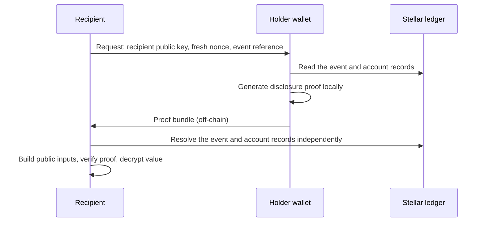

[Specification](https://github.com/OpenZeppelin/stellar-contracts/blob/main/packages/confidential/docs/selective-disclosure/README.md)

The confidential token hides amounts by default, but regulated finance routinely asks an account holder to prove one
specific fact to one specific party. A bank's compliance desk asks to confirm the amount of an incoming payment, a tax
authority asks for the total received over a quarter, and a KYC provider asks for evidence that a balance is below a
threshold. Selective disclosure answers these requests with a zero-knowledge proof bound to a single on-chain event (or
the current balance) and to a single recipient, without handing over a viewing key.

<Callout type="info">
Selective disclosure is an off-chain layer specified alongside the library. It needs no changes to the token contract,
but the library does not ship the disclosure circuits: the circuits in `circuits/` today cover only the core
operations. Disclosure proofs are verified off-chain by the recipient, not by the token's verifier registry.
</Callout>

## The Selective-Disclosure Gap

[Auditing](/stellar-contracts/tokens/confidential/auditing) gives each auditor a key that decrypts every transfer of
the accounts in its scope. That suits regulator access, but it is the wrong tool for routine requests:

- **Granularity.** An auditor key cannot decrypt one transfer without being able to decrypt all of them.
- **Counterparties.** Many requests come from parties that are not the auditor, and routing all of them through the
  auditor concentrates trust and adds latency.
- **Recipient binding.** A plaintext answer can be re-shared or replayed, with nothing tying it to the party that
  asked.

Handing over the viewing key is not an alternative, since it exposes the account's entire history (see
[Wallet Integration](/stellar-contracts/tokens/confidential/wallet-integration)).

## Design Goals

Each proof covers one named on-chain event, a finite set of events, or the current balance, never an account's
history. It is bound to the recipient's public key and a fresh nonce, so it cannot answer a different request and its
value opens only for that recipient. The recipient checks it against the event log, account records, and auditor
registry without trusting the prover. Either the holder (with its viewing key) or the auditor (with its auditor key)
can be the prover, and the contract's storage, entry points, and ciphertexts stay unchanged.

**Non-goals.** The layer proves positive statements only ("this event paid me X"), never completeness ("there are no
other transfers from Y"); completeness still routes through the auditor. Disclosures are not logged on-chain, since
that would leak exactly the metadata the protocol hides, and there is no on-chain registry of recipients.

## Disclosure Types

| Disclosure | Produced by | Proves |
| --- | --- | --- |
| D-recipient | The holder that received a `Transfer` or `SpenderTransfer` | "This on-chain payment paid me this amount." |
| D-sender | The originator: the holder for a `Transfer`, the spender for a `SpenderTransfer` | "I sent this on-chain payment, for this amount, to the address in the event." |
| D-auditor | The auditor of either party | The amount of a transfer in its scope. Variants disclose the sender's post-transfer balance (or allowance) and its opening. |
| D-balance | The holder | The current spendable balance is at least, or at most, a threshold, or its exact value. |
| Aggregate | The holder, sender, or auditor | The total across a set of transfers, as an exact value or as at least a threshold, without revealing individual amounts. |

Predicate-style variants reveal no value at all: the proof's validity asserts the predicate. Value-revealing variants
encrypt the disclosed value to the recipient. D-balance attests to the balance *at verification time*, since a proof
against a stale commitment fails to verify, whereas the D-auditor balance variant is historical and anchored to a
specific transfer. The commitment can also change without the holder's involvement, through a compliance clawback or
forced revocation, in which case the holder proves again against the new one.

## How a Disclosure Works

A recipient publishes a long-lived key pair out of band, for example through web PKI or a certificate. For each
request, it issues a fresh nonce over an authenticated channel. The recipient key and nonce together bind the
resulting proof.

The **proof bundle** carries only a circuit identifier (which selects the pinned verification key), a reference to each
disclosed event (transaction hash and event index), the UltraHonk proof, and the disclosed value encrypted to the
recipient's key. It deliberately carries no event payload, account address, or other public input. The recipient takes
all of those from the chain itself. D-balance is the exception: with no event to reference, its bundle names the
disclosing account, which the recipient checks against the one agreed in the request, and its predicate variants
carry no ciphertext.

The recipient's verifier then runs a fixed sequence of checks, any of which rejects the bundle:

1. Resolve each event reference to exactly one transfer-family event emitted by the deployed confidential token
   contract, and take its fields verbatim.
2. Determine the disclosing account from the event, never from the bundle: `to` for D-recipient; `from` (or `spender`)
   and `to` for D-sender. D-auditor uses the auditor key instead.
3. Read auxiliary state: the contract's address field and, for D-auditor, the auditor key that was active at the
   event's ledger, rejecting the bundle if it cannot resolve one. The registry shipped with the library keeps only
   the current key for each `auditor_id`, so for a transfer made before a rotation, one option is to reconstruct the
   earlier key from the registry's `AuditorRotated` events, which carry the old and the new key. The registry emits
   those events, not the token, so they are outside the indexer's scope: beyond the RPC window the verifier needs
   its own archive of them.
4. Build the public inputs from chain data, its own key and nonce, and only the encrypted value from the bundle.
5. Verify the proof against the pinned verification key for the circuit.
6. Decrypt the disclosed value.

A disclosure leaves no on-chain trace: no transaction, event, or state change. It relies only on public chain data:
`confidential_balance` for public viewing keys and the spendable commitment, the auditor registry's key lookup, the
transfer-family events, and the contract address field. That field has no getter, so the verifier reads it from
instance storage or recomputes it from the contract address. See
[Verifier Protocol](https://github.com/OpenZeppelin/stellar-contracts/blob/main/packages/confidential/docs/selective-disclosure/protocol.md#verifier-protocol).

<Callout type="warning">
The verifier's checks are what bind a proof to a specific on-chain event. A verifier that accepts public inputs from
the bundle instead of resolving them from the chain voids that binding. The verification-key set is a trusted input
too: a key for a tampered circuit can make false statements verify.
</Callout>

### On-Chain Verification

Disclosure proofs are UltraHonk proofs, so a contract could verify them. Doing so publishes the disclosure's existence,
the recipient, the referenced event, and its timing. That trade-off is worth it only when the result has to gate
another on-chain action, such as a compliance escrow or a permissioned pool. Such a verifier is a separate protocol,
outside this specification; the outline is in
[On-Chain Verification](https://github.com/OpenZeppelin/stellar-contracts/blob/main/packages/confidential/docs/selective-disclosure/protocol.md#on-chain-verification).

## Security Properties and Limits

- **Soundness.** A disclosed amount equals the value the on-chain commitment commits to; forging one would require
  breaking Poseidon2 preimage resistance or discrete log on Grumpkin. The binding to a specific event additionally
  relies on per-operation salts being unique, which makes each event's ephemeral key unique.
- **Recipient binding.** Anyone holding a bundle can verify it but cannot decrypt the value; they only learn that some
  value was disclosed. The nonce prevents reusing the proof for another request.
- **Cherry-picking.** A holder can disclose some transfers and withhold others. Recipients that need completeness
  should request a D-auditor disclosure, since the auditor sees every event in its scope.
- **Out of scope.** Once decrypted, protecting the value is the recipient's responsibility; compelling a holder to
  disclose is a legal matter, with auditor variants as the cryptographic backstop. Addresses are public anyway, so
  disclosure protects only amounts.
- **Spender transfers.** The owner cannot produce a D-sender proof for a `SpenderTransfer`, because the ephemeral key
  derives from the spender's viewing key. The owner can route through its auditor (D-auditor), or ask the spender for
  a D-sender proof, which proves that the spender paid. Delegation provenance comes from the `SetSpender` event and
  the delegation entry.
- **Older transfers.** A transfer whose ephemeral scalar was not derived deterministically may not be disclosable by
  its sender. The wallet tests this by recomputing the scalar and comparing it with the event's ephemeral key, and
  reports a distinct "not disclosable" outcome.

## Implementation Notes

The specification defines four circuits: `disclose_recipient`, `disclose_sender`, and `disclose_auditor`, each with an
aggregate form over a bounded number of events, and `disclose_balance` in at-least, at-most, and exact-value variants.
A disclosing wallet keeps its current spendable opening for D-balance and indexes event references so users can pick
events by date or counterparty. The verifier should be a standalone library, independent of any wallet, that returns
either the disclosed value or a typed error saying whether proof verification, on-chain state, or decryption failed.
For aggregates, it must reject bundles in which two references resolve to the same event. See
[Security and Implementation Notes](https://github.com/OpenZeppelin/stellar-contracts/blob/main/packages/confidential/docs/selective-disclosure/security.md#implementation-notes).
