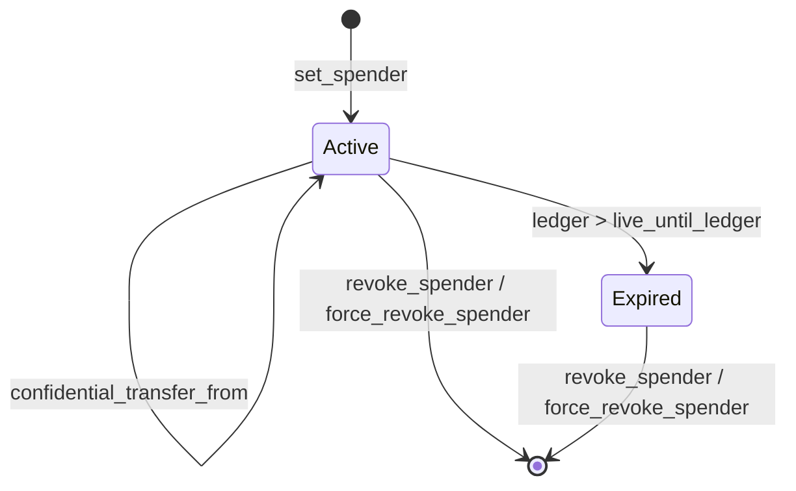

[Source Code](https://github.com/OpenZeppelin/stellar-contracts/tree/main/packages/confidential)

A spender is an address the owner authorizes to send confidential transfers from a capped allowance
that expires. Spenders let automated services, payment processors, custodians, or DeFi integrations
move funds for an owner without the owner sharing their spending key.

Unlike a SEP-41 allowance, which is only a permission to pull from the owner's balance, a confidential
allowance is **escrowed**. `set_spender` moves the amount out of the owner's spendable balance into a
separate per-spender commitment. The spender can only ever reach that escrow, so a compromised or
malicious spender can lose at most the allowance.

## Lifecycle



`force_revoke_spender` exists only in deployments with the compliance extension (see
[Revoking a Spender](#revoking-a-spender)).

Each `(owner, spender)` pair holds at most one delegation. `set_spender` reverts with
`DelegationAlreadyExists` while an entry exists for the pair, even if it has expired. To re-delegate to
the same spender, the owner first calls `revoke_spender` and then `set_spender` again.

## Setting a Spender

```rust
// `set_spender_data` is the XDR-encoded `SetSpenderData` built by the owner's wallet.
token_client.set_spender(&owner, &spender, &live_until_ledger, &set_spender_data);
```

The spender must already be a registered confidential account. The owner's wallet needs the spender's
spending public key to hand over the key the spender uses to read its allowance.

The owner's proof shows that:

- the allowance comes out of the spendable balance, and the balance covers it;
- the new spendable commitment and the allowance commitment are well formed;
- a **delegation viewing key** for this spender is derived correctly and encrypted to the spender's
  spending key;
- the owner's auditor receives the escrowed amount, the owner's new balance and its blinding factor, and
  the blinding factor of the allowance commitment.

The delegation viewing key is derived from the owner's viewing key and the spender's address. It
reveals only this spender's allowance in this token contract, and it cannot be used to recover the
owner's viewing key. Because it is escrowed on-chain inside the delegation entry, owner and spender
never need to exchange keys off-chain.

The owner's spendable balance drops by the allowance as soon as the call succeeds.

## Spending from an Allowance

```rust
// Authorized by the spender, not the owner.
token_client.confidential_transfer_from(&spender, &owner, &recipient, &spender_transfer_data);
```

Only the spender signs. The owner approved in advance at `set_spender`, and that approval lives in the
delegation entry until it expires or is revoked. The call reverts with `DelegationNotFound` if there is
no entry, and with `DelegationExpired` once the current ledger is past `live_until_ledger`.

The spender's proof shows that the allowance covers the amount and that the new allowance commitment is
correct. It also encrypts the amount for the recipient and both auditors, as a direct transfer does.
The recipient decrypts it as it would a direct
[confidential transfer](/stellar-contracts/tokens/confidential/operations#confidential-transfer), except
that the credit arrives as a `SpenderTransfer` event rather than `Transfer`, and the salt to use is the
event's `sigma_a_new`. A recipient wallet that watches only `Transfer` events misses these credits.

Two more details differ from a direct transfer:

- **Sender-side auditing follows the funds.** The ciphertexts on the sender side go to the **owner's**
  auditor, not the spender's, and include the remaining allowance after the transfer.
- **Masks use a replacement salt.** The delegation stores its current salt, `allowance_salt`, which only
  opens the current allowance. Every encryption mask is keyed to the replacement salt `sigma_a_new` that
  the spender's wallet picks, and the contract writes it back as the new `allowance_salt`. A reverted
  call leaves the stored salt unchanged, so the wallet must sample a fresh `sigma_a_new` for every
  attempt, retries included. The circuit only rejects a value equal to the stored salt; it cannot
  enforce freshness.

## Revoking a Spender

```rust
token_client.revoke_spender(&owner, &spender);
```

Revocation needs no proof. The contract adds the remaining allowance commitment back to the owner's
spendable commitment and deletes the delegation entry. It works for both active and expired
delegations.

The `RevokeSpender` event carries the encrypted allowance and its salt. Since the entry is deleted in
the same call, these event fields are the only place the owner's wallet can read them to learn how much
came back.

In deployments with the compliance extension, the token admin can also end a frozen account's
delegation with [`force_revoke_spender`](/stellar-contracts/tokens/confidential/clawback#forced-revocation).
It needs no authorization from the owner and runs no hook, but it folds the allowance back the same way
and emits the same `RevokeSpender` event. Owner wallets must therefore handle a `RevokeSpender` they did
not initiate.

## Expiry

`live_until_ledger` limits how long the spender can spend, but the escrowed funds stay put:

- While `ledger.sequence() <= live_until_ledger`, the spender can call `confidential_transfer_from`.
- After that, spending reverts, but the escrowed value **stays on-chain** in the delegation entry until
  the owner calls `revoke_spender`.

`set_spender` does not validate `live_until_ledger`. The value is bound by the owner's authorization,
but the contract does not compare it with the current ledger and the proof does not cover it. A value
already in the past creates a delegation that is expired from the start; its escrow comes back only
through `revoke_spender`. Wallets should check the value before submitting.

Delegations live in persistent storage, not temporary storage, so an expired escrow is never deleted
automatically. Its TTL is still finite: a new delegation starts with the network's minimum TTL, and the
library extends it only when an operation reads the entry. An escrow that nobody touches for long
enough is archived and must be restored before `revoke_spender` or `confidential_transfer_from` can
use it (see [TTL Management](/stellar-contracts/tokens/confidential/confidential#ttl-management)).
Wallets should show upcoming expirations and prompt the owner to renew or revoke.

## Owner Operations While Spenders Are Active

The owner's spendable balance and each allowance are separate commitments, so they never need to be
kept in sync. The owner can transfer, withdraw, merge, or set up more spenders while delegations are
active. None of these touch an allowance, so a spender's in-flight proof stays valid. Spender
transfers never touch the owner's spendable balance either. The one owner action that does affect a
spender is `revoke_spender`, which removes the allowance the spender's next proof would reference.

## Reading Delegation State

`is_spender(account, spender)` returns `true` only if a delegation exists **and** has not expired. It
returns `false` for a missing, revoked, or expired delegation, so it answers "can this spender spend
now?", not "is value escrowed?".

`get_spender_delegation(account, spender)` returns the raw `SpenderDelegation` without the expiry
filter, and reverts if no entry exists. Compare `live_until_ledger` with the current ledger to tell an
active delegation from an expired one.

| Field | Description |
| --- | --- |
| `allowance_commitment` | Commitment to the remaining allowance |
| `a_tilde` | The remaining allowance, encrypted under the delegation viewing key |
| `escrowed_dvk` | The delegation viewing key, encrypted to the spender's spending key |
| `allowance_salt` | Salt of the current allowance state; replaced on every spender transfer |
| `live_until_ledger` | Last ledger at which the spender may spend |

## Events

Each event's first topic is its name in snake case (`set_spender`, `spender_transfer`, `revoke_spender`),
followed by the addresses below.

| Event | Topic addresses | Data |
| --- | --- | --- |
| `SetSpender` | `account`, `spender` | `live_until_ledger`, `r_e_point`, `sigma`, `b_tilde`, `v_tilde_aud_s`, `b_tilde_aud_s`, `r_tilde_aud_s`, `r_a_tilde_aud_s` |
| `SpenderTransfer` | `spender`, `from`, `to` | `r_e_point`, `v_tilde`, `sigma_a_new`, `v_tilde_aud_r`, `r_tilde_aud_r`, `v_tilde_aud_s`, `a_tilde_aud_s`, `r_tilde_aud_s` |
| `RevokeSpender` | `account`, `spender` | `a_tilde`, `allowance_salt` |

- **`SetSpender`** is a spendable-balance checkpoint for the owner, like a `Withdraw` or an outgoing
  `Transfer`. `b_tilde` and `sigma` let the owner's wallet recover its new spendable balance during
  recovery. The `…_aud_s` fields are the owner-auditor ciphertexts.
- **`SpenderTransfer`** carries the amount encrypted for the recipient (`v_tilde`), the ciphertexts for
  the recipient's auditor and the owner's auditor, and the new salt. It does not carry the new encrypted
  allowance, which the contract writes only to the delegation entry; read it with
  `get_spender_delegation`.
- **`RevokeSpender`** is described in [Revoking a Spender](#revoking-a-spender). It is emitted by both
  `revoke_spender` and `force_revoke_spender`.

## Spender Wallets

A spender rebuilds its allowance from the delegation entry instead of replaying events. Its wallet
reads the entry and decrypts `escrowed_dvk` with its own spending key. It then reads the current
allowance from `a_tilde` and `allowance_salt`, and builds the next `confidential_transfer_from` proof.
The owner's wallet can read the same allowance, because it can derive the delegation viewing key from
its own viewing key. See [Wallet Integration](/stellar-contracts/tokens/confidential/wallet-integration).

A spender can see its own allowance, but never the owner's spendable balance.

## Auditing and Disclosure

The owner's auditor sees the escrowed amount at `set_spender`, and the amount and remaining allowance on
every spender transfer. See [Auditing](/stellar-contracts/tokens/confidential/auditing).

A spender transfer derives its encryption randomness from the spender's own viewing key. The owner
therefore cannot produce a sender-side
[selective disclosure](/stellar-contracts/tokens/confidential/selective-disclosure) for it on its own:
either the spender cooperates, or the owner's auditor discloses the transfer instead.

## Further Reading

- [Set Spender](https://github.com/OpenZeppelin/stellar-contracts/blob/main/packages/confidential/docs/protocol/operations/set-spender.md), including [Delegation Key Escrow](https://github.com/OpenZeppelin/stellar-contracts/blob/main/packages/confidential/docs/protocol/operations/set-spender.md#delegation-key-escrow)
- [Spender Transfer](https://github.com/OpenZeppelin/stellar-contracts/blob/main/packages/confidential/docs/protocol/operations/spender-transfer.md)
- [Revoke Spender](https://github.com/OpenZeppelin/stellar-contracts/blob/main/packages/confidential/docs/protocol/operations/revoke-spender.md)
- [Spender Delegation](https://github.com/OpenZeppelin/stellar-contracts/blob/main/packages/confidential/docs/protocol/account-state.md#spender-delegation)
