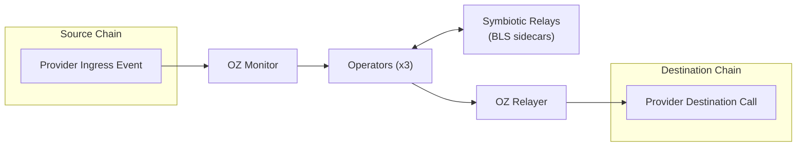

System overview for the Symbiotic multi-provider template.

## Core Model

1. One active provider per running stack, selected in `config/environments/<env>.json`.
2. Shared off-chain runtime:
   - OZ Monitor for ingress
   - 3 operator processes
   - 3 Symbiotic relay sidecars for BLS signatures
   - OZ Relayer for destination submission
   - Redis queue
3. Provider-specific on-chain contracts and calldata format.

## Provider Matrix

| Provider | Source ingress event | Destination submit call | Local | Testnet | Mainnet |
| --- | --- | --- | --- | --- | --- |
| [`layerzero`](/symbiotic/layerzero) | `JobAssigned` | `SymbioticLayerZeroDVN.submitProof(...)` | Supported | Supported | Verified end-to-end (operator-owned config) |
| [`chainlink_ccv`](/symbiotic/chainlink-ccv) | `CCIPMessageSent` | `OffRamp.execute(...)` | Supported | Supported | Not yet |

## Shared Off-Chain Runtime



The provider abstraction decides:
- which source-chain event the monitor watches
- how operators encode the signed payload
- which destination call the relayer submits

## Merkle Batching

Messages are collected into Merkle trees so one quorum signature can cover many messages:

1. ingress events become message records
2. operators batch message leaves into a Merkle root
3. the root is signed through the Symbiotic relay sidecars
4. proofs let the destination verify individual messages against that signed root

## Symbiotic Integration

Symbiotic provides the shared security layer:

- operators register BLS public keys
- settlement verifies quorum signatures
- voting power and epoch rules define signature validity

## Operator Internals

| Module | Location | Purpose |
|--------|----------|---------|
| API Server | `operator/src/api/` | Axum HTTP server, webhook endpoint, debug routes |
| Provider | `operator/src/provider/` | Provider trait, event decoding, message storage |
| SignerJob | `operator/src/signer/` | Batches messages into Merkle trees, requests BLS signatures |
| RelaySubmitterJob | `operator/src/relay_submitter/` | Submits signed proofs via OZ Relayer |
| Storage | `operator/src/storage/` | redb key-value store for messages, Merkle trees, and submissions |
| Crypto | `operator/src/crypto/` | Merkle tree construction, leaf hashing, signing message encoding |

## Adding a New Provider

1. Implement the `Provider` trait in `operator/src/provider/<provider>.rs`.

```rust
#[async_trait]
pub trait Provider: Send + Sync + 'static {
    fn name(&self) -> &'static str;
    async fn handle_webhook_event(&self, event: &WebhookEvent) -> Result<(), ProviderError>;

    // Required for a functional provider: the trait ships default impls for
    // these that return an error, so the signing/submission path fails until
    // you override all three.
    fn compute_leaf_hash(&self, message: &MessageData) -> Result<B256, ProviderError>;
    fn encode_signing_message(&self, tree: &MerkleTreeData) -> Result<Vec<u8>, ProviderError>;
    fn prepare_submission(
        &self,
        message: &MessageData,
        tree: &MerkleTreeData,
        proof: &MerkleProof,
        target_address: &str,
    ) -> Result<PreparedSubmission, ProviderError>;

    // Optional overrides (sensible defaults provided):
    fn register_api_routes(&self, router: Router<AppState>) -> Router<AppState> { router }
    fn max_batch_size(&self) -> usize { usize::MAX }
    async fn acceptance_hook(
        &self,
        _msg: &MessageData,
        _context: &AcceptanceContext,
    ) -> Result<AcceptanceDecision, ProviderError> {
        Ok(AcceptanceDecision::accept())
    }
    fn verifier_result_for(
        &self,
        _id: &B256,
    ) -> Result<Option<VerifierResult>, ProviderError> {
        Ok(None)
    }
}
```

2. Add provider config to `operator/src/config/mod.rs`.
3. Register the provider in `operator/src/provider/mod.rs`.
4. Add monitor templates under `config/templates/oz-monitor/`.
5. Add `docs/<provider>.mdx` and update [the docs index](/symbiotic).
