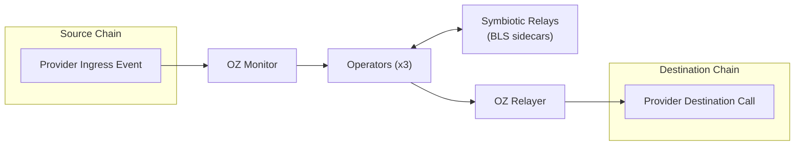
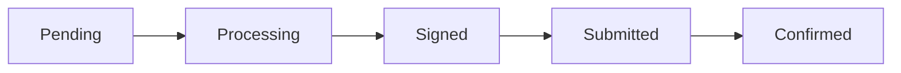

System overview for the Symbiotic multi-provider template.

## Core Model

1. One active provider per running stack (`config/environments/<env>.json`).
2. Shared off-chain runtime:
   - OZ Monitor for ingress
   - 3 operator processes
   - 3 Symbiotic relay sidecars for BLS signatures
   - OZ Relayer for destination tx submission
   - Redis queue
3. Provider-specific on-chain contracts and calldata format.

## Provider Matrix

| Provider | Source ingress event | Destination submit call | Local | Testnet | Mainnet |
| --- | --- | --- | --- | --- | --- |
| [`layerzero`](/symbiotic/layerzero) | `JobAssigned` | `SymbioticLayerZeroDVN.submitProof(...)` | Supported | Supported | Not yet |
| [`chainlink_ccv`](/symbiotic/chainlink-ccv) | `CCIPMessageSent` | `OffRamp.execute(...)` | Supported | Not yet | Not yet |

See per-provider pages for detailed message flows and code pointers.

## Shared Off-Chain Runtime



All providers share the same off-chain pipeline. The provider abstraction determines:
- Which event the monitor watches for
- How operators encode the payload
- What calldata the relayer submits

## Merkle Tree Batching

Messages are batched into Merkle trees for gas efficiency:

1. Multiple messages are collected into a batch
2. Each message becomes a leaf in the Merkle tree
3. The Merkle root is signed by operators
4. Proofs allow verifying individual messages against the signed root

This means:
- One signature covers many messages
- On-chain verification cost is amortized
- Individual messages can be verified independently

## Symbiotic Integration

Symbiotic provides the shared security layer:

- **Operator Registration**: Operators stake and register their BLS public keys
- **Settlement Contract**: Verifies BLS signatures and checks quorum
- **Slashing**: Misbehaving operators can be penalized (production)

The Settlement contract:
1. Maintains the list of registered operators and their public keys
2. Defines the quorum threshold
3. Verifies aggregated signatures
4. Reports verification results to the provider contract

## BLS Signing Pipeline

1. Operators sign provider-defined payloads through Symbiotic relay sidecars.
2. Aggregation/quorum logic comes from settlement-backed Symbiotic attestation rules.
3. Provider-specific contracts decode and enforce those attestations on the destination execution path.

## Message Status Lifecycle



| Status | Description |
|--------|-------------|
| Pending | Received via webhook, awaiting batching |
| Processing | Batched into Merkle tree, awaiting BLS signatures |
| Signed | Quorum signatures collected, ready for submission |
| Submitted | Sent to OZ Relayer |
| Confirmed | On-chain TX confirmed |

## Operator Internals

| Module | Location | Purpose |
|--------|----------|---------|
| API Server | `operator/src/api/` | Axum HTTP server, webhook endpoint, debug routes |
| Provider | `operator/src/provider/` | Provider trait, event decoding, message storage |
| SignerJob | `operator/src/signer/` | Batches messages into Merkle trees, requests BLS signatures |
| RelaySubmitterJob | `operator/src/relay_submitter/` | Submits signed proofs via OZ Relayer |
| Storage | `operator/src/storage/` | redb key-value store (messages, Merkle trees, submissions) |
| Crypto | `operator/src/crypto/` | Merkle tree construction, leaf hashing, signing message encoding |

## Adding a New Provider

1. Create `operator/src/provider/yourprovider.rs` implementing the `Provider` trait:

```rust
#[async_trait]
pub trait Provider: Send + Sync + 'static {
    fn name(&self) -> &'static str;
    async fn handle_webhook_event(&self, event: &WebhookEvent) -> Result<(), ProviderError>;

    // Optional overrides:
    fn register_api_routes(&self, router: Router<AppState>) -> Router<AppState> { router }
    async fn acceptance_hook(&self, _msg: &MessageData) -> Result<(), ProviderError> { Ok(()) }
}
```

2. Add configuration to `operator/src/config/mod.rs`.
3. Register in `create_provider()` in `operator/src/provider/mod.rs`.
4. Create provider-specific monitor template in `config/templates/oz-monitor/monitors/`.
5. Create `docs/<provider-name>.mdx` following the structure of existing provider docs (e.g., [LayerZero](/symbiotic/layerzero)).
6. Update this file's provider matrix, the [docs index](/symbiotic), and the project README.

## Environment Comparison

| Aspect | Local (Anvil) | Testnet | Production |
|--------|---------------|---------|------------|
| Source chain | Anvil 31337 | Base Sepolia 84532 | Mainnet |
| Dest/Settlement chain | Anvil 31338 | Sepolia 11155111 | Mainnet |
| Operators | 3 (local containers) | 3 (local containers) | 1+ (distributed) |
| Symbiotic Core | Deployed locally | Pre-deployed on Sepolia | Pre-deployed |
| BLS Keys | Deterministic | Deterministic | Hardware security |
| Quorum | 2-of-3 | 2-of-3 | Configurable |
| OZ Services | Local | Local | Hosted by OZ |
