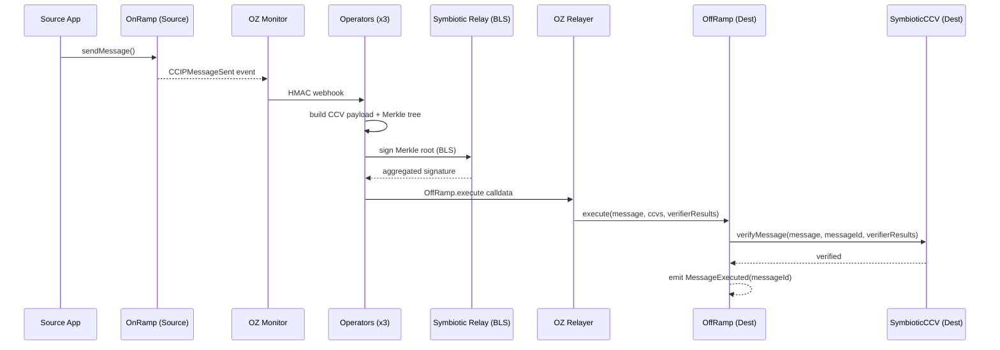

Symbiotic-secured Cross-Chain Verifier (CCV) for Chainlink CCIP-compatible message verification.

## Overview

The CCV provider implements a Symbiotic-backed verifier compatible with Chainlink's CCIP CCV interface. When a message is sent through an OnRamp-compatible contract, a `CCIPMessageSent` event is emitted. Operators build a CCV payload, collect BLS attestations via Symbiotic relay sidecars, and the relayer submits the proof to `OffRamp.execute(...)` on the destination chain. The OffRamp calls `SymbioticCCV.verifyMessage(...)` for each message, and success is confirmed when `MessageExecuted(messageId)` is emitted.

<Callout>

This template supports the **Symbiotic CCV variant** only. The Chainlink auxiliary devenv stack (aggregator, indexer, verifier, executor) is not required.

</Callout>

## Message Flow



## Code Pointers

### Contracts

- `contracts/src/ccv/SymbioticCCV.sol` -- CCV verifier implementation (`verifyMessage`, `forwardToVerifier`)
- `contracts/src/ccv/interfaces/` -- CCV interface definitions (`ICrossChainVerifierV1`, etc.)
- `contracts/src/ccv/libraries/` -- CCV encoding and helper libraries
- `contracts/src/symbiotic/Settlement.sol` -- BLS signature verification and quorum enforcement
- `contracts/src/symbiotic/KeyRegistry.sol` -- Operator BLS public key registry
- `contracts/src/symbiotic/Driver.sol` -- Epoch and genesis management

### Operator (Rust)

- `operator/src/provider/chainlink_ccv.rs` -- Decodes `CCIPMessageSent` events, builds CCV payloads
- `operator/src/provider/mod.rs` -- `Provider` trait and registration

### Config Templates

- `config/templates/oz-monitor/monitors/ccip_message_sent.json` -- Monitor job for `CCIPMessageSent` events

## Configuration

Select CCV as the active provider:

```json
// config/environments/<env>.json
{
  "activeProvider": "chainlink_ccv"
}
```

Chain config is shared across providers — chain IDs from `chains.source.chainId` and `chains.destination.chainId` are used as CCIP chain selectors at runtime.

Address resolution for CCV scripts:

1. `CCV_*` environment variables (highest priority)
2. `deployments/<env>.json`

CCV settlement addresses in deployment state:

- Destination: `destination.chainlinkCcv.settlement` in `deployments/<env>.json`

Available `CCV_*` override variables:

| Variable | Description |
|----------|-------------|
| `CCV_SOURCE_ADDRESS` | SymbioticCCV on source chain |
| `CCV_DEST_ADDRESS` | SymbioticCCV on destination chain |
| `CCV_SOURCE_ONRAMP_ADDRESS` | Source OnRamp-compatible contract |
| `CCV_DEST_OFFRAMP_ADDRESS` | Destination OffRamp submit target |

## Usage

```bash
# Select chainlink_ccv provider in config/environments/local.json
# "activeProvider": "chainlink_ccv"

# Start the stack
make start

# Send a test message
make send MSG="hello"

# Watch until MessageExecuted on destination
make watch

# Or run both
make e2e
```

`make send` sends through the source mock `OnRamp.sendMessage(...)`, emitting `CCIPMessageSent`.

`make watch` succeeds only when `MessageExecuted(messageId)` is found on the destination chain (not just relayer submission).

See [CLI Reference](/symbiotic/cli) for full command options.

## Deployment Status

| Environment | Status |
|-------------|--------|
| Local | Supported (Symbiotic-only mock path) |
| Testnet | Not yet |
| Mainnet | Not yet |

## Common Issues

- **EpochTooStale revert (0xf5ab0d81)** -- Settlement epoch data is stale. Refresh genesis or tune epoch timing. See [Troubleshooting](/symbiotic/troubleshooting#epochtoostale-revert-0xf5ab0d81).
- **Watch does not reach success** -- CCV requires destination `MessageExecuted(messageId)`, not just relayer submission. See [Troubleshooting](/symbiotic/troubleshooting#watch-does-not-reach-success).
- **Submission fails at estimate-gas** -- Common causes: stale epoch, incorrect CCV addresses, settlement not initialized. See [Troubleshooting](/symbiotic/troubleshooting#submission-fails-at-estimate-gas).
