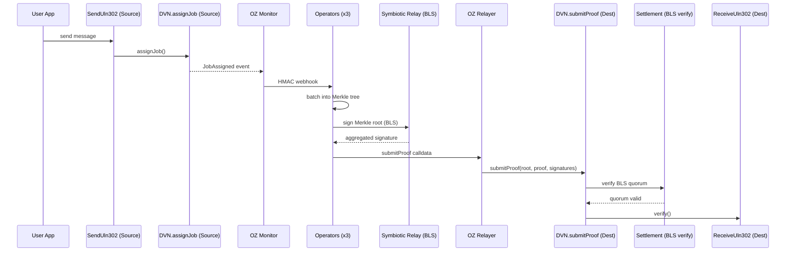

Symbiotic-secured DVN (Decentralized Verifier Network) for LayerZero V2 cross-chain messaging.

## Overview

The LayerZero provider implements a DVN that uses Symbiotic shared security to verify cross-chain messages. When a message is sent through LayerZero's `SendUln302`, the DVN contract emits a `JobAssigned` event. Operators batch these jobs into Merkle trees, collect BLS signatures through Symbiotic relay sidecars, and submit the signed proof to the destination DVN contract. The destination DVN verifies the BLS quorum via the Settlement contract and forwards verification to LayerZero's `ReceiveUln302`.

## Message Flow



## Code Pointers

### Contracts

- `contracts/src/SymbioticLayerZeroDVN.sol` -- DVN contract handling `assignJob` (source) and `submitProof` (destination)
- `contracts/src/symbiotic/Settlement.sol` -- BLS signature verification and quorum enforcement
- `contracts/src/symbiotic/KeyRegistry.sol` -- Operator BLS public key registry
- `contracts/src/symbiotic/VotingPowers.sol` -- Operator voting power tracking
- `contracts/src/symbiotic/Driver.sol` -- Epoch and genesis management
- `contracts/src/examples/TestOApp.sol` -- Test application for sending/receiving messages

### Operator (Rust)

- `operator/src/provider/layerzero.rs` -- Decodes `JobAssigned` events, stores messages
- `operator/src/provider/mod.rs` -- `Provider` trait and registration
- `operator/src/crypto/mod.rs` -- Merkle tree construction, DVN leaf hashing
- `operator/src/signer/mod.rs` -- Batches messages, requests BLS signatures
- `operator/src/relay_submitter/mod.rs` -- Submits signed proofs via OZ Relayer

### Config Templates

- `config/templates/oz-monitor/monitors/layerzero_job_assigned.json` -- Monitor job for `JobAssigned` events
- `config/templates/oz-monitor/triggers/webhook_layerzero.json` -- Webhook trigger template

## Configuration

Select LayerZero as the active provider:

```json
// config/environments/<env>.json
{
  "activeProvider": "layerzero"
}
```

Chain config is shared across providers and lives at the top level:

| Field | Description |
|-------|-------------|
| `chains.source.chainId` | Source chain ID |
| `chains.destination.chainId` | Destination chain ID |
| `chains.source.eid` | LayerZero endpoint ID for source |
| `chains.destination.eid` | LayerZero endpoint ID for destination |

LayerZero predeploys (testnet/mainnet) go in `chains.<role>.predeploys.layerzero`:

```json
{
  "predeploys": {
    "layerzero": {
      "endpoint": "0x6EDCE65403992e310A62460808c4b910D972f10f",
      "sendUln302": "0xC1868e054425D378095A003EcbA3823a5D0135C9"
    }
  }
}
```

`make deploy` and `make start` use these values to generate runtime configs (`destination_chains`, `chain_relayers`, `eid_to_chain_id`) under `generated/<env>/`. Validation fails if chain IDs/EIDs drift from the generated deployment state.

## Usage

```bash
# Select layerzero provider in config/environments/local.json
# "activeProvider": "layerzero"

# Start the stack
make start

# Send a test message
make send MSG="hello"

# Watch until destination verification
make watch

# Or run both in one shot
make e2e
```

`make send` sends through `TestOApp.send(...)` which calls `SendUln302`, triggering `DVN.assignJob()`.

`make watch` succeeds when destination target verification is observed on-chain.

See [CLI Reference](/symbiotic/cli) for full command options.

## Common Issues

- **Message stuck at "Processing"** -- BLS signatures not aggregating. Check sidecar health and operator key registration. See [Troubleshooting](/symbiotic/troubleshooting#bls-signatures-not-aggregating).
- **Quorum not reached** -- All 3 operators must be running and receiving the same events. See [Troubleshooting](/symbiotic/troubleshooting#quorum-not-reached).
- **submitProof reverts** -- Check that the OZ Relayer address is authorized as a submitter on the DVN contract, and that Settlement has correct operator keys. See [Troubleshooting](/symbiotic/troubleshooting#layerzero-issues).
