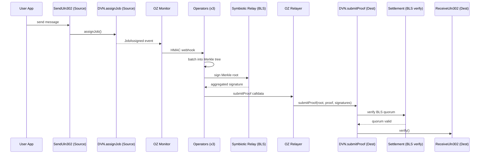

Symbiotic-secured DVN for LayerZero V2 cross-chain messaging.

## Overview

The LayerZero provider watches `JobAssigned` events emitted by the `SymbioticLayerZeroDVN` source DVN (whose `assignJob` function is called by `SendUln302`), batches them into Merkle trees, collects BLS attestations through Symbiotic relay sidecars, and submits proofs to the destination DVN. The destination DVN verifies the quorum via Settlement and forwards verification into `ReceiveUln302`.

## Message Flow



## Contracts and Code

### Contracts

- `contracts/src/SymbioticLayerZeroDVN.sol`
- `contracts/src/symbiotic/Settlement.sol`
- `contracts/src/symbiotic/KeyRegistry.sol`
- `contracts/src/symbiotic/VotingPowers.sol`
- `contracts/src/symbiotic/Driver.sol`
- `contracts/src/examples/ExampleOApp.sol`

### Operator

- `operator/src/provider/layerzero.rs`
- `operator/src/provider/mod.rs`
- `operator/src/crypto/mod.rs`
- `operator/src/signer/mod.rs`
- `operator/src/relay_submitter/mod.rs`

### Monitor Templates

- `config/templates/oz-monitor/monitors/layerzero_job_assigned.json`
- `config/templates/oz-monitor/triggers/webhook_layerzero.json`

## Configuration

Select LayerZero in `config/environments/<env>.json`:

```json
{
  "activeProvider": "layerzero"
}
```

Shared chain config:

| Field | Description |
|-------|-------------|
| `chains.source.chainId` | Source chain ID |
| `chains.destination.chainId` | Destination chain ID |
| `chains.source.eid` | LayerZero endpoint ID for source |
| `chains.destination.eid` | LayerZero endpoint ID for destination |

LayerZero predeploys for non-local environments live under `chains.<role>.predeploys.layerzero`:

```json
{
  "predeploys": {
    "layerzero": {
      "endpoint": "0x6EDCE65403992e310A62460808c4b910D972f10f",
      "sendUln302": "0xC1868e054425D378095A003EcbA3823a5D0135C9"
    }
  }
}
```

`make deploy` and `make start` use these values to generate the runtime chain maps under `generated/<env>/`.

The template also manages a starter OApp by default:

```json
{
  "layerzero": {
    "oapp": {
      "enabled": true
    }
  }
}
```

- `true`: deploy and wire `ExampleOApp` on both chains
- `false`: skip the starter OApp and run LayerZero in provider-only mode

Starter OApp deployments are published under `deployments/<env>.json` at `layerzero.oapp.source` and `layerzero.oapp.destination`.

Provider validation does not require the starter OApp to exist. Disabling it only removes the `make send` and `make e2e` demo flow for that environment.

Local and testnet are supported. See [Setup](/symbiotic/setup), [Deployment](/symbiotic/deployment), and [CLI & API Reference](/symbiotic/cli) for operation.
