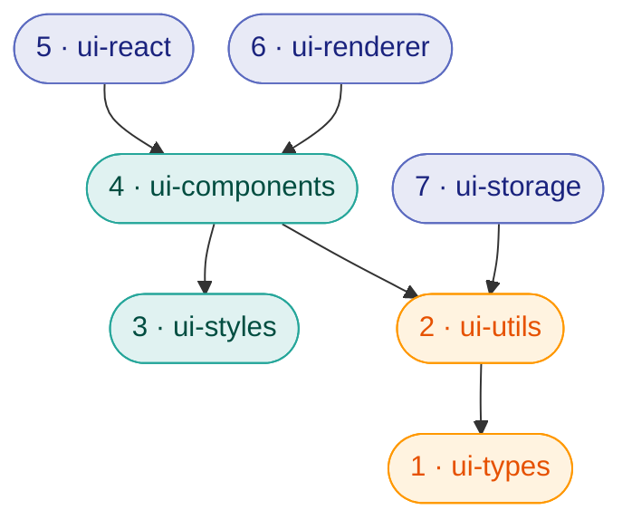
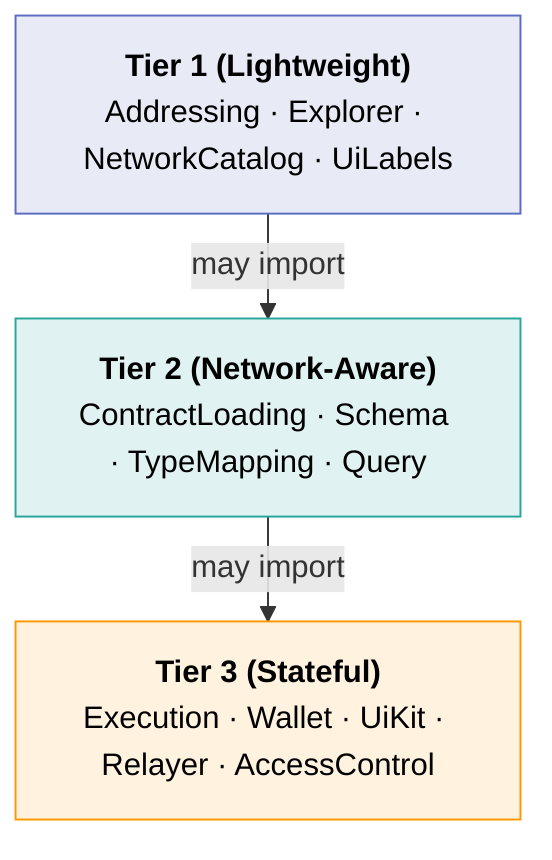
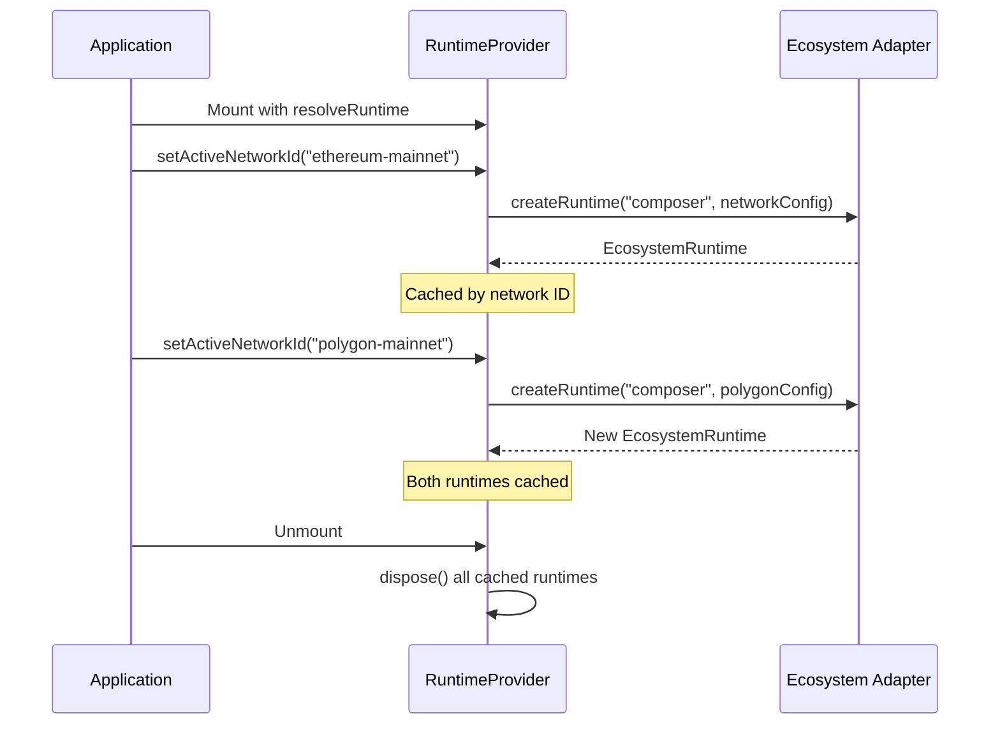
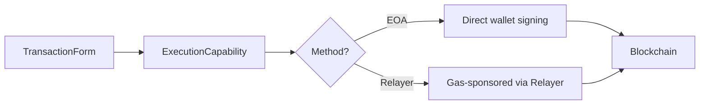
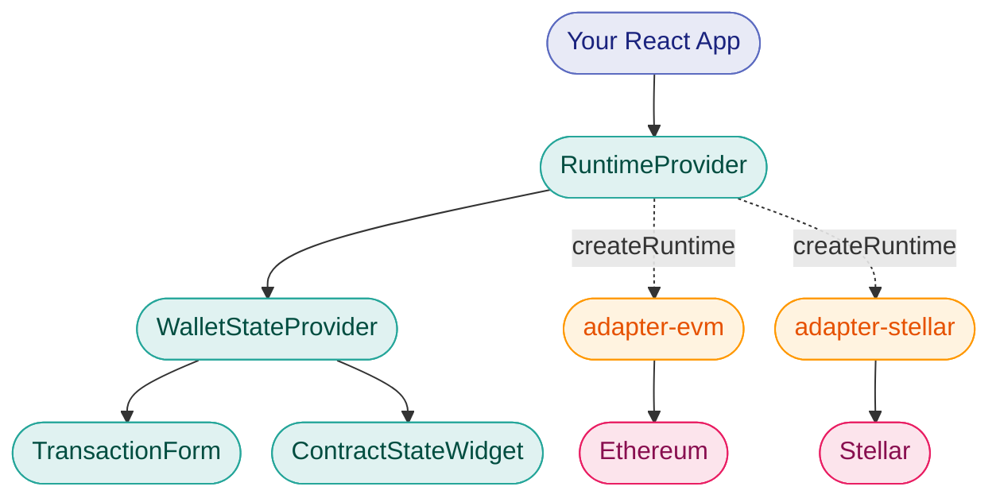

OpenZeppelin UIKit is built as a layered stack of independently installable packages. This page explains how those layers fit together, how the capability-driven adapter model works, and how runtimes manage lifecycle across multiple ecosystems.

## Package Layers

The packages form a dependency chain where each layer builds on the ones below it. Lower layers are lighter and more generic; higher layers add React-specific and domain-specific behavior.



**Color key:** <span style={{color: '#5c6bc0'}}>■</span> Application layers (5–7) · <span style={{color: '#26a69a'}}>■</span> UI & design (3–4) · <span style={{color: '#ff9800'}}>■</span> Foundation (1–2)

| Layer | Package | Responsibility |
| --- | --- | --- |
| 1 | `@openzeppelin/ui-types` | TypeScript interfaces for capabilities, schemas, form models, networks, transactions, and execution config. No runtime code: pure type definitions. |
| 2 | `@openzeppelin/ui-utils` | Framework-agnostic helpers: `AppConfigService` for environment/config loading, structured logger, validation utilities, and routing helpers. |
| 3 | `@openzeppelin/ui-styles` | Tailwind CSS 4 theme tokens using OKLCH color space. Ships CSS variables and custom variants (dark mode). No JavaScript. |
| 4 | `@openzeppelin/ui-components` | React UI primitives (buttons, dialogs, cards, tabs) and blockchain-aware form fields (address, amount, bytes, enum, map). Built on Radix UI + shadcn/ui patterns. |
| 5 | `@openzeppelin/ui-react` | `RuntimeProvider` for managing `EcosystemRuntime` instances per network. `WalletStateProvider` for global wallet state. Derived hooks for cross-ecosystem wallet abstraction. |
| 6 | `@openzeppelin/ui-renderer` | `TransactionForm` for schema-driven transaction forms. `ContractStateWidget` for view function queries. `ExecutionConfigDisplay`, `AddressBookWidget`, address book components. |
| 7 | `@openzeppelin/ui-storage` | `EntityStorage` and `KeyValueStorage` base classes on Dexie.js/IndexedDB. Account alias plugin for address-to-name mapping. |

<a id="capabilities"></a>
## Capabilities

The UIKit type system defines 13 **capabilities**: small, focused interfaces that describe what an adapter can do.

Capabilities are organized into three tiers based on their requirements:



**Tier 1** requires no runtime context: safe to import anywhere. **Tier 2** needs a `networkConfig`. **Tier 3** additionally needs wallet state and participates in the `dispose()` lifecycle. Each higher tier may import from lower tiers, but never the reverse.

| Capability | Tier | Purpose |
| --- | --- | --- |
| `Addressing` | 1 | Address validation, formatting, checksumming |
| `Explorer` | 1 | Block explorer URL generation |
| `NetworkCatalog` | 1 | Available network listing and metadata |
| `UiLabels` | 1 | Human-readable labels for ecosystem-specific terms |
| `ContractLoading` | 2 | Fetch and parse contract ABIs/IDLs |
| `Schema` | 2 | Transform contract definitions into form-renderable schemas |
| `TypeMapping` | 2 | Map blockchain types (e.g. `uint256`) to form field types |
| `Query` | 2 | Execute read-only contract calls (view functions) |
| `Execution` | 3 | Sign, broadcast, and track transactions |
| `Wallet` | 3 | Connect/disconnect wallets, account state, chain switching |
| `UiKit` | 3 | Ecosystem-specific React components and hooks |
| `Relayer` | 3 | Gas-sponsored transaction execution via relayers |
| `AccessControl` | 3 | Role-based access control queries and snapshots |

For more background on the adapter pattern and how chain-specific integrations are structured, see [Building New Adapters](/ui-builder/building-adapters).

### Capability Bundles

Higher-level components request specific **bundles** of capabilities rather than the full set. For example, `TransactionForm` expects a `TransactionFormCapabilities` type: an intersection of the capabilities needed for form rendering, execution, and status tracking.

This means you can pass a partial adapter that only implements what the component actually needs.

<a id="runtimes"></a>
## Runtimes and Profiles

### Ecosystem Runtimes

An `EcosystemRuntime` is a live instance that bundles capabilities for a specific network. Capabilities created within the same runtime share runtime-scoped state (network config, wallet connection, caches) and are disposed together.

Runtimes are created by ecosystem adapter packages:

```tsx
import { ecosystemDefinition } from '@openzeppelin/adapter-evm';

const runtime = await ecosystemDefinition.createRuntime(
  'composer',           // profile name
  ethereumMainnetConfig // network config
);

// Access capabilities from the runtime
const address = runtime.addressing.formatAddress('0x...');
const schema = await runtime.schema.generateFormSchema(contractDef);
const txHash = await runtime.execution.signAndBroadcast(txData, execConfig);

// Clean up when done
runtime.dispose();
```

### Profiles

Adapters support five standard profiles that define which capabilities are included:

| Profile | Use Case | Tier 1 | Tier 2 | Tier 3 |
| --- | --- | --- | --- | --- |
| `declarative` | Address formatting, explorer links | ✓ | - | - |
| `viewer` | Read contract state, no wallet needed | ✓ | ✓ | - |
| `transactor` | Execute transactions, basic wallet | ✓ | ✓ | Execution, Wallet |
| `composer` | Full UI with form rendering | ✓ | ✓ | ✓ (most) |
| `operator` | Administrative tools, access control | ✓ | ✓ | ✓ (all) |

Choose the lightest profile that fits your use case. A dashboard that only displays contract state can use `viewer`; a full transaction builder should use `composer` or `operator`.

For more background on the adapter architecture, see [Building New Adapters](/ui-builder/building-adapters).

### Runtime Lifecycle



`RuntimeProvider` maintains a **per-network-id registry** of runtimes. When a network is selected for the first time, the runtime is created asynchronously and cached. On unmount, all runtimes are disposed, releasing any wallet connections, subscriptions, or internal state.

## Execution Strategies

The execution system supports multiple ways to submit a transaction. The adapter selects the appropriate strategy based on the `ExecutionConfig`:



Each ecosystem adapter defines which execution methods it supports. The EVM adapter supports both EOA and Relayer; other ecosystems may support only EOA.

## How It Connects

Putting it all together, here is how a typical application uses UIKit with an Ecosystem Adapter:



## Next Steps

- [Components](/tools/uikit/components): Explore all available UI primitives and form fields
- [React Integration](/tools/uikit/react-integration): Deep dive into providers, hooks, and wallet state
- [Building New Adapters](/ui-builder/building-adapters): Background on the adapter pattern and ecosystem integrations
