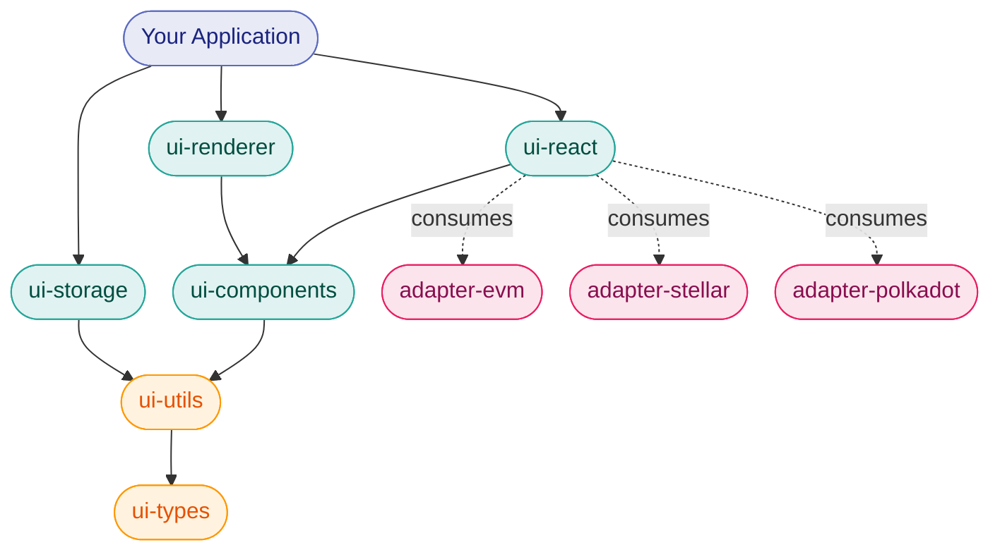
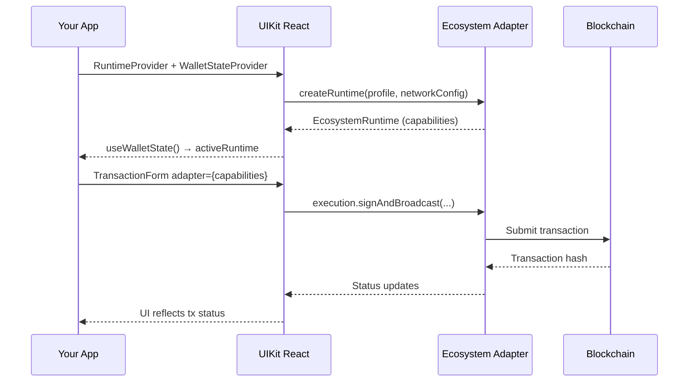

A modular React component library for building blockchain transaction interfaces — chain-agnostic, capability-driven, and designed for multi-ecosystem applications.

<Callout type="info">
**Source code**: OpenZeppelin UIKit is open-source. Browse the implementation, open issues, and contribute at [**github.com/OpenZeppelin/openzeppelin-ui**](https://github.com/OpenZeppelin/openzeppelin-ui).
</Callout>

<Cards>
  <Card href="/tools/uikit/getting-started" title="Getting Started" description="Install packages, set up Tailwind, and render your first transaction form." />
  <Card href="/tools/uikit/architecture" title="Architecture" description="Understand the layered package system, capability model, and runtime lifecycle." />
  <Card href="/tools/uikit/components" title="Components" description="Browse UI primitives, blockchain-aware form fields, and renderer widgets." />
  <Card href="/tools/uikit/react-integration" title="React Integration" description="Wire up providers, hooks, and wallet state management." />
  <Card href="/tools/uikit/theming" title="Theming & Styling" description="Configure Tailwind v4 tokens, dark mode, and design customization." />
  <Card href="/tools/uikit/storage" title="Storage" description="Persist address aliases and app data with IndexedDB via the storage plugin system." />
</Cards>

## What is OpenZeppelin UIKit?

OpenZeppelin UIKit is a set of modular npm packages that provide everything needed to build rich blockchain UIs in React. Instead of a monolithic library, it ships as a **layered stack** — from low-level types and utilities up to high-level form renderers and wallet integration.

Each layer is independently installable. Use only the pieces you need: the type system for a headless integration, the component library for a design system, or the full renderer for turnkey transaction forms.

## Packages

| Package | Description | Layer |
| --- | --- | --- |
| [`@openzeppelin/ui-types`](https://www.npmjs.com/package/@openzeppelin/ui-types) | Shared TypeScript type definitions — capabilities, schemas, form models | 1 |
| [`@openzeppelin/ui-utils`](https://www.npmjs.com/package/@openzeppelin/ui-utils) | Framework-agnostic utilities — config, logging, validation, routing | 2 |
| [`@openzeppelin/ui-styles`](https://www.npmjs.com/package/@openzeppelin/ui-styles) | Centralized Tailwind CSS 4 theme with OKLCH tokens and dark mode | 3 |
| [`@openzeppelin/ui-components`](https://www.npmjs.com/package/@openzeppelin/ui-components) | React UI primitives and blockchain-aware form fields (shadcn/ui based) | 4 |
| [`@openzeppelin/ui-react`](https://www.npmjs.com/package/@openzeppelin/ui-react) | React context providers, runtime management, and wallet hooks | 5 |
| [`@openzeppelin/ui-renderer`](https://www.npmjs.com/package/@openzeppelin/ui-renderer) | Transaction form rendering engine and contract state widgets | 6 |
| [`@openzeppelin/ui-storage`](https://www.npmjs.com/package/@openzeppelin/ui-storage) | IndexedDB storage abstraction with Dexie.js and address book plugin | 7 |

## Key Design Principles

**Chain-agnostic core.** UIKit packages never import chain-specific logic. Blockchain details are handled entirely by ecosystem adapter packages. For background on the adapter pattern, see [Building New Adapters](/ui-builder/building-adapters).

**Capability-driven, not monolithic.** Instead of one large adapter interface, the system defines small, focused [capabilities](/tools/uikit/architecture#capabilities) (addressing, query, execution, wallet, etc.) organized into tiers. Components request only the capabilities they need.

**Pay for what you use.** Install only the layers your app requires. A simple form builder can use just `ui-types` + `ui-components`. A full transaction dashboard can add `ui-renderer` + `ui-react` + `ui-storage`.

**Multi-ecosystem ready.** A single app can support EVM, Stellar, Polkadot, and more simultaneously. The runtime system manages per-network adapter instances with proper lifecycle and disposal.

## Ecosystem Adapter Integration

UIKit connects to blockchains through ecosystem adapter packages — standalone packages that translate chain-specific operations into the shared capability model. For more background, see [Building New Adapters](/ui-builder/building-adapters).

For more background on how adapters work and how new ecosystem integrations are structured, see [Building New Adapters](/ui-builder/building-adapters).

## Requirements

- **Node.js** >= 20.19.0
- **React** 19
- **Tailwind CSS** 4

## Next Steps

- [Getting Started](/tools/uikit/getting-started) — Install, configure, and render your first form
- [Architecture](/tools/uikit/architecture) — Deep dive into the capability model and runtime lifecycle
- [Building New Adapters](/ui-builder/building-adapters) — How chain-specific logic is decoupled from the UI
