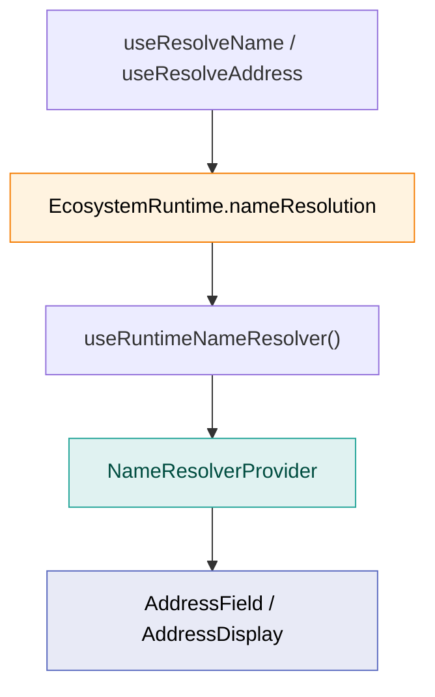

OpenZeppelin UIKit ships first-class support for **forward** (name → address) and **reverse** (address → name) resolution on networks where the active adapter exposes the `nameResolution` capability. On EVM chains this powers ENS-aware address inputs and displays without forking form fields.

<Callout type="info">
**Live example**: See forward and reverse resolution, network-scoped hooks, and preview cards in the [**basic-react-app**](https://github.com/OpenZeppelin/openzeppelin-ui/tree/main/examples/basic-react-app) (`ENSResolutionDemo`) and at [**openzeppelin-ui.netlify.app**](https://openzeppelin-ui.netlify.app).
</Callout>

## Name resolution vs. address aliases

UIKit exposes two distinct systems for showing human-readable names next to addresses. They solve different problems and must not be conflated:

| Concern | Name resolution (ENS) | Address aliases (Address Book) |
| --- | --- | --- |
| **Source** | On-chain naming (ENS, Universal Resolver) via adapter `nameResolution` | User-defined labels in IndexedDB via `@openzeppelin/ui-storage` |
| **Providers** | `NameResolverProvider` (`@openzeppelin/ui-components`) fed by `useRuntimeNameResolver` (`@openzeppelin/ui-react`) | `AddressLabelProvider`, `AddressSuggestionProvider` |
| **Hooks** | `useResolveName`, `useResolveAddress` | `useAliasLabelResolver`, `useAliasSuggestionResolver` |
| **Typical input** | User types `vitalik.eth`; field resolves to hex before submit | User picks a saved alias from suggestions or sees a stored label on `AddressDisplay` |
| **Persistence** | None — resolution is live against the selected network | Local address book entries survive reloads |

An app can use **both**: mount `NameResolverProvider` for ENS and `AddressLabelProvider` for saved aliases. The basic-react-app wires both via separate bridge components.

## Architecture



1. The adapter builds a **network-scoped** `NameResolutionCapability` when `createRuntime` runs (EVM: ENS via viem + Universal Resolver).
2. `useRuntimeNameResolver` projects `activeRuntime.nameResolution` into the `NameResolver` seam consumed by UI components.
3. `NameResolverProvider` makes that resolver available to every `AddressField` and `AddressDisplay` in the subtree.
4. `useResolveName` / `useResolveAddress` expose the same capability to custom UI with debouncing, caching, and typed errors.

Resolution is always **bound to the active network** (or an explicitly passed `network` for network-scoped hooks). Results carry **provenance** metadata (ENS system, external gateway, cross-network fallback) for display and submit gating.

## Provider wiring

### Ambient wiring (recommended)

Mirror the pattern from `examples/basic-react-app/src/providers/AppProviders.tsx`:

```tsx
import { NameResolverProvider } from '@openzeppelin/ui-components';
import { RuntimeProvider, useRuntimeNameResolver, useWalletState, WalletStateProvider } from '@openzeppelin/ui-react';
import type { CreateRuntimeOptions, NetworkConfig } from '@openzeppelin/ui-types';

const runtimeCreationOptions: CreateRuntimeOptions = {
  // Opt-in: after a definitive miss on the bound chain (e.g. Sepolia), consult mainnet L1 once.
  nameResolution: { enableMainnetL1MissFallback: true },
};

function NameResolverBridge({ children }: { children: React.ReactNode }) {
  const resolver = useRuntimeNameResolver();
  const { activeNetworkId, activeNetworkConfig } = useWalletState();

  return (
    <NameResolverProvider
      {...resolver}
      activeNetworkId={activeNetworkId ?? null}
      activeNetworkName={activeNetworkConfig?.name}
    >
      {children}
    </NameResolverProvider>
  );
}

function App() {
  return (
    <RuntimeProvider
      resolveRuntime={(nc: NetworkConfig) =>
        ecosystemDefinition.createRuntime('composer', nc, runtimeCreationOptions)
      }
    >
      <WalletStateProvider initialNetworkId="ethereum-sepolia" getNetworkConfigById={getNetworkById}>
        <NameResolverBridge>
          <YourApp />
        </NameResolverBridge>
      </WalletStateProvider>
    </RuntimeProvider>
  );
}
```

`TransactionForm` from `@openzeppelin/ui-renderer` mounts its own `NameResolverProvider` internally when rendered under `WalletStateProvider`, so schema-driven forms gain ENS on every `blockchain-address` field with no registry swap.

### Network-scoped resolution

When a field must resolve against a **specific** network (not the wallet-global active network), pass a `NetworkConfig` into the hook:

```tsx
import { useRuntimeNameResolver } from '@openzeppelin/ui-react';
import { NameResolverProvider } from '@openzeppelin/ui-components';

function NetworkScopedField({ dialogNetwork }: { dialogNetwork: NetworkConfig }) {
  const resolver = useRuntimeNameResolver(dialogNetwork);

  return (
    <NameResolverProvider {...resolver} activeNetworkId={dialogNetwork.id} activeNetworkName={dialogNetwork.name}>
      <AddressField name="alias" label="Alias" control={control} addressing={addressing} />
    </NameResolverProvider>
  );
}
```

The same `network` option is available on `useResolveAddress(address, { network })`.

## Hooks

| Hook | Package | Purpose |
| --- | --- | --- |
| `useRuntimeNameResolver(network?)` | `@openzeppelin/ui-react` | Stable `NameResolver` object for `NameResolverProvider` |
| `useResolveName(name, options?)` | `@openzeppelin/ui-react` | Async forward resolution with debounce and cache |
| `useResolveAddress(address, options?)` | `@openzeppelin/ui-react` | Async reverse resolution with debounce and cache |

`useResolveName` returns a status union (`idle`, `loading`, `debouncing`, `success`, `error`) and never throws for expected failures (`NAME_NOT_FOUND`, `UNSUPPORTED_NETWORK`, etc.).

## Address fields and preview cards

### `AddressField` (forward)

Once `NameResolverProvider` is mounted, the base `AddressField` resolves typed names inline. The form value is always the **resolved hex** on success; unresolved names gate submit.

```tsx
import { AddressField } from '@openzeppelin/ui-components';

<AddressField
  name="recipient"
  label="Recipient"
  control={control}
  addressing={runtime.addressing}
  placeholder="0x… or name.eth"
/>
```

### `AddressFieldWithResolvedPreview` + reverse preview

For a live reverse-lookup card under the input, compose the preview slot with `ResolvedAddressFieldPreviewWithNameResolution`:

```tsx
import { useWatch } from 'react-hook-form';
import { AddressFieldWithResolvedPreview } from '@openzeppelin/ui-components';
import { ResolvedAddressFieldPreviewWithNameResolution } from '@openzeppelin/ui-renderer';

function RecipientField({ control, addressing, networkId, network }) {
  const previewAddress = useWatch({ control, name: 'recipient' });

  return (
    <AddressFieldWithResolvedPreview
      name="recipient"
      label="Recipient"
      control={control}
      addressing={addressing}
      previewAddress={previewAddress}
      previewNetworkId={networkId}
      preview={
        <ResolvedAddressFieldPreviewWithNameResolution
          address={previewAddress}
          addressing={addressing}
          network={network}
        />
      }
    />
  );
}
```

### `AddressDisplay` (reverse)

`AddressDisplay` inherits reverse resolution from the same `NameResolverProvider`. When `resolveAddress` is available on the active runtime, verified names render inline with optional cross-network fallback disclaimers.

## Runtime options (EVM)

| Option | Default | Effect |
| --- | --- | --- |
| `nameResolution.enableMainnetL1MissFallback` | `false` | When `true`, after a definitive `NAME_NOT_FOUND` on a bound chain with its own Universal Resolver, attempt one mainnet L1 lookup (useful for testnets resolving mainnet-only names). |

Pass options as the third argument to `ecosystemDefinition.createRuntime(profile, networkConfig, options)`.

## Degradation behavior

When no `WalletStateProvider` is mounted, the runtime lacks `nameResolution`, or the capability omits `resolveName`, fields **degrade safely**:

- Hex addresses behave exactly as before.
- Typed names surface `UNSUPPORTED_NETWORK` with submit gated — never a silent coercion to hex.

## Next steps

- [React Integration](/tools/uikit/react-integration): `RuntimeProvider`, `WalletStateProvider`, and wallet hooks
- [Storage](/tools/uikit/storage): address-book aliases (`AddressLabelProvider`) — separate from ENS
- [Architecture](/ecosystem-adapters/architecture#capability-reference): `NameResolution` capability reference
- [Supported Ecosystems](/ecosystem-adapters/supported-ecosystems): per-adapter name-resolution support
