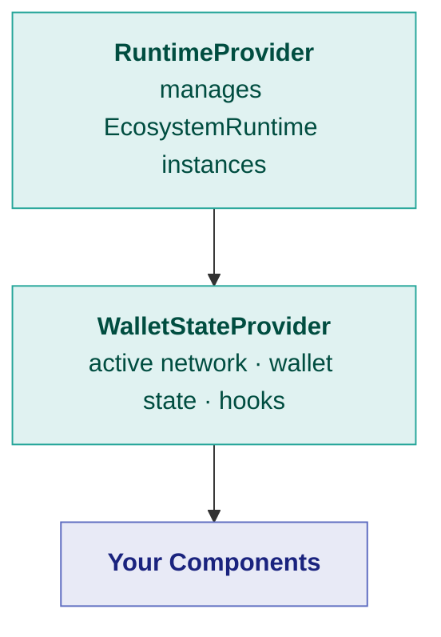
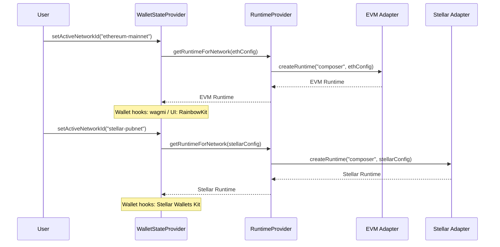

The `@openzeppelin/ui-react` package provides the runtime and wallet infrastructure that connects UIKit components to blockchain ecosystems. This page covers providers, hooks, wallet state management, and multi-ecosystem support.

## Provider Setup

Two providers form the foundation of a UIKit-powered React app:



### RuntimeProvider

`RuntimeProvider` maintains a **registry of `EcosystemRuntime` instances** — one per network ID. It creates runtimes on demand, caches them, and disposes all of them on unmount.

```tsx
import { RuntimeProvider } from '@openzeppelin/ui-react';
import { ecosystemDefinition } from '@openzeppelin/adapter-evm';

async function resolveRuntime(networkConfig) {
  return ecosystemDefinition.createRuntime('composer', networkConfig);
}

function App() {
  return (
    <RuntimeProvider resolveRuntime={resolveRuntime}>
      {/* children */}
    </RuntimeProvider>
  );
}
```

**Props:**

| Prop | Type | Description |
| --- | --- | --- |
| `resolveRuntime` | `(networkConfig) => Promise<EcosystemRuntime>` | Factory function that creates a runtime for a given network |

### WalletStateProvider

`WalletStateProvider` builds on `RuntimeProvider` to manage:

- The **active network** ID and config
- The **active runtime** and its loading state
- **Wallet facade hooks** from the active runtime's `UiKitCapability`
- The ecosystem's **React UI provider** component (e.g. wagmi's `WagmiProvider`)

```tsx
import { RuntimeProvider, WalletStateProvider } from '@openzeppelin/ui-react';

function App() {
  return (
    <RuntimeProvider resolveRuntime={resolveRuntime}>
      <WalletStateProvider
        initialNetworkId="ethereum-mainnet"
        getNetworkConfigById={getNetworkById}
      >
        <YourApp />
      </WalletStateProvider>
    </RuntimeProvider>
  );
}
```

**Props:**

| Prop | Type | Description |
| --- | --- | --- |
| `initialNetworkId` | `string` | Network to activate on mount |
| `getNetworkConfigById` | `(id: string) => NetworkConfig` | Resolver for network configurations |
| `loadConfigModule` | `(runtime) => Promise<void>` | Optional — load UI kit config modules for the runtime |

## Hooks

### useWalletState

The primary hook for accessing global wallet and runtime state:

```tsx
import { useWalletState } from '@openzeppelin/ui-react';

function Dashboard() {
  const {
    activeNetworkId,       // Current network ID string
    activeNetworkConfig,   // Full NetworkConfig object
    activeRuntime,         // EcosystemRuntime instance (or null)
    isRuntimeLoading,      // True while runtime is being created
    walletFacadeHooks,     // Ecosystem-specific React hooks
    setActiveNetworkId,    // Switch networks
    reconfigureActiveUiKit // Re-initialize UI kit config
  } = useWalletState();

  if (isRuntimeLoading || !activeRuntime) {
    return <p>Loading runtime...</p>;
  }

  return (
    <div>
      <p>Network: {activeNetworkConfig?.name}</p>
      <p>Ecosystem: {activeRuntime.ecosystem}</p>
    </div>
  );
}
```

### useRuntimeContext

Low-level hook for direct access to the runtime registry:

```tsx
import { useRuntimeContext } from '@openzeppelin/ui-react';

function AdvancedComponent() {
  const { getRuntimeForNetwork, isLoading } = useRuntimeContext();

  const handleQuery = async () => {
    const runtime = await getRuntimeForNetwork(polygonConfig);
    const result = await runtime.query.queryViewFunction(/* ... */);
  };
}
```

### Derived Wallet Hooks

These hooks abstract wallet interactions across ecosystems, providing a consistent API regardless of whether the user is connected to EVM, Stellar, or any other chain:

| Hook | Returns |
| --- | --- |
| `useDerivedAccountStatus()` | `{ isConnected, address, chainId }` |
| `useDerivedConnectStatus()` | `{ connect, isPending, error }` |
| `useDerivedDisconnect()` | `{ disconnect }` |
| `useDerivedSwitchChainStatus()` | `{ switchChain, isPending }` |
| `useDerivedChainInfo()` | `{ chainId, chains }` |
| `useWalletReconnectionHandler()` | Manages automatic wallet reconnection |

These are built on top of the `walletFacadeHooks` from the active runtime's `UiKitCapability`, which wraps the ecosystem's native wallet library (e.g. `wagmi` for EVM, Stellar Wallets Kit for Stellar).

## Wallet Components

`@openzeppelin/ui-react` ships ready-to-use wallet UI components:

| Component | Description |
| --- | --- |
| `WalletConnectionHeader` | Compact header bar with wallet status and connect/disconnect |
| `WalletConnectionUI` | Full wallet connection interface |
| `WalletConnectionWithSettings` | Wallet connection with integrated network/RPC settings |
| `NetworkSwitchManager` | Handles programmatic network switching with user confirmation |

### NetworkSwitchManager

Pass capabilities from the active runtime — not a monolithic adapter instance:

```tsx
import { useState } from 'react';
import { NetworkSwitchManager, useWalletState } from '@openzeppelin/ui-react';

function MyApp() {
  const [targetNetwork, setTargetNetwork] = useState(null);
  const { activeRuntime } = useWalletState();

  const wallet = activeRuntime?.wallet;
  const networkCatalog = activeRuntime?.networkCatalog;

  return (
    <>
      {wallet && networkCatalog && targetNetwork && (
        <NetworkSwitchManager
          wallet={wallet}
          networkCatalog={networkCatalog}
          targetNetworkId={targetNetwork}
          onNetworkSwitchComplete={() => setTargetNetwork(null)}
        />
      )}
    </>
  );
}
```

### Ecosystem Wallet Components

Each adapter can provide its own wallet components via the `UiKitCapability`. These are accessed through the runtime:

```tsx
const walletComponents = runtime.uiKit?.getEcosystemWalletComponents();
// { ConnectButton, AccountDisplay, NetworkSwitcher }
```

For EVM, this integrates with [RainbowKit](https://www.rainbowkit.com/). For Stellar, it integrates with [Stellar Wallets Kit](https://stellarwalletskit.dev/). Each adapter maps its ecosystem's wallet library into the standardized component interface.

## Multi-Ecosystem Apps

A single app can support multiple blockchain ecosystems. The key is the `resolveRuntime` function, which determines which adapter to use based on the network config:

```tsx
import { ecosystemDefinition as evmDef } from '@openzeppelin/adapter-evm';
import { ecosystemDefinition as stellarDef } from '@openzeppelin/adapter-stellar';

async function resolveRuntime(networkConfig) {
  switch (networkConfig.ecosystem) {
    case 'evm':
      return evmDef.createRuntime('composer', networkConfig);
    case 'stellar':
      return stellarDef.createRuntime('composer', networkConfig);
    default:
      throw new Error(`Unsupported ecosystem: ${networkConfig.ecosystem}`);
  }
}

function App() {
  return (
    <RuntimeProvider resolveRuntime={resolveRuntime}>
      <WalletStateProvider
        initialNetworkId="ethereum-mainnet"
        getNetworkConfigById={getNetworkById}
      >
        <MultiChainApp />
      </WalletStateProvider>
    </RuntimeProvider>
  );
}
```

When the user switches networks, `WalletStateProvider` automatically resolves the correct runtime and updates the wallet facade hooks, UI provider, and wallet components for the new ecosystem.



## Next Steps

- [Components](/tools/uikit/components) — Browse all available components and form fields
- [Theming & Styling](/tools/uikit/theming) — Customize the visual design
- [Ecosystem Adapters — Getting Started](/ecosystem-adapters/getting-started) — Install and configure adapters
